---
title: 分布式总结
tags: 分布式
toc: true
date: 2020-02-10 20:33:46
---
# 理论概念

## 事务 ACID

- 事务具有以下4个基本特征。
- Atomic（原子性）：事务中包含的操作被看做一个逻辑单元，这个逻辑单元中的操作要么全部成功，要么全部失败。**事务中的所有元素作为一个整体提交或回滚，事务的个元素是不可分的，事务是一个完整操作**。
- Consistency（一致性）：**在事务开始之前和事务结束以后，数据库的完整性没有被破坏**。这里的一致性是指逻辑上的一致性，即所有操作是符合现实当中的期望的，比如丢失修改、不可重复读、脏读、幻读。
- Isolation（隔离性）：并行事务的修改必须与其他并行事务的修改相互独立。对数据进行修改的多个事务是彼此隔离的。**事务必须是独立的，不应该以任何方式以来于或影响其他事务**。SQL标准还定义了几种隔离级别较好地平衡了隔离效果和性能。
- Durability（持久性）：事务结束后，事务处理的结果必须能够得到固化。**事务完成之后，它对于系统的影响是永久的**。为了防止断电导致事务丢失，事务在提交前通常持久化事务日志（redo log）到硬盘，为了避免硬件故障或损坏导致事务丢失，数据库系统通常采用“主库+备库”（即主备镜像）来进一步保证持久性。


## 分布式 CAP


- CAP定律说的是在一个分布式计算机系统中，一致性(Consistency)，可用性(Availability)和分区容错性(partition-tolerance)这三种保证无法同时得到满足，最多满足两个。
- Consistency（一致性）：**每时每刻每个节点上的同一份数据都是一致的**。这就要求任何更新都是原子的，即要么全部成功，要么全部失败。
- Availability（可用性）：**任意时刻系统都可以提供读写服务**。
- Partition tolerance（分区容忍性）：当节点之间网络不通时（出现网络分区），可用性和一致性仍然能得到保障。

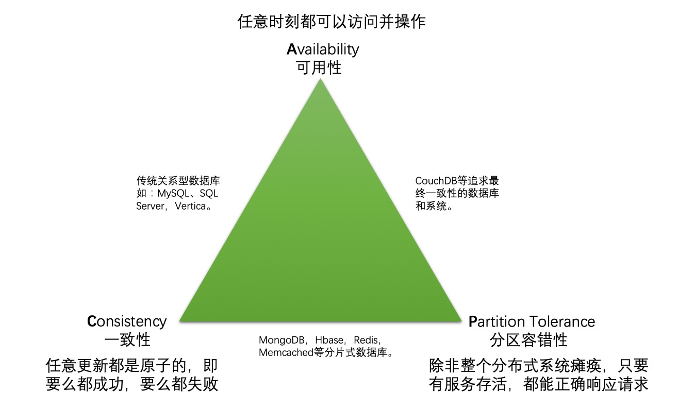
- 分片式的NoSQL中间件集群（Redis、Memcached、MongoDB）牺牲可用性来保证一致性和原子性，一旦一个分片宕机了，整个系统的数据也就不完整了，读取宕机分片的数据就会没响应，也就是不可用了。
- CouchDB选择放弃一致性使用最终一致性，保持高可用性和分区容忍性。
- 全同步复制技术下的Mysql完成一次事务需要所有节点联动，因此在网络出现分区时候没办法保证可用性和一致性。”出现分区时会不会影响一致性”的关键则在于出现脑裂时有没有保证一致性的方案，这对主从同步型数据库（MySQL、SQL Server）是致命的，一旦网络出现分区，产生脑裂，系统会出现一份数据两个值的状态，谁都不觉得自己是错的。需要说明的是，正常来说同一局域网内，网络分区的概率非常低，这也是为啥我们最熟悉的数据库（MySQL、SQL Server等）也是不考虑P的原因。


### cap系统分类

- CAP定理将系统分为三类：
- CP（一致性和分区容忍度）：CP是指仅在网络分区的情况下牺牲可用性的系统类别。
- AP（可用和分区容忍）：这些系统可用并且分区容忍但不能保证一致性
- CA（一致和可用）在没有任何网络分区的情况下，CA系统是一致且可用的系统。通常，单个节点的数据库服务器被归类为CA系统。单节点DB服务器不需要处理分区容限，因此被视为CA系统。该理论中的唯一漏洞是，单节点DB系统不是共享数据系统的网络，因此不属于CAP的范畴。
- 一致性与可用性的决择：CAP理论就是说在分布式存储系统中，最多只能实现上面的两点。而**由于当前的网络硬件肯定会出现延迟丢包等问题，所以分区容忍性是我们必须需要实现的。所以我们只能在一致性和可用性之间进行权衡**。
- [不要再将数据库称作CP或AP](https://zhuanlan.zhihu.com/p/55053121)

### 一致性分类

- **数据库 ACID 的一致性，又称之为内部一致性**：事务开始前和结束后，数据库的完整性约束没有被破坏 。比如 A 向 B 转账，不可能 A 扣了钱，B 却没收到。**内部一致性注重于事务前后数据的完整性**！
- **分布式 CAP 的一致性，也称之为外部一致性**：在分布式系统中，写操作后再读，就必须返回写入的值。比如分布式数据库A、B、C，A 中写入数据 hello，写完马上读 B 和 C，就一定要读出 hello，读出来我们就称之为符合一致性。**外部一致性则注重于读写数据值是否一致**。


- 对于分布式数据系统，分区容忍性是基本要求，否则就失去了价值。**因此设计分布式数据系统，就是在一致性和可用性之间取一个平衡**。对于大多数WEB应用，其实并不需要强一致性，因此牺牲一致性而换取高可用性，是多数分布式数据库产品的方向。
- 当然，牺牲一致性，并不是完全不管数据的一致性，否则数据是混乱的，那么系统可用性再高分布式再好也没有了价值。**牺牲一致性，只是不再要求关系型数据库中的强一致性，而是只要系统能达到最终一致性即可**，考虑到客户体验，这个最终一致的时间窗口，要尽可能的对用户透明，也就是需要保障“用户感知到的一致性”。通常是通过数据的多份异步复制来实现系统的高可用和数据的最终一致性的，“用户感知到的一致性”的时间窗口则取决于数据复制到一致状态的时间。
- 对于一致性，可以分为从客户端和服务端两个不同的视角。从客户端来看，一致性主要指的是多并发访问时更新过的数据如何获取的问题。从服务端来看，则是更新如何复制分布到整个系统，以保证数据最终一致。一致性是因为有并发读写才有的问题，因此在理解一致性的问题时，一定要注意结合考虑并发读写的场景。

#### 客户端角度

- 从客户端角度，多进程并发访问时，更新过的数据在不同进程如何获取的不同策略，决定了不同的一致性。对于关系型数据库：
- 要求更新过的数据能被后续的访问都能看到，这是强一致性。
- 如果能容忍后续的部分或者全部访问不到，则是弱一致性。
- 如果经过一段时间后要求能访问到更新后的数据，则是最终一致性。
- 在MongoDB中可以通过配置让复制集成员内部支持强一致性，这时可以设置一个写成功数，只有写操作成功数满足设定的值时才会向客户端返回结果。

#### 服务端角度

- 从服务端角度，如何尽快将更新后的数据分布到整个系统，降低达到最终一致性的时间窗口，是提高系统的可用度和用户体验非常重要的方面。
- 对于分布式数据系统：N — 数据复制的份数，W — 更新数据是需要保证写完成的节点数，R — 读取数据的时候需要读取的节点数，如果W+R>N，写的节点和读的节点重叠，则是强一致性。例如对于典型的一主一备同步复制的关系型数据库，N=2,W=2,R=1，则不管读的是主库还是备库的数据，都是一致的。如果W+R<=N，则是弱一致性。例如对于一主一备异步复制的关系型数据库，N=2,W=1,R=1，则如果读的是备库，就可能无法读取主库已经更新过的数据，所以是弱一致性。
- 对于分布式系统，为了保证高可用性，一般设置N>=3。不同的N,W,R组合，是在可用性和一致性之间取一个平衡，以适应不同的应用场景。如果N=W,R=1，任何一个写节点失效，都会导致写失败，因此可用性会降低，但是由于数据分布的N个节点是同步写入的，因此可以保证强一致性。如果N=R,W=1，只需要一个节点写入成功即可，写性能和可用性都比较高。但是读取其他节点的进程可能不能获取更新后的数据，因此是弱一致性。这种情况下，如果W<(N+1)/2，并且写入的节点不重叠的话，则会存在写冲突。

### BASE理论

- BASE是Basically Available（基本可用）、Soft state（软状态）和Eventually consistent（最终一致性）三个短语的简写，BASE是对CAP中一致性和可用性权衡的结果，其来源于对大规模互联网系统分布式实践的结论，是基于CAP定理逐步演化而来的，其核心思想是**即使无法做到强一致性（Strong consistency），但每个应用都可以根据自身的业务特点，采用适当的方式来使系统达到最终一致性（Eventual consistency）**
- 基本可用是指分布式系统在出现不可预知故障的时候，允许损失部分可用性——但请注意，这绝不等价于系统不可用，以下两个就是“基本可用”的典型例子。
- 响应时间上的损失：正常情况下，一个在线搜索引擎需要0.5秒内返回给用户相应的查询结果，但由于出现异常（比如系统部分机房发生断电或断网故障），查询结果的响应时间增加到了1~2秒。
- 功能上的损失：正常情况下，在一个电子商务网站上进行购物，消费者几乎能够顺利地完成每一笔订单，但是在一些节日大促购物高峰的时候，由于消费者的购物行为激增，为了保护购物系统的稳定性，部分消费者可能会被引导到一个降级页面。
- 弱状态也称为软状态，和硬状态相对，是指允许**系统中的数据存在中间状态，并认为该中间状态的存在不会影响系统的整体可用性**，即**允许系统在不同节点的数据副本之间进行数据同步的过程存在延时**。
- 最终一致性强调的是系统中所有的数据副本，在经过一段时间的同步后，最终能够达到一个一致的状态。因此，最终一致性的本质是需要系统保证最终数据能够达到一致，而不需要实时保证系统数据的强一致性
- 最终一致性是一种特殊的弱一致性：**系统能够保证在没有其他新的更新操作的情况下，数据最终一定能够达到一致的状态，因此所有客户端对系统的数据访问都能够获取到最新的值**。同时，在没有发生故障的前提下，数据达到一致状态的时间延迟，取决于网络延迟，系统负载和数据复制方案设计等因素。
- 在实际工程实践中，最终一致性存在以下五类主要变种。
- 因果一致性：因果一致性是指，如果进程A在更新完某个数据项后通知了进程B，那么进程B之后对该数据项的访问都应该能够获取到进程A更新后的最新值，并且如果进程B要对该数据项进行更新操作的话，务必基于进程A更新后的最新值，即不能发生丢失更新情况。与此同时，与进程A无因果关系的进程C的数据访问则没有这样的限制。
- 读己之所写：读己之所写是指，进程A更新一个数据项之后，它自己总是能够访问到更新过的最新值，而不会看到旧值。也就是说，对于单个数据获取者而言，其读取到的数据一定不会比自己上次写入的值旧。因此，读己之所写也可以看作是一种特殊的因果一致性。
- 会话一致性：会话一致性将对系统数据的访问过程框定在了一个会话当中：系统能保证在同一个有效的会话中实现“读己之所写”的一致性，也就是说，执行更新操作之后，客户端能够在同一个会话中始终读取到该数据项的最新值。
- 单调读一致性：单调读一致性是指如果一个进程从系统中读取出一个数据项的某个值后，那么系统对于该进程后续的任何数据访问都不应该返回更旧的值。
- 单调写一致性：单调写一致性是指，一个系统需要能够保证来自同一个进程的写操作被顺序地执行。
- 以上就是最终一致性的五类常见的变种，在时间系统实践中，可以将其中的若干个变种互相结合起来，以构建一个具有最终一致性的分布式系统。在现代关系型数据库中，大多都会采用同步和异步方式来实现主备数据复制技术。在同步方式中，数据的复制过程通常是更新事务的一部分，因此在事务完成后，主备数据库的数据就会达到一致。而在异步方式中，备库的更新往往存在延时，这取决于事务日志在主备数据库之间传输的时间长短，如果传输时间过长或者甚至在日志传输过程中出现异常导致无法及时将事务应用到备库上，那么很显然，从备库中读取的的数据将是旧的，因此就出现了不一致的情况。当然，无论是采用多次重试还是认为数据订正，关系型数据库还是能够保证最终数据达到一致——这就是系统提供最终一致性保证的经典案例。
- 总的来说，BASE理论面向的是大型高可用可扩展的分布式系统，和传统事务的ACID特性是相反的，它完全不同于ACID的强一致性模型，而是提出通过牺牲强一致性来获得可用性，并允许数据在一段时间内是不一致的，但最终达到一致状态。但同时，在实际的分布式场景中，不同业务单元和组件对数据一致性的要求是不同的，因此在具体的分布式系统架构设计过程中，ACID特性与BASE理论往往又会结合在一起使用。


## 单元化LDC架构CAP分析

### LDC（logic data center）

- 蚂蚁单元化架构从容量要求上看必然从单机房走向多机房。另一方面，异地灾备也决定了这些IDC机房必须是异地部署的。整体上支付宝也采用了三地五中心（IDC机房）来保障系统的可用性，支付宝将单元分成了三类（也称CRG架构）：
- RZone(Region Zone)：实际上就是**所有可以分库分表的业务系统整体部署的最小单元**。每个RZone连上数据库就可以撑起一片天空，把业务跑的溜溜的。
- CZone(City Zone)：**以城市为单位部署的单元**。同样部署了不可拆分的数据和服务，比如用户账号服务，客户信息服务等。理论上RZone的频率会比访问GZone高很多。**CZone是基于特定的GZone场景进行优化的一种单元，它把GZone中有些有着”写读时间差现象”的数据和服务进行了的单独部署，这样RZone只需要访问本地的CZone即可，而不是访问异地的GZone**。
- GZone(Global Zone)：全局单元，意味着**全局只有一份**。**部署了不可拆分的数据和服务，比如系统配置等**。实际情况下，GZone异地也会部署，不过仅是用于灾备，同一时刻，只有一地GZone进行全局服务。GZone一般被RZone依赖，提供的大部分是读取服务。
- “写读时间差现象”是指大部分情况下，一个数据被写入后，都会过足够长的时间后才会被访问。例如办完银行卡后可能很久才会存第一笔钱；这些时间差远远超过了系统同步时间。一般来说异地的延时在100ms以内，所以只要满足某地CZone写入数据后100ms以后才用这个数据，这样的数据和服务就适合放到CZone中。
- 这三个单元的分类其背后对应的是不同性质的数据，而服务不过是对数据的操作集。当下几乎所有互联网公司的分库分表规则都是根据用户ID来制定的，而围绕用户来看整个系统的数据可以分为以下两类：
- 用户流水型数据：典型的有用户的订单、用户发的评论、用户的行为记录等。**这些数据都是用户行为产生的流水型数据，具备天然的用户隔离性**，比如A用户的App上绝对看不到B用户的订单列表。**所以此类数据非常适合分库分表后独立部署服务**。
- 用户间共享型数据：这种类型的数据又分两类。
- 一类共享型数据是像账号、个人博客等可能会被所有用户请求访问的用户数据，比如A向B转账，A给B发消息，这时候需要确认B账号是否存在；又比如A想看B的个人博客之类的。
- 一类是用户无关型数据，像商品、系统配置（汇率、优惠政策）、财务统计等这些非用户纬度的数据，很难说跟具体的某一类用户挂钩，可能涉及到所有用户。比如商品，假设按商品所在地来存放商品数据（这需要双维度分库分表），那么上海的用户仍然需要访问杭州的商品，这就又构成跨地跨zone访问了，还是达不到单元化的理想状态，而且双维度分库分表会给整个LDC运维带来复杂度提升。
- **RZone包含的就是分库分表后负责固定客户群体的服务**，**GZone则包含了用户间共享的公共数据对应的服务**。GZone之所以只能单地部署，是因为其数据要求被所有用户共享，无法分库分表，而多地部署会带来由异地延时引起的不一致，比如实时风控系统。通过对RZone已有业务的分析，80%甚至更高的场景下，数据更新后都不要求立马被读取到，即”写读时间差现象”，对于这类数据，允许每个地区的RZone服务直接访问本地区CZone，**在CZone的场景下，写请求一般从GZone写入公共数据所在库，然后同步到整个OB集群，然后由CZone提供读取服务**。比如支付宝的会员服务就是如此。

### CAP分析

- LDC机房的各个单元都由两部分组成：负责业务逻辑计算的应用服务器和负责数据持久化的数据库。大部分应用服务器就像一个个计算器，自身是不对写一致性负责的，这个任务被下沉到了数据库。所以蚂蚁解决分布式一致性问题的关键就在于数据库！
- MySQL是一款满足AC但不满足P的分布式系统。当一个MySQL主从结构的数据库集群出现分区时，问题分区内的Slave会认为主已经挂了，所以自己成为本分区的master（脑裂），等分区问题恢复后，会产生2个主库的数据，而无法确定谁是正确的，也就是分区导致了一致性被破坏。这样的结果是严重的，这也是蚂蚁宁愿自研OceanBase的原动力之一。**所谓的”脑”其实就是具备写能力的系统，”非脑”就是只具备读能力的系统**，对应了MySQL集群中的从库。
- OceanBase对于某一类数据（固定用户号段的数据）任意时刻只有一个单元会负责写入某个节点，其他节点要么是实时库间同步，要么是异步数据同步。OB也采用了PAXOS共识协议。**实时库间同步的节点(包含自己)个数至少需要(N/2)+1个，这样就可以解决分区容忍性问题**。
- OceanBase的CAP：产生分区的时候它变成AP+最终一致性（C）。整体来说，它是AP的，即高可用和分区容忍。
- 分区容忍性：OceanBase节点之间是有互相通信的（需要相互同步数据），所以存在分区问题，OceanBase通过仅同步到部分节点来保证可用性。这一点就说明OB做了分区容错。
- 可用性分区容忍性：OB事务只需要同步到（N/2)+1个节点，允许其余的一小半节点分区（宕机、断网等），只要(N/2)+1个节点活着就是可用的。极端情况下，比如5个节点分成3份（2:2:1），那就确实不可用了，只是这种情况概率比较低。
- 一致性分区容忍性：分区情况下意味着部分节点失联了，一致性显然是不满足的。但通过共识算法可以保证当下只有一个值是合法的，并且最终会通过节点间的同步达到最终一致性。
- 蚂蚁支持高并发场景的设计：
- 基于用户分库分表的RZone设计。**每个用户群独占一个单元给整个系统的容量带来了爆发式增长**。
- RZone在网络分区或灾备切换时OceanBase的防脑裂设计（PAXOS）。
- 基于CZone的本地读设计。这一点**保证了很大一部分有着“写读时间差”现象的公共数据能被高速本地访问**。
- 对于实时库存数据，可以通过“页面展示查询走应用层缓存”+“实际下单时再校验”的方式减少其GZone调用量。


# 一致性协议

- 一致性协议要解决的问题是在一个集群中某个节点上的数据做了改动时，想让这个改动迅速地传遍整个集群中的服务器，换句话说，让这些服务器的数据都达到一致性的状态。
- 最简单的做法让数据的改动，都保存到一个稳定的服务器X上，然后其他的服务器都从服务器X中去拉取数据。这样做可能会产生两个问题：
1. 节点的可用性问题，当节点宕机时需要保证有其他节点能够提供服务，这就需要有备份节点，并且在服务宕机时能够选举出备份节点替代原有节点。
2. 如果子节点网络异常连接不上主节点就无法拉取最新数据了，即使它可以连接到其他节点。这就是一个典型的分布式系统中的一致性的问题，科学家们已经研究出了很多中算法出来，比如Paxos, Raft, Gossip协议。
- 一致性协议根据是否允许数据分歧可以分为两种：
- 单主协议（不允许数据分歧）：整个分布式系统就像一个单体系统，所有写操作都由主节点处理并且同步给其他副本。例如主备同步、2PC、Paxos 都属于这类协议。**单主协议只允许由主节点发起写操作，因此它可以保证操作有序性，一致性更强**。
- 多主协议（允许数据分歧）：所有写操作可以由不同节点发起，并且同步给其他副本。例如 Gossip、POW。**多主协议允许多个节点发起写操作，因此它不能保证操作的有序性，只能做到最终一致性**。
- Gossip协议通过节点之间的主动传播，通常采用UDP的方式，使得数据更新事件能够快速传递到所有节点，但是在某一时刻当某些节点未被传染时这时数据是不一致的，因此**Gossip协议只保证了数据的最终一致性**。


## PAXOS算法

- PAXOS定义：Paxos is a family of protocols for solving consensus in a network of unreliable processors (that is, processors that may fail).
- PAXOS是在一群不是特别可靠的节点组成的集群中的一种共识机制。**Paxos要求任何一个提议，至少有(N/2)+1的系统节点认可，才被认为是可信的**，这背后的一个基础理论是少数服从多数。想象一下，如果多数节点认可后，整个系统宕机了，重启后，仍然可以通过一次投票知道哪个值是合法的（多数节点保留的那个值）。这样的设定也巧妙的解决了分区情况下的共识问题，因为一旦产生分区，势必最多只有一个分区内的节点数量会大于等于(N/2)+1。通过这样的设计就可以巧妙的避开脑裂，当然MySQL集群的脑裂问题也是可以通过其他方法来解决的，比如同时Ping一个公共的IP，成功者继续为脑，显然这就又制造了另外一个单点。
- PAXOS通过最终一致性保证分区下的可用性：PAXOS不要求对所有节点做实时同步，实质上是考虑到了分区情况下的可用性，通过减少完成一次事务需要的参与者个数，来保障系统的可用性。**PAXOS对一致性的贡献在于经过一次事务后，这个集群里已经有部分节点保有了本次事务正确的结果（共识的结果），这个结果随后会被异步的同步到其他节点上，从而保证最终一致性**。


- Paxos算法可以分为Basic Paxos和Multi-Paxos两种形式，它们的主要特点如下
- Basic Paxos (“single decree”):
- 一个或者多个服务器发起提议
- 系统会在一个被选择的提议值上达成一致
- 只有一个提议值会被选择
- Multi-Paxos:
- Multi-Paxos通过多回合的Basic Paxos算法在一列的值上形成一致，这一系列值相当于redo log，它的一致性等价于各服务器状态机的一致

### Basic Paxos

基本概念：
- Proposal：提议 = 提议的值 + 提议编号；
- Proposer：提议发起者；
- Acceptor：提议接受者；
- Learner：提议学习者；


按照上图的流程顺序讨论一下Basic Paxos的过程：
1. 生成Proposal ID；生成proposal ID本身是有一些讲究的，Basic Paxos要求proposal ID是唯一的，并没有要求Proposal ID全局递增。但如果proposal ID本身是随机的UUID，它很大概率会在p1b阶段被acceptor否决掉。Basic Paxos是允许一个或者多个Proposer(s)的，而真正全局递增的id是有一定难度的，或者说如果实现了全局递增的id，那么Basic Paxos就只需要走accept流程了。所以一个比较现实的方式是使用近似递增且唯一的proposal ID生成方式。比如果使用maxRound + server ID的组合。这里的加号指的是高低位拼接，低位的server ID和本地递增的maxRound保证了唯一性。
2. 响应Prepare(n)；这里首先要做的是，必要时更新minProposal。此外根据minProposal和N的关系进行响应。这里有一些需要解释一下acceptors服务器中几个变量。其中minProposal就是该acceptor接收（不是接受哦）到的“最大Proposal ID“，这个minProposal的名称来自于一个ppt（见参考资料），应该是个笔误，但是不用在意名字，知道它的含义就好。acceptedProposal就是接受过的最大proposal ID。而acceptedValue就是接受过的最大proposal ID对应的值。当然，在Basic Paxos算法中，由于只有一个value最终会被选中，所以这里的“最大”其实意义不大。（这些值都是需要直接持久化的硬盘的，以保证故障之后可以恢复状态）。
3. 在响应Prepare(n)的另一种情况下，n <= minProposal。个人理解，n == minProposal的情况严格说来是不存在的。而n < minProposal的情况，acceptor需要否决掉这个Proposal，可以直接忽略掉这个提议。当然从优化角度讲，还是应该发送一个否决消息。
4. 在响应Prepare(n)的积极情况下(n > minProposal)，又有两种子情况。第一种是acceptor从来没有接受过提议，那么acceptedProposal和acceptedValue都是null；另一种情况是acceptor已经接受过Proposal，那么这两个值就不为空。这两种情况都是合理的，只是Promise()报文的内容不一样而已。
5. Proposer接收到多数机器的返回后，如果acceptedValue都是空的，那么就把自己想提议的值放进accept!()报文中；否者就要用最大Proposal ID对应的proposal value。这也印证了Basic Paxos只能在一个值上达成一致。


### Multi-Paxos

- Basic Paxos只能在一个值上达成一致，这是很难满足实际应用场景的。所以我们需要Multi-Paxos算法，它可以实现在分布式系统在一系列值上达成一致。Multi-Paxos一般使用一个leader来统一发起Proposal，同时也只有leader可以发起Proposal。上半句其实并不严谨，因为Multi-Paxos实际上由两个状态组成，leader服务状态和leader选举状态。后一个状态这里我们先不探讨。
- 由于只有leader可以发起Proposal，所以在leader服务态，一切都会变得比较简单。简言之，Basic Paxos算法的prepare步骤变得不必要了，直接进入accept步骤。至于为什么Multi-Paxos可以在多个值上达成一致，看下面这个图就明白了。
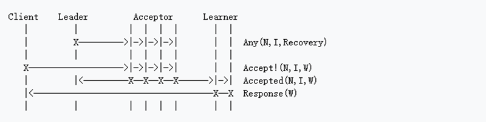
- 这里的Accept!()报文和Accepted()报文都多了一个I，这个I就是值的序号。正如前文所说，这个W其实就是一条redo log，所有的redo log加一起，即可以在分布式系统实现状态机的一致。
- 熟悉或者了解Zookeeper的同学应该知道，ZXID的高位是Epoch ID，而低位就是一个递增的事务序号。这个ZXID其实和这里N和I的组合是差不多等价的。


## Raft算法

- 由于Paxos难以理解，所以才有了Raft。它跟 multi-Paxos 作用相同，效率也相当，但是它的组织结构跟 Paxos 不同。这使得 Raft 比 Paxos 更容易理解并且更容易在工程实践中实现。

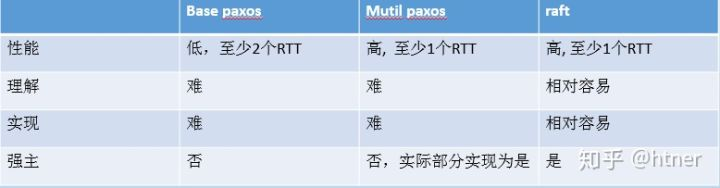

- **Raft 是用来管理复制日志（replicated log）的一致性协议**。为了使 Raft 协议更易懂，**Raft将一致性的关键元素分开，如 leader 选举、日志复制和安全性，并且它实施更强的一致性以减少必须考虑的状态的数量**。 Raft 还包括一个用于变更集群成员的新机制，**它使用重叠的大多数（overlapping majorities）来保证安全性**。
- 实现raft的几个重要元素
- Leader选举（Leader election）
- 日志同步（Log replication）
- 安全性（Safety）
- 日志压缩（Log compaction）
- 成员变更（Membership change）
- Raft 在许多方面类似于现有的一致性算法，但它有几个新特性：
- **Strong leader**：在 Raft 中，日志条目（log entries）只从 leader 流向其他服务器。这简化了复制日志的管理，使得 raft 更容易理解。
- **Leader 选举**：Raft 使用随机计时器进行 leader 选举。这只需在任何一致性算法都需要的心跳（heartbeats）上增加少量机制，同时能够简单快速地解决冲突。
- **成员变更**：Raft 使用了一种新的联合一致性方法，其中两个不同配置的大多数在过渡期间重叠。这允许集群在配置更改期间继续正常运行。


### 复制状态机

- 复制状态机用于解决分布式系统中的各种容错问题。例如，具有单个 leader 的大规模系统，如 GFS ，HDFS 和 RAMCloud，通常使用单独的复制状态机来进行 leader 选举和存储 leader 崩溃后重新选举需要的配置信息。Chubby 和 ZooKeeper 都是复制状态机。
- 复制状态机通常使用复制日志实现，如图所示。每个服务器存储一个包含一系列命令的日志，其状态机按顺序执行日志中的命令。每个日志中命令都相同并且顺序也一样，因此每个状态机处理相同的命令序列。这样就能得到相同的状态和相同的输出序列。

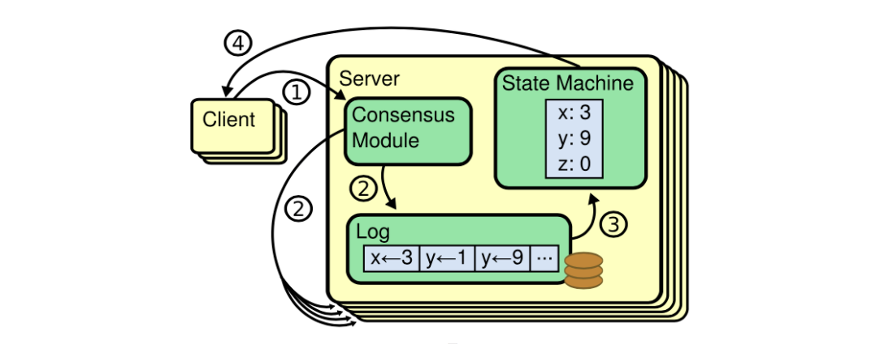

- **一致性算法的工作就是保证复制日志的一致性**。每台服务器上的一致性模块接收来自客户端的命令，并将它们添加到其日志中。它与其他服务器上的一致性模块通信，以确保每个日志最终以相同的顺序包含相同的命令，即使有一些服务器失败。一旦命令被正确复制，每个服务器上的状态机按日志顺序处理它们，并将输出返回给客户端。这样就形成了高可用的复制状态机。
- 实际系统中的一致性算法通常具有以下属性：
- 它们确保在所有非拜占庭条件下（包括网络延迟，分区和数据包丢失，重复和乱序）的安全性（不会返回不正确的结果）。
- **只要任何大多数（过半）服务器都可以运行**，并且可以相互通信和与客户通信，一致性算法就可用。因此，五台服务器的典型集群可以容忍任何两台服务器的故障。假设服务器突然宕机; 它们可以稍后从状态恢复并重新加入群集。
- **它们不依赖于时序来确保日志的一致性**：错误的时钟和极端消息延迟可能在最坏的情况下导致可用性问题。

### Raft 一致性算法
- Raft 通过首先选举一个 distinguished leader，然后让它全权负责管理复制日志来实现一致性。**Leader 从客户端接收日志条目，把日志条目复制到其他服务器上，并且在保证安全性的时候通知其他服务器将日志条目应用到他们的状态机中**。拥有一个 leader 大大简化了对复制日志的管理。例如，领导人可以决定新的日志条目需要放在日志中的什么位置而不需要和其他服务器商议，并且数据都是从 leader 流向其他服务器。leader 可能宕机，也可能和其他服务器断开连接，这时一个新的 leader 会被选举出来。
- 通过选举一个 leader 的方式，Raft 将一致性问题分解成了三个相对独立的子问题
- **Leader 选举**：当前的 leader 宕机时，一个新的 leader 必须被选举出来。
- **日志复制**：Leader 必须从客户端接收日志条目然后复制到集群中的其他节点，并且强制要求其他节点的日志和自己的保持一致。
- **安全性**：如果有任何的服务器节点已经应用了一个特定的日志条目到它的状态机中，那么其他服务器节点不能在同一个日志索引位置应用一条不同的指令。

### Raft 基础

- 在任何时刻，每一个服务器节点都处于这三个状态之一：leader、follower 或者 candidate 。在正常情况下，集群中只有一个 leader 并且其他的节点全部都是 follower 。Follower 都是被动的：他们不会发送任何请求，只是简单的响应来自 leader 和 candidate 的请求。Leader 处理所有的客户端请求（如果一个客户端和 follower 通信，follower 会将请求重定向给 leader）。第三种状态，candidate ，是用来选举一个新的 leader。


- Raft 把时间分割成任意长度的任期（term）。任期用连续的整数标记。每一段任期从一次选举开始，一个或者多个 candidate 尝试成为 leader 。如果一个 candidate 赢得选举，然后他就在该任期剩下的时间里充当 leader 。在某些情况下，一次选举无法选出 leader 。在这种情况下，这一任期会以没有 leader 结束；一个新的任期（包含一次新的选举）会很快重新开始。Raft 保证了在任意一个任期内，最多只有一个 leader 。

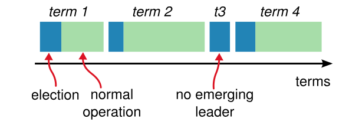

- 不同的服务器节点观察到的任期转换的次数可能不同，在某些情况下，一个服务器节点可能没有看到 leader 选举过程或者甚至整个任期全程。**任期在 Raft 算法中充当逻辑时钟的作用，这使得服务器节点可以发现一些过期的信息比如过时的 leader** 。每一个服务器节点存储一个当前任期号，该编号随着时间单调递增。**服务器之间通信的时候会交换当前任期号；如果一个服务器的当前任期号比其他的小，该服务器会将自己的任期号更新为较大的那个值。如果一个 candidate 或者 leader 发现自己的任期号过期了，它会立即回到 follower 状态**。如果一个节点接收到一个包含过期的任期号的请求，它会直接拒绝这个请求。
- Raft 算法中服务器节点之间使用 RPC 进行通信，并且基本的一致性算法只需要两种类型的 RPC。当服务器没有及时的收到 RPC 的响应时，会进行重试。
- 请求投票（RequestVote）RPC 由 candidate 在选举期间发起
- 追加条目（AppendEntries）RPC 由 leader 发起，用来复制日志和提供一种心跳机制。
- 为了在服务器之间传输快照增加了第三种 RPC。

### Leader 选举

- Raft 使用一种心跳机制来触发 leader 选举。当服务器程序启动时，他们都是 follower 。一个服务器节点只要能从 leader 或 candidate 处接收到有效的 RPC 就一直保持 follower 状态。**Leader 周期性地向所有 follower 发送心跳（不包含日志条目的 AppendEntries RPC）来维持自己的地位**。如果一个 follower 在一段选举超时时间内没有接收到任何消息，它就假设系统中没有可用的 leader，然后开始进行选举以选出新的leader。
- 要开始一次选举过程，follower 先增加自己的当前任期号并且转换到 candidate 状态。然后投票给自己并且并行地向集群中的其他服务器节点发送 RequestVote RPC（让其他服务器节点投票给它）。
- Candidate 会一直保持当前状态直到以下三件事情之一发生：
1. 它自己赢得了这次的选举（收到过半的投票）
2. 其他的服务器节点成为 leader
3. 一段时间(随机的选举超时时间)之后没有任何获胜者
- 第一个情况：当一个 candidate 获得集群中过半服务器节点针对同一个任期的投票，它就赢得了这次选举并成为 leader 。**对于同一个任期，每个服务器节点只会投给一个 candidate ，按照先来先服务（first-come-first-served）的原则**。**一旦 candidate 赢得选举，就立即成为 leader 。然后它会向其他的服务器节点发送心跳消息来确定自己的地位并阻止新的选举**。
- 第二种情况：在等待投票期间，candidate 可能会收到另一个声称自己是 leader 的服务器节点发来的 AppendEntries RPC 。如果这个 leader 的任期号（包含在RPC中）不小于 candidate 当前的任期号，那么 candidate 会承认该 leader 的合法地位并回到 follower 状态。 如果 RPC 中的任期号比自己的小，那么 candidate 就会拒绝这次的 RPC 并且继续保持 candidate 状态。
- 第三种情况：candidate 既没有赢得选举也没有输：**如果有多个 follower 同时成为 candidate ，那么选票可能会被瓜分以至于没有 candidate 赢得过半的投票。当这种情况发生时，每一个候选人都会超时，然后通过增加当前任期号来开始一轮新的选举**。然而，如果没有其他机制的话，该情况可能会无限重复。
- **Raft 算法使用随机选举超时时间的方法来确保很少发生选票瓜分的情况，就算发生也能很快地解决**。**为了阻止选票一开始就被瓜分，选举超时时间是从一个固定的区间（例如 150-300 毫秒）随机选择**。这样可以把服务器都分散开以至于在大多数情况下只有一个服务器会选举超时；然后该服务器赢得选举并在其他服务器超时之前发送心跳。同样的机制被用来解决选票被瓜分的情况。**每个 candidate 在开始一次选举的时候会重置一个随机的选举超时时间，然后一直等待直到选举超时；这样减小了在新的选举中再次发生选票瓜分情况的可能性**。

### 日志复制

- Raft的日志复制过程**类似一个二阶段提交过程**，对于客户端发送的写请求，全部由 Leader 接收，Leader 将请求封装成一个事务 Proposal，将其发送给所有 Follwer ，然后，根据所有 Follwer 的反馈，如果超过半数成功响应，则执行 commit 操作（先提交自己，再发送 commit 给所有 Follwer）。
- Leader 一旦被选举出来，就开始为客户端请求提供服务。客户端的每一个请求都包含一条将被复制状态机执行的指令。**Leader 把该指令作为一个新的条目追加到日志中去，然后并行的发起 AppendEntries RPC 给其他的服务器，让它们复制该条目。当该条目被安全地复制，leader 会应用该条目到它的状态机中（状态机执行该指令）然后把执行的结果返回给客户端**。如果 follower 崩溃或者运行缓慢，或者网络丢包，领导人会不断地重试 AppendEntries RPC（即使已经回复了客户端）直到当前 follower 最终都存储了所有的日志条目。
- 每个日志条目存储一条状态机指令和 leader 收到该指令时的任期号。任期号用来检测多个日志副本之间的不一致情况。每个日志条目都有一个整数索引值来表明它在日志中的位置。
- Leader 决定什么时候把日志条目应用到状态机中是安全的；这种日志条目被称为已提交的。**Raft 算法保证所有已提交的日志条目都是持久化的并且最终会被所有可用的状态机执行**。**一旦创建该日志条目的 leader 将它复制到过半的服务器上，该日志条目就会被提交**。同时，leader 日志中该日志条目之前的所有日志条目也都会被提交，包括由其他 leader 创建的条目。**Leader 追踪将会被提交的日志条目的最大索引，未来的所有 AppendEntries RPC 都会包含该索引，这样其他的服务器才能最终知道哪些日志条目需要被提交**。Follower 一旦知道某个日志条目已经被提交就会将该日志条目应用到自己的本地状态机中（按照日志的顺序）。
- **我们设计了 Raft 的日志机制来维持不同服务器之间日志高层次的一致性**。这么做不仅简化了系统的行为也使得系统行为更加可预测，同时该机制也是保证安全性的重要组成部分。Raft 维护着以下特性：
- 如果不同日志中的两个条目拥有相同的索引和任期号，那么他们存储了相同的指令。
- 如果不同日志中的两个条目拥有相同的索引和任期号，那么他们之前的所有日志条目也都相同。
- Leader 在特定的任期号内的一个日志索引处最多创建一个日志条目，同时日志条目在日志中的位置也从来不会改变。该点保证了上面的第一条特性。第二个特性是由 AppendEntries RPC 执行一个简单的一致性检查所保证的。**在发送 AppendEntries RPC 的时候，leader 会将前一个日志条目的索引位置和任期号包含在里面。如果 follower 在它的日志中找不到包含相同索引位置和任期号的条目，那么他就会拒绝该新的日志条目**。一致性检查就像一个归纳步骤：一开始空的日志状态肯定是满足 Log Matching Property（日志匹配特性） 的，然后一致性检查保证了日志扩展时的日志匹配特性。因此，每当 AppendEntries RPC 返回成功时，leader 就知道 follower 的日志一定和自己相同（从第一个日志条目到最新条目）。
- 正常操作期间，leader 和 follower 的日志保持一致，所以 AppendEntries RPC 的一致性检查从来不会失败。然而，leader 崩溃的情况会使日志处于不一致的状态（老的 leader 可能还没有完全复制它日志里的所有条目）。这种不一致会在一系列的 leader 和 follower 崩溃的情况下加剧。下图展示了在什么情况下 follower 的日志可能和新的 leader 的日志不同。Follower 可能缺少一些在新 leader 中有的日志条目，也可能拥有一些新 leader 没有的日志条目，或者同时发生。缺失或多出日志条目的情况可能会涉及到多个任期。

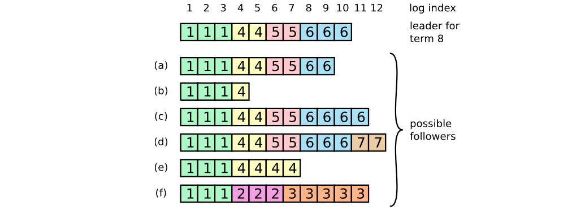

- 上图当一个 leader 成功当选时（最上面那条日志），follower 可能是（a-f）中的任何情况。每一个盒子表示一个日志条目；里面的数字表示任期号。Follower 可能会缺少一些日志条目（a-b），可能会有一些未被提交的日志条目（c-d），或者两种情况都存在（e-f）。例如，场景 f 可能这样发生，f 对应的服务器在任期 2 的时候是 leader ，追加了一些日志条目到自己的日志中，一条都还没提交（commit）就崩溃了；该服务器很快重启，在任期 3 重新被选为 leader，又追加了一些日志条目到自己的日志中；在这些任期 2 和任期 3 中的日志都还没被提交之前，该服务器又宕机了，并且在接下来的几个任期里一直处于宕机状态。
- 在 Raft 算法中，leader 通过强制 follower 复制它的日志来解决不一致的问题。这意味着 follower 中跟 leader 冲突的日志条目会被 leader 的日志条目覆盖。
- 要使得 follower 的日志跟自己一致，leader 必须找到两者达成一致的最大的日志条目（索引最大），删除 follower 日志中从那个点之后的所有日志条目，并且将自己从那个点之后的所有日志条目发送给 follower 。所有的这些操作都发生在对 AppendEntries RPCs 中一致性检查的回复中。**Leader 针对每一个 follower 都维护了一个 nextIndex ，表示 leader 要发送给 follower 的下一个日志条目的索引。当选出一个新 leader 时，该 leader 将所有 nextIndex 的值都初始化为自己最后一个日志条目的 index 加1**。如果 follower 的日志和 leader 的不一致，那么下一次 AppendEntries RPC 中的一致性检查就会失败。在被 follower 拒绝之后，leaer 就会减小 nextIndex 值并重试 AppendEntries RPC 。最终 nextIndex 会在某个位置使得 leader 和 follower 的日志达成一致。此时，AppendEntries RPC 就会成功，将 follower 中跟 leader 冲突的日志条目全部删除然后追加 leader 中的日志条目（如果有需要追加的日志条目的话）。一旦 AppendEntries RPC 成功，follower 的日志就和 leader 一致，并且在该任期接下来的时间里保持一致。
- 通过这种机制，leader 在当权之后就不需要任何特殊的操作来使日志恢复到一致状态。Leader 只需要进行正常的操作，然后日志就能在回复 AppendEntries 一致性检查失败的时候自动趋于一致。Leader 从来不会覆盖或者删除自己的日志条目。
- 这样的日志复制机制保证了一致性特性：只要过半的服务器能正常运行，Raft 就能够接受，复制并应用新的日志条目；在正常情况下，新的日志条目可以在一个 RPC 来回中被复制给集群中的过半机器；并且单个运行慢的 follower 不会影响整体的性能。

### 安全性

- 日志条目的传送是单向的，只从 leader 到 follower，并且 leader 从不会覆盖本地日志中已经存在的条目。为了保证每一个状态机会按照相同的顺序执行相同的指令，在选举过程中有一个限制，只有候选人的日志信息和当前节点一样或者比当前新才会给它投票。**如果 candidate 的日志至少和过半的服务器节点一样新，那么他一定包含了所有已经提交的日志条目**。

#### 选举限制

- Raft 使用投票的方式来阻止 candidate 赢得选举除非该 candidate 包含了所有已经提交的日志条目。候选人为了赢得选举必须与集群中的过半节点通信，这意味着至少其中一个服务器节点包含了所有已提交的日志条目。如果 candidate 的日志至少和过半的服务器节点一样新（接下来会精确地定义“新”），那么他一定包含了所有已经提交的日志条目。**RequestVote RPC 执行了这样的限制： RPC 中包含了 candidate 的日志信息，如果投票者自己的日志比 candidate 的还新，它会拒绝掉该投票请求**。
- Raft 通过比较两份日志中最后一条日志条目的索引值和任期号来定义谁的日志比较新。如果两份日志最后条目的任期号不同，那么任期号大的日志更新。如果两份日志最后条目的任期号相同，那么日志较长的那个更新。

#### 提交之前任期内的日志条目

- 一旦当前任期内的某个日志条目已经存储到过半的服务器节点上，leader 就知道该日志条目已经被提交了。如果某个 leader 在提交某个日志条目之前崩溃了，以后的 leader 会试图完成该日志条目的复制。然而，如果是之前任期内的某个日志条目已经存储到过半的服务器节点上，leader 也无法立即断定该日志条目已经被提交了。
- 下图展示了一种情况，一个已经被存储到过半节点上的老日志条目，仍然有可能会被未来的 leader 覆盖掉。

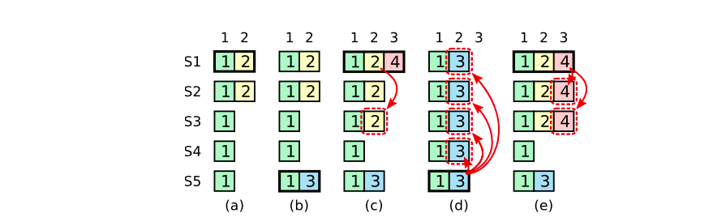

- 如图的时间序列展示了为什么 leader 无法判断老的任期号内的日志是否已经被提交。在 (a) 中，S1 是 leader ，部分地复制了索引位置 2 的日志条目。在 (b) 中，S1 崩溃了，然后 S5 在任期 3 中通过 S3、S4 和自己的选票赢得选举，然后从客户端接收了一条不一样的日志条目放在了索引 2 处。然后到 (c)，S5 又崩溃了；S1 重新启动，选举成功，继续复制日志。此时，来自任期 2 的那条日志已经被复制到了集群中的大多数机器上，但是还没有被提交。如果 S1 在 (d) 中又崩溃了，S5 可以重新被选举成功（通过来自 S2，S3 和 S4 的选票），然后覆盖了他们在索引 2 处的日志。但是，在崩溃之前，如果 S1 在自己的任期里复制了日志条目到大多数机器上，如 (e) 中，然后这个条目就会被提交（S5 就不可能选举成功）。 在这种情况下，之前的所有日志也被提交了。
- 为了消除上图中描述的问题，Raft 永远不会通过计算副本数目的方式来提交之前任期内的日志条目。只有 leader 当前任期内的日志条目才通过计算副本数目的方式来提交；一旦当前任期的某个日志条目以这种方式被提交，那么由于日志匹配特性，之前的所有日志条目也都会被间接地提交。在某些情况下，领导人可以安全地断定一个老的日志条目已经被提交（例如，如果该条目已经存储到所有服务器上），但是 Raft 为了简化问题使用了一种更加保守的方法。
- Raft 会在提交规则上增加额外的复杂性是因为当 leader 复制之前任期内的日志条目时，这些日志条目都保留原来的任期号。在其他的一致性算法中，如果一个新的 leader 要重新复制之前的任期里的日志时，它必须使用当前新的任期号。Raft 的做法使得更加容易推导出（reason about）日志条目，因为他们自始至终都使用同一个任期号。另外，和其他的算法相比，Raft 中的新 leader 只需要发送更少的日志条目（其他算法中必须在它们被提交之前发送更多的冗余日志条目来给它们重新编号）。

### Follower 和 candidate 崩溃

- Follower 和 candidate 崩溃后的处理方式比 leader 崩溃要简单的多，并且两者的处理方式是相同的。**如果 follower 或者 candidate 崩溃了，那么后续发送给他们的 RequestVote 和 AppendEntries RPCs 都会失败。Raft 通过无限的重试来处理这种失败；如果崩溃的机器重启了，那么这些 RPC 就会成功地完成。如果一个服务器在完成了一个 RPC，但是还没有响应的时候崩溃了，那么在它重启之后就会再次收到同样的请求。Raft 的 RPCs 都是幂等的，所以这样的重试不会造成任何伤害**。例如，一个 follower 如果收到 AppendEntries 请求但是它的日志中已经包含了这些日志条目，它就会直接忽略这个新的请求中的这些日志条目。


### 集群成员变更

- 为了保证安全性，**配置变更必须采用一种两阶段方法**。目前有很多种两阶段的实现。例如，有些系统在第一阶段停掉旧的配置所以不能处理客户端请求；然后在第二阶段在启用新的配置。**在 Raft 中，集群先切换到一个过渡的配置，我们称之为联合一致（joint consensus）；一旦联合一致已经被提交了，那么系统就切换到新的配置上。联合一致结合了老配置和新配置**：
- 日志条目被复制给集群中新、老配置的所有服务器。
- 新、旧配置的服务器都可以成为 leader 。
- 达成一致（针对选举和提交）需要分别在两种配置上获得过半的支持。
- 联合一致允许独立的服务器在不妥协安全性的前提下，在不同的时刻进行配置转换过程。此外，联合一致允许集群在配置变更期间依然响应客户端请求。

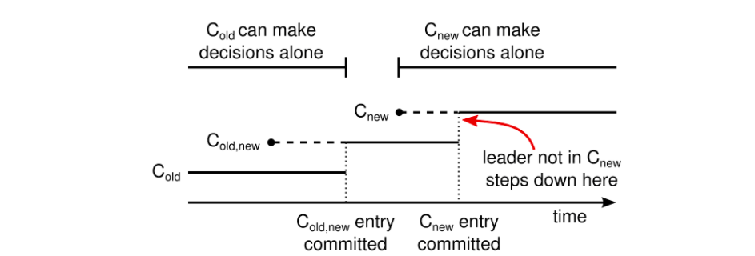

- 集群配置在复制日志中以特殊的日志条目来存储和通信。上图展示了配置变更过程。当一个 leader 接收到一个改变配置从 C-old 到 C-new 的请求，它就为联合一致将该配置（图中的 C-old,new）存储为一个日志条目，并以前面描述的方式复制该条目。一旦某个服务器将该新配置日志条目增加到自己的日志中，它就会用该配置来做出未来所有的决策（服务器总是使用它日志中最新的配置，无论该配置日志是否已经被提交）。这就意味着 leader 会使用 C-old,new 的规则来决定 C-old,new 的日志条目是什么时候被提交的。如果 leader 崩溃了，新 leader 可能是在 C-old 配置也可能是在 C-old,new 配置下选出来的，这取决于赢得选举的 candidate 是否已经接收到了 C-old,new 配置。在任何情况下， C-new 在这一时期都不能做出单方面决定。
- 一旦 C-old,new 被提交，那么 C-old 和 C-new 都不能在没有得到对方认可的情况下做出决定，并且 leader 完整性特性保证了只有拥有 C-old,new 日志条目的服务器才能被选举为 leader 。现在 leader 创建一个描述 C-new 配置的日志条目并复制到集群其他节点就是安全的了。此外，新的配置被服务器收到后就会立即生效。当新的配置在 C-new 的规则下被提交，旧的配置就变得无关紧要，同时不使用新配置的服务器就可以被关闭了。上图所示，任何时刻 C-old 和 C-new 都不能单方面做出决定；这保证了安全性。
- 在关于配置变更还有三个问题需要解决
1. 新的服务器开始时可能没有存储任何的日志条目。当这些服务器以这种状态加入到集群中，它们需要一段时间来更新来赶上其他服务器，这段它们无法提交新的日志条目。为了避免因此而造成的系统短时间的不可用，Raft 在配置变更前引入了一个额外的阶段，在该阶段，新的服务器以没有投票权身份加入到集群中来（leader 也复制日志给它们，但是考虑过半的时候不用考虑它们）。一旦该新的服务器追赶上了集群中的其他机器，配置变更就可以按上面描述的方式进行。
2. 集群的 leader 可能不是新配置中的一员。在这种情况下，leader 一旦提交了 C-new 日志条目就会退位（回到 follower 状态）。这意味着有这样的一段时间（leader 提交 C-new 期间），leader 管理着一个不包括自己的集群；它复制着日志但不把自己算在过半里面。Leader 转换发生在 C-new 被提交的时候，因为这是新配置可以独立运转的最早时刻（将总是能够在 C-new 配置下选出新的领导人）。在此之前，可能只能从 C-old 中选出领导人。
3. 那些被移除的服务器（不在 C-new 中）可能会扰乱集群。这些服务器将不会再接收到心跳，所以当选举超时，它们就会进行新的选举过程。它们会发送带有新任期号的 RequestVote RPCs ，这样会导致当前的 leader 回到 follower 状态。新的 leader 最终会被选出来，但是被移除的服务器将会再次超时，然后这个过程会再次重复，导致系统可用性很差。
- 为了防止这种问题，当服务器认为当前 leader 存在时，服务器会忽略RequestVote RPCs 。特别的，当服务器在最小选举超时时间内收到一个 RequestVote RPC，它不会更新任期号或者投票。这不会影响正常的选举，每个服务器在开始一次选举之前，至少等待最小选举超时时间。相反，这有利于避免被移除的服务器的扰乱：如果 leader 能够发送心跳给集群，那它就不会被更大的任期号废黜。

### 日志压缩

- 快照技术是日志压缩最简单的方法。在快照技术中，整个当前系统的状态都以快照的形式持久化到稳定的存储中，该时间点之前的日志全部丢弃。
- Raft 中快照的基本思想：**每个服务器独立地创建快照，快照只包括自己日志中已经被提交的条目。主要的工作是状态机将自己的状态写入快照中**。Raft 快照中也包含了少量的元数据：the last included index 指的是最后一个被快照取代的日志条目的索引值（状态机最后应用的日志条目），the last included term 是该条目的任期号。保留这些元数据是为了支持快照后第一个条目的 AppendEntries 一致性检查，因为该条目需要之前的索引值和任期号。为了支持集群成员变更，快照中也包括日志中最新的配置作为 last included index 。一旦服务器完成写快照，他就可以删除 last included index 之前的所有日志条目，包括之前的快照。
- 尽管通常服务器都是独立地创建快照，但是 leader 必须偶尔发送快照给一些落后的跟随者。这通常发生在 leader 已经丢弃了需要发送给 follower 的下一条日志条目的时候。幸运的是这种情况在常规操作中是不可能的：一个与 leader 保持同步的 follower 通常都会有该日志条目。然而一个例外的运行缓慢的 follower 或者新加入集群的服务器将不会有这个条目。这时让该 follower 更新到最新的状态的方式就是通过网络把快照发送给它。
- Leader 使用 InstallSnapshot RPC 来发送快照给太落后的 follower ；当 follower 收到带有这种 RPC 的快照时，它必须决定如何处理已经存在的日志条目。通常该快照会包含接收者日志中没有的信息。在这种情况下，follower 丢弃它所有的日志；这些会被该快照所取代，并且可能一些没有提交的条目会和该快照产生冲突。如果接收到的快照是自己日志的前面部分（由于网络重传或者错误），那么被快照包含的条目将会被全部删除，但是快照之后的条目仍然有用并保留。


### 客户端交互

- Raft 的客户端发送所有的请求给 leader 。当客户端第一次启动的时候，它会随机挑选一个服务器进行通信。如果客户端第一次挑选的服务器不是 leader ，那么该服务器会拒绝客户端的请求并且提供关于它最近接收到的领导人的信息（AppendEntries 请求包含了 leader 的网络地址）。如果 leader 已经崩溃了，客户端请求就会超时；客户端之后会再次随机挑选服务器进行重试。
- 客户端对于每一条指令都赋予一个唯一的序列号。然后，状态机跟踪每个客户端已经处理的最新的序列号以及相关联的回复。如果接收到一条指令，该指令的序列号已经被执行过了，就立即返回结果，而不重新执行该请求。
- 只读的操作可以直接处理而不需要记录日志。但是，如果不采取任何其他措施，这么做可能会有返回过时数据（stale data）的风险，因为 leader 响应客户端请求时可能已经被新的 leader 替代了，但是它还不知道自己已经不是最新的 leader 了。为了防止这种问题出现采用了以下两个措施
- leader 必须有关于哪些日志条目被提交了的最新信息。Leader 完整性特性保证了 leader 一定拥有所有已经被提交的日志条目，但是在它任期开始的时候，它可能不知道哪些是已经被提交的。为了知道这些信息，它需要在它的任期里提交一个日志条目。Raft 通过让 leader 在任期开始的时候提交一个空的没有任何操作的日志条目到日志中来处理该问题。
- leader 在处理只读请求之前必须检查自己是否已经被替代了（如果一个更新的 leader 被选举出来了，它的信息就是过时的了）。Raft 通过让 leader 在响应只读请求之前，先和集群中的过半节点交换一次心跳信息来处理该问题。另一种可选的方案，leader 可以依赖心跳机制来实现一种租约的形式，但是这种方法依赖 timing 来保证安全性（假设时间误差是有界的）。


## Gossip协议

- Redis集群和consul都使用此协议来同步集群节点变更信息，是一种多主协议，允许多个节点写入，不能保证操作的有序性，只能做到最终一致性。
- Redis集群中通过在每个节点间建立TCP长连接来保持通信。
- consul使用UTP的方式发送Gossip数据。
- 传统的监控，如ceilometer，由于每个节点都会向server报告状态，随着节点数量的增加server的压力随之增大。分布式健康检查可以解决这类性能瓶颈，降节点数量从数百台扩至数千台，甚至更多。
- Agent在每台节点上运行，可以在每个Agent上添加一些健康检查的动作，Agent会周期性的运行这些动作。用户可以添加脚本或者请求一个URL链接。一旦有健康检查报告失败，Agent就把这个事件上报给服务器节点。用户可以在服务器节点上订阅健康检查事件，并处理这些报错消息。
- 在所有的Agent之间（包括服务器模式和普通模式）运行着Gossip协议。服务器节点和普通Agent都会加入这个Gossip集群，收发Gossip消息。每隔一段时间，每个节点都会随机选择几个节点发送Gossip消息，其他节点会再次随机选择其他几个节点接力发送消息。这样一段时间过后，整个集群都能收到这条消息。
- 传播过程如下：每个节点在收到消息之后从自己知道的节点中随机选择4个，传播这次的数据改动。数目 4 被称为Fanout。下图展示的是40个节点的情况，可以看到，经过3轮次以后，所有的节点都被感染了，数据保持一致了。但是在某一时刻当某些节点未被传染时这时数据是不一致的，因此Gossip协议只保证了数据的最终一致性。

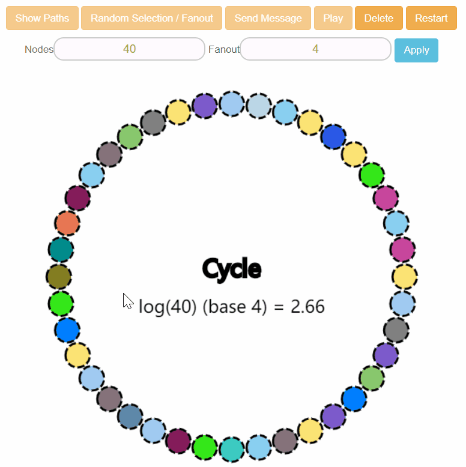

- Gossip算法又被称为反熵（Anti-Entropy），熵是物理学上的一个概念，代表杂乱无章，而反熵就是在杂乱无章中寻求一致，这充分说明了Gossip的特点：**在一个有界网络中，每个节点都随机地与其他节点通信，经过一番杂乱无章的通信，最终所有节点的状态都会达成一致**。每个节点可能知道所有其他节点，也可能仅知道几个邻居节点，只要这些节可以通过网络连通，最终他们的状态都是一致的，当然这也是疫情传播的特点。
- 优点：
- **可伸缩性**：可以应对节点的快速增长。 Gossip协议的的复杂度是O(logN)以Fanout为底数 ，500个节点如果Fanout为4也只需要5轮即可。**即使集群节点的数量增加，每个节点的负载也不会增加很多，几乎是恒定的**。这就允许Consul管理的集群规模能横向扩展到数千个节点。
- **容错性**：即使由于网络问题造成两个节点之间无法连接，但是通过协议还是可以收到其他节点的数据更新消息。
- 收敛的一致性：Gossip 以指数级快速传播信息，当一个消息到达以后，能够快速传遍整个网络，系统状态的不一致可以在很快的时间内收敛，消息传播速度是log(N)
- **去中心化**：Gossip 协议不要求任何中心的关键节点，所有节点都可以是对等的，任何一个节点无需知道整个网络状况，只要网络是连通的，任意一个节点就可以把消息散播到全网。
- 缺点：
- 消息是有延迟的：Gossip协议虽然传播得很快，但是还需要经过几个轮次的传播才能到达全网的所有节点，这就不适合对实时性要求很高的场景了。或者说，Gossip协议只能达到最终一致性。
- 消息是有冗余的：消息的发送是有冗余的，尤其是到了后面几轮，大多数节点已经收到了消息，但是还在持续选择节点发送。

## 常用分布式工具的一致性

- Redis：redis Cluster 使用Gossip协议来保持节点状态信息同步，使用raft算法进行leader选举。**因为redis使用的是异步复制，因此没办法保证从节点中包含所有最新的更改**，因此在主从切换时会丢掉一部分数据。
- Consul：consul使用raft协议用来处理leader选举和多节点数据一致性问题，使用gossip用来广播故障、成员关系等事件。
- Kafka：Kafka将元数据信息保存在Zookeeper，通过Zookeeper实现分布式的管理、协调代理。在集群启动是通过抢占的方式使一个节点成为控制器，通过该节点进行leader选举，leader选举时会从ISR集合中选择一个副本作为新的Leader。ISR（in-sync replica，已同步的副本）是Kafak针对每个Topic的分区副本集合，只有当这些副本都跟Leader中的副本同步了之后，kafka才会认为消息已提交，并反馈给消息的生产者，Kafka使用ISR保证可用性和一致性的动态平衡。
- ZooKeeper：ZooKeeper的一致性协议以Fast Paxos算法为基础的ZAB协议(Zookeeper Atomic Broadcast)，在事务提交过程中需要保证过半的从节点确认，很好地保证分布式环境中数据的一致性。
- MySQL：MySQL采用主从同步来保证高可用，对于MySQL来说默认采用的是最高性能模式，主从同步是异步的。如果开启了Semi-sync则为最大可用模式，正常情况下需要等待备库确认接收再返回给客户端，如果超时则变为异步，保证可用性。
- OceanBase：为了保证高可用采用了分布式一致性协议Paxos，任何修改都需要超过半数的参与者同意才能通过，即使主库突发故障，只要活着的库超过半数，则已经提交的每一笔事务的日志至少会在一个库上存在，不会有任何数据丢失。


# 微服务

- 面向服务的架构SOA（Service-Oriented Architecture）是一个组件模型，它将应用程序的不同功能单元（称为服务）通过这些服务之间定义良好的接口和契约联系起来。接口是采用中立的方式进行定义的，它应该独立于实现服务的硬件平台、操作系统和编程语言。这使得构建在各种各样的系统中的服务可以以一种统一和通用的方式进行交互。
- 微服务特性：
1. 一系列独立运行的微服务共同构建起整个系统；
2. 每个服务为独立的业务开发，一个微服务只关注某个特定的功能，例如订单管理、用户管理等；
3. 微服务之间通过一些轻量的通信机制进行通信，例如通过REST API进行调用；
4. 可以使用不同的语言与数据存储技术；
- 微服务架构的优点
1. 易于开发和维护：一个微服务只关注一个特定的业务功能，所以它的业务清晰、代码量较少。开发和维护单个微服务相对是比较简单的。而整个应用是由若干个微服务构建而成的，所以整个应用也会维持在可控状态。
2. 局部修改容易部署：单体应用只要有修改，就得重新部署整个应用，微服务解决了这样的问题。一般来说，对某个微服务进行修改，只需要重新部署这个服务即可。
3. 技术栈不受限：在微服务中，我们可以结合项目业务及团队的特点，合理地选择技术栈。例如某些服务可使用关系型数据库MySQL；某些微服务有图形计算的需求，我们可以使用Neo4J；甚至可以根据需要，部分微服务使用Java开发，部分微服务使用NodeJS进行开发。
4. 按需伸缩：我们可以根据需求，实现细粒度的扩展。例如：系统中的某个微服务遇到了瓶颈，我们可以结合这个微服务的业务特点，增加内存、升级CPU或者是增加节点。 
- 微服务设计原则
- 单一职责原则：一个类，只有一个引起它变化的原因。应该只有一个职责。
- 服务自治原则：服务自治，是指每个微服务应该具备独立的业务能力、依赖与运行环境。
- 轻量级通信原则：微服务之间应该通过轻量级通信机制进行 交互。轻量级通信机制应具备两点：一是体量较轻，二是跨语言、跨平台。
- 接口明确原则：每个服务的对外接口应该明确定义，并尽量保持不变。

## consul

### consul 简介

- consul就是提供服务注册发现的工具。consul是分布式的、高可用、横向扩展的。consul提供的一些关键特性：
1. service discovery：consul通过DNS或者HTTP接口使服务注册和服务发现变的很容易，一些外部服务，例如saas提供的也可以一样注册。
2. health checking：健康检测使consul可以快速的告警在集群中的操作。和服务发现的集成，可以防止服务转发到故障的服务上面。
3. key/value storage：一个用来存储动态配置的系统。提供简单的HTTP接口，可以在任何地方操作。
4. multi-datacenter：无需复杂的配置，即可支持任意数量的区域。
- 主流注册中心对比：

Feature|Consul| zookeeper|etcd|euerka
--------- | -------------|--------- | -------------|---------
语言| GO| JAVA| GO| JAVA
服务健康检查|服务状态，内存，硬盘等| (弱)长连接，keepalive| 连接心跳| 可配支持
多数据中心| 支持 |— |—| —
kv存储服务| 支持 |支持 |支持| —
一致性协议|raft| paxos|raft| —
cap| cp| cp| cp| ap
使用接口(多语言能力)| 支持http和dns| 客户端| http/grpc| http（sidecar）

### consul Glossary(术语)
- Agent: 代理是 consul 集群中每个成员的基本单位，他们以守护进程的形式存在，代理有客户端以及服务端两种角色运行。所有的节点都必须运行一个代理，它们相互之间通过 DNS 或者 HTTP 接口保持健康检查并同步数据。
- Client: 客户端是代理的其中一种角色，它会将所有的 RPC 请求转发到服务端代理，而客户端本身是无状态的，而且只会占用非常少的资源并消耗少量的网络带宽，建议每个应用节点都运行一个客户端 。
- Server: 服务端相对而言是一个非常重的代理，它的主要工作包括参与raft仲裁、维护集群状态、响应RPC查询、与其他的数据中心交换数据、将查询转发给Leader / 其他数据中心等。可以说，服务端是 consul 集群中最重要的角色，所以建议将其放置在相对独立的主机上，**并且一个集群（数据中心）中至少需要 3 个以上的服务端才能保证最终一致性**。
- Datacenter: 数据中心其实就是一个低延迟、高带宽的私有网络环境，一个稳定的数据中心环境对raft协议来说非常重要，否则及其可能出现数据不同步、服务质量下降等情况。
- Gossip: 一种**保证最终一致性的分布式协议**，常用于点对点通信，模拟人与人之间的交流从而达到理想中的最终一致性。**consul 通过 UDP 使用该协议提供成员管理、失败检测、事件广播等功能**。
- Raft: 是一种**保证强一致性的分布式协议**，**consul 使用Raft协议提供服务端们的数据一致性**。

### consul架构

consul概念图：


- 如上架构图可以看出几个关键点
- Client和Client之间的LAN Gossip
- Client将RPC请求发至Server, Follower Server将请求转发至Leader节点
- Server之间的选举行为
- Datacenter之间的WAN Gossip
- consul的集群是由N个SERVER，加上m个CLIENT组成的。而不管是SERVER还是CLIENT，都是consul的一个节点，所有的服务都可以注册到这些节点上，正是通过这些节点实现服务注册信息的共享。除了这两个，还有一些小细节：
- CLIENT：表示consul的client模式，就是客户端模式。是consul节点的一种模式，这种模式下，**所有注册到当前节点的服务会被转发到SERVER，本身是不持久化这些信息**。
- SERVER：SERVER表示consul的server模式，表明这个consul是个server，这种模式下，功能和CLIENT都一样，唯一不同的是，**它会把所有的信息持久化的本地，这样遇到故障，信息是可以被保留的**。官方建议是: 至少要运行3个或者3个以上的Consul Server。多个server之中需要选举一个leader，这个**选举过程Consul基于Raft协议实现**，**多个Server节点上的Consul数据信息保持强一致性**。
- SERVER-LEADER：中间那个SERVER下面有LEADER的字眼，表明这个SERVER是它们的老大，它和其它SERVER不一样的一点是，**SERVER-LEADER需要负责同步注册的信息给其它的SERVER，同时也要负责各个节点的健康监测**。
- consul使用raft协议用来处理选主还有多节点数据一致性问题，使用gossip用来广播故障、成员关系等事件。
- **同一个数据中心的所有节点都必须加入gossip协议**。这意味着gossip协议包含一个给定数据中心的所有节点。这服务于几个目的：
1. 成员关系允许Client自动发现Server节点，减少所需的配置量
2. 检测节点故障的工作不是放在server上，而是分布式的。这是的故障检测相比心跳机制有更高的可扩展性。
3. 它用来作为一个消息层来通知事件，比如leader选举发生时。
- leader负责处理所有的查询和事务。作为一致性协议的一部分，事务也必须被复制到所有其他的节点。因为这一要求，当一个非leader得server收到一个RPC请求时，它将请求转发给集群leader。
- server节点也作为WAN gossip Pool的一部分。这个Pool不同于LAN Pool，因为它是为了优化互联网更高的延迟，并且它只包含其他Consul server节点。这个Pool的目的是为了允许数据中心能够以low-touch的方式发现彼此。这使得一个新的数据中心可以很容易的加入现存的WAN gossip。因为server都运行在这个pool中，它也支持跨数据中心请求。当一个server收到来自另一个数据中心的请求时，它随即转发给正确数据中心一个server。该server再转发给本地leader。
- 这使得数据中心之间只有一个很低的耦合，但是由于故障检测，连接缓存和复用，跨数据中心的请求都是相对快速和可靠的。
- Consul的每个Agent会利用Gossip协议互相检查在线状态，本质上是节点之间互Ping，分担了服务器节点的心跳压力。**如果有节点掉线，不用服务器节点检查，其他普通节点会发现，然后用Gossip广播给整个集群**。


## dubbo


### dubbo架构

- 节点角色说明：
- Provider: 暴露服务的服务提供方。
- Consumer: 调用远程服务的服务消费方。
- Registry: 服务注册与发现的注册中心。
- Monitor: 统计服务的调用次调和调用时间的监控中心。
- Container: 服务运行容器。
- 调用关系说明：
0. 服务容器负责启动，加载，运行服务提供者。
1. 服务提供者在启动时，向注册中心注册自己提供的服务。
2. 服务消费者在启动时，向注册中心订阅自己所需的服务。
3. 注册中心返回服务提供者地址列表给消费者，如果有变更，注册中心将基于长连接推送变更数据给消费者。
4. 服务消费者，从提供者地址列表中，基于软负载均衡算法，选一台提供者进行调用，如果调用失败，再选另一台调用。
5. 服务消费者和提供者，在内存中累计调用次数和调用时间，定时每分钟发送一次统计数据到监控中心。
- 连通性：
- **注册中心负责服务地址的注册与查找，相当于目录服务，服务提供者和消费者只在启动时与注册中心交互，注册中心不转发请求，压力较小**
- 监控中心负责统计各服务调用次数，调用时间等，统计先在内存汇总后每分钟一次发送到监控中心服务器，并以报表展示
- **服务提供者向注册中心注册其提供的服务，并汇报调用时间到监控中心，此时间不包含网络开销**
- **服务消费者向注册中心获取服务提供者地址列表，并根据负载算法直接调用提供者，同时汇报调用时间到监控中心，此时间包含网络开销**
- **注册中心，服务提供者，服务消费者三者之间均为长连接，监控中心除外**
- **注册中心通过长连接感知服务提供者的存在，服务提供者宕机，注册中心将立即推送事件通知消费者**
- **注册中心和监控中心全部宕机，不影响已运行的提供者和消费者，消费者在本地缓存了提供者列表**
- 注册中心和监控中心都是可选的，服务消费者可以直连服务提供者
- 健状性：
- 监控中心宕掉不影响使用，只是丢失部分采样数据
- 数据库宕掉后，注册中心仍能通过缓存提供服务列表查询，但不能注册新服务
- 注册中心对等集群，任意一台宕掉后，将自动切换到另一台
- 注册中心全部宕掉后，服务提供者和服务消费者仍能通过本地缓存通讯
- 服务提供者无状态，任意一台宕掉后，不影响使用
- 服务提供者全部宕掉后，服务消费者应用将无法使用，并无限次重连等待服务提供者恢复
- 伸缩性：
- **注册中心为对等集群，可动态增加机器部署实例，所有客户端将自动发现新的注册中心**
- 服务提供者无状态，可动态增加机器部署实例，注册中心将推送新的服务提供者信息给消费者
- 升级性：
- 当服务集群规模进一步扩大，带动IT治理结构进一步升级，需要实现动态部署，进行流动计算，现有分布式服务架构不会带来阻力：


### 负载均衡

- 在集群负载均衡时，Dubbo提供了多种均衡策略，缺省为random随机调用。
- Random LoadBalance
- 随机，按权重设置随机概率。
- 在一个截面上碰撞的概率高，但调用量越大分布越均匀，而且按概率使用权重后也比较均匀，有利于动态调整提供者权重。
- RoundRobin LoadBalance
- 轮循，按公约后的权重设置轮循比率。
- 存在慢的提供者累积请求问题，比如：第二台机器很慢，但没挂，当请求调到第二台时就卡在那，久而久之，所有请求都卡在调到第二台上。
- LeastActive LoadBalance
- 最少活跃调用数，相同活跃数的随机，活跃数指调用前后计数差。
- 使慢的提供者收到更少请求，因为越慢的提供者的调用前后计数差会越大。
- ConsistentHash LoadBalance
- 一致性Hash，相同参数的请求总是发到同一提供者。
- 当某一台提供者挂时，原本发往该提供者的请求，基于虚拟节点，平摊到其它提供者，不会引起剧烈变动。
- 缺省只对第一个参数Hash，使用用160份虚拟节点


### 线程模型


- 事件处理线程说明
- 如果事件处理的逻辑能迅速完成，并且不会发起新的IO请求，比如只是在内存中记个标识，则直接在IO线程上处理更快，因为减少了线程池调度。
- 但如果事件处理逻辑较慢，或者需要发起新的IO请求，比如需要查询数据库，则必须派发到线程池，否则IO线程阻塞，将导致不能接收其它请求。
- 如果用IO线程处理事件，又在事件处理过程中发起新的IO请求，比如在连接事件中发起登录请求，会报“可能引发死锁”异常，但不会真死锁。
- Dispatcher
- all 所有消息都派发到线程池，包括请求，响应，连接事件，断开事件，心跳等。
- direct 所有消息都不派发到线程池，全部在IO线程上直接执行。
- message 只有请求响应消息派发到线程池，其它连接断开事件，心跳等消息，直接在IO线程上执行。
- execution 只请求消息派发到线程池，不含响应，响应和其它连接断开事件，心跳等消息，直接在IO线程上执行。
- connection 在IO线程上，将连接断开事件放入队列，有序逐个执行，其它消息派发到线程池。
- ThreadPool
- fixed 固定大小线程池，启动时建立线程，不关闭，一直持有。(缺省)
- cached 缓存线程池，空闲一分钟自动删除，需要时重建。
- limited 可伸缩线程池，但池中的线程数只会增长不会收缩。(为避免收缩时突然来了大流量引起的性能问题)。


## dubbo通信协议

- dubbo共支持如下几种通信协议：dubbo、rmi、hessian、http、webService、thrift、memCached、redis

### Dubbo协议
- 官方推荐使用Dubbo协议，该协议采用单一长连接和NIO异步通讯，适合于小数据量大并发的服务调用，以及服务消费者机器数远大于服务提供者机器数的情况。Dubbo缺省协议不适合传送大数据量的服务，比如传文件，传视频等，除非请求量很低。
- Dubbo协议缺省每服务每提供者每消费者使用单一长连接，如果数据量较大，可以使用多个连接。默认为0。为防止被大量连接撑挂，可在服务提供方限制大接收连接数，以实现服务提供方自我保护。
- 缺省协议，使用基于mina1.1.7+hessian3.2.1的tbremoting交互。
- 连接个数：单连接
- 连接方式：长连接
- 传输协议：TCP
- 传输方式：NIO异步传输
- 序列化：Hessian二进制序列化
- 适用范围：传入传出参数数据包较小（建议小于100K），消费者比提供者个数多，单一消费者无法压满提供者，尽量不要用dubbo协议传输大文件或超大字符串。
- 适用场景：常规远程服务方法调用
- 为什么要消费者比提供者个数多：
- 因dubbo协议采用单一长连接，假设网络为千兆网卡(1024Mbit=128MByte)，根据测试经验数据每条连接最多只能压满7MByte，理论上1个服务提供者需要20个服务消费者才能压满网卡。
- 为什么不能传大包：
- 因dubbo协议采用单一长连接，如果每次请求的数据包大小为500KByte，假设网络为千兆网卡(1024Mbit=128MByte)，每条连接最大7MByte(不同的环境可能不一样，供参考)，单个服务提供者的TPS(每秒处理事务数)最大为：128MByte / 500KByte = 262。单个消费者调用单个服务提供者的TPS(每秒处理事务数)最大为：7MByte / 500KByte = 14。如果能接受，可以考虑使用，否则网络将成为瓶颈。
- 为什么采用异步单一长连接：
- 因为服务的现状大都是服务提供者少，通常只有几台机器，而服务的消费者多，可能整个网站都在访问该服务，比如Morgan的提供者只有6台提供者，却有上百台消费者，每天有1.5亿次调用，如果采用常规的hessian服务，服务提供者很容易就被压跨，通过单一连接，保证单一消费者不会压死提供者，长连接，减少连接握手验证等，并使用异步IO，复用线程池，防止C10K问题。


# ZooKeeper


## zookeeper

- ZooKeeper的设计目标是**将那些复杂且容易出错的分布式一致性服务封装起来，构成一个高效可靠的原语集，并以一系列简单易用的接口提供给用户使用**。
- ZooKeeper是一个典型的**分布式数据一致性的解决方案**。分布式应用程序可以基于它实现诸如数据发布/订阅、负载均衡、命名服务、分布式协调/通知、集群管理、Master选举、分布式锁和分布式队列等功能。ZooKeeper可以保证如下分布式一致性特性。
- **顺序一致性**:从同一个客户端发起的事务请求，最终将会严格按照其发起顺序被应用到ZooKeeper中。每个znode在创建的时候都会编一个号，同样的父节点的znode共用一套编号，由父节点维护，是唯一的，锁机制要用到。
- **原子性**:**所有事务请求的结果在集群中所有机器上的应用情况是一致的**，也就是说要么整个集群所有集群都成功应用了某一个事务，要么都没有应用，一定不会出现集群中部分机器应用了该事务，而另外一部分没有应用的情况。
- **可靠性**:一旦服务端成功地应用了一个事务，并完成对客户端的响应，那么该事务所引起的服务端状态变更将会被一直保留下来，除非有另一个事务又对其进行了变更。
- 实时性:通常人们看到实时性的第一反应是，一旦一个事务被成功应用，那么客户端能够立即从服务端上读取到这个事务变更后的最新数据状态。这里需要注意的是，**ZooKeeper仅仅保证在一定的时间段内，客户端最终一定能够从服务端上读取到最新的数据状态。**


### 介绍

- ZooKeeper以Fast Paxos算法为基础，同时为了解决活锁问题，对Fast Paxos算法进⾏了优化，因此也可以⼴泛用于⼤数据之外的其他分布式系统，为⼤型分布式系统提供可靠的协作处理功能。
- 关于ZooKeeper这样的系统功能的讨论都围绕着⼀条主线：**它可以在分布式系统中协作多个任务**。⼀个协作任务是指⼀个包含多个进程的任务。这个任务可以是为了协作或者是为了管理竞争。
- 协作意味着多个进程需要⼀同处理某些事情，⼀些进程采取某些⾏动使得其他进程可以继续⼯作。⽐如，在典型的主-从（master-worker）⼯作模式中，从节点处于空闲状态时会通知主节点可以接受⼯作，于是主节点就会分配任务给从节点。
- 竞争则不同。它指的是两个进程不能同时处理⼯作的情况，⼀个进程必须等待另⼀个进程。同样在主-从⼯作模式的例⼦中，我们想有⼀个主节点，但是很多进程也许都想成为主节点，因此我们需要实现互斥排他锁（mutual exclusion）。实际上，我们可以认为获取主节点⾝份的过程其实就是获取锁的过程，获得主节点控制权锁的进程即主节点进程。


## ZooKeeper原理

- ZooKeeper并不直接暴露原语，它暴露了由⼀⼩部分调⽤⽅法组成的类似⽂件系统的API，以便允许应⽤实现⾃⼰的原语。我们通常使⽤菜谱（recipes）来表⽰这些原语的实现。菜谱包括ZooKeeper操作和维护⼀个⼩型的数据节点，这些节点被称为znode，采⽤类似于⽂件系统的层级树状结构进⾏管理。
- ZooKeeper的API暴露了以下⽅法：
- create/path data 创建⼀个名为/path的znode节点，并包含数据data。
- delete/path 删除名为/path的znode。
- exists/path 检查是否存在名为/path的节点。 setData/path data 设置名为/path的znode的数据为data。
- getData/path 返回名为/path节点的数据信息。
- getChildren/path 返回所有/path节点的所有⼦节点列表。
- 需要注意的是，**ZooKeeper并不允许局部写⼊或读取znode节点的数据。当设置⼀个znode节点的数据或读取时，znode节点的内容会被整个替换或全部读取进来**。

### 集群角色

- 在ZooKeeper中，有三种角色：
- Leader(同一时刻只会有一个)
- Follower
- Observer
- ZooKeeper默认只有Leader和Follower两种角色，没有Observer角色。为了使用Observer模式，在任何想变成Observer的节点的配置文件中加入：peerType=observer并在所有server的配置文件中，配置成observer模式的server的那行配置追加:observer，例如：`server.1:localhost:2888:3888:observer`
- ZooKeeper集群的所有机器通过一个Leader选举过程来选定一台被称为『Leader』的机器，**Leader服务器为客户端提供读和写服务。Follower和Observer都能提供读服务，不能提供写服务**。两者唯一的区别在于，**Observer机器不参与Leader选举过程，也不参与写操作的『过半写成功』策略**，**因此Observer可以在不影响写性能的情况下提升集群的读性能**。


### Zookeeper leader选举

- leader选举就像总统选举一样，每人一票，获得多数票的人就当选为总统了。在zookeeper集群中也是一样，每个节点都会投票，**如果某个节点获得超过半数以上的节点的投票，则该节点就是leader节点了**。
- 当一个服务器进入LOOKING状态，就会发送给集群中的每个一个通知信息，该消息中包括该服务器的投票信息，**投票中包含服务器标识符(sid)和最近执行的事务的zxid信息**。
- 当一个服务器收到一个投票信息，该服务器会根据以下规则修改自己的投票信息
1. 将接收的voteId和voteZxid作为一个标识符，并获取接收方当前的投票信息中的zxid，用myZxid和mySid标识接收方服务器自己的值。
2. 如果(voteZxid>myZxid)或者(voteZxid=myZxid且voteId>mySid)，保留当前的投票信息。
3. 否则修改自己的投票信息，将voteZxid赋值给myZxid，将voteId赋值给mySid。
- 选举结束后follower会开始与leader之间进行状态同步，之后才可以处理新的请求。
- 在leader选举的时候需要选择zxid最大的服务器作为leader，这使得ZooKeeper不需要将提议从follower传到leader。

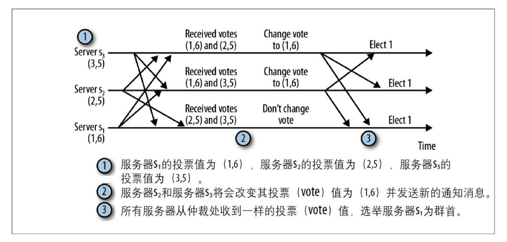

### 数据节点（ZNode）

- 在谈到分布式的时候，一般『节点』指的是组成集群的每一台机器。而ZooKeeper中的数据节点是指数据模型中的数据单元，称为ZNode。**ZooKeeper将所有数据存储在内存中，数据模型是一棵树**（ZNode Tree），由斜杠（/）进行分割的路径，如/hbase/master，其中hbase和master都是ZNode。每个ZNode上都会保存自己的数据内容，同时会保存一系列属性信息。
- 注：这里的ZNode可以理解成既是Unix里的文件，又是Unix里的目录。因为每个ZNode不仅本身可以写数据（相当于Unix里的文件），还可以有下一级文件或目录（相当于Unix里的目录）。
- 在ZooKeeper中，ZNode可以分为持久节点和临时节点两类。
- 持久节点：所谓持久节点是指一旦这个ZNode被创建了，除非主动进行ZNode的移除操作，否则这个ZNode将一直保存在ZooKeeper上。
- 临时节点：临时节点的生命周期跟客户端会话绑定，一旦客户端会话失效，那么这个客户端创建的所有临时节点都会被移除。
- ZooKeeper还允许用户为每个节点添加一个特殊的属性：SEQUENTIAL。一旦节点被标记上这个属性，那么在这个节点被创建的时候，ZooKeeper就会自动在其节点后面追加上一个整型数字，这个整型数字是一个由父节点维护的自增数字。有序znode通过提供了创建具有唯⼀名称的znode的简单⽅式。同时也通过这种⽅式可以直观地查看znode的创建顺序。

#### 状态信息
每个ZNode除了存储数据内容之外，还存储了ZNode本身的一些状态信息。用 get 命令可以同时获得某个ZNode的内容和状态信息。如下：
```
[zk: localhost:2181(CONNECTED) 23] get /yarn-leader-election/appcluster-yarn/ActiveBreadCrumb
appcluster-yarnrm1
cZxid = 0x1b00133dc0 //Created ZXID,表示该ZNode被创建时的事务ID
ctime = Tue Jan 03 15:44:42 CST 2017 //Created Time,表示该ZNode被创建的时间
mZxid = 0x1d00000063 //Modified ZXID，表示该ZNode最后一次被更新时的事务ID
mtime = Fri Jan 06 08:44:25 CST 2017 //Modified Time，表示该节点最后一次被更新的时间
pZxid = 0x1b00133dc0 //表示该节点的子节点列表最后一次被修改时的事务ID。注意，只有子节点列表变更了才会变更pZxid，子节点内容变更不会影响pZxid。
cversion = 0 //子节点的版本号
dataVersion = 11 //数据节点的版本号
aclVersion = 0 //ACL版本号
ephemeralOwner = 0x0 //创建该节点的会话的seddionID。如果该节点是持久节点，那么这个属性值为0。
dataLength = 22 //数据内容的长度
numChildren = 0 //子节点的个数
```
- 在ZooKeeper中，version属性是用来实现乐观锁机制中的『写入校验』的（保证分布式数据原子性操作）。

#### 版本（实现CAS）

- ZooKeeper的每个ZNode上都会存储数据，对应于每个ZNode，ZooKeeper都会为其维护一个叫作Stat的数据结构，Stat中记录了这个ZNode的三个数据版本，分别是version（当前ZNode的版本）、cversion（当前ZNode子节点的版本）和aversion（当前ZNode的ACL版本）。
- 节点的版本随着每次数据变化而自增，这样可以阻止并行操作的不一致性。

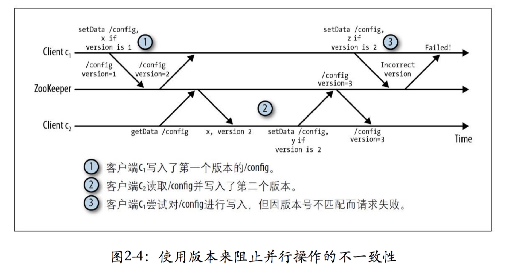

### ACL（Access Control Lists）
- ZooKeeper采用ACL（Access Control Lists）策略来进行权限控制。ZooKeeper定义了如下5种权限。
- CREATE: 创建子节点的权限。
- READ: 获取节点数据和子节点列表的权限。
- WRITE：更新节点数据的权限。
- DELETE: 删除子节点的权限。
- ADMIN: 设置节点ACL的权限。
- 注意：CREATE 和 DELETE 都是针对子节点的权限控制。

### 会话（Session）

- Session是指客户端会话。在ZooKeeper中，一个客户端连接是指客户端和ZooKeeper服务器之间的TCP长连接。
- ZooKeeper对外的服务端口默认是2181，客户端启动时，首先会与服务器建立一个TCP连接，从第一次连接建立开始，客户端会话的生命周期也开始了，通过这个连接，客户端能够通过心跳检测和服务器保持有效的会话，也能够向ZooKeeper服务器发送请求并接受响应，同时还能通过该连接接收来自服务器的Watch事件通知。
- 创建一个会话时需要设置超时时间
- 对于服务端来说经过这个超时时间未收到任何消息的话，服务端就会声明会话过期。
- 客户端经过 1/3 的时间未收到任何消息，客户端将向服务端发送心跳消息。在经过 2/3 的时间后， Zookeeper客户端开始寻找其他的服务器。
- 集群模式下服务端会传递给客户端可用的服务器列表，供客户端连接。
- 当客户端尝试连接其他服务器时需要保证这个服务器的Zookeepe状态要与最后连接的服务器的Zookeeper状态保持最新。Zookeeper通过在服务中排序更新操作来决定状态是否最新。Zookeeper确保每一个变化相对于所有其他已执行的更新是完全有序的。
- 会话提供了顺序保障，这就意味着同⼀个会话中的请求会以FIFO（先进先出）顺序执⾏。通常，⼀个客户端只打开⼀个会话，因此客户端请求将全部以FIFO顺序执⾏。如果客户端拥有多个并发的会话，FIFO顺序在多个会话之间未必能够保持。⽽即使⼀个客户端中连贯的会话并不重叠，也未必能够保证FIFO顺序。

### 事务操作

- **服务器对于只读请求会在本地处理，对于那些会改变ZooKeeper状态的客户端请求(create、delete、setData)将会被转发给leader执行相应的请求，并形成状态的更新，这个过程称为事务**。对应每一个事务请求，ZooKeeper都会为其分配一个全局唯一的事务ID，用ZXID表示，通常是一个64位的数字。每一个ZXID对应一次更新操作，从这些ZXID中可以间接地识别出ZooKeeper处理这些事务操作请求的全局顺序。
- 通过Zxid对事务进行标识，就可以按照leader所指定的顺序在各个服务器中按序执行。服务器之间在进行新的群首选举时也会交换zxid信息，这样就可以知道哪个无故障服务器接收了更多的事务，并可以同步他们之间的状态信息。
- ⼀个事务为⼀个单位，也就是说所有的变更处理需要以原⼦⽅式执⾏。以setData的操作为例，变更节点的数据信息，但并不改变版本号将会导致错误的发⽣，因此，**ZooKeeper集群以事务⽅式运⾏，并确保所有的变更操作以原⼦⽅式被执⾏，同时不会被其他事务所⼲扰**。在ZooKeeper中，并不存在传统的关系数据库中所涉及的回滚机制，⽽是确保事务的每⼀步操作都互不⼲扰。在很长的⼀段时间⾥，ZooKeeper所采⽤的设计⽅式为:在每个服务器中启动⼀个单独的线程来处理事务，通过单独的线程来保障事务之间的顺序执⾏互不⼲扰。最近，ZooKeeper增加了多线程的⽀持，以便提⾼事务处理的速度。
- zxid为一个64位的long型，分为两部分：时间戳部分和计数器部分。每个部分32位，通过时间戳和计数器表示服务器的状态变更信息。
- 时间戳的概念代表了管理权随时间的变化情况，一个时间戳表示了某个服务器行使管理权的这段时间，在一个时间戳内，leader会广播提案消息，并根据计数器识别每一个消息。
- 时间戳在每次leader选举的时候便会增加。

### Watcher

- Watcher（事件监听器），是ZooKeeper中一个很重要的特性。ZooKeeper允许用户在指定节点上注册一些Watcher，并且在一些特定事件触发的时候，ZooKeeper服务端会将事件通知到感兴趣的客户端上去。该机制是ZooKeeper实现分布式协调服务的重要特性。
- ZooKeeper允许客户端向服务端注册一个Watcher监听，当服务端的一些事件触发了这个Watcher，那么就会向指定客户端发送一个事件通知来实现分布式的通知功能。
- 监视点是⼀个单次触发的操作，意即监视点会触发⼀个通知。为了接收多个通知，客户端必须在每次通知后设置⼀个新的监视点。**通知机制的⼀个重要保障是，对同⼀个znode的操作，先向客户端传送通知，然后再对该节点进⾏变更**。丢失事件通常并不是问题，因为任何在接收通知与注册新监视点之间的变化情况，均可以通过读取ZooKeeper的状态信息来获得。
- 当客户端向ZooKeeper服务器注册Watcher的同时，会将Watcher对象存储在客户端的WatchManager中。当ZooKeeper服务器端触发Watcher事件后，会向客户端发送通知，客户端线程从WatchManager中取出对应的Watcher对象来执行回调逻辑。
- 在ZooKeeper中，接口类Watcher用于表示一个标准的事件处理器，其定义了事件通知相关的逻辑，包含KeeperState和EventType两个枚举类，分别代表了通知状态和事件类型，同时定义了事件的回调方法：process（WatchedEvent event）
- WatchedEvent包含了每一个事件的三个基本属性：通知状态（keeperState），事件类型（EventType）和节点路径（path）
- ZooKeeper使用WatchedEvent对象来封装服务端事件并传递给Watcher，从而方便回调方法process对服务端事件进行处理。
- 服务端在生成WatchedEvent事件之后，会调用getWrapper方法将自己包装成一个可序列化的WatcherEvent事件，以便通过网络传输到客户端。客户端在接收到服务端的这个事件对象后，首先会将WatcherEvent还原成一个WatchedEvent事件，并传递给process方法处理，回调方法process根据入参就能够解析出完整的服务端事件了。
- 在创建一个ZooKeeper客户单的实例时可以向构造方法中传入一个默认的Watcher，这个Watcher将作为这个ZooKeeper会话期间的默认Watcher，会一直被保存在客户端ZKWatchManager的defaultWatcher中
- 另外，ZooKeeper客户端也可以通过getData，getChildren和exist三个接口来向ZooKeeper服务器注册Watcher，无论使用哪种方式，注册Watcher的工作原理都是一致的

### 数据存储

- Zookeeper中数据存储被分为内存数据存储和磁盘数据存储

#### 内存数据
- Zookeeper的数据模型是树结构，在内存数据库中，存储了整棵树的内容，包括所有的节点路径、节点数据、ACL信息，Zookeeper会定时将这个数据存储到磁盘上。
1. DataTree：DataTree是内存数据存储的核心，是一个树结构，代表了内存中一份完整的数据。DataTree不包含任何与网络、客户端连接及请求处理相关的业务逻辑，是一个独立的组件。
2. DataNode：DataNode是数据存储的最小单元，其内部除了保存了结点的数据内容、ACL列表、节点状态之外，还记录了父节点的引用和子节点列表两个属性，其也提供了对子节点列表进行操作的接口。
3. ZKDatabase：Zookeeper的内存数据库，管理Zookeeper的所有会话、DataTree存储和事务日志。ZKDatabase会定时向磁盘dump快照数据，同时在Zookeeper启动时，会通过磁盘的事务日志和快照文件恢复成一个完整的内存数据库。

#### 事务日志

1. 文件存储：在配置Zookeeper集群时需要配置dataDir目录，其用来存储事务日志文件。也可以为事务日志单独分配一个文件存储目录:dataLogDir。若配置dataLogDir为/home/admin/zkData/zk_log，那么Zookeeper在运行过程中会在该目录下建立一个名字为version-2的子目录，该目录确定了当前Zookeeper使用的事务日志格式版本号，当下次某个Zookeeper版本对事务日志格式进行变更时，此目录也会变更，即在version-2子目录下会生成一系列文件大小一致(64MB)的文件。
2. 日志写入：FileTxnLog负责维护事务日志对外的接口，包括事务日志的写入和读取等。Zookeeper的事务日志写入过程大体可以分为如下6个步骤。
1. 确定是否有事务日志可写。当Zookeeper服务器启动完成需要进行第一次事务日志的写入，或是上一次事务日志写满时，都会处于与事务日志文件断开的状态，即Zookeeper服务器没有和任意一个日志文件相关联。因此在进行事务日志写入前，Zookeeper首先会判断FileTxnLog组件是否已经关联上一个可写的事务日志文件。若没有，则会使用该事务操作关联的ZXID作为后缀创建一个事务日志文件，同时构建事务日志的文件头信息，并立即写入这个事务日志文件中去，同时将该文件的文件流放入streamToFlush集合，该集合用来记录当前需要强制进行数据落盘的文件流。
2. 确定事务日志文件是否需要扩容(预分配)。Zookeeper会采用磁盘空间预分配策略。当检测到当前事务日志文件剩余空间不足4096字节时，就会开始进行文件空间扩容，即在现有文件大小上，将文件增加65536KB(64MB)，然后使用"0"填充被扩容的文件空间。
3. 事务序列化。对事务头和事务体的序列化，其中事务体又可分为会话创建事务、节点创建事务、节点删除事务、节点数据更新事务等。
4. 生成Checksum。为保证日志文件的完整性和数据的准确性，Zookeeper在将事务日志写入文件前，会计算生成Checksum。
5. 写入事务日志文件流。将序列化后的事务头、事务体和Checksum写入文件流中，此时并为写入到磁盘上。
6. 事务日志刷入磁盘。由于步骤5中的缓存原因，无法实时地写入磁盘文件中，因此需要将缓存数据强制刷入磁盘。
3. 日志截断：在Zookeeper运行过程中，可能出现非Leader记录的事务ID比Leader上大，这是非法运行状态。此时，需要保证所有机器必须与该Leader的数据保持同步，即Leader会发送TRUNC命令给该机器，要求进行日志截断，Learner收到该命令后，就会删除所有包含或大于该事务ID的事务日志文件。
- 关于持久化事务到磁盘，还有⼀个重要说明：现代操作系统通常会缓存脏页（Dirty Page），并将它们异步写⼊磁盘介质。然⽽，我们需要在继续之前，确保事务已经被持久化。因此我们需要冲刷（Flush）事务到磁盘介质。冲刷在这⾥就是指我们告诉操作系统将脏页写⼊磁盘，并在操作完成后返回。因为我们在SyncRequestProcessor处理器中持久化事务，所以这个处理器同时也会负责冲刷。即使队列中只有⼀个事务，这个处理器依然会执⾏冲刷。该处理器并不会等待更多的事务进⼊队列，因为这样做会增加执⾏操作的延时。
- 服务器只有在强制将事务写⼊事务日志之后才确认对应的提议。更准确⼀点，服务器调用ZKDatabase的commit⽅法，这个⽅法最终会调用 FileChannel.force。这样，服务器保证在确认事务之前已经将它持久化到磁盘中。不过，有⼀个需要注意的地⽅，现代的磁盘⼀般有⼀个缓存用于保存将要写到磁盘的数据。如果写缓存开启，force调用在返回后并不能保证数据已经写⼊介质中。实际上，它可能还在写缓存中。为了保证在 FileChannel.force（）⽅法返回后，写⼊的数据已经在介质上，磁盘写缓存必须关闭。不同的操作系统有不同的关闭⽅式。
- 补⽩（padding）是指在⽂件中预分配磁盘存储块。这样做，对于涉及存储块分配的⽂件系统元数据的更新，就不会显著影响⽂件的顺序写⼊操作。假如需要⾼速向⽇志中追加事务，⽽⽂件中并没有原先分配存储块，那么⽆论何时在写⼊操作到达⽂件的结尾，⽂件系统都需要分配⼀个新存储块。⽽通过补⽩⾄少可以减少两次额外的磁盘寻址开销：⼀次是更新元数据；另⼀次是返回⽂件。

#### snapshot-数据快照

- 数据快照是Zookeeper数据存储中非常核心的运行机制，数据快照用来记录Zookeeper服务器上某一时刻的全量内存数据内容，并将其写入指定的磁盘文件中。
1. 文件存储：与事务文件类似，Zookeeper快照文件也可以指定特定磁盘目录，通过dataDir属性来配置。若指定dataDir为/home/admin/zkData/zk_data，则在运行过程中会在该目录下创建version-2的目录，该目录确定了当前Zookeeper使用的快照数据格式版本号。在Zookeeper运行时，会生成一系列文件。
2. 数据快照：FileSnap负责维护快照数据对外的接口，包括快照数据的写入和读取等，将内存数据库写入快照数据文件其实是一个序列化过程。针对客户端的每一次事务操作，Zookeeper都会将他们记录到事务日志中，同时也会将数据变更应用到内存数据库中，Zookeeper在进行若干次事务日志记录后，将内存数据库的全量数据Dump到本地文件中，这就是数据快照。其步骤如下
1. 确定是否需要进行数据快照。每进行一次事务日志记录之后，Zookeeper都会检测当前是否需要进行数据快照，考虑到数据快照对于Zookeeper机器的影响，需要尽量避免Zookeeper集群中的所有机器在同一时刻进行数据快照。采用过半随机策略进行数据快照操作。
2. 切换事务日志文件。表示当前的事务日志已经写满，需要重新创建一个新的事务日志。
3. 创建数据快照异步线程。创建单独的异步线程来进行数据快照以避免影响Zookeeper主流程。
4. 获取全量数据和会话信息。从ZKDatabase中获取到DataTree和会话信息。
5. 生成快照数据文件名。Zookeeper根据当前已经提交的最大ZXID来生成数据快照文件名。
6. 数据序列化。首先序列化文件头信息，然后再对会话信息和DataTree分别进行序列化，同时生成一个Checksum，一并写入快照数据文件中去。


### 初始化

- 在Zookeeper服务器启动期间，首先会进行数据初始化工作，用于将存储在磁盘上的数据文件加载到Zookeeper服务器内存中。
- 初始化流程：

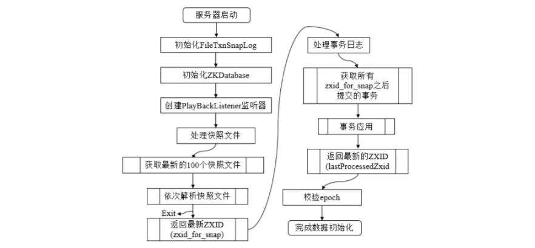

- 数据的初始化工作是从磁盘上加载数据的过程，主要包括了从快照文件中加载快照数据和根据实物日志进行数据修正两个过程。
1. 初始化FileTxnSnapLog。FileTxnSnapLog是Zookeeper事务日志和快照数据访问层，用于衔接上层业务和底层数据存储，底层数据包含了事务日志和快照数据两部分。FileTxnSnapLog中对应FileTxnLog和FileSnap。
2. 初始化ZKDatabase。首先构建DataTree，同时将FileTxnSnapLog交付ZKDatabase，以便内存数据库能够对事务日志和快照数据进行访问。在ZKDatabase初始化时，DataTree也会进行相应的初始化工作，如创建一些默认结点，如/、/zookeeper、/zookeeper/quota三个节点。
3. 创建PlayBackListener。其主要用来接收事务应用过程中的回调，在Zookeeper数据恢复后期，会有事务修正过程，此过程会回调PlayBackListener来进行对应的数据修正。
4. 处理快照文件。此时可以从磁盘中恢复数据了，首先从快照文件开始加载。
5. 获取最新的100个快照文件。更新时间最晚的快照文件包含了最新的全量数据。
6. 解析快照文件。逐个解析快照文件，此时需要进行反序列化，生成DataTree和sessionsWithTimeouts，同时还会校验Checksum及快照文件的正确性。对于100个快找文件，如果正确性校验通过时，通常只会解析最新的那个快照文件。只有最新快照文件不可用时，才会逐个进行解析，直至100个快照文件全部解析完。若将100个快照文件解析完后还是无法成功恢复一个完整的DataTree和sessionWithTimeouts，此时服务器启动失败。
7. 获取最新的ZXID。此时根据快照文件的文件名即可解析出最新的ZXID：zxid_for_snap。该ZXID代表了Zookeeper开始进行数据快照的时刻。
8. 处理事务日志。此时服务器内存中已经有了一份近似全量的数据，现在开始通过事务日志来更新增量数据。
9. 获取所有zxid_for_snap之后提交的事务。此时，已经可以获取快照数据的最新ZXID。只需要从事务日志中获取所有ZXID比步骤7得到的ZXID大的事务操作。
10. 事务应用。获取大于zxid_for_snap的事务后，将其逐个应用到之前基于快照数据文件恢复出来的DataTree和sessionsWithTimeouts。每当有一个事务被应用到内存数据库中后，Zookeeper同时会回调PlayBackListener，将这事务操作记录转换成Proposal，并保存到ZKDatabase的committedLog中，以便Follower进行快速同步。
11. 获取最新的ZXID。待所有的事务都被完整地应用到内存数据库中后，也就基本上完成了数据的初始化过程，此时再次获取ZXID，用来标识上次服务器正常运行时提交的最大事务ID。
12. 校验epoch。epoch标识了当前Leader周期，集群机器相互通信时，会带上这个epoch以确保彼此在同一个Leader周期中。完成数据加载后，Zookeeper会从步骤11中确定ZXID中解析出事务处理的Leader周期：epochOfZxid。同时也会从磁盘的currentEpoch和acceptedEpoch文件中读取上次记录的最新的epoch值，进行校验。

### 数据同步

- 整个集群完成Leader选举后，Learner会向Leader进行注册，当Learner向Leader完成注册后，就进入数据同步环节，同步过程就是Leader将那些没有在Learner服务器上提交过的事务请求同步给Learner服务器，大体过程如下：


1. 获取Learner状态。在注册Learner的最后阶段，Learner服务器会发送给Leader服务器一个ACKEPOCH数据包，Leader会从这个数据包中解析出该Learner的currentEpoch和lastZxid。
2. 数据同步初始化。首先从Zookeeper内存数据库中提取出事务请求对应的提议缓存队列proposals，同时完成peerLastZxid(该Learner最后处理的ZXID)、minCommittedLog(Leader提议缓存队列commitedLog中最小的ZXID)、maxCommittedLog(Leader提议缓存队列commitedLog中的最大ZXID)三个ZXID值的初始化。
- 对于集群数据同步而言，通常分为四类，直接差异化同步(DIFF同步)、先回滚再差异化同步(TRUNC+DIFF同步)、仅回滚同步(TRUNC同步)、全量同步(SNAP同步)，在初始化阶段，Leader会优先以全量同步方式来同步数据。同时，会根据Leader和Learner之间的数据差异情况来决定最终的数据同步方式。
- 直接差异化同步(DIFF同步，peerLastZxid介于minCommittedLog和maxCommittedLog之间)。Leader首先向这个Learner发送一个DIFF指令，用于通知Learner进入差异化数据同步阶段，Leader即将把一些Proposal同步给自己，针对每个Proposal，Leader都会通过发送PROPOSAL内容数据包和COMMIT指令数据包来完成，
- 先回滚再差异化同步(TRUNC+DIFF同步，Leader已经将事务记录到本地事务日志中，但是没有成功发起Proposal流程)。当Leader发现某个Learner包含了一条自己没有的事务记录，那么就需要该Learner进行事务回滚，回滚到Leader服务器上存在的，同时也是最接近于peerLastZxid的ZXID。
- 仅回滚同步(TRUNC同步，peerLastZxid大于maxCommittedLog)。Leader要求Learner回滚到ZXID值为maxCommittedLog对应的事务操作。
- 全量同步(SNAP同步，peerLastZxid小于minCommittedLog或peerLastZxid不等于lastProcessedZxid)。Leader无法直接使用提议缓存队列和Learner进行同步，因此只能进行全量同步。Leader将本机的全量内存数据同步给Learner。Leader首先向Learner发送一个SNAP指令，通知Learner即将进行全量同步，随后，Leader会从内存数据库中获取到全量的数据节点和会话超时时间记录器，将他们序列化后传输给Learner。Learner接收到该全量数据后，会对其反序列化后载入到内存数据库中。

## ZAB协议(Zookeeper Atomic Broadcast)

- zookeeper 使用的是zab协议，类似 raft 的 Strong Leader 模式。
- ZAB 协议的消息广播过程使用的是一个原子广播协议，类似一个**二阶段提交过程**。对于客户端发送的写请求，全部由 Leader 接收，Leader 将请求封装成一个事务 Proposal，将其发送给所有 Follwer，当超过半数成功回应，则执行 commit ，同时提交自己。同时每个事物都有一个zxid 还有一个消息队列解决异步，同时，针对各个节点的数据不一致性问题还有选举过程。

### ZAB协议：状态更新的⼴播协议

- Zookeeper的实现是有Client、Server构成，Server端提供了一个一致性复制、存储服务，Client端会提供一些具体的语义，比如分布式锁、选举算法、分布式互斥等。从存储内容来说，Server端更多的是存储一些数据的状态，而非数据内容本身，因此Zookeeper可以作为一个小文件系统使用。数据状态的存储量相对不大，完全可以全部加载到内存中，从而极大地消除了通信延迟。
- Server可以Crash后重启，考虑到容错性，Server必须“记住”之前的数据状态，因此数据需要持久化，但吞吐量很高时，磁盘的IO便成为系统瓶颈，其解决办法是使用缓存，把随机写变为连续写。
- 考虑到Zookeeper主要操作数据的状态，为了保证状态的一致性，Zookeeper提出了两个安全属性（Safety Property）
- 全序（Total order）：如果消息a在消息b之前发送，则所有Server应该看到相同的结果
- 因果顺序（Causal order）：如果消息a在消息b之前发生（a导致了b），并被一起发送，则a始终在b之前被执行。
- 为了保证上述两个安全属性，Zookeeper使用了TCP协议和Leader。通过使用TCP协议保证了消息的全序特性（先发先到），通过Leader解决了因果顺序问题：先到Leader的先执行。因为有了Leader，Zookeeper的架构就变为：Master-Slave模式，但在该模式中Master（Leader）会Crash，因此，Zookeeper引入了Leader选举算法，以保证系统的健壮性。归纳起来Zookeeper整个工作分两个阶段：
- Atomic Broadcast
- Leader选举
- 具体的，ZooKeeper使用了一个单一的主进程（Leader）来接收并处理客户端的所有事务请求，并采用ZAB的原子广播协议，将服务器数据的状态变更以事务Proposal的形式广播到所有的副本进程上去（Follower）。**ZAB协议的这个主备模型架构保证了同一时刻集群中只能有一个主进程来广播服务器的状态变更，因此能够很好地处理客户端大量的并发请求**。另一方面，考虑到分布式环境中，顺序执行的一些状态变更其前后会存在一定的依赖关系，有些状态变更必须依赖于比它早生成的那些状态变更，例如变更C需要依赖变更A和变更B。这样的依赖关系也对ZAB协议提出了一个要求：**ZAB协议必须能够保证一个全局的变更序列被顺序应用。也就是说，ZAB协议需要保证如果一个状态变更已经被处理了，那么所有依赖的状态变更都应该已经被提前处理掉了**。最后，考虑到主进程在任何时候都有可能出现崩溃退出或重启现象，因此，ZAB协议还需要做到在当前主进程出现上述异常情况的时候，依然能够正常工作。


### ZAB应用流程


- 使用ZAB的广播方式提交一个事务的过程
1. leader首先向所有的follower发送一个proposal消息p
2. 当一个follower接收到消息p后，会相应leader一个ACK消息，通知leader其已经接受提案。
3. **当收到仲裁数量的服务器发送的确认消息后(仲裁数包含自己)，leader就会发送消息通知追随者进行提交操作**。
- **一次更新操作需要收到仲裁数量的服务器发送的确认消息后才能确认，因此follower数量越少写性能越高，所以引入观察者即提高读性能又不参与投票，不会减少写性能**。
- 在答应提案消息之前，追随者还需要执行一些检查操作。追随者将会检查所发送的提案消息是否属于其所追随的leader，并确认leader所广播的提案消息和提交事务消息的顺序正确。
- ZAB保证了两个重要属性，第一个是服务器之间的传送顺序一致，第二个是保证服务器不会跳过任何事务。
1. 如果leader按照顺序广播了事务T和事务Y，那么每个服务器在提交事务Y前必须保证事务T已经提交完成。
2. 如果某个服务器按照事务T事务Y的顺序提交事务，所有其他服务器必然会在提交事务Y前提交事务T。
- ZAB在仲裁数量服务器中记录了事务，集群中仲裁数量的服务器需要在leader提交事务前对事务达成一致，而且追随者也会在硬盘中记录事务的确认信息。
- ZAB协议包括两种基本的模式，分别是崩溃恢复和消息广播。在整个ZooKeeper集群启动过程中，或是当Leader服务器出现网络中断、崩溃退出与重启等异常情况时，ZAB协议就会进入恢复模式并选举产生新的Leader服务器。当选举产生了新的Leader服务器，同时集群中有过半的机器与该Leader服务器完成了状态同步之后，ZAB协议就会退出恢复模式。其中，状态同步是指数据同步，用来保证集群中存在过半的机器能够和Leader服务器的数据状态保持一致。
- 崩溃恢复模式包括两个阶段：Leader选举和数据同步。

## ZooKeeper典型应用场景

ZooKeeper是一个高可用的分布式数据管理与协调框架。基于对ZAB算法的实现，该框架能够很好地保证分布式环境中数据的一致性。也是基于这样的特性，使得ZooKeeper成为了解决分布式一致性问题的利器。

### 数据发布与订阅（配置中心）
- 数据发布与订阅，即所谓的配置中心，顾名思义就是发布者将数据发布到ZooKeeper节点上，供订阅者进行数据订阅，进而达到动态获取数据的目的，实现配置信息的集中式管理和动态更新。
- 在我们平常的应用系统开发中，经常会碰到这样的需求：系统中需要使用一些通用的配置信息，例如机器列表信息、数据库配置信息等。这些全局配置信息通常具备以下3个特性。
- 数据量通常比较小。
- 数据内容在运行时动态变化。
- 集群中各机器共享，配置一致。
- 对于这样的全局配置信息就可以发布到ZooKeeper上，让客户端（集群的机器）去订阅该消息。
- 发布/订阅系统一般有两种设计模式，分别是推（Push）和拉（Pull）模式。
- 推：服务端主动将数据更新发送给所有订阅的客户端。
- 拉：客户端主动发起请求来获取最新数据，通常客户端都采用定时轮询拉取的方式。
- ZooKeeper采用的是推拉相结合的方式。客户端想服务端注册自己需要关注的节点，一旦该节点的数据发生变更，那么服务端就会向相应的客户端发送Watcher事件通知，客户端接收到这个消息通知后，需要主动到服务端获取最新的数据（推拉结合）。

### 命名服务(Naming Service)

- 命名服务也是分布式系统中比较常见的一类场景。在分布式系统中，通过使用命名服务，客户端应用能够根据指定名字来获取资源或服务的地址，提供者等信息。被命名的实体通常可以是集群中的机器，提供的服务，远程对象等等——这些我们都可以统称他们为名字（Name）。其中较为常见的就是一些分布式服务框架（如RPC、RMI）中的服务地址列表。**通过在ZooKeepr里创建顺序节点，能够很容易创建一个全局唯一的路径，这个路径就可以作为一个名字**。
**ZooKeeper的命名服务即生成全局唯一的ID。**

### 分布式协调/通知

- ZooKeeper中特有Watcher注册与异步通知机制，能够很好的实现分布式环境下不同机器，甚至不同系统之间的通知与协调，从而实现对数据变更的实时处理。使用方法通常是不同的客户端都对ZK上同一个ZNode进行注册，监听ZNode的变化（包括ZNode本身内容及子节点的），如果ZNode发生了变化，那么所有订阅的客户端都能够接收到相应的Watcher通知，并做出相应的处理。
**ZK的分布式协调/通知，是一种通用的分布式系统机器间的通信方式。**

### 心跳检测

- 机器间的心跳检测机制是指在分布式环境中，不同机器（或进程）之间需要检测到彼此是否在正常运行，例如A机器需要知道B机器是否正常运行。在传统的开发中，我们通常是通过主机直接是否可以相互PING通来判断，更复杂一点的话，则会通过在机器之间建立长连接，通过TCP连接固有的心跳检测机制来实现上层机器的心跳检测，这些都是非常常见的心跳检测方法。
- **基于ZK的临时节点的特性，可以让不同的进程都在ZK的一个指定节点下创建临时子节点，不同的进程直接可以根据这个临时子节点来判断对应的进程是否存活**。通过这种方式，检测和被检测系统直接并不需要直接相关联，而是通过ZK上的某个节点进行关联，大大减少了系统耦合。


### Master选举

- Master选举可以说是ZooKeeper最典型的应用场景了。比如HDFS中Active NameNode的选举、YARN中Active ResourceManager的选举和HBase中Active HMaster的选举等。
- 针对Master选举的需求，通常情况下，我们可以选择常见的关系型数据库中的主键特性来实现：希望成为Master的机器都向数据库中插入一条相同主键ID的记录，数据库会帮我们进行主键冲突检查，也就是说，只有一台机器能插入成功——那么，我们就认为向数据库中成功插入数据的客户端机器成为Master。
- **利用ZooKeepr的强一致性，能够很好地保证在分布式高并发情况下节点的创建一定能够保证全局唯一性**。利用这个特性，就能很容易地在分布式环境中进行Master选举了。
- **成功创建该节点的客户端所在的机器就成为了Master。同时，其他没有成功创建该节点的客户端，都会在该节点上注册一个子节点变更的Watcher，用于监控当前Master机器是否存活，一旦发现当前的Master挂了，那么其他客户端将会重新进行Master选举**。


### 分布式锁

- 分布式锁是控制分布式系统之间同步访问共享资源的一种方式。
- 分布式锁又分为排他锁和共享锁两种。

#### 排他锁（Exclusive Locks，简称X锁）
- 如果事务T1对数据对象O1加上了排他锁，那么在整个加锁期间，只允许事务T1对O1进行读取和更新操作，其他任何事务都不能在对这个数据对象进行任何类型的操作（不能再对该对象加锁），直到T1释放了排他锁。
- 可以看出，排他锁的核心是如何保证当前只有一个事务获得锁，并且锁被释放后，所有正在等待获取锁的事务都能够被通知到。
- 实现方式
- 定义锁：ZooKeeper上的一个ZNode可以表示一个锁。例如/exclusive_lock/lock节点就可以被定义为一个锁。
- 获得锁：把ZooKeeper上的一个ZNode看作是一个锁，获得锁就通过创建ZNode的方式来实现。所有客户端都去/exclusive_lock节点下创建临时子节点/exclusive_lock/lock。ZooKeeper会保证在所有客户端中，最终只有一个客户端能够创建成功，那么就可以认为该客户端获得了锁。同时，所有没有获取到锁的客户端就需要到/exclusive_lock节点上注册一个子节点变更的Watcher监听，以便实时监听到lock节点的变更情况。
- 释放锁：因为/exclusive_lock/lock是一个临时节点，因此在以下两种情况下，都有可能释放锁。
- 当前获得锁的客户端机器发生宕机或重启，那么该临时节点就会被删除，释放锁。
- 正常执行完业务逻辑后，客户端就会主动将自己创建的临时节点删除，释放锁。
- 无论在什么情况下移除了lock节点，ZooKeeper都会通知所有在/exclusive_lock节点上注册了节点变更Watcher监听的客户端。这些客户端在接收到通知后，再次重新发起分布式锁获取，即重复『获取锁』过程。
#### 共享锁（Shared Locks，简称S锁）
- 如果事务T1对数据对象O1加上了共享锁，那么T1只能对O1进行读操作，其他事务也能同时对O1加共享锁（不能是排他锁），直到O1上的所有共享锁都释放后O1才能被加排他锁。

# 分布式事务

## 二段提交模型

- 当一个分布式事务所涉及的SQL逻辑都执行完成，并到了大家要最后提交事务的关键时刻，为了避免分布式系统所固有的不可靠性导致提交事务的意外失败，TM实施两步走的方案
- 首先发起投票表决，通知数据库完成事务提交过程涉及的各种复杂的准备工作，比如写redo、undo日志，尽量把提交过程中所有消耗时间的操作和准备都提前完成，确保后面100%成功提交事务，如果准备工作失败则告诉PM。
- 真正的提交阶段：在该阶段，TM将基于第1个阶段的投票结果进行决策，即提交或取消事务。当且仅当所有参与者同意提交时，TM才通知所有的RM正式提交事务，否则TM将通知取消事务。

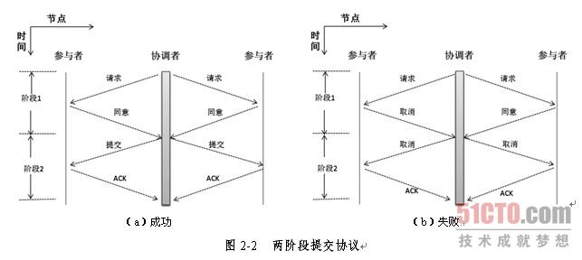

- 两阶段提交协议最大的缺点在于它是通过阻塞完成的协议，节点在等待消息的时候处于阻塞状态，节点中其他进程则需要等待阻塞进程释放资源。如果协调者发生了故障，那么参与者将无法完成事务而一直等待下去。以下情况可能会导致节点发生永久阻塞。
- 如果参与者发送同意提交消息给协调者，进程将阻塞直至收到协调者的提交或回滚的消息。如果协调者发生永久故障，参与者将一直等待，这里可以采用备份的协调者，所有参与者将回复发给备份协调者，由它承担原协调者的功能。
- 如果协调者发送"请求提交"消息给参与者，它将被阻塞直到所有参与者都回复完，如果某个参与者发生永久故障，那么协调者也不会一直阻塞，因为协调者在某一时间内还未收到某参与者的消息，那么它将通知其他参与者回滚事务。
- 同时两阶段提交协议没有容错机制，一个节点发生故障整个事务都要回滚，代价比较大。

## TMC

- TMC主要采用最终一致性方案来解决分布式事务问题，核心是将需要分布式处理的任务通过消息队列的方式来异步执行。如果事务失败可发起人工重试的纠正流程。

### 分布式事务主要步骤

- 要实现分布式事务，就是要考虑消息在各个环节中都不丢，任一系统在挂掉的情况下，都能保证能够把消息找回来，并且流程还能够继续下去。为了记录状态，引入了一个中间人，即TMC（Transaction Message Center）：


1. 系统A在事务执行之前 push 一条消息给TMC
2. TMC在DB中记录下这条消息
3. 系统A执行本地事务更新DB
4. 系统A如果本地事务执行成功，告诉TMC这条消息submit，如果本地事务执行失败，告诉TMC这条消息rollback。如果在超时时间后没有收到A的消息则TMC会主动发起check请求，询问A的状态。
5. TMC对于成功submit的消息，开始往MQ进行投递，等待ack，如果一段时间没有收到ack，会继续投递该消息(生产者产生的消息是一定要被消费掉的，消费端需要实现幂等性，因为有可能会收到重复消息)
6. MQ将消息push给消费者系统B
7. 系统B执行事务更新DB
8. 系统B给TMC做ack，告诉这条消息消费成功


### 系统设计

- TMC的设计使用了MySql、Base框架、Consul、RabbitMQ，系统结构图如下：

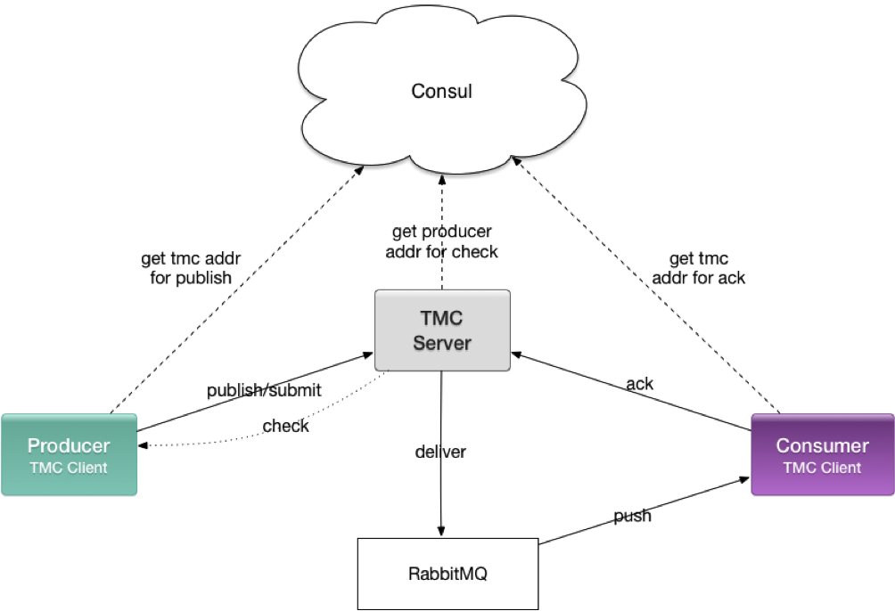

- TMC Server是一个标准的基于Base的微服务
- TMC Client是一个基于Base的Client，通过maven分发，包含Producer和Consumer功能
- 系统之间的交互可以描述为以下几点：
- Producer通过微服务名tmc以及client端配置的tmcTag，从Consul上获得到TMC Server的地址，然后通过Base RPC调用TMC Server发送或者submit消息，记住：Producer和RabbitMQ没有关系，只和TMC Server打交道，所有操作都是通过Base RPC进行
- 对于状态未知的消息，TMC Server会通过发送者的微服务名以及Topic里配置的Tag，从Consul上获得业务应用的地址，通过Base RPC去向业务应用check消息的状态
- TMC Server会将成功submit的消息投递进RabbitMQ
- 对于消费者，TMC Client会在启动的时候去监听配置要消费的RabbitMQ的队列，当然，消费者的配置只需要配置TMC里的topic，而TMC Client代码会自动转换成RabbitMQ的队列名，所以：消费者是直接从RabbitMQ获取数据的，需要配置TMC所使用的RabbitMQ集群地址
- Consumer通过微服务名tmc以及client端配置的tmcTag，从Consul上获得到TMC Server的地址，然后将消费成功的ack发送给TMC

### 单队列 or 多队列

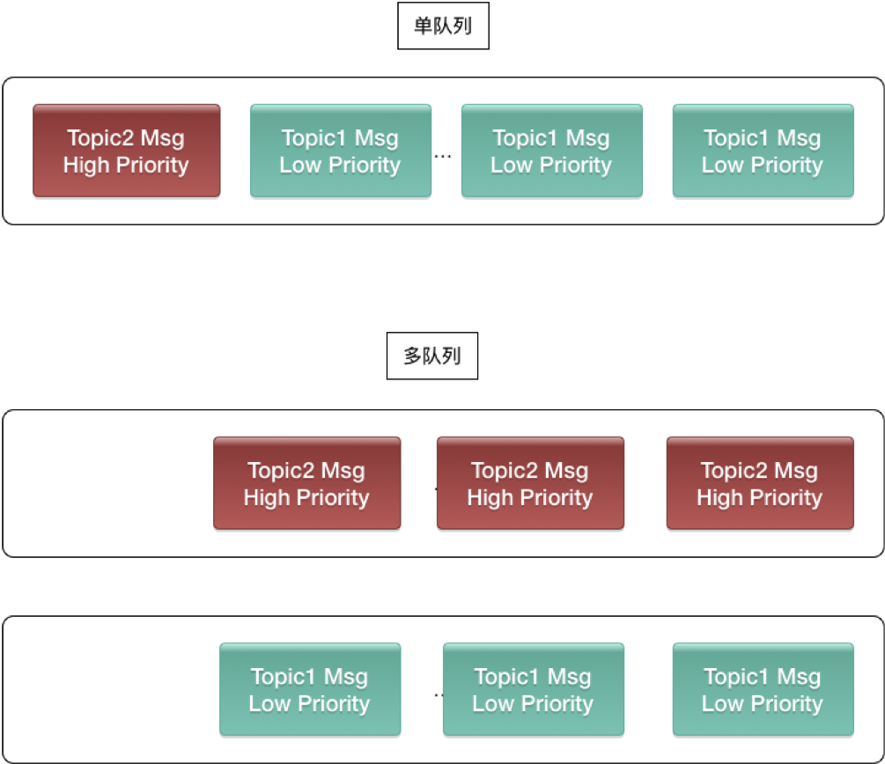

- 单队列是指每个消费者，会订阅不同的TMC topic，他所得到的所有TMC消息，会放在同一个RabbitMQ队列里，队列的命名规则是tmc.sub.{clientId}.{clientTag}。有些消息，可能时效性要求比较高，量比较小，而有些消息，时效性要求比较低，但量比较大，放在同一个队列里就会影响后面重要消息的消费时效性。
- 而多队列每一个消费者，每一个TMC topic都会放在一个单独的RabbitMQ队列里，命名规则是tmc.sub.{clientId}.{clientTag}.{topic}，这样就不会造成高优先级消息被低优先级消息阻塞的问题。
- 由于单/多队列的命名规则不同，因此在client端消息入口不同，单队列通过实现MessageConsumer接口，而多队列通过打@TmcListener标注。

### 失败和重试
- 事务消息的事务，主要体现在生产者和Server之间，因为只有生产者本地事务失败是可以回滚消息的，而**只要生产者事务成功提交，消费者是一定要消费掉的，超过一定时间没有消费掉，会给出报警，让人工介入处理**。
- 重试主要用在两个地方：
- 生产者没有主动submit/rollback，Server存在未知状态消息，需要不断去生产者那边check改消息的状态
- 消息已经成功被submit，Server已经投进MQ，但是消费者一直没有ack，需要继续投递，直到被ack
- 重试的程序实现是，每个分表都有一个扫表线程，这个扫表线程落在哪台机器上，通过Base里的分布式锁抢占，即抢到分表的分布式锁的机器负责扫该表。那每次扫出哪些消息取决于Status和NextRetryTime，只有Status等于正在进行的并且NextRetryTime小于当前时间的会被扫出来。而NextRetryTime的更新规则是now + Retry * RetryInterval，Retry是已经重试的次数，这样的重试时间是被逐渐拉长的，举个例子，如果起始时间是0，RetryInterval是10s，那一次重试是在10s，第二次重试是在30s，第三次重试是在60s，第四次重试是在100s。这样设计是考虑到，当前无法消费成功的消息，短期内立即重试大概率仍然不能消费成功，所以逐渐拉长重试的时间。
- 凡是投递超过MaxRetryTimes的消息，更新状态为失败，不在继续重试，并且发送报警给登记的业务负责人。

### 消息查询和重新激活
- 在控制后台支持通过MsgId、MsgKey以及状态和时间范围查询消息的状态，并且对于失败的消息，可以一键重新激活，重新开始check或者投递。控制后台拥有的功能消息查询，消费查询，消息重试，投递重试，很容易搞混，下面来说明一下。
- 消息查询，是查询消息表的数据，查询消息是否入库，是否被submit，以及消息的内容（原始base64和解码过的字符串格式都能看到），check的次数，下次check时间
- 消费查询，是查询消费表的数据，是否生成消费记录（如果没有说明生产者还没submit），是否被ack，投递的次数，下次投递的时间
- 消息重试，是生产者还没有提交，超过check重试的失败消息，进行重新激活，重新开始check生产者消息的状态
- 投递重试，是超过投递次数，消费者还没有ack的失败消息，进行重新激活，重新开始往MQ投递

### 额外的小功能
- 业务在使用过程中，提出了一些特殊的小需求，TMC也试着满足他们的需求，列举如下：
- 支持demo环境，由于demo环境consul和线上隔离，因此无法通过consul来获取地址，只能在client端配置上TMC Server地址，同时新消息Server也会记录下发送者的地址用于check
- 测试环境支持生产、消费不同tag，由于公司测试有好几个环境dev、stable、k8stest等等，为方便开发和测试同学，生产和消费都支持指定tag
- 延迟消息，生产者可以指定delay参数，Server在submit后到达delay的时间才会开始投递
- 顺序消息（未上线），之前有业务提过，想要支持顺序消息，就尝试把RabbitMQ换成支持顺序消息的MQ，如RocketMQ，但后来业务改了方案不需要了，这份代码就暂时没合入主分支，没有上线

## Seata

- 事务一词含义随着SOA架构逐渐扩大，根据上下文不同，可分为两类：
1. System transaction：多指数据库事务
2. Business transaction：对应一个业务交易
- 分布式事务的含义也在泛化，尤其SOA、微服务概念流行起来后，多指的是一个业务场景，需要编排很多独立部署的服务时，如何保证交易整体的原子性与一致性问题，这类分布式事务也称作长事务(long-lived transaction)，例如一个定行程的交易，它由购买航班、租车以及预订酒店构成，而航班预订可能需要一两天才能确认。

### XA模式

- XA是一个分布式事务协议，XA规范中分布式事务有AP，RM，TM组成：
- 应用程序(Application Program ，简称AP)：AP定义事务边界（定义事务开始和结束）并访问事务边界内的资源。
- 资源管理器(Resource Manager，简称RM)：Rm管理计算机共享的资源，许多软件都可以去访问这些资源，资源包含比如数据库、文件系统、打印机服务器等。
- 事务管理器(Transaction Manager ，简称TM)：负责管理全局事务，分配事务唯一标识，监控事务的执行进度，并负责事务的提交、回滚、失败恢复等。
- Xa主要规定了RM与TM之间的交互，XA协议是使用了二阶段协议的，其中：
- 第一阶段TM要求所有的RM准备提交对应的事务分支，询问RM是否有能力保证成功的提交事务分支，RM根据自己的情况，如果判断自己进行的工作可以被提交，那就就对工作内容进行持久化，并给TM回执OK；否者给TM的回执NO。RM在发送了否定答复并回滚了已经的工作后，就可以丢弃这个事务分支信息了。
- 第二阶段TM根据阶段1各个RM prepare的结果，决定是提交还是回滚事务。如果所有的RM都prepare成功，那么TM通知所有的RM进行提交；如果有RM prepare回执NO的话，则TM通知所有RM回滚自己的事务分支。

### 两阶段提交的“提升”

- 基于数据库的XA协议本质上就是两阶段提交，但由于性能原因在互联网高并发场景下并不适用。如果数据库只能保证本地ACID时，没办法保证出现异常时的原子性和一致性。
- 最直接就是按照逻辑依次调用服务，当出现异常后就对那些已经成功的进行补偿，补偿成功就一致了，这种朴素的模型就是Saga。但Saga这种方式并不能保证隔离性，于是出现了TCC，在实际交易逻辑前先做业务检查、对涉及到的业务资源进行“预留”，或者说是一种“中间状态”，如果都预留成功则完成这些预留资源的真正业务处理，典型的如票务座位等场景。
- 仔细对比这些方案与XA，会发现这些方案本质上都是将两阶段提交从资源层提升到了应用层。
- Saga的核心就是补偿，一阶段就是服务的正常顺序调用（数据库事务正常提交），如果都执行成功，则第二阶段则什么都不做；但如果其中有执行发生异常，则依次调用其补偿服务（一般多逆序调用未已执行服务的反交易）来保证整个交易的一致性。应用实施成本一般。
- TCC的特点在于业务资源检查与加锁，一阶段进行校验，资源锁定，如果第一阶段都成功，二阶段对锁定资源进行交易逻辑，否则，对锁定资源进行释放。应用实施成本较高。
- 基于可靠消息最终一致，一阶段服务正常调用，同时同事务记录消息表，二阶段则进行消息的投递，消费。应用实施成本较低(TMC原理)

### 主要功能描述

- [分布式事务 Seata 及其三种模式详解](https://www.jianshu.com/p/7f856b8cd5f9)
- Seata 中有三大模块，分别是 TM、RM 和 TC。
- TC - 事务协调者：维护全局和分支事务的状态，驱动全局事务提交或回滚。
- TM - 事务管理器：定义全局事务的范围：开始全局事务、提交或回滚全局事务。
- RM - 资源管理器：管理分支事务处理的资源，与TC交谈以注册分支事务和报告分支事务的状态，并驱动分支事务提交或回滚。


- 在 Seata 中，分布式事务的执行流程：
1. TM 开启分布式事务（TM 向 TC 注册全局事务记录）；
2. 按业务场景，编排数据库、服务等事务内资源（RM 向 TC 汇报资源准备状态 ）；
3. TM 结束分布式事务，事务一阶段结束（TM 通知 TC提交/回滚分布式事务）；
4. TC 汇总事务信息，决定分布式事务是提交还是回滚；
5. TC 通知所有 RM 提交/回滚 资源，事务二阶段结束；
- Seata 会有 4 种分布式事务解决方案，分别是 AT 模式、TCC 模式、Saga 模式和 XA 模式。
- AT 模式是一种无侵入的分布式事务解决方案。**在 AT 模式下，用户只需关注自己的“业务 SQL”，用户的 “业务 SQL”作为一阶段，Seata 框架会自动生成事务的二阶段提交和回滚操作**。AT 模式的一阶段、二阶段提交和回滚均由 Seata 框架自动生成，用户只需编写“业务 SQL”，便能轻松接入分布式事务，AT 模式是一种对业务无任何侵入的分布式事务解决方案。
- **TCC 模式需要用户根据自己的业务场景实现 Try、Confirm 和 Cancel 三个操作**；用户接入 TCC 模式，最重要的事情就是考虑如何将业务模型拆成 2 阶段，实现成 TCC 的 3 个方法，并且保证 Try 成功 Confirm 一定能成功。相对于 AT 模式，TCC 模式对业务代码有一定的侵入性，但是 TCC 模式无 AT 模式的全局行锁，TCC 性能会比 AT 模式高很多。
- Try：事务发起方在一阶段执行 Try 方式，资源的检测和预留；例如扣款操作之前先冻结余额。
- Confirm：在二阶段提交执行 Confirm 方法，执行的业务操作提交；要求 Try 成功 Confirm 一定要能成功；例如确认扣减余额。
- Cancel：二阶段回滚执行 Cancel 方法。预留资源释放；例如释放冻结的余额。
- **在 Saga 模式下，分布式事务内有多个参与者，每一个参与者都是一个冲正补偿服务，需要用户根据业务场景实现其正向操作和逆向回滚操作**。分布式事务执行过程中，依次执行各参与者的正向操作，如果所有正向操作均执行成功，那么分布式事务提交。如果任何一个正向操作执行失败，那么分布式事务会去退回去执行前面各参与者的逆向回滚操作，回滚已提交的参与者，使分布式事务回到初始状态。Saga 模式适用于业务流程长且需要保证事务**最终一致性**的业务系统，主要特点：
- 一阶段提交本地数据库事务，无锁，高性能；
- 参与者可以采用事务驱动异步执行，高吞吐；
- 补偿服务即正向服务的“反向”，易于理解，易于实现；
