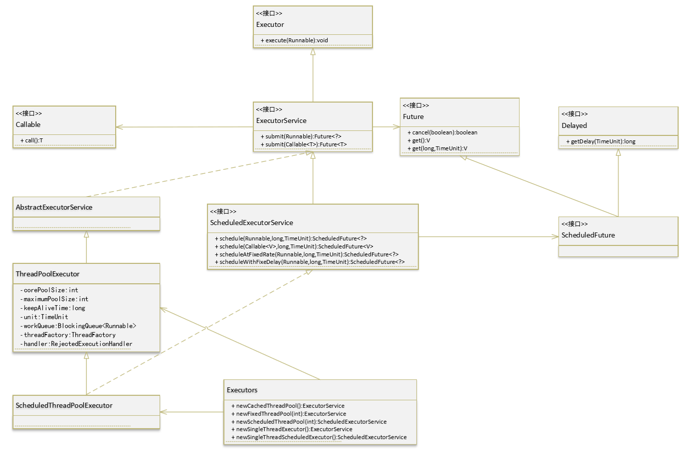

---

title: Java 线程池浅析
tags: Java
toc: true

date: 2018-09-15 13:58:26

---
<!--more-->
Java 中的线程池是运用场景最多的并发框架，几乎所有需要异步或并发执行任务的程序都可以使用线程池。在开发过程中，合理地使用线程池能够带来 3 个好处。
- **降低资源消耗**。通过重复利用已创建的线程降低线程创建和销毁造成的消耗。
- **提高响应速度**。当任务到达时，任务可以不需要等到线程创建就能立即执行。
- **提高线程的可管理性**。线程是稀缺资源，如果无限制地创建，不仅会消耗系统资源，还会降低系统的稳定性，使用线程池可以进行统一分配、调优和监控。

线程池的继承关系如下图：



线程池最顶层是*Executor*，这是只有一个 execute 方法的接口，也是整个 Executor 框架的顶层接口，所有 Executor 框架的组件都要实现这个接口。

*ExecutorService*继承了 Executor，在此基础上增加了 submit(Runnable) 和 submit(Callable<T>)，表示任务的提交，Runnable 和 Callable<T> 的区别在于 Callable 的 call() 方法有返回值，而 Runnable 的 run 没有。

*ThreadPoolExecutor*是线程池的核心实现类，大部分线程池的功能都在这个类中被定义，它有多个参数和构造函数，根据不同的构造参数可以实现不同功能的线程池。线程池的参数会在下文详细介绍。

*Executors*是 ThreadPoolExecutor 的工厂类，封装了一些常用的线程池，具体类型也会在下文详细介绍。

## 线程池基本概念 

### 创建一个线程池 

我们可以通过 ThreadPoolExecutor 来创建一个线程池：

```java
new ThreadPoolExecutor(corePoolSize,maximumPoolSize,keepAliveTime,unit,workQueue,ThreadFactory,RejectedExecutionHandler)
```

线程池的构造函数中需要接收 7 个参数，它们分别是：
- corePoolSize 核心线程数，指保留的线程池大小（不超过 maximumPoolSize 值时，线程池中最多有 corePoolSize 个线程工作） 
- maximumPoolSize 指的是线程池的最大大小（线程池中最大有 maximumPoolSize 个线程可运行）
- keepAliveTime 指的是空闲线程结束的超时时间（当一个线程不工作时，过 keepAliveTime 长时间将停止该线程）
- unit 是一个枚举，表示 keepAliveTime 的单位（有 NANOSECONDS, MICROSECONDS, MILLISECONDS, SECONDS, MINUTES, HOURS, DAYS，7 个可选值）
- workQueue 表示存放任务的队列（存放需要被线程池执行的线程队列）。它的类型是 BlockingQueue<Runnable> 就是阻塞队列，有关阻塞队列的内容可以参考这篇[《阻塞队列源码阅读》](www.huzb.me)
- threadFactory 是一个线程工厂，负责线程的创建，一般会使用默认的 Executors.defaultThreadFactory()。
- handler 拒绝策略（添加任务失败后如何处理该任务）

### 线程池的运行策略

线程池刚创建时，里面没有一个线程。任务队列是作为参数传进来的。我们可以使用*execute()*方法提交任务到线程池：

```java
executorService.execute(new Runnable() {
    @Override
    public void run() {
        //TODO
    }
});
```

也可以使用*submit()*方法提交任务到线程池：

```java
Future future = executorService.submit(new Runnable() {
    @Override
    public void run() {
        //TODO
    }
});
```
区别在于 submit() 会返回一个 Future 对象，通过这个 Future 对象可以判断任务是否执行成功，并且可以通过 Future 的 get() 方法来获取返回值。另外继承了 ExecutorService 接口的 ScheduledExecutorService 还可以使用*schedule()*方法来提交一个定时任务：

```java
scheduledExecutorService.schedule(new Runnable() {
    @Override
    public void run() {
       //TODO
    }
}, 1, TimeUnit.SECONDS);
```
上面代码就会在 1 秒后执行我们的定时任务。无论是 submit() 还是 schedule()，其底层最后都会调用 execute() 来提交执行任务。不过，就算队列里面有任务，线程池也不会马上执行它们。

当添加一个任务时，线程池会做如下判断：
- 如果正在运行的线程数量小于 corePoolSize，那么马上创建线程运行这个任务；
- 如果正在运行的线程数量大于或等于 corePoolSize，那么将这个任务放入队列；
- 如果这时候队列满了，而且正在运行的线程数量小于 maximumPoolSize，那么还是要创建线程运行这个任务；
- 如果队列满了，而且正在运行的线程数量大于或等于 maximumPoolSize，那么线程池会调用 reject()，这个方法会调用 handler.rejectedExecution() 方法，根据不同的 handler 策略会有不同的处理方式。

当一个线程完成任务时，它会从队列中取下一个任务来执行。

当一个线程无事可做，超过一定的时间（keepAliveTime）时，线程池会判断，如果当前运行的线程数大于 corePoolSize，那么这个线程就被停掉。所以线程池的所有任务完成后，它最终会收缩到 corePoolSize 的大小。

### 线程池的拒绝策略

上面提到任务添加失败后，线程池会调用 reject() 方法，这个方法会调用 handler.rejectedExecution() 方法，根据不同的 handler 策略会有不同的处理方式。线程池中预设有以下几种处理方式：

- AbortPolicy：为 Java 线程池默认的阻塞策略，不执行此任务，而且直接抛出一个运行时异常，切记 ThreadPoolExecutor.execute 需要 try catch，否则程序会直接退出。
- DiscardPolicy：直接抛弃，任务不执行，空方法。
- DiscardOldestPolicy：从队列里面抛弃 head 的一个任务，并再次 execute 此 task。
- CallerRunsPolicy：还给原线程自己执行，会阻塞入口。
- 用户自定义拒绝策略：实现 RejectedExecutionHandler，并自己定义策略模式。

### 关闭线程池

Java 线程池提供了两个方法用于关闭一个线程池，一个是 shutdownNow()，另一个是 shutdown()。我们可以看一下这两个方法的声明：

```java
void shutdown();
List<Runnable> shutdownNow();
```

这两个方法的区别在于：
- shutdown()：当线程池调用该方法时，线程池的状态则立刻变成 SHUTDOWN 状态。我们不能再往线程池中添加任何任务，否则将会抛出 RejectedExecutionException 异常；但是，此时线程池不会立刻退出，直到添加到线程池中的任务都已经处理完成后才会退出。
- shutdownNow()：当执行该方法，线程池的状态立刻变成 STOP 状态，并试图停止所有正在执行的线程，不再处理还在池队列中等待的任务，并以返回值的形式返回那些未执行的任务。此方法会通过调用 Thread.interrupt() 方法来试图停止正在运行的 Worker 线程，但是这种方法的作用有限，如果线程中没有 sleep 、wait、Condition、定时锁等操作时，interrupt() 方法是无法中断当前的线程的。所以，shutdownNow() 并不代表线程池就一定立即就能退出，可能必须要等待所有正在执行的任务都执行完成了才能退出。

### Executors 提供的线程池

ThreadPoolExecutor 提供的线程创建方式参数太多，对开发人员并不友好。因此 Java 在 Executors 类中封装了几种常用的线程池，它们分别是：

- **Executors.newCachedThreadPool** 这是一个会根据需要创建线程的线程池，它的 corePoolSize 被设置为 0，maximumPoolSize 被设置为 Integer.MAX_VALUE，KeepAliveTime 被设置为 60s，使用没有容量的 SynchronousQueue 作为线程池的工作队列。这就意味着，线程池中没有固定的线程数量，任何一个任务被提交时，线程池都会为它创建或者分配一个线程；而任何一个线程空闲时间超过 60s，都会关闭它。使用该线程池时要注意主线程提交任务的速度和线程池处理任务的速度，若提交速度大于处理速度，CachedThreadPool 会因为创建过多线程而耗尽 CPU 和内存资源。该线程池的吞吐量在几种预设线程池中是最大的。
- **Executors.newFixedThreadPool** 这是被称为可重用固定线程数的线程池，它的 corePoolSize 等于 maximumPoolSize，KeepAliveTime 被设置为 0，使用最大长度的有界队列 LinkedBlockingQueue（队列容量为 Integer.MAX_VALUE）作为工作队列，这也意味着 FixedThreadPool 运行稳定后线程数量是不变的，且所有任务都会进入工作队列，不会拒绝任务。
- **Executors.newSingleThreadExecutor** 这是一个只有一个工作线程的线程池，它的 corePoolSize 和 maximumPoolSize 都被设置为 1，其它参数与 FixedThreadPool 相同，可以把它理解为 newFixedThreadPool(1)，线程执行完任务后会无限反复从 LinkedBlockingQueue 获取任务来执行。
- **Executors.newScheduledThreadPool** 这是一个可以定时执行的线程池，它的 maximumPoolSize 被设置为 Integer.MAX_VALUE，KeepAliveTime 被设置为 10ms，使用 DelayedWorkQueue 作为阻塞队列，这是一个类似于 DelayedQueue 和 PriorityBlockingQueue 的阻塞队列，每次会取出队列中执行时间最早的任务，如果没有到执行之间，则 await 两者的差值，以此来达到定时执行的目的。同时 newScheduledThreadPool 的 scheduleAtFixedRate 和 scheduleWithFixedRate 方法还可以实现周期执行的功能。两者都是依靠给 ScheduledFutureTask（newScheduledThreadPool 中被执行的任务）设置下一次执行时间来实现的。区别在于 scheduleAtFixedRate 中下次执行时间=本次开始时间+间隔时间，而 scheduleWithFixedRate 中下次执行时间=本次结束时间+间隔时间。

## 线程池代码分析
### 线程池的属性字段
在开始深入了解 ThreadPoolExecutor 代码之前, 我们先来简单地看一下 ThreadPoolExecutor 类中到底有哪些重要的字段。
```java
public class ThreadPoolExecutor extends AbstractExecutorService {
    // 这个是一个复用字段, 它复用地表示了当前线程池的状态, 当前线程数信息.
    private final AtomicInteger ctl = new AtomicInteger(ctlOf(RUNNING, 0));
    
    // 用于存放提交到线程池中, 但是还未执行的那些任务.
    private final BlockingQueue<Runnable> workQueue;

    // 线程池内部锁, 对线程池内部操作加锁, 防止竞态条件
    private final ReentrantLock mainLock = new ReentrantLock();

    // 一个 Set 结构, 包含了当前线程池中的所有工作线程.
    // 对 workers 字段的操作前, 需要获取到这个锁.
    private final HashSet<Worker> workers = new HashSet<Worker>();

    // 条件变量, 用于支持 awaitTermination 操作
    private final Condition termination = mainLock.newCondition();

    // 记录线程池中曾经到达过的最大的线程数.
    // 这个字段在获取 mainLock 锁的前提下才能操作.
    private int largestPoolSize;

    // 记录已经完成的任务数. 仅仅当工作线程结束时才更新此字段.
    // 这个字段在获取 mainLock 锁的前提下才能操作.
    private long completedTaskCount;

    // 线程工厂. 当需要一个新的线程时, 这里生成.
    private volatile ThreadFactory threadFactory;

    // 任务提交失败后的处理 handler
    private volatile RejectedExecutionHandler handler;

    // 空闲线程的等待任务时间, 以纳秒为单位.
    // 当当前线程池中的线程数大于 corePoolSize 时, 
    // 或者 allowCoreThreadTimeOut 为真时, 线程才有 idle 等待超时时间, 
    // 如果超时则此线程会停止.; 
    // 反之线程会一直等待新任务到来.
    private volatile long keepAliveTime;

    // 默认为 false.
    // 当为 false 时, keepAliveTime 不起作用, 线程池中的 core 线程会一直存活, 
    // 即使这些线程是 idle 状态.
    // 当为 true 时, core 线程使用 keepAliveTime 作为 idle 超时
    // 时间来等待新的任务.
    private volatile boolean allowCoreThreadTimeOut;

    // 核心线程数.
    private volatile int corePoolSize;

    // 最大线程数.
    private volatile int maximumPoolSize;
}


```
ThreadPoolExecutor 中, 使用到 ctl 这个字段来维护线程池中当前线程数和线程池的状态。ctl 是一个 AtomicInteger 类型, 它的低 29 位用于存放当前的线程数，因此一个线程池在理论上最大的线程数是 536870911；高 3 位是用于表示当前线程池的状态，其中高三位的值和状态对应如下：

- 111: **RUNNING** 此时能够接收新任务，以及对已添加的任务进行处理。
状态切换：线程池初始化时就是 RUNNING 状态。
- 000: **SHUTDOWN** 此时不接收新任务，但能处理已添加的任务。
状态切换：调用线程池的 shutdown() 接口时，线程池由 RUNNING -> SHUTDOWN。
- 001: **STOP** 此时不接收新任务，不处理已添加的任务，并且会中断正在处理的任务。
状态切换：调用线程池的 shutdownNow() 接口时，线程池由 (RUNNING or SHUTDOWN ) -> STOP。
- 010: **TIDYING** 当所有的任务已终止，ctl 记录的”任务数量”为 0，线程池会变为 TIDYING 状态。当线程池变为 TIDYING 状态时，会执行钩子函数 terminated()。terminated() 在 ThreadPoolExecutor 类中是空的，若用户想在线程池变为 TIDYING 时，进行相应的处理；可以通过重载 terminated() 函数来实现。
状态切换：当线程池在 SHUTDOWN 状态下，阻塞队列为空并且线程池中执行的任务也为空时，就会由 SHUTDOWN -> TIDYING。当线程池在 STOP 状态下，线程池中执行的任务为空时，就会由 STOP -> TIDYING。
- 011: **TERMINATED** 线程池彻底终止，就变成 TERMINATED 状态。
状态切换：线程池处在 TIDYING 状态时，执行完 terminated() 之后，就会由 TIDYING -> TERMINATED。 

### 提交任务到线程池
```java
public void execute(Runnable command) {
    if (command == null)
        throw new NullPointerException();
   
    int c = ctl.get();
    if (workerCountOf(c) < corePoolSize) {
        if (addWorker(command, true))
            return;
        c = ctl.get();
    }
    if (isRunning(c) && workQueue.offer(command)) {
        int recheck = ctl.get();
        if (! isRunning(recheck) && remove(command))
            // 策略模式，调用传入的 RejectedExecutionHandler 的 rejectedExecution 方法
            reject(command);
        else if (workerCountOf(recheck) == 0)
            addWorker(null, false);
    }
    else if (!addWorker(command, false))
        reject(command);
}
```
上面的代码有三个步骤，首先第一步是检查当前线程池的线程数是否小于 corePoolSize，如果小于，那么由我们前面提到的规则，线程池会创建一个新的线程来执行此任务，因此在第一个 if 语句中，会调用 addWorker(command, true) 来创建一个新 Worker 线程，并执行此任务。


如果当前线程池的线程数不小于 corePoolSize，那么会尝试将此任务插入到工作队列中，即 workQueue.offer(command)。当插入到 workQueue 成功后，我们还需要再次检查一下此时线程池是否还是 RUNNING 状态，如果不是的话就会将原来插入队列中的那个任务删除，然后调用 reject 方法拒绝此任务的提交；接着考虑到在我们插入任务到 workQueue 中的同时，如果此时线程池中的线程都执行完毕并终止了，在这样的情况下刚刚插入到 workQueue 中的任务就永远不会得到执行了。为了避免这样的情况，因此我们要再次检查一下线程池中的线程数，如果为零，则调用 addWorker(null, false) 来添加一个线程。

最后如果任务插入到工作队列失败了，就会直接调用 addWorker(command, false) 来新开一个线程。如果失败了，那么我们就知道线程池已经关闭或者饱和了，就拒绝这次添加。

### 关于 addWorker 方法

前面我们大体分析了一下 execute 提交任务的流程，不过省略了一个关键步骤，即 addWorker 方法。现在我们来看看这个方法里究竟发生了什么。

首先看一下 addWorker 方法的签名：
```java
private boolean addWorker(Runnable firstTask, boolean core)
```
这个方法接收两个参数，第一个是一个 Runnable 类型的参数，一般来说是我们调用 execute 方法所传输的参数，不过也有可能是 null 值，这样的情况我们在前面一小节中也见到过。
那么第二个参数是做什么的呢？第二个参数是一个 boolean 类型的变量，它的作用是标识是否使用 corePoolSize 属性。我们知道，ThreadPoolExecutor 中，有一个 corePoolSize 属性，用于规定线程池中的核心线程数。那么当 core 这个参数是 true 时，则表示在添加新任务时，需要考虑到 corePoolSzie 的影响（例如如果此时线程数已经大于 corePoolSize 了，那么就不能再添加新线程了）；当 core 为 false 时，就不考虑 corePoolSize 的影响，而是以 maximumPoolSize 代替 corePoolSize 来做判断条件。

然后是 addWorker 的源码：
```java
private boolean addWorker(Runnable firstTask, boolean core) {
    retry:
    for (int c = ctl.get();;) {
        // Check if queue empty only if necessary.
        if (runStateAtLeast(c, SHUTDOWN)
            && (runStateAtLeast(c, STOP)
                || firstTask != null
                || workQueue.isEmpty()))
            return false;
         for (;;) {
            // 当 core 为真, 那么就判断当前线程是否大于 corePoolSize
            // 当 core 为假, 那么就判断当前线程数是否大于 maximumPoolSize
            // 这里的 for 循环是一个自旋 CAS(CompareAndSwap) 操作, 用于确保多线程环境下的正确性
            if (workerCountOf(c)
                >= ((core ? corePoolSize : maximumPoolSize) & COUNT_MASK))
                return false;
            if (compareAndIncrementWorkerCount(c))
                break retry;
            c = ctl.get();  // Re-read ctl
            if (runStateAtLeast(c, SHUTDOWN))
                continue retry;
            // else CAS failed due to workerCount change; retry inner loop
        }
    }
    boolean workerStarted = false;
    boolean workerAdded = false;
    Worker w = null;
    try {
        w = new Worker(firstTask);
        final Thread t = w.thread;
        if (t != null) {
            final ReentrantLock mainLock = this.mainLock;
            mainLock.lock();
            try {
                // Recheck while holding lock.
                // Back out on ThreadFactory failure or if
                // shut down before lock acquired.
                int c = ctl.get();
                if (isRunning(c) ||
                    (runStateLessThan(c, STOP) && firstTask == null)) {
                    if (t.isAlive()) // precheck that t is startable
                        throw new IllegalThreadStateException();
                    workers.add(w);
                    int s = workers.size();
                    if (s > largestPoolSize)
                        largestPoolSize = s;
                    workerAdded = true;
                }
            } finally {
                mainLock.unlock();
            }
            if (workerAdded) {
                t.start();
                workerStarted = true;
            }
        }
    } finally {
       if (! workerStarted)
            addWorkerFailed(w);
    }
    return workerStarted;
}
```
首先在 addWorker 的一开始，有一个 for 循环，用于判断当前是否可以添加新的 Worker 线程。它的逻辑如下：

- 如果传入的 core 为真，那么判断当前的线程数是否大于 corePoolSize，如果大于，则不能新建 Worker 线程，返回 false。
- 
如果传入的 core 为假，那么判断当前的线程数是否大于 maximumPoolSize，如果大于，则不能新建 Worker 线程，返回 false。


如果条件符合，那么在 for 循环内，又有一个自旋 CAS 更新逻辑，用于递增当前的线程数，即 compareAndIncrementWorkerCount(c)，这个方法会原子地更新 ctl 的值，将当前线程数的值+1。addWorker 接下来有一个 try...finally 语句块，这里就是实际上的创建线程、启动线程、添加线程到线程池中的工作了。首先可以看到 w = new Worker(firstTask)；这里是实例化一个 Worker 对象，这个类其实就是 ThreadPoolExecutor 中对工作线程的封装。Worker 类继承于 AbstractQueuedSynchronizer 并实现了 Runnable 接口，我们来看一下它的构造器：


```java
Worker(Runnable firstTask) {
    setState(-1); // inhibit interrupts until runWorker
    this.firstTask = firstTask;
    this.thread = getThreadFactory().newThread(this);
}


```
它会把我们提交的任务（firstTask）设置为自己的内部属性 firstTask，然后使用 ThreadPoolExecutor 中的 threadFactory 来创建一个新的线程，并保存在 thread 字段中，而且注意到，创建线程时，我们传递给新线程的 Runnable 其实是 Worker 对象本身（this），因此当这个线程启动时，实际上运行的是 Worker.run() 中的代码。

回过头来再看一下 addWorker 方法。当创建好 Worker 线程后，就会将这个 worker 线程存放在 workers 这个 HashSet<Worker> 类型的字段中。而且注意到，正如我们在前面所提到的，mainLock 是 ThreadPoolExecutor 的内部锁，我们对 ThreadPoolExecutor 中的字段进行操作时，为了保证线程安全，需要在获取到 mainLock 的前提下才能操作。


最后，我们可以看到，在 addWorker 方法的最后，调用了 t.start()；来真正启动这个新建的线程。

### 任务的分配与调度

线程池在执行完 firstTask 后并不会立即销毁，而是可以根据情况复用。线程的复用就涉及到任务的分配与调度。Java 线程池的调度方式很简单，就是执行完之后从 workQueue 中拿出下一个任务，如果获取到了任务，那就再次执行。

前一小节中，我们看到 addWorker 中会新建一个 Worker 对象来代表一个 worker 线程，接着会调用线程的 start() 来启动这个线程，我们也提到了当启动这个线程后，会运行到 Worker 中的 run 方法，我们来看一下 Worker.run 具体的实现：
```java
public void run() {
    runWorker(this);
}
```
Worker.run 方法很简单，只是调用了 ThreadPoolExecutor.runWorker 方法而已。runWorker 方法比较关键，它是整个线程池任务分配的核心：
```java
final void runWorker(Worker w) {
    Thread wt = Thread.currentThread();
    Runnable task = w.firstTask;
    w.firstTask = null;
    w.unlock(); // allow interrupts
    boolean completedAbruptly = true;
    try {
        while (task != null || (task = getTask()) != null) {
            w.lock();
            // If pool is stopping, ensure thread is interrupted;
            // if not, ensure thread is not interrupted.  This
            // requires a recheck in second case to deal with
            // shutdownNow race while clearing interrupt
            if ((runStateAtLeast(ctl.get(), STOP) ||
                 (Thread.interrupted() &&
                  runStateAtLeast(ctl.get(), STOP))) &&
                !wt.isInterrupted())
                wt.interrupt();
            try {
                beforeExecute(wt, task);
                Throwable thrown = null;
                try {
                    task.run();
                } catch (RuntimeException x) {
                    thrown = x; throw x;
                } catch (Error x) {
                    thrown = x; throw x;
                } catch (Throwable x) {
                    thrown = x; throw new Error(x);
                } finally {
                    afterExecute(task, thrown);
                }
            } finally {
                task = null;
                w.completedTasks++;
                w.unlock();
            }
        }
        completedAbruptly = false;
    } finally {
        processWorkerExit(w, completedAbruptly);
    }
}


```
runWorker 方法是整个工作线程的核心循环，在这个循环中，工作线程会不断的从 workerQuque 中获取新的 task，然后执行它。我们注意到在 runWorker 一开始，有一个 w.unlock()，咦, 这是为什么呢? 其实这是 Worker 类玩的一个小把戏。回想一下，Worker 类继承于 AQS 并实现了 Runnable 接口，它的构造器如下：
```java
Worker(Runnable firstTask) {
    setState(-1); // inhibit interrupts until runWorker
    this.firstTask = firstTask;
    this.thread = getThreadFactory().newThread(this);
}


```
setState(-1) 方法是 AQS 提供的，初始化 Worker 时，会先设置 state 为 -1，根据注释，这样做的原因是为了抑制工作线程的 interrupt 信号，直到此工作线程开始执行 task。那么在 addWorker 中的 w.unlock() 就是允许 Worker 的 interrupt 信号。

接着在 addWorker 中会进入一个 while 循环，在这里此工作线程会不断地从 workQueue 中取出一个任务，然后调用 task.run() 来执行这个任务，因此就执行到了用户所提交的 Runnable 中的 run() 方法了。

### 工作线程的 idle 超时处理

工作线程的 idle 超出处理在底层依赖于 BlockingQueue 带超时的 poll 方法，即工作线程会不断地从 workQueue 这个 BlockingQueue 中获取任务，如果 allowCoreThreadTimeOut 字段为 true，或者当前的工作线程数大于 corePoolSize，那么线程的 idle 超时机制就生效了，此时工作线程会以带超时的 poll 方式从 workQueue 中获取任务。当超时了还没有获取到任务，那么我们就知道此线程已经到达 idle 超时时间了，就终止此工作线程。具体源码如下：
```java
private Runnable getTask() {
    boolean timedOut = false; // Did the last poll() time out?

    for (;;) {
        int c = ctl.get();
        int rs = runStateOf(c);

        // Check if queue empty only if necessary.
        if (rs >= SHUTDOWN && (rs >= STOP || workQueue.isEmpty())) {
            decrementWorkerCount();
            return null;
        }

        int wc = workerCountOf(c);

        // Are workers subject to culling?
        boolean timed = allowCoreThreadTimeOut || wc > corePoolSize;

        if ((wc > maximumPoolSize || (timed && timedOut))
            && (wc > 1 || workQueue.isEmpty())) {
            if (compareAndDecrementWorkerCount(c))
                return null;
            continue;
        }

        try {
            Runnable r = timed ?
                workQueue.poll(keepAliveTime, TimeUnit.NANOSECONDS) :
                workQueue.take();
            if (r != null)
                return r;
            timedOut = true;
        } catch (InterruptedException retry) {
            timedOut = false;
        }
    }
}
```
从源码中就可以看到，一开始会判断当前的线程池状态，如果不是 SHUTDOWN 或 STOP 之类的状态，那么接着获取当前的工作线程数，然后判断工作线程数量是否已经大于了 corePoolSize。当 allowCoreThreadTimeOut 字段为 true，或者当前的工作线程数大于 corePoolSize，那么线程的 idle 超时机制就生效，此时工作线程会以带超时的 workQueue.poll(keepAliveTime, TimeUnit.NANOSECONDS) 方式从 workQueue 中获取任务；反之会以 workQueue.take() 方式阻塞等待任务，直到获取一个新的任务。当从 workQueue 获取新任务超时时，会调用 compareAndDecrementWorkerCount 将当前的工作线程数-1，并返回 null。getTask 方法返回 null 后， runWorker 中的 while 循环自然也就结束了，因此也导致了 runWorker 方法的返回，最后自然整个工作线程的 run() 方法执行完毕，工作线程自然就终止了。