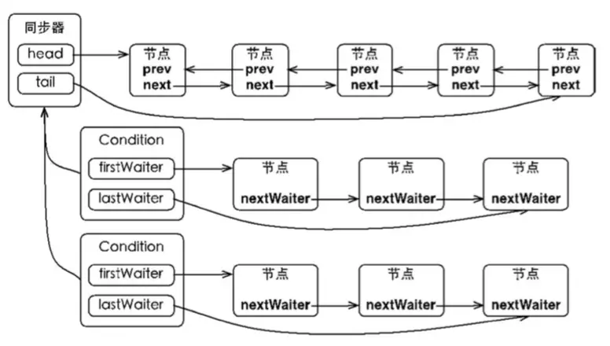

---

title: Java 阻塞队列浅析
tags: Java
toc: true
date: 2018-09-03 21:58:36

---
## 一、BlockingQueue 接口

Java 中的阻塞队列都是实现 BlockingQueue 接口的实现类。BlockingQueue 继承自 Queue，所以其实现类也可以作为 Queue 的实现来使用，而 Queue 又继承自 Collection 接口。所以 BlockingQueue 可以使用 Queue 和 Collection 的方法。 但一般我们使用 BlockingQueue 是因为它提供了`获取队列元素但是队列为空时，会阻塞等待队列中有元素再返回`和`添加元素时，如果队列已满，那么等到队列可以放入新元素时再放入`这两种功能。

BlockingQueue 对插入操作、移除操作、获取元素操作提供了四种不同的处理方式：1、抛出异常；2、返回特殊值（null 或 true/false，取决于具体的操作）；3、一直阻塞；4、超时退出。总结如下：

|  | 抛出异常 | 返回特殊值 | 一直阻塞 | 超时退出 |
| :------ | :------ | :------ | :------ | :------ |
| **插入** | add(e) | offer(e) | **put(e)** | offer(e, time, unit) |
| **移除** | remove() | poll() | **take()** | poll(time, unit) |
| **获取元素** | element() | peek() | / | / |

我们需要关注的应该是 put(e) 和 take() 这两个方法，因为这两个方法是带阻塞的，是 BlockingQueue 的核心功能。

## 二、BlockingQueue 的实现

JDK7 中提供了 7 个阻塞队列，分别是：
- ArrayBlockingQueue ：底层是数组，有界队列，元素按照先进先出排列。
- LinkedBlockingQueue ：底层是单向链表，可以当做无界和有界队列来使用，元素按照先进先出排列。
- PriorityBlockingQueue ：底层是数组，无界队列，元素按优先级排列，基于最小堆实现。
- DelayQueue：底层是数组，无界队列，元素按可取出时间排列（元素在入队时需要指定一个延迟期，表示延迟多久才能从队列中取出），基于最小堆实现。
- SynchronousQueue：一个不存储元素的阻塞队列。
- LinkedTransferQueue：底层是单向链表，无界队列，和 LinkedBlockingQueue 的不同之处在于多了 `transfer` 和 `tryTransfer`，允许元素在入队之前直接传输给消费者。
- LinkedBlockingDeque：底层是双向链表，无界队列，可以在两端插入和移出元素。

### 1、ArrayBlockingQueue
ArrayBlockingQueue 是一个用数组实现的有界阻塞队列。此队列按照先进先出的原则对元素进行排序。可以支持公平和非公平两种模式，公平性是由 ReentrantLock 实现的。在非公平模式下，当一个线程请求锁时，如果在发出请求的同时锁变成可用状态，那么这个线程会跳过队列中所有的等待线程而获得锁。ArrayBlockingQueue 的属性如下：

```java
// 用于存放元素的数组
final Object[] items;
// 下一次读取操作的位置
int takeIndex;
// 下一次写入操作的位置
int putIndex;
// 队列中的元素数量
int count;

// 以下几个就是控制并发用的同步器，公平性是由 ReentrantLock 实现的
final ReentrantLock lock;
private final Condition notEmpty;
private final Condition notFull;
```

ArrayBlockingQueue 实现并发同步的原理是：读操作和写操作都需要获取到 AQS 独占锁才能进行操作，如果队列为空，这个时候读操作的线程进入到读线程队列排队，等待写线程写入新的元素，然后唤醒读线程队列的第一个等待线程；如果队列已满，这个时候写操作的线程进入到写线程队列排队，等待读线程将队列元素移除腾出空间，然后唤醒写线程队列的第一个等待线程。

### 2、LinkedBlockingQueue
底层基于单向链表实现的阻塞队列，可以当做无界队列也可以当做有界队列来使用。看构造方法：
```java
// 无界队列
public LinkedBlockingQueue() {
    this(Integer.MAX_VALUE);
}

// 有界队列
public LinkedBlockingQueue(int capacity) {
    if (capacity <= 0) throw new IllegalArgumentException();
    this.capacity = capacity;
    last = head = new Node<E>(null);
}
```
LinkedBlockingQueue 的属性：
```java
// 队列容量
private final int capacity;
// 队列中的元素数量
private final AtomicInteger count = new AtomicInteger(0);
// 队头
private transient Node<E> head;
// 队尾
private transient Node<E> last;

// take, poll, peek 等读操作的方法需要获取到这个锁
private final ReentrantLock takeLock = new ReentrantLock();

// 如果读操作的时候队列是空的，那么等待 notEmpty 条件
private final Condition notEmpty = takeLock.newCondition();

// put, offer 等写操作的方法需要获取到这个锁
private final ReentrantLock putLock = new ReentrantLock();

// 如果写操作的时候队列是满的，那么等待 notFull 条件
private final Condition notFull = putLock.newCondition();
```
可以看到 LinkedBlockingQueue 使用了双锁队列来提高队列吞吐量。双锁的使用如下：
- takeLock 和 notEmpty：如果要获取（take）一个元素，需要获取 takeLock 锁，但是获取了锁还不够，如果队列此时为空，还需要队列不为空（notEmpty）这个条件（Condition）。
- putLock 和 notFull：如果要插入（put）一个元素，需要获取 putLock 锁，但是获取了锁还不够，如果队列此时已满，还需要队列不是满的（notFull）这个条件（Condition）。

> **为什么 ArrayBlockingQueue 不使用双锁呢?**
这是因为ArrayBlockingQueue 本身的入队和出队操作已经足够轻快了。LinkedBlockingQueue 使用双锁是因为 LinkedBlockingQueue 添加需要构造节点，导致较长的等待，所以同时存取有较大优化。 而 ArrayBlockingQueue 本身的入队和出队操作就足够轻快，转成双锁之后，对比原来的存取操作，需要多竞争两次。一次是 count 变量的 cas 操作，另一次是获得另一把锁的通知操作，这部分的损耗要比并发存取带来的收益更大。

### 3、PriorityBlockingQueue
带排序的 BlockingQueue 实现，其并发控制采用的是 ReentrantLock，队列为无界队列，开始的时候可以指定初始的队列大小，后面插入元素的时候，如果空间不够的话会自动扩容。

简单地说，它就是 PriorityQueue 的线程安全版本。不可以插入 null 值，同时，插入队列的对象必须是可比较大小的（comparable），否则报 ClassCastException 异常。它的插入操作 put 方法不会 block，因为它是无界队列（take 方法在队列为空的时候会阻塞）。

它的属性如下：
```java
// 构造方法中，如果不指定大小的话，默认大小为 11
private static final int DEFAULT_INITIAL_CAPACITY = 11;
// 数组的最大容量
private static final int MAX_ARRAY_SIZE = Integer.MAX_VALUE - 8;

// 这个就是存放数据的数组
private transient Object[] queue;

// 队列当前大小
private transient int size;

// 大小比较器，如果按照自然序排序，那么此属性可设置为 null
private transient Comparator<? super E> comparator;

// 并发控制所用的锁，所有的 public 且涉及到线程安全的方法，都必须先获取到这个锁
private final ReentrantLock lock;

// 由上面的 lock 属性创建，取出时需要判断队列是否为空
private final Condition notEmpty;

// 这个也是用于锁，用于数组扩容的时候，需要先获取到这个锁，才能进行扩容操作
// 其使用 CAS 操作
private transient volatile int allocationSpinLock;

// 用于序列化和反序列化的时候用，对于 PriorityBlockingQueue 我们应该比较少使用到序列化
private PriorityQueue q;
```
此类实现了 Collection 和 Iterator 接口中的所有接口方法，对其对象进行迭代并遍历时，不能保证有序性。如果你想要实现有序遍历，建议采用 Arrays.sort(queue.toArray()) 进行处理。PriorityBlockingQueue 提供了 drainTo 方法用于将部分或全部元素有序地填充（准确说是转移，会删除原队列中的元素）到另一个集合中。还有一个需要说明的是，如果两个对象的优先级相同（compare 方法返回 0），此队列并不保证它们之间的顺序。

PriorityBlockingQueue 使用了基于数组的最小堆来存放元素，所有的 public 方法采用同一个 lock 进行并发控制。

我们来看一下它的构造方法：
```java
// 默认构造方法，采用默认值(11)来进行初始化
public PriorityBlockingQueue() {
    this(DEFAULT_INITIAL_CAPACITY, null);
}
// 指定数组的初始大小
public PriorityBlockingQueue(int initialCapacity) {
    this(initialCapacity, null);
}
// 指定比较器
public PriorityBlockingQueue(int initialCapacity, Comparator<? super E> comparator) {
    if (initialCapacity < 1)
        throw new IllegalArgumentException();
    this.lock = new ReentrantLock();
    this.notEmpty = lock.newCondition();
    this.comparator = comparator;
    this.queue = new Object[initialCapacity];
}
// 在构造方法中就先填充指定的集合中的元素
public PriorityBlockingQueue(Collection<? extends E> c) {
    this.lock = new ReentrantLock();
    this.notEmpty = lock.newCondition();
    // 
    boolean heapify = true; // true if not known to be in heap order
    boolean screen = true;  // true if must screen for nulls
    if (c instanceof SortedSet<?>) {
        SortedSet<? extends E> ss = (SortedSet<? extends E>) c;
        this.comparator = (Comparator<? super E>) ss.comparator();
        heapify = false;
    }
    else if (c instanceof PriorityBlockingQueue<?>) {
        PriorityBlockingQueue<? extends E> pq =
            (PriorityBlockingQueue<? extends E>) c;
        this.comparator = (Comparator<? super E>) pq.comparator();
        screen = false;
        if (pq.getClass() == PriorityBlockingQueue.class) // exact match
            heapify = false;
    }
    Object[] a = c.toArray();
    int n = a.length;
    // If c.toArray incorrectly doesn't return Object[], copy it.
    if (a.getClass() != Object[].class)
        a = Arrays.copyOf(a, n, Object[].class);
    if (screen && (n == 1 || this.comparator != null)) {
        for (int i = 0; i < n; ++i)
            if (a[i] == null)
                throw new NullPointerException();
    }
    this.queue = a;
    this.size = n;
    if (heapify)
        heapify();
}
```
接下来是内部的自动扩容实现：
```java
private void tryGrow(Object[] array, int oldCap) {
    // 释放了原来的独占锁 lock，这样的话，扩容操作和读操作可以同时进行，提高吞吐量
    lock.unlock(); // must release and then re-acquire main lock
    Object[] newArray = null;
    // 用 CAS 操作将 allocationSpinLock 由 0 变为 1，也算是获取锁
    if (allocationSpinLock == 0 &&
        UNSAFE.compareAndSwapInt(this, allocationSpinLockOffset, 0, 1)) {
        try {
            // 如果节点个数小于 64，那么增加 oldCap + 2 的容量
            // 如果节点数大于等于 64，那么增加 oldCap 的一半
            // 所以节点数较小时，增长得快一些
            int newCap = oldCap + ((oldCap < 64) ? (oldCap + 2) : (oldCap >> 1));
            // 这里有可能溢出
            if (newCap - MAX_ARRAY_SIZE > 0) {    // possible overflow
                int minCap = oldCap + 1;
                if (minCap < 0 || minCap > MAX_ARRAY_SIZE)
                    throw new OutOfMemoryError();
                newCap = MAX_ARRAY_SIZE;
            }
            // 如果 queue != array，那么说明有其他线程给 queue 分配了其他的空间
            if (newCap > oldCap && queue == array)
                // 分配一个新的大数组
                newArray = new Object[newCap];
        } finally {
            // 重置，也就是释放锁
            allocationSpinLock = 0;
        }
    }
    // 如果有其他的线程也在做扩容的操作
    if (newArray == null) // back off if another thread is allocating
        Thread.yield();
    // 重新获取锁
    lock.lock();
    // 将原来数组中的元素复制到新分配的大数组中
    if (newArray != null && queue == array) {
        queue = newArray;
        System.arraycopy(array, 0, newArray, 0, oldCap);
    }
}
```
下面，我们来分析下入队操作 put 方法和出队操作 take 方法。
```java
// 入队操作
public void put(E e) {
    // 直接调用 offer 方法，因为前面我们也说了，在这里，put 方法不会阻塞
    offer(e); 
}

public boolean offer(E e) {
    if (e == null)
        throw new NullPointerException();
    final ReentrantLock lock = this.lock;
    // 首先获取到独占锁
    lock.lock();
    int n, cap;
    Object[] array;
    // 如果当前队列中的元素个数 >= 数组的大小，那么需要扩容了
    while ((n = size) >= (cap = (array = queue).length))
        tryGrow(array, cap);
    try {
        Comparator<? super E> cmp = comparator;
        // 节点添加到最小堆中
        if (cmp == null)
            siftUpComparable(n, e, array);
        else
            siftUpUsingComparator(n, e, array, cmp);
        // 更新 size
        size = n + 1;
        // 唤醒等待的读线程
        notEmpty.signal();
    } finally {
        lock.unlock();
    }
    return true;
}

// 出队操作
public E take() throws InterruptedException {
    final ReentrantLock lock = this.lock;
    // 独占锁
    lock.lockInterruptibly();
    E result;
    try {
        // dequeue 出队
        while ( (result = dequeue()) == null)
            notEmpty.await();
    } finally {
        lock.unlock();
    }
    return result;
}

private E dequeue() {
    int n = size - 1;
    if (n < 0)
        return null;
    else {
        Object[] array = queue;
        // 取出队头
        E result = (E) array[0];
        // 取出队尾，调整时放到队头
        E x = (E) array[n];
        // 队尾置空
        array[n] = null;
        Comparator<? super E> cmp = comparator;
        if (cmp == null)
            // 使用 Comparable 调整最小堆
            siftDownComparable(0, x, array, n);
        else
            // 使用 Comparator 调整最小堆
            siftDownUsingComparator(0, x, array, n, cmp);
        size = n;
        return result;
    }
}
```
可以看出， put 和 take 都是基于最小堆操作的。 

### 4、DelayQueue
DelayQueue 的功能在某种程度上和 PriorityBlockingQueue 有点类似。在 PriorityBlockingQueue 中元素会按照优先级排序，而在 DelayQueue 中，元素的优先级被固定为`可取出的时间`。队列中的元素按可取时间排序，越早的越靠前。DelayQueue 的排序功能依赖 PriorityQueue 实现，这个队列我们提到过，是 PriorityBlockingQueue 的非线程安全版。但和 PriorityBlockingQueue 不一样的是，当有线程从 DelayQueue 中取元素（take）时，会被阻塞一直到队首元素可取出。DelayQueue 可以被用于以下地方：
- 缓存系统的设计：可以用 DelayQueue 保存缓存元素的有效期，使用一个线程循环查询 DelayQueue，一旦能从 DelayQueue 中获取元素时，表示缓存有效期到了。
- 定时任务调度。使用 DelayQueue 保存当天将会执行的任务和执行时间，一旦从 DelayQueue 中获取到任务就开始执行，从比如 TimerQueue 就是使用 DelayQueue 实现的。

我们看一下入队操作 take 的实现：
```java
public E take() throws InterruptedException {
    // 所有 public 方法的同步由 lock 保障
    final ReentrantLock lock = this.lock;
    lock.lockInterruptibly();
    try {
        for (;;) {
            E first = q.peek();
            if (first == null)
                // 队列为空，要等待有元素入队
                available.await();
            else {
                // 获取队首元素的可取时间距离当前时间的间隔
                long delay = first.getDelay(NANOSECONDS);
                if (delay <= 0)
                    // 可取时间早于当前时间，直接取出
                    return q.poll();
                first = null; // don't retain ref while waiting
                if (leader != null)
                    // 有其它更早的线程，当前线程等待
                    available.await();
                else {
                    Thread thisThread = Thread.currentThread();
                    leader = thisThread;
                    try {
                        // 有限等待，等到队首元素可取
                        available.awaitNanos(delay);
                    } finally {
                        if (leader == thisThread)
                            leader = null;
                    }
                }
            }
        }
    } finally {
        if (leader == null && q.peek() != null)
            available.signal();
        lock.unlock();
    }
}
```
getDelay 是一个需要队列中的元素自己实现的接口，我们以 ScheduledThreadPoolExecutor 里 ScheduledFutureTask 类为例。这个类实现了 Delayed 接口：
```java
ScheduledFutureTask(Runnable r, V result, long ns, long period) {
            super(r, result);
            this.time = ns; // 这个 time 就是可取时间
            this.period = period;
            this.sequenceNumber = sequencer.getAndIncrement();
}

public long getDelay(TimeUnit unit) {
            // 返回的是可取时间 - 当前时间
            return unit.convert(time - now(), TimeUnit.NANOSECONDS);
}
```
### 5、SynchronousQueue
SynchronousQueue 是一个不存储元素的阻塞队列。每一个 put 操作必须等待一个 take 操作，否则不能继续添加元素。SynchronousQueue 可以看成是一个传球手，负责把生产者线程处理的数据直接传递给消费者线程。队列本身并不存储任何元素，非常适合于传递性场景，比如在一个线程中使用的数据，传递给另外一个线程使用，SynchronousQueue 的吞吐量高于 LinkedBlockingQueue 和 ArrayBlockingQueue。

### 6、LinkedTransferQueue
LinkedTransferQueue 是一个由链表结构组成的无界阻塞 TransferQueue 队列。TransferQueue 队列继承了 BlockingQueue，在 BlockingQueue 的基础上多了 tryTransfer 和 transfer 方法。transfer 会在元素进入阻塞队列前，先判断有没有消费者线程在等待获取，若有，则直接移交；否则将元素插入到队列尾部。tryTransfer 相比 transfer 少了插入的步骤，多了返回值 boolean，即若当前没有消费者线程空闲，则直接返回 false，不会插入到阻塞队列。

### 7、LinkedBlockingDeque
LinkedBlockingDeque 是一个由链表结构组成的双向阻塞队列。所谓双向队列指的你可以从队列的两端插入和移出元素。双端队列因为多了一个操作队列的入口，在多线程同时入队时，也就减少了一半的竞争。相比其他的阻塞队列，LinkedBlockingDeque 多了 addFirst，addLast，offerFirst，offerLast，peekFirst，peekLast 等方法，以 First 单词结尾的方法，表示插入，获取（peek）或移除双端队列的第一个元素。以 Last 单词结尾的方法，表示插入，获取或移除双端队列的最后一个元素。另外插入方法 add 等同于 addLast，移除方法 remove 等效于 removeFirst。但是 take 方法却等同于 takeFirst，不知道是不是 Jdk 的 bug，使用时还是用带有 First 和 Last 后缀的方法更清楚。在初始化 LinkedBlockingDeque 时可以初始化队列的容量，用来防止其再扩容时过渡膨胀。另外双向阻塞队列可以运用在“工作窃取”模式中。

## 三、阻塞队列的实现原理
通过上面的分析我们知道了，阻塞队列之所以能实现`获取队列元素但是队列为空时，会阻塞等待队列中有元素再返回`和`添加元素时，如果队列已满，那么等到队列可以放入新元素时再放入`这两种功能，主要依赖于 AQS 提供的 Condition 这个工具。当队列满时，我们可以让线程 await 于一个 notFull Condition，它会等待另一个线程的 notFull signal；当队列空时，我们可以让线程 await 于一个 notEmpty Condition，它会等待另一个线程的 notEmpty signal。那么 Condition 的 await 和 signal 在底层是怎么实现的呢？先来看一下 await 的源码：
```java
// await
public final void await() throws InterruptedException {
        if (Thread.interrupted())
            throw new InterruptedException();
        // 加入等待队列
        Node node = addConditionWaiter();
        // 释放同步状态（锁）
        int savedState = fullyRelease(node);
        int interruptMode = 0;
        // 判断节点是否在同步队列中
        while (!isOnSyncQueue(node)) {
            // 核心部分，阻塞（和 Object.wait(0) 一样进入无限等待状态）
            LockSupport.park(this); 
            if ((interruptMode = checkInterruptWhileWaiting(node)) != 0)
                break;
        }
        // 退出 while 循环说明节点被 signal() 调入同步队列中，调用 acquireQueued() 加入同步状态竞争，竞争到锁后从 await() 方法返回
        if (acquireQueued(node, savedState) && interruptMode != THROW_IE)
            interruptMode = REINTERRUPT;
        if (node.nextWaiter != null) // clean up if cancelled
            unlinkCancelledWaiters();
        if (interruptMode != 0)
            reportInterruptAfterWait(interruptMode);
}
```
同步队列是 AQS 提供的等待同一个 Lock 的数据结构，等待队列也是 AQS 提供的用于等待同一个 Condition 的数据结构，它们的关系如图：



一个 Lock 底下可以挂载多个 Condition，这些 Condition 之间彼此独立。当 await 调用时，相应的节点会从同步队列中取下，放入等待队列中。当 signal 被调用时，等待队列的队首节点会被取出，重新加入同步队列中；当 signalAll 被调用时，等待队列的所有节点会被取出，加入同步队列。

await 方法的核心部分是第 13 行的 LockSupport.park() 函数，该函数表示阻塞当前线程，它的源码如下：
```java
public static void park(Object blocker) {
    Thread t = Thread.currentThread();
    setBlocker(t, blocker);
    // 核心部分
    UNSAFE.park(false, 0L); 
    setBlocker(t, null);
}
```
函数的核心部分是第 5 行 UNSAFE.park() 函数，这是一个 native 方法，park 这个方法会阻塞当前线程，只有以下四种情况中的一种发生时，该方法才会返回。
- 与 park 对应的 unpark 执行或已经执行时。
- 线程被中断时。
- 如果参数中的 time 不是零，等待了指定的毫秒数时。
- 发生异常现象时。这些异常事先无法确定。

JVM 中 park 在不同的操作系统使用不同的方式实现，在 linux 下是使用的是系统方法 pthread_cond_wait 实现。
```C++
void os::PlatformEvent::park() {
             int v ;
         for (;;) {
        v = _Event ;
         if (Atomic::cmpxchg (v-1, &_Event, v) == v) break ;
         }
         guarantee (v >= 0, "invariant") ;
         if (v == 0) {
         // Do this the hard way by blocking ...
         int status = pthread_mutex_lock(_mutex);
         assert_status(status == 0, status, "mutex_lock");
         guarantee (_nParked == 0, "invariant") ;
         ++ _nParked ;
         while (_Event < 0) {
         // 核心部分
         status = pthread_cond_wait(_cond, _mutex); 
         // for some reason, under 2.7 lwp_cond_wait() may return ETIME ...
         // Treat this the same as if the wait was interrupted
         if (status == ETIME) { status = EINTR; }
         assert_status(status == 0 || status == EINTR, status, "cond_wait");
         }
         -- _nParked ;
 
         // In theory we could move the ST of 0 into _Event past the unlock(),
         // but then we'd need a MEMBAR after the ST.
         _Event = 0 ;
         status = pthread_mutex_unlock(_mutex);
         assert_status(status == 0, status, "mutex_unlock");
         }
         guarantee (_Event >= 0, "invariant") ;
         }
     }
```
`pthread_cond_wait` 是一个多线程的条件变量函数，_cond 是 condition 的缩写，字面意思可以理解为线程在等待一个条件发生，这个条件是一个全局变量。这个方法接收两个参数，一个共享变量_cond，一个互斥量_mutex。调用后它会阻塞直到另一个线程调用 `pthread_cond_signal` 方法，它会唤醒一个等待 _cond 的线程。这也是 signal 的原理，下面是 signal 的源码：
```java
public final void signal() {
    if (!isHeldExclusively())
        throw new IllegalMonitorStateException();
    // first 指向等待队列的首节点
    Node first = firstWaiter;
    if (first != null)
         // 实际执行的方法
        doSignal(first);
}

private void doSignal(AbstractQueuedSynchronizer.Node first) {
    do {
        if ( (firstWaiter = first.nextWaiter) == null)
            lastWaiter = null;
        first.nextWaiter = null;
    // 找到第一个状态不为 CANCELLED 的节点（这个状态的原因是超时或中断）
    // transferForSignal 是核心方法
    } while (!transferForSignal(first) &&
            (first = firstWaiter) != null);
}

final boolean transferForSignal(Node node) {
    // 这里返回 false 的条件是 node 的状态为 CANCELLED
    if (!compareAndSetWaitStatus(node, Node.CONDITION, 0))
        return false;
    Node p = enq(node);
    int ws = p.waitStatus;
    if (ws > 0 || !compareAndSetWaitStatus(p, ws, Node.SIGNAL))
        // 核心方法
        LockSupport.unpark(node.thread);
    return true;
}

public static void unpark(Thread thread) {
    if (thread != null)
        // 核心方法
        UNSAFE.unpark(thread);
    }
```
这里又看到了一个 UNSAFE 方法，说明这是一个 JNI 方法，在 Linux 下的实现为：
```C++
void Parker::unpark() {
  int s, status ;
  status = pthread_mutex_lock(_mutex);
  assert (status == 0, "invariant") ;
  s = _counter;
  _counter = 1;
  if (s < 1) {
     if (WorkAroundNPTLTimedWaitHang) {
        // 核心部分
        status = pthread_cond_signal (_cond) ;
        assert (status == 0, "invariant") ;
        status = pthread_mutex_unlock(_mutex);
        assert (status == 0, "invariant") ;
     } else {
        status = pthread_mutex_unlock(_mutex);
        assert (status == 0, "invariant") ;
        status = pthread_cond_signal (_cond) ;
        assert (status == 0, "invariant") ;
     }
  } else {
    pthread_mutex_unlock(_mutex);
    assert (status == 0, "invariant") ;
  }
```
我们看到果然是调用了`pthread_cond_signal`，从而把阻塞在 _cond 上的一个线程唤醒。同理还有 `pthread_cond_broadcast` 函数，它会唤醒所有阻塞在 _cond 上的线程，这也是 `signalAll` 的原理。
## 四、参考
[juc中ArrayBlockingQueue为什么出入用同一个锁？](https://blog.csdn.net/qq_27007251/article/details/75207050)
[解读 java 并发队列 BlockingQueue](https://javadoop.com/post/java-concurrent-queue)