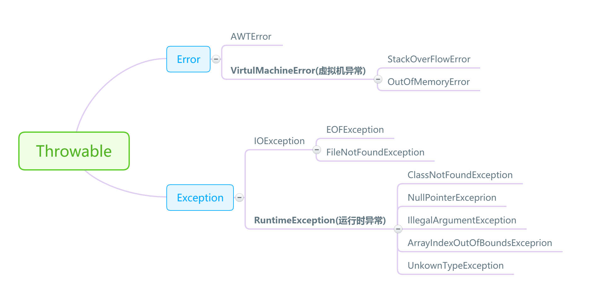

---

title: Java中的异常

date: 2017-12-29 19:43:59
categories: 原创
tags:
 Java
---


异常是Java中非常基础但重要的一块内容，异常的概念理解起来简单，但系统讲起来却并不容易。专门抽了一个下午将它整理出来，以备所需。
## Java中异常的分类

Java中的异常是指程序在编译或者运行中遇到的问题。
Java中的异常都继承自Throwable类。Throwable是java语言中所有错误和异常的超类，它表示可抛（万物皆可抛）。它有两个子类：Error和Exception。


- Error：Error为错误，是程序无法处理的。如OutOfMemoryError、ThreadDeath等，出现这种情况只能听之任之，交由JVM处理。一般情况下JVM也没法子，只好终止线程。
- Exception：Exception是程序可以处理的异常。它有很多子类，比如IOException,RuntimeException,SQLException等等。其中RuntimeException比较特殊，它表示程序运行中发生的异常，在编译时可以不接受检查。而其它异常编译时就要接受检查，对于抛出异常的部分，要么throw给子类，要么用try...catch处理。
<!--more-->
常见异常继承关系：


## Java中常见的异常

##### runtimeException子类
- ArrayIndexOutOfBoundsException：数组索引越界异常。当对数组的索引值为负数或大于等于数组大小时抛出
- ArithmeticException：算术条件异常。譬如：整数除零等
- NullPointerException：空指针异常。当应用试图在要求使用对象的地方使用了null时，抛出该异常。譬如：调用null对象的实例方法、访问  null对象的属性、计算null对象的长度、使用throw语句抛出null等等
- ClassNotFoundException：找不到类异常。当应用试图根据字符串形式的类名构造类，而在遍历CLASSPAH之后找不到对应名称的class文件时，抛出该异常
- NegativeArraySizeException：数组长度为负异常

##### IOException子类

- IOException：操作输入流和输出流时可能出现的异常
- EOFException：文件已结束异常
- FileNotFoundException：文件未找到异常

##### 其它Exception子类

- ClassCastException：类型转换异常类
- ArrayStoreException：数组中包含不兼容的值抛出的异常
- SQLException：操作数据库异常类

## Java中异常处理的机制

Java中异常抛出后有两种处理方式：try...catch...finally机制和throws继续抛出机制。
 

##### try...catch...finally机制
try...catch...finally是java中的关键字，使用方式如下：
```java
try{
     抛出异常的代码
}catch(异常类){
     处理语句
}finally{
     处理完后执行语句
}     
```

在使用try...catch...finally时，若try中某一语句抛出了异常，则try后面的代码会被屏蔽，直接进行catch中的语句。catch中语句执行到return(返回语句)时，会先看看有没有finally块，若有，则优先执行finally块中语句。*如果catch块和finally块都有return语句，则执行finally块中的。*
  
抛出异常的代码可能抛出多种异常，处理异常的catch也可以有多个catch，分别处理不同的异常。在执行时，会依次查找catch语句，直到找到第一个能catch某异常的代码块。

##### throw和throws机制
throws用在方法声明中，表示这个方法将会抛出某一异常。使用该方法的时候必须对该异常进行处理（try...catch或throw）throw用在语句中，表示抛出一个异常。抛出异常后方法会出栈，方法中后面的代码将不会执行。

## 异常处理的几个注意事项

- throws只是再次抛出了某个异常，并没有真正处理异常。在使用中，需要有代码去真正处理抛出的异常
 
- 如果子类重写了父类的方法，则子类能够抛出的异常只能是父类的子集（父类所有异常类及它们的子类集合）
 
- 对于runtimeException异常及其子类，程序可以选择显式处理也可以不处理，交给程序调用者去处理；对于其它exception（编译时异常），程序必须要显式处理（try...catch）或抛出（throws），交给调用者处理