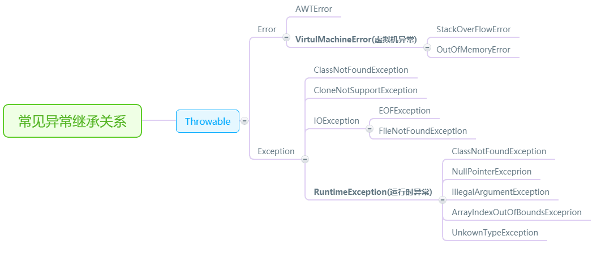

---

title: Java 中的异常

date: 2017-12-29 19:43:59
tags: Java
toc: true
---
<!--more-->
异常是 Java 中非常基础但重要的一块内容，异常的概念理解起来简单，但系统讲起来却并不容易。专门抽了一个下午将它整理出来，以备所需。

## 一、异常的分类

Java 中的异常是指程序在编译或者运行中遇到的问题。

Java 中的异常都继承自 Throwable 类。Throwable 是 java 语言中所有错误和异常的超类，它表示可抛（万物皆可抛）。它有两个子类：Error 和 Exception。

- Error：Error 为错误，是程序无法处理的。如 OutOfMemoryError、ThreadDeath 等，出现这种情况只能听之任之，交由 JVM 处理。一般情况下 JVM 也没法子，只好终止线程。
- Exception：Exception 是程序可以处理的异常。它有很多子类，比如 IOException,RuntimeException,SQLException 等等。其中 RuntimeException 比较特殊，它表示程序运行中		发生的异常，在编译时可以不接受检查。而其它异常编译时就要接受检查，对于抛出异常的部分，要么 throw 给子类，要么用 try...catch 处理。

常见异常继承关系：



## 二、常见的异常

记住常见的异常可以让我们更高效地调试程序代码，有助于提高开发效率。

### runtimeException 子类

- ArrayIndexOutOfBoundsException：数组索引越界异常。当对数组的索引值为负数或大于等于数组大小时抛出
- ArithmeticException：算术条件异常。譬如：整数除零等
- NullPointerException：空指针异常。当应用试图在要求使用对象的地方使用了 null 时，抛出该异常。譬如：调用 null 对象的实例方法、访问  null 对象的属性、计算 null 对象的长度、使用 throw 语句抛出 null 等等
- ClassNotFoundException：找不到类异常。当应用试图根据字符串形式的类名构造类，而在遍历 CLASSPAH 之后找不到对应名称的 class 文件时，抛出该异常
- NegativeArraySizeException：数组长度为负异常


### IOException 子类

- IOException：操作输入流和输出流时可能出现的异常
- EOFException：文件已结束异常
- FileNotFoundException：文件未找到异常

### 其它 Exception 子类

- ClassCastException：类型转换异常类
- ArrayStoreException：数组中包含不兼容的值抛出的异常
- SQLException：操作数据库异常类

## 三、异常处理的机制

Java 中异常抛出后有两种处理方式：try...catch...finally 机制和 throws 继续抛出机制。
 

### try...catch...finally 机制
try...catch...finally 是 java 中的关键字，使用方式如下：
```java
try{
     抛出异常的代码
}catch(异常类){
     处理语句
}finally{
     处理完后执行语句
}     
```

在使用 try...catch...finally 时，若 try 中某一语句抛出了异常，则 try 后面的代码会被屏蔽，直接进行 catch 中的语句。catch 中语句执行到 return(返回语句) 时，会先看看有没有 finally 块，若有，则优先执行 finally 块中语句。*如果 catch 块和 finally 块都有 return 语句，则执行 finally 块中的。*
  
抛出异常的代码可能抛出多种异常，处理异常的 catch 也可以有多个 catch，分别处理不同的异常。在执行时，会依次查找 catch 语句，直到找到第一个能 catch 某异常的代码块。

### throw 和 throws 机制
throws 用在方法声明中，表示这个方法将会抛出某一异常。使用该方法的时候必须对该异常进行处理（try...catch 或 throw）throw 用在语句中，表示抛出一个异常。抛出异常后方法会出栈，方法中后面的代码将不会执行。

## 四、注意事项

- throws 只是再次抛出了某个异常，并没有真正处理异常。在使用中，需要有代码去真正处理抛出的异常
- 如果子类重写了父类的方法，则子类能够抛出的异常只能是父类的子集（父类所有异常类及它们的子类集合）
- 对于 runtimeException 异常及其子类，程序可以选择显式处理也可以不处理，交给程序调用者去处理；对于其它 exception（编译时异常），程序必须要显式处理（try...catch）或抛出（throws），交给调用者处理

## 五、异常处理规约

摘自阿里 JAVA 开发手册，个人觉得有助于良好的代码风格形成。

1.【强制】不要捕获 Java 类库中定义的继承自 RuntimeException 的运行时异常类，如：IndexOutOfBoundsException/NullPointerException，这类异常由程序员预检查来规避，保证程序健壮性。
正例：if(obj != null) {...}
反例：try { obj.method() } catch(NullPointerException e){...}

2.【强制】异常不要用来做流程控制，条件控制，因为异常的处理效率比条件分支低。

3.【强制】对大段代码进行 try-catch，这是不负责任的表现。catch 时请分清稳定代码和非稳定代码，稳定代码指的是无论如何不会出错的代码。对于非稳定代码的 catch 尽可能进行区分异常类型，再做对应的异常处理。

4.【强制】捕获异常是为了处理它，不要捕获了却什么都不处理而抛弃之，如果不想处理它，请将该异常抛给它的调用者。最外层的业务使用者，必须处理异常，将其转化为用户可以理解的内容。

5.【强制】有 try 块放到了事务代码中，catch 异常后，如果需要回滚事务，一定要注意手动回滚事务。

6.【强制】finally 块必须对资源对象、流对象进行关闭，有异常也要做 try-catch。
说明：如果 JDK7，可以使用 try-with-resources 方式。

7.【强制】不能在 finally 块中使用 return，finally 块中的 return 返回后方法结束执行，不会再执行 try 块中的 return 语句。

8.【强制】捕获异常与抛异常，必须是完全匹配，或者捕获异常是抛异常的父类。
说明：如果预期对方抛的是绣球，实际接到的是铅球，就会产生意外情况。

9.【推荐】方法的返回值可以为 null，不强制返回空集合，或者空对象等，必须添加注释充分说明什么情况下会返回 null 值。调用方需要进行 null 判断防止 NPE 问题。
说明：本规约明确防止 NPE 是调用者的责任。即使被调用方法返回空集合或者空对象，对调用者来说，也并非高枕无忧，必须考虑到远程调用失败，运行时异常等场景返回 null 的情况。

10.【推荐】防止 NPE，是程序员的基本修养，注意 NPE 产生的场景：
1） 返回类型为包装数据类型，有可能是 null，返回 int 值时注意判空。
反例：public int f(){ return Integer 对象}; 如果为 null，自动解箱抛 NPE。
2） 数据库的查询结果可能为 null。
3） 集合里的元素即使 isNotEmpty，取出的数据元素也可能为 null。
4） 远程调用返回对象，一律要求进行 NPE 判断。
5） 对于 Session 中获取的数据，建议 NPE 检查，避免空指针。
6） 级联调用 obj.getA().getB().getC()；一连串调用，易产生 NPE。

11.【推荐】在代码中使用“抛异常”还是“返回错误码”，对于公司外的 http/api 开放接口必须使用“错误码”；而应用内部推荐异常抛出；跨应用间 RPC 调用优先考虑使用 Result 方式，封装 isSuccess、“错误码”、“错误简短信息”。
说明：关于 RPC 方法返回方式使用 Result 方式的理由：
1）使用抛异常返回方式，调用方如果没有捕获到就会产生运行时错误。
2）如果不加栈信息，只是 new 自定义异常，加入自己的理解的 error message，对于调用端解决问题的帮助不会太多。如果加了栈信息，在频繁调用出错的情况下，数据序列化和传输的性能损耗也是问题。

12.【推荐】定义时区分 unchecked/checked 异常，避免直接使用 RuntimeException 抛出，更不允许抛出 Exception 或者 Throwable，应使用有业务含义的自定义异常。推荐业界已定义过的自定义异常，如：DAOException/ServiceException 等。

13.【参考】避免出现重复的代码（Don't Repeat Yourself），即 DRY 原则。
说明：随意复制和粘贴代码，必然会导致代码的重复，在以后需要修改时，需要修改所有的副本，容易遗漏。必要时抽取共性方法，或者抽象公共类，甚至是共用模块。
正例：一个类中有多个 public 方法，都需要进行数行相同的参数校验操作，这个时候请抽取：private boolean checkParam(DTO dto){...}