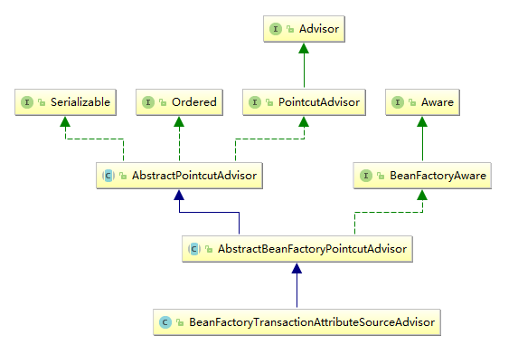
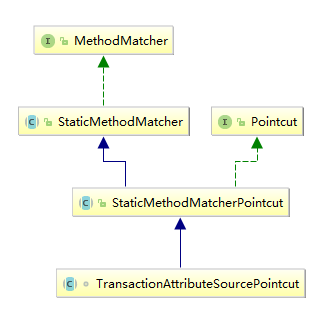
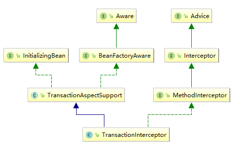
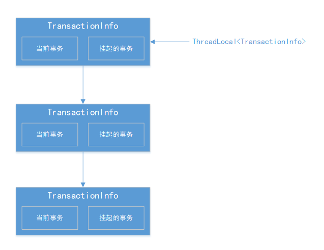

---
title: Spring AOP 源码浅析——事务的实现
tags: 
	- Spring
toc: true
date: 2019-03-28 16:03:54
---
Spring AOP 的诸多应用中，事务无疑是最常使用的工具之一。对于 Spring 事务的有些特性我们很熟悉，比如事务的四大特性 ACID，比如具体的实现委托给底层 DB。但有些特性我们又有些陌生，比如事务传播行为，事务实现的原理。这也是这篇文章要阐述的内容。

## 一、基础知识
### 1.1 传播行为
传播行为就是指在一个方法中调用另一个声明了事务的方法，被调用方法的事务的执行策略，先看两段代码：
```java
@Component
public class ServiceA{
    @Transactional
    public void invokeA(){
        //do sql...
    }
}
@Component
public class ServiceB{
    @Transactional
    public void invokeB(){
        //do sql...
    }
}
@Component
public class Test{
    @Autowire
    ServiceA serviceA;
    @Autowire
    ServiceB serviceB;
    
    @Transactional
    public void doTest(){
        serviceA.invokeA();
        serviceB.invokeB();
        //do sql...
    }
}
```
如上，当我们在其它地方调用开启了事务的 invokeA() 和 invokeB() 时，就发生了事务的传播。这里面会有很多种情况，比如调用方当前存不存在事务，如果存在事务的话，是要加入当前的事务还是自己创建一个；如果不存在的话，是自己创建一个还是抛异常。这些策略的选择，统称为 Spring 的事务传播行为。

org.springframework.transaction.annotation 包下的枚举类 Propagation 为 Spring 定义了七种传播行为，我们简单了解一下：

|事务传播行为|说明|
|:---|:---|
|PROPAGATION_REQUIRED| 支持当前事务，如果不存在事务，创建一个事务，这是默认的传播属性值。|
|PROPAGATION_SUPPORTS| 支持当前事务，如果不存在事务，则在无事务环境执行。|
|PROPAGATION_MANDATORY| 支持当前事务，如果不存在事务，则抛出异常。|
|PROPAGATION_REQUIRES_NEW|不支持当前事务，挂起当前事务，创建一个新事务。|
|PROPAGATION_NOT_SUPPORTED|不支持当前事务，挂起当前事务，在无事务环境上执行。|
|PROPAGATION_NEVER|不支持当前事务，如果当前存在事务，则抛出异常，否则在无事务环境上执行。|
|PROPAGATION_NESTED|如果当前存在事务，则嵌套事务执行|

这里解释一下挂起和嵌套的概念，假设我们有如下代码：
```java
@Transactional
public void service(){
     do sql
     serviceA();
     serviceB();
     1/0;
}
@Transactional(propagation=Propagation.NESTED)
serviceA(){
    do sql
}
@Transactional(propagation=Propagation.NEW)
serviceB(){
    do sql
}
```
很明显，1/0 会抛出异常，然后事务回滚。看 propagation 的值可以知道：serviceA 是嵌套事务执行，而 serviceB 是挂起后新建事务执行。那么当 service 回滚时，**嵌套在内层的事务会随着外层事务的提交而提交，随着外层事务的回滚而回滚**，而**挂起后新建的事务本身看做一个独立的事务，不会受外部事务的提交和回滚影响**。当 serviceA 内部发生错误需要回滚时，**嵌套在内层的事务不会引起外层事务的回滚**，同样，**挂起后新建的事务回滚也不会引起挂起的事务回滚**。

### 1.2 顶层接口
Spring 框架中，最重要的事务管理的接口有三个：TransactionDefinition、PlatformTransactionManager 和 TransactionStatus。 所谓事务管理，实质上就是按照给定的事务规则来执行提交或者回滚操作。其中，“给定的事务规则”是用 TransactionDefinition 表示的，“按照……来执行提交或者回滚操作”是用 PlatformTransactionManager 表示的，而 TransactionStatus 可以看作代表事务本身。
#### 1.2.1 PlatformTransactionManager
Spring 事务策略是通过 PlatformTransactionManager 接口体现的，该接口是 Spring 事务策略的核心。该接口的源代码如下：
```java
public interface PlatformTransactionManager {

    // 平台无关的获得事务的方法
    TransactionStatus getTransaction(TransactionDefinition definition) throws TransactionException;

    // 平台无关的事务提交方法
    void commit(TransactionStatus status) throws TransactionException;

    // 平台无关的事务回滚方法
    void rollback(TransactionStatus status) throws TransactionException;
}
```
可以看出，PlatformTransactionManager 是一个与任何事务策略分离的接口。PlatformTransactionManager 接口有许多不同的实现类，应用程序面向与平台无关的接口编程，而对不同平台的底层支持由 PlatformTransactionManager 接口的实现类完成，故而应用程序无须与具体的事务 API 耦合。因此使用 PlatformTransactionManager 接口，可将代码从具体的事务 API 中解耦出来。以下是几个常用的实现类：

|实现类|说明|
|:---|:---|
|org.springframework.jdbc.datasource.DataSourceTransactionManager |使用 spring jdbc 或 ibatis、mybatis 进行持久化数据时使用|
|org.springframework.orm.hibernate3.HibernateTransactionManager|使用 Hibernate 进行持久化数据时使用|

在PlatformTransactionManager 接口内，包含一个 `getTransaction（TransactionDefinition definition）`方法，该方法根据一个 TransactionDefinition 参数，返回一个 TransactionStatus 对象。TransactionStatus 对象表示一个事务，该事务可能是一个新的事务，也可能是一个已经存在的事务对象，这由 TransactionDefinition 所定义的事务规则所决定。

#### 1.2.2 TransactionDefinition
我们通过@Transaction 声明事务时，最终都转换成 TransactionDefinition 来表示。TransactionDefinition 接口用于定义一个事务的规则，它包含了事务的一些静态属性，比如：事务传播行为、超时时间等。同时，Spring 还为我们提供了一个默认的实现类：DefaultTransactionDefinition，该类适用于大多数情况。如果该类不能满足需求，可以通过实现 TransactionDefinition 接口来实现自己的事务定义。接口的定义如下：
```java
public interface TransactionDefinition{
    // 获取事务隔离级别，和数据库隔离界别一个概念
    int getIsolationLevel();
    // 获取事务传播行为，上文介绍过了
    int getPropagationBehavior();
    // 获取超时时间，超时时间指一个事务所允许执行的最长时间，如果超过该时间限制但事务还没有完成，则自动回滚事务
    int getTimeout();
    // 获取事务的只读属性，事务的只读属性是指，对事务性资源（比如数据源）进行只读操作或者是读写操作。
    boolean isReadOnly();
}
```
#### 1.2.3 TransactionStatus
PlatformTransactionManager.getTransaction(…) 方法返回一个 TransactionStatus 对象，该对象可能代表一个新的或已经存在的事务（如果在当前调用堆栈有一个符合条件的事务）。TransactionStatus 接口提供了一个简单的控制事务执行和查询事务状态的方法。该接口的源代码如下：
```java
public  interface TransactionStatus{
   // 是否是一个新事务
   boolean isNewTransaction();
   // Spring 中默认是通过抛出运行时异常来回滚，如果不想抛出异常，可以设置这个参数手动回滚
   void setRollbackOnly();
   // 判断当前是否设置了回滚标记
   boolean isRollbackOnly();
}
```
这个接口有一个默认实现类：DefaultTransactionStatus。这是整个事务框架最重要的状态对象，它贯穿于事务拦截器，Spring 抽象框架和底层具体事务实现框架之间，它的重要任务是在新建，挂起，提交事务的过程中保存对应事务的属性。在 AbstractPlatformTransactionManager 中，每个事物流程都会创建这个对象。
DefaultTransactionStatus 会持有一个 DataSourceTransactionObject，这是底层 JDBC 具体框架使用的对象，其中包含 ConnectionHolder，它又持有了 Connection，表示一个实际的数据库连接。

### 1.3 AOP 套件
Spring 的事务是通过 AOP 的机制实现的，因此在阅读源码之前对一些 AOP 组件的了解是有必要的。
#### 1.3.1 事务通知器
事务通知器的实现类是 BeanFactoryTransactionAttributeSourceAdvisor，如果开启了事务功能，它会自动注入容器中。和其它通知器一样它的内部也有一组切点和通知，只是它的切点匹配方式和我们常见的通知器不一样，不是根据 AspectJ 表达式，而是根据有没有@Transaction 注解来匹配的。类继承关系如下：

可以看出继承了 PointcutAdvisor 和 BeanFactoryAware 接口，表明它是一个通知器，而且能获取到容器对象。该类的定义如下：
```java
public class BeanFactoryTransactionAttributeSourceAdvisor extends AbstractBeanFactoryPointcutAdvisor {

    // 事务属性源，用于解析方法上的事务定义信息
    private TransactionAttributeSource transactionAttributeSource;

    // 匿名内部类实现的切点，和常见的切点实现类的不同之处在于它可以获取事务属性源
    private final TransactionAttributeSourcePointcut pointcut = new TransactionAttributeSourcePointcut() {
        @Override
        @Nullable
        protected TransactionAttributeSource getTransactionAttributeSource() {
            return transactionAttributeSource;
        }
    };
    
    // 设置事务属性源
    public void setTransactionAttributeSource(TransactionAttributeSource transactionAttributeSource){...}
    // 类过滤器，用于过滤不匹配的类，默认是 ClassFilter.TRUE，即不过滤任何类
    public void setClassFilter(ClassFilter classFilter) {...}
    // 获取切点
    @Override
    public Pointcut getPointcut() {...}

}
```
#### 1.3.2 事务属性源
事务属性源是事务通知器中一个非常重要的属性，它的作用是解析方法上的事务定义信息（比如 @Transactional 注解）。该类的定义如下：
```java
public interface TransactionAttributeSource {
    // 解析方法上的事务定义信息
    TransactionAttribute getTransactionAttribute(Method method, Class<?> targetClass);
}
```
#### 1.3.3 事务切点
TransactionAttributeSourcePointcut 对应 AOP 中的切点。它是一个抽象接口，具体的实现在 BeanFactoryTransactionAttributeSourceAdvisor 里，是一个匿名内部类。它的继承关系如图所示：

它实现了两个接口：Pointcut 和 MethodMatcher。MethodMatcher 中的 matches 方法提供了方法的匹配，而 Pointcut 的 getClassFilter 和 getMethodMatcher 方法提供了获取方法匹配器和类过滤器的方法。那么这里为什么没有实现类过滤器呢？因为在抽象类 `StaticMethodMatcherPointcut` 里直接指定了 `private ClassFilter classFilter = ClassFilter.TRUE;`。TransactionAttributeSourcePointcut 的定义如下：
```java
abstract class TransactionAttributeSourcePointcut extends StaticMethodMatcherPointcut implements Serializable {

    // 默认类过滤器
    private ClassFilter classFilter = ClassFilter.TRUE;

    // 方法匹配
    @Override
    public boolean matches(Method method, Class<?> targetClass) {...}

    // 获取 TransactionAttributeSource，用于获取方法的 TransactionDefinition 信息
    @Nullable
    protected abstract TransactionAttributeSource getTransactionAttributeSource();

    // 设置类过滤器
    public void setClassFilter(ClassFilter classFilter) {...}

    // 获取类过滤器
    @Override
    public ClassFilter getClassFilter() {...}

    // 获取方法匹配器
    @Override
    public final MethodMatcher getMethodMatcher() {...}
}
```
#### 1.3.4 事务拦截器
TransactionInterceptor 对应 AOP 中的拦截器，也就是 AspectJ 标准中的通知。TransactionInterceptor 是一个环绕型通知，它的类继承关系如下：

主要实现了两个接口：BeanFactoryAware 和 Advice。说明它是一个通知类，同时也能获取容器对象。该类的（部分）定义如下：
```java
public class TransactionInterceptor extends TransactionAspectSupport implements MethodInterceptor, Serializable {
    // ThreadLocal 变量，指向线程内事务栈的栈顶
    private static final ThreadLocal<TransactionInfo> transactionInfoHolder;
    // 事务管理器
    private PlatformTransactionManager transactionManager;
    // 事务属性源
    private TransactionAttributeSource transactionAttributeSource;
    // Spring 容器对象
    private BeanFactory beanFactory;

    // 通知的执行方法，在方法执行前后的一些处理
    @Override
    @Nullable
    public Object invoke(MethodInvocation invocation) throws Throwable {...}

    // 获取当前事务信息
    protected static TransactionInfo currentTransactionInfo(){...}

    // 获取当前事务状态
    public static TransactionStatus currentTransactionStatus(){...}

    // 在事务中运行方法（核心）
    protected Object invokeWithinTransaction(Method method, Class<?> targetClass, InvocationCallback invocation)  {...}
```
### 1.3 事务同步管理器
这个组件单独拿出来说是因为在之后的代码中会经常看到。这是一个保存当前事务信息的组件，代码如下：
```java
public abstract class TransactionSynchronizationManager {
    // 保存当前事务的一些资源，比如连接
    private static final ThreadLocal<Map<Object, Object>> resources =
            new NamedThreadLocal<>("Transactional resources");
    // 记录当前事务的回调方法，类似于事务的监听器
    private static final ThreadLocal<Set<TransactionSynchronization>> synchronizations =
            new NamedThreadLocal<>("Transaction synchronizations");
    // 记录当前事务名
    private static final ThreadLocal<String> currentTransactionName =
            new NamedThreadLocal<>("Current transaction name");
    // 记录当前事务读写情况
    private static final ThreadLocal<Boolean> currentTransactionReadOnly =
            new NamedThreadLocal<>("Current transaction read-only status");
    // 记录当前事务隔离级别
    private static final ThreadLocal<Integer> currentTransactionIsolationLevel =
            new NamedThreadLocal<>("Current transaction isolation level");
    // 记录当前事务是否活跃
    private static final ThreadLocal<Boolean> actualTransactionActive =
            new NamedThreadLocal<>("Actual transaction active");
    
    //...
}
```
可以看到内部统一使用了 ThreadLocal，这是因为当前事务的信息需要在线程内部全局可见，类似于操作系统中的进程上下文。当事务切换时，本质上就是获取一个新的数据库连接然后把事务同步管理器中的 ThreadLocal 变量替换掉。

这个对象非常重要，仔细回想一下，我们在 JDBC 操作数据库的时候，都会指定一个连接：
```java
try {  
    Connection conn = DriverManager.getConnection();
    PreparedStatement ps = conn.prepareStatement();
    ps.executeUpdate("SQL操作"); // 执行操作时需要指定连接
    ps.execute(); // 语句执行
} catch (Exception e) {  
    conn.rollback();    
} 
```
而在 Spring 中操作数据时并没有指定连接：
```java
@Transactional
public void service(){
     mapper.update();// 执行操作时没有指定连接
}
```
这里面就是 mapper 帮我们从 TransactionSynchronizationManager 中获取了线程当前的数据库连接。

## 二、事务实现

事务的实现依赖于 Spring 的 AOP 机制，从本质上来讲，下面两段代码是等价的：
```java
public void service() throws Exception {  
      // 1.获取事务控制管理器  
      DataSourceTransactionManager transactionManager = applicationContext.getBean(  
           "transactionManager", DataSourceTransactionManager.class);
      // 2.获取事务定义  
      DefaultTransactionDefinition def = new DefaultTransactionDefinition();  
      // 3.设置事务隔离级别
      def.setPropagationBehavior(TransactionDefinition.PROPAGATION_REQUIRED);  
      // 4.开启事务，获得事务状态 
      TransactionStatus status = transactionManager.getTransaction(def);  
      try {  
        // 5.具体的数据库操作（多个）  
        do sql...
        // 6.提交事务
        transactionManager.commit(status);  
      } catch (Exception e) {
        // 7.回滚事务  
        transactionManager.rollback(status);  
      }  
}
```
```java
@Transactional
public void service() throws Exception {
    do sql
}
```
从上我们大概可以猜到，Spring 的事务本质上就是一个环绕通知器，在方法运行前开启事务，在方法结束后提交事务，抛出异常时回滚事务。由于之前已经分析过 AOP 相关的源码，因此对事务的实现这里只看一些重要的方法。

### 2.1 生成代理对象

我们知道在生成代理对象前，Spring 会遍历容器中所有的通知器和被代理的对象进行匹配，当有通知器匹配上时，Spring 会把它加入到代理对象的通知器列表中。BeanFactoryTransactionAttributeSourceAdvisor 的匹配是方法级的，即对当前对象逐方法匹配，在注解形式下，匹配的依据是方法上的 @Transactional 注解：
```java
TransactionAttributeSourcePointcut
public boolean matches(Method method, Class<?> targetClass) {
    if (targetClass != null && TransactionalProxy.class.isAssignableFrom(targetClass)) {
        return false;
    }
    // 获取事务属性源，用于解析方法上的事务
    TransactionAttributeSource tas = getTransactionAttributeSource();
    // 获取方法上的事务定义信息，如果获取到了就说明当前方法能够匹配
    return (tas == null || tas.getTransactionAttribute(method, targetClass) != null);
}

AbstractFallbackTransactionAttributeSource
public TransactionAttribute getTransactionAttribute(Method method, Class<?> targetClass) {
    // 首先检查是否缓存了当前方法的事务定义信息
    // 事务属性源内部以 Map<类名+方法名,TransactionDefinition> 的形式缓存了全局的事务定义信息
    Object cacheKey = getCacheKey(method, targetClass);
    Object cached = this.attributeCache.get(cacheKey);
    if (cached != null) {
        // 这个标记表明之前解析过该方法且这个方法上没有定义事务，那么直接返回 null
        if (cached == NULL_TRANSACTION_ATTRIBUTE) {
            return null;
        }
        else {
            return (TransactionAttribute) cached;
        }
    }
    else {
        // 获取当前方法的事务定义信息
        TransactionAttribute txAttr = computeTransactionAttribute(method, targetClass);
        // Put it in the cache.
        // 如果方法上没有解析到事务，缓存一个标记，下次调用时直接返回 null
        if (txAttr == null) {
            this.attributeCache.put(cacheKey, NULL_TRANSACTION_ATTRIBUTE);
        }
        else {
            String methodIdentification = ClassUtils.getQualifiedMethodName(method, targetClass);
            if (txAttr instanceof DefaultTransactionAttribute) {
                ((DefaultTransactionAttribute) txAttr).setDescriptor(methodIdentification);
            }
            // 把当前方法的事务定义信息缓存到 TransactionAttributeSource
            this.attributeCache.put(cacheKey, txAttr);
        }
        return txAttr;
    }
}
AbstractFallbackTransactionAttributeSource
protected TransactionAttribute computeTransactionAttribute(Method method, @Nullable Class<?> targetClass) {
    // 忽略非 public 的方法
    if (allowPublicMethodsOnly() && !Modifier.isPublic(method.getModifiers())) {
        return null;
    }

    // method 代表接口中的 default 方法，specificMethod 代表实现类中的方法
    Method specificMethod = AopUtils.getMostSpecificMethod(method, targetClass);

    // 查看实现方法中是否存在事务声明
    TransactionAttribute txAttr = findTransactionAttribute(specificMethod);
    if (txAttr != null) {
        return txAttr;
    }

    // 查看方法所在类中是否存在事务声明
    txAttr = findTransactionAttribute(specificMethod.getDeclaringClass());
    if (txAttr != null && ClassUtils.isUserLevelMethod(method)) {
        return txAttr;
    }

    // 如果存在接口，则到接口中去寻找
    if (specificMethod != method) {
        // 查找接口方法是否存在事务声明
        txAttr = findTransactionAttribute(method);
        if (txAttr != null) {
            return txAttr;
        }
        // 查看接口所在类上面是否存在事务声明
        txAttr = findTransactionAttribute(method.getDeclaringClass());
        if (txAttr != null && ClassUtils.isUserLevelMethod(method)) {
            return txAttr;
        }
    }

    return null;
}
```
如果方法中存在事务定义信息，则使用方法上的定义信息，否则使用方法所在的类上的事务定义信息，如果方法所在类的属性上还是没有搜寻到对应的事务定义信息，那么再搜寻接口中的方法，再没有的话，最后尝试搜寻接口的类上面的声明。最终返回一个 TransactionAttribute（TransactionDefinition的子类）类型的结果，匹配到的依据就是返回的对象是否为空，为空就是没匹配到，不为空就是匹配到了。

对于匹配到的对象，Spring 会把 BeanFactoryTransactionAttributeSourceAdvisor 放进相应代理对象的通知器列表中，在实际方法的调用过程中会转化成拦截器 TransactionInterceptor。

### 2.2 执行事务拦截器
在执行动态代理的对象时，对象持有的若干个通知器会抽离出内部持有的拦截器组成拦截器链，事务通知器也不例外。事务拦截器本质上是一个环绕型通知，通过内部的事务定义信息控制事务的创建、提交和回滚。其核心方法如下：
```java
protected Object invokeWithinTransaction(Method method, @Nullable Class<?> targetClass,final TransactionAspectSupport.InvocationCallback invocation) throws Throwable {
    // 获取事务属性源，用于解析方法上的事务定义信息
    TransactionAttributeSource tas = getTransactionAttributeSource();
    // 获取方法上的事务定义信息，如果没有定义事务返回 null，TransactionAttribute 是 TransactionDefinition 的子类
    final TransactionAttribute txAttr = (tas != null ? tas.getTransactionAttribute(method, targetClass) : null);
    // 获取容器中的事务管理器
    final PlatformTransactionManager tm = determineTransactionManager(txAttr);
    // 构造方法唯一标识（类.方法，如service.UserServiceImpl.save）
    final String joinpointIdentification = methodIdentification(method, targetClass, txAttr);

    // 如果定义了事务
    if (txAttr == null || !(tm instanceof CallbackPreferringPlatformTransactionManager)) {
        // 根据传播行为创建事务，返回值是事务信息的栈（以链表实现），里面包含当前事务信息、挂起的事务信息、指向上一个栈帧的指针等
        TransactionAspectSupport.TransactionInfo txInfo = createTransactionIfNecessary(tm, txAttr, joinpointIdentification);
        Object retVal = null;
        try {
            // 调用回调方法（这个看起来好像跟其它拦截器里面的回调方法不一样，但其实是一样的。这个是函数式接口，传入的是 process() 方法）
            retVal = invocation.proceedWithInvocation();
        }
        catch (Throwable ex) {
            // 抛出异常，根据当前事务信息决定是回滚还是提交
            completeTransactionAfterThrowing(txInfo, ex);
            // 继续抛出异常，这里有两个目的：如果是内层事务，抛出异常让外层事务去回滚；如果是最外层事务，抛出异常给用户
            throw ex;
        }
        finally {
            // 将当前事务信息从事务栈中移出
            cleanupTransactionInfo(txInfo);
        }
        // 提交当前事务
        commitTransactionAfterReturning(txInfo);
        return retVal;
    }
    // 编程式事务
    else {...}
}
```
从代码我们可以看出，拦截器主要做了五件事：获取事务定义信息、创建事务、执行方法、正常处理和异常处理。我们先看一下获取事务定义信息的相关方法：

#### 2.2.1 获取事务定义信息

获取事务的定义信息的过程在之前 2.1 小节中出现过，当时通知器会根据当前方法上能否获取到事务定义信息来判断当前方法是否跟通知器匹配，获取到的事务定义信息会放到一个全局的 Map 中，避免重复解析。由于判断通知器是否匹配过程中只要有一个方法匹配上就会退出，不一定扫描了所有的方法，因此在实际调用中，需要在这里再获取一次方法上的事务定义信息。核心代码和 2.1 小节中的 `getTransactionAttribute(Method method, Class<?> targetClass)` 一模一样，这里就不赘述了。

#### 2.2.2 获取事务
```java
protected TransactionInfo createTransactionIfNecessary(PlatformTransactionManager tm, TransactionAttribute txAttr, final String joinpointIdentification) {   
    //...
    TransactionStatus status = null;
    if (txAttr != null) {
        if (tm != null) {
            // 获取事务
            status = tm.getTransaction(txAttr);
        }
        else {
            //...
        }
    }
    // 把事务信息、事务状态封装成一个链表的形式返回
    return prepareTransactionInfo(tm, txAttr, joinpointIdentification, status);
}
```
这里要强调一下，这边 TransactionInterceptor 中**以栈的形式维护了所有嵌套的事务信息**，栈的底层由链表实现，返回的 TransactionInfo 实际上是链表的头节点，每一个 TransactionInfo 中都维护了指向上一个 TransactionInfo 的指针，TransactionInterceptor 中以 ThreadLocal&lt;TransactionInfo&gt; 的形式保存栈顶的事务信息，也就是当前所处的事务上下文。结构如下图所示：



每个栈帧都保存了当前事务和挂起的事务。这样就能实现多层嵌套下的挂起和恢复操作。

回到获取事务的逻辑：
```java
public final TransactionStatus getTransaction(@Nullable TransactionDefinition definition) throws TransactionException {
    // transaction 代表了当前事务
    Object transaction = doGetTransaction();

    if (definition == null) {
        // 如果没有事务定义信息，使用默认定义
        definition = new DefaultTransactionDefinition();
    }

    if (isExistingTransaction(transaction)) {
        // 已经存在事务，根据传播行为确定接下来的处理流程
        return handleExistingTransaction(definition, transaction, debugEnabled);
    }

    // 当前不存在事务，不同的传播行为不同处理
    if (definition.getPropagationBehavior() == TransactionDefinition.PROPAGATION_MANDATORY) {
        // PROPAGATION_MANDATORY 下直接抛出异常
        throw new IllegalTransactionStateException(...);
    }
    else if (definition.getPropagationBehavior() == TransactionDefinition.PROPAGATION_REQUIRED ||
            definition.getPropagationBehavior() == TransactionDefinition.PROPAGATION_REQUIRES_NEW ||
            definition.getPropagationBehavior() == TransactionDefinition.PROPAGATION_NESTED) {
        // PROPAGATION_REQUIRED、PROPAGATION_REQUIRES_NEW、PROPAGATION_NESTED 三种情况下创建新事务
        SuspendedResourcesHolder suspendedResources = suspend(null);
        try {
            // 打开同步开关，除非设置为 SYNCHRONIZATION_NEVER
            boolean newSynchronization = (getTransactionSynchronization() != SYNCHRONIZATION_NEVER);
            // 更新事务状态
            DefaultTransactionStatus status = newTransactionStatus(
                    definition, transaction, true, newSynchronization, debugEnabled, suspendedResources);
            // 开启事务
            doBegin(transaction, definition);
            // 执行同步，即把当前事务信息写入线程变量
            prepareSynchronization(status, definition);
            return status;
        }
        catch (RuntimeException | Error ex) {
            // 恢复事务
            resume(null, suspendedResources);
            throw ex;
        }
    }
    else {
        // PROPAGATION_SUPPORTS、PROPAGATION_NOT_SUPPORTED、PROPAGATION_NEVER 三种情况下在无事务环境运行，基本不用做什么操作
        if (definition.getIsolationLevel() != TransactionDefinition.ISOLATION_DEFAULT && logger.isWarnEnabled()) {
            logger.warn(...);
        }
        // 关闭同步开关，除非设置为 SYNCHRONIZATION_ALWAYS
        boolean newSynchronization = (getTransactionSynchronization() == SYNCHRONIZATION_ALWAYS);
        // 创建新的事务状态但不执行同步
        return prepareTransactionStatus(definition, null, true, newSynchronization, debugEnabled, null);
    }
}
```
如上，源码分成了2条处理线：
1. 当前已存在事务：isExistingTransaction() 判断是否存在事务，存在事务 handleExistingTransaction() 根据不同传播机制不同处理
2. 当前不存在事务: 不同传播机制不同处理

```java
private TransactionStatus handleExistingTransaction(TransactionDefinition definition, Object transaction, boolean debugEnabled)
        throws TransactionException {

    if (definition.getPropagationBehavior() == TransactionDefinition.PROPAGATION_NEVER) {
        // PROPAGATION_NEVER 下直接抛出异常
        throw new IllegalTransactionStateException(...);
    }

    if (definition.getPropagationBehavior() == TransactionDefinition.PROPAGATION_NOT_SUPPORTED) {
        // PROPAGATION_NOT_SUPPORTED 下先挂起当前事务，再在无事务状态下运行
        // 挂起当前事务
        Object suspendedResources = suspend(transaction);
        // 关闭同步开关，除非 SYNCHRONIZATION_ALWAYS
        boolean newSynchronization = (getTransactionSynchronization() == SYNCHRONIZATION_ALWAYS);
        // 创建新的事务状态
        return prepareTransactionStatus(definition, null, false, newSynchronization, debugEnabled, suspendedResources);
    }

    if (definition.getPropagationBehavior() == TransactionDefinition.PROPAGATION_REQUIRES_NEW) {
        // PROPAGATION_NOT_SUPPORTED 下先挂起当前事务，再创建新事务
        // 挂起当前事务
        SuspendedResourcesHolder suspendedResources = suspend(transaction);
        try {
            // 打开同步开关，除非 SYNCHRONIZATION_NEVER
            boolean newSynchronization = (getTransactionSynchronization() != SYNCHRONIZATION_NEVER);
            // 创建新的事务状态
            DefaultTransactionStatus status = newTransactionStatus(definition, transaction, true, newSynchronization, debugEnabled, suspendedResources);
            // 开启新事务
            doBegin(transaction, definition);
            // 执行同步，把新的事务信息写入线程变量
            prepareSynchronization(status, definition);
            return status;
        }
        catch (RuntimeException | Error beginEx) {
            // 恢复事务
            resumeAfterBeginException(transaction, suspendedResources, beginEx);
            throw beginEx;
        }
    }

    if (definition.getPropagationBehavior() == TransactionDefinition.PROPAGATION_NESTED) {
        // PROPAGATION_NESTED 下，嵌套执行新事务。嵌套事务本质上是设置了一个保存点，在内部事务中的回滚都是回滚到保存点
        if (!isNestedTransactionAllowed()) {
            throw new NestedTransactionNotSupportedException(...);
        }
        // 大多数情况下，通过保存点方式实现
        if (useSavepointForNestedTransaction()) {
            // 创建新的事务状态，但不执行同步（第四个参数）
            DefaultTransactionStatus status =
                    prepareTransactionStatus(definition, transaction, false, false, debugEnabled, null);
            // 创建并持有了保存点
            status.createAndHoldSavepoint();
            return status;
        }
        // JTA 情况下，通过新建事务实现
        else {
            // 开启同步开关，除非 SYNCHRONIZATION_NEVER
            boolean newSynchronization = (getTransactionSynchronization() != SYNCHRONIZATION_NEVER);
            // 创建新的事务状态
            DefaultTransactionStatus status = newTransactionStatus(
                    definition, transaction, true, newSynchronization, debugEnabled, null);
            // 开启新事务
            doBegin(transaction, definition);
            // 执行同步
            prepareSynchronization(status, definition);
            return status;
        }
    }

    // PROPAGATION_REQUIRED、PROPAGATION_SUPPORTS、PROPAGATION_MANDATORY 三种情况都是加入原先的事务
    if (isValidateExistingTransaction()) {
        // 这里会判断新旧事务的隔离级别，如果新事务的隔离级别和旧事务不一样，而且不是 ISOLATION_DEFAULT，抛出异常
        if (definition.getIsolationLevel() != TransactionDefinition.ISOLATION_DEFAULT) {
            Integer currentIsolationLevel = TransactionSynchronizationManager.getCurrentTransactionIsolationLevel();
            if (currentIsolationLevel == null || currentIsolationLevel != definition.getIsolationLevel()) {
                Constants isoConstants = DefaultTransactionDefinition.constants;
                throw new IllegalTransactionStateException(...);
            }
        }
        // 检查新旧事务的只读属性，不一样抛出异常
        if (!definition.isReadOnly()) {
            if (TransactionSynchronizationManager.isCurrentTransactionReadOnly()) {
                throw new IllegalTransactionStateException(...);
            }
        }
    }
    // 打开同步开关，除非 SYNCHRONIZATION_NEVER
    boolean newSynchronization = (getTransactionSynchronization() != SYNCHRONIZATION_NEVER);
    return prepareTransactionStatus(definition, transaction, false, newSynchronization, debugEnabled, null);
}
```
可以看到，获取事务时会根据事务传播行为和当前是否存在事务，来决定以何种方式来创建事务。流程涉及到三个方法：挂起事务、开启事务和恢复事务，我们依次来看一下：
##### 2.2.1.1 挂起事务

挂起事务本身不是 JDBC 的一个操作，它是 Spring 事务传播机制的一个概念，将当前连接挂起，切换成新的连接。如下：
```java
private Connection conn1 = null;  
private PreparedStatement ps1 = null;  
private Connection conn2 = null;  
private PreparedStatement ps2 = null;  

try {  
    conn1.setAutoCommit(false);  // 将自动提交设置为 false  
    conn2.setAutoCommit(false);
    ps1.executeUpdate("修改SQL"); // 执行修改操作  
    ps2.executeQuery("查询SQL");  // 切换连接，相当于挂起了 conn1，执行查询操作                 
    conn2.commit();      // 提交 conn2
    ps1.executeQuery("查询SQL"); // 再次切换连接，相当于恢复 conn1
    conn1.commit();     // 提交 conn1

} catch (Exception e) {  
    conn1.rollback();    
    conn2.rollback();
} 
```
上述代码简单展示了一个挂起和恢复的操作。在这段代码中我们可以看到，通过切换连接就实现了挂起和恢复的功能，这里面我们需要思考一个问题就是如何保存当前和被挂起的连接信息。在 Spring 中，TransactionSynchronizationManager 以静态 ThreadLocal 的形式中存放了当前使用的连接信息（回想一下我们在 Spring 中操作数据库的时候，是不是没有指定连接？其实就是从 TransactionSynchronizationManager 获取的），而被挂起的连接会封装成一个 SuspendedResourcesHolder 对象放进 TranscationInfo 中（拦截器以栈的形式存储 TranscationInfo），当前事务结束后又会把被挂起的连接恢复。代码如下：
```java
protected final SuspendedResourcesHolder suspend(@Nullable Object transaction) throws TransactionException {
    // 当前存在同步
    if (TransactionSynchronizationManager.isSynchronizationActive()) {
        // 获取当前事务的同步方法（类似于监听器）
        List<TransactionSynchronization> suspendedSynchronizations = doSuspendSynchronization();
        try {
            Object suspendedResources = null;
            if (transaction != null) {
                // 挂起当前事务，获取挂起事务的资源
                suspendedResources = doSuspend(transaction);
            }
            // 保存和清空一些事务同步管理器中的线程变量
            String name = TransactionSynchronizationManager.getCurrentTransactionName();
            TransactionSynchronizationManager.setCurrentTransactionName(null);
            boolean readOnly = TransactionSynchronizationManager.isCurrentTransactionReadOnly();
            TransactionSynchronizationManager.setCurrentTransactionReadOnly(false);
            Integer isolationLevel = TransactionSynchronizationManager.getCurrentTransactionIsolationLevel();
            TransactionSynchronizationManager.setCurrentTransactionIsolationLevel(null);
            boolean wasActive = TransactionSynchronizationManager.isActualTransactionActive();
            TransactionSynchronizationManager.setActualTransactionActive(false);

            // 将线程变量保存在 SuspendedResourcesHolder 中返回
            return new SuspendedResourcesHolder(
                    suspendedResources, suspendedSynchronizations, name, readOnly, isolationLevel, wasActive);
        }
        catch (RuntimeException | Error ex) {
            // 挂起失败，调用事务恢复的同步方法
            doResumeSynchronization(suspendedSynchronizations);
            throw ex;
        }
    }
    // 当前有同步但没有同步方法
    else if (transaction != null) {
        Object suspendedResources = doSuspend(transaction);
        return new SuspendedResourcesHolder(suspendedResources);
    }
    // 当前既没有同步也没有同步方法
    else {
        return null;
    }
}
```
```java
protected Object doSuspend(Object transaction) {
    // 数据源事务对象
    DataSourceTransactionObject txObject = (DataSourceTransactionObject) transaction;
    // 清空数据库连接
    txObject.setConnectionHolder(null);
    // 解绑并返回当前线程的连接持有者
    return TransactionSynchronizationManager.unbindResource(this.dataSource);
}
```
挂起线程的核心操作：
1）保存并置空当前线程中的事务信息
2）清空数据源事务对象中的连接持有者
3）线程中解绑并返回当前连接持有者

##### 2.2.1.2 开启事务
```java
protected void doBegin(Object transaction, TransactionDefinition definition) {
    // 数据源事务对象
    DataSourceTransactionObject txObject = (DataSourceTransactionObject) transaction;
    Connection con = null;

    try {
        // 当前没有数据库连接
        if (!txObject.hasConnectionHolder() || txObject.getConnectionHolder().isSynchronizedWithTransaction()) {
            // 从数据源获得新连接
            Connection newCon = obtainDataSource().getConnection();
            txObject.setConnectionHolder(new ConnectionHolder(newCon), true);
        }

        txObject.getConnectionHolder().setSynchronizedWithTransaction(true);
        // 当前数据库的连接
        con = txObject.getConnectionHolder().getConnection();
        // 给连接设置新的隔离级别、只读
        Integer previousIsolationLevel = DataSourceUtils.prepareConnectionForTransaction(con, definition);
        // 保存旧的隔离级别
        txObject.setPreviousIsolationLevel(previousIsolationLevel);
        
        // 如果是自动提交切换到手动提交
        if (con.getAutoCommit()) {
            txObject.setMustRestoreAutoCommit(true);
            // 表示开启事务
            con.setAutoCommit(false);
        }

        // 如果只读，执行sql设置事务只读
        prepareTransactionalConnection(con, definition);
        txObject.getConnectionHolder().setTransactionActive(true);

        // 设置事务超时
        int timeout = determineTimeout(definition);
        if (timeout != TransactionDefinition.TIMEOUT_DEFAULT) {
            txObject.getConnectionHolder().setTimeoutInSeconds(timeout);
        }

        // 绑定当前的连接持有者到当前线程
        if (txObject.isNewConnectionHolder()) {
            TransactionSynchronizationManager.bindResource(this.dataSource, txObject.getConnectionHolder());
        }
    }

    catch (Throwable ex) {
        if (txObject.isNewConnectionHolder()) {
             // 释放连接
            DataSourceUtils.releaseConnection(con, obtainDataSource());
            // 清空连接对象
            txObject.setConnectionHolder(null, false);
        }
        throw new CannotCreateTransactionException("Could not open JDBC Connection for transaction", ex);
    }
}
```
开启事务分为两种情况，如果当前没有连接，则从数据源获取一条新连接，等于是新开了一个事务；如果当前已有连接，则使用当前的连接，等于是加入了原先的事务。不过加入原先事务的时候，会修改原先事务的隔离级别、自动提交、超时时间等信息。然后把当前的<数据源,连接持有者>写入线程变量中。
##### 2.2.1.3 恢复事务
```java
protected final void resume(@Nullable Object transaction, @Nullable SuspendedResourcesHolder resourcesHolder)
        throws TransactionException {
    // resourcesHolder 中是挂起的事务信息
    if (resourcesHolder != null) {
        // 获取挂起的事务资源
        Object suspendedResources = resourcesHolder.suspendedResources;
        if (suspendedResources != null) {
            // 执行恢复操作
            doResume(transaction, suspendedResources);
        }
        // 下面的代码是将挂起的事务信息重新写回事务同步管理器中
        List<TransactionSynchronization> suspendedSynchronizations = resourcesHolder.suspendedSynchronizations;
        if (suspendedSynchronizations != null) {
            TransactionSynchronizationManager.setActualTransactionActive(resourcesHolder.wasActive);
            TransactionSynchronizationManager.setCurrentTransactionIsolationLevel(resourcesHolder.isolationLevel);
            TransactionSynchronizationManager.setCurrentTransactionReadOnly(resourcesHolder.readOnly);
            TransactionSynchronizationManager.setCurrentTransactionName(resourcesHolder.name);
            // 将回调方法写回事务同步管理器之前会调用事务恢复的回调方法 
            doResumeSynchronization(suspendedSynchronizations);
        }
    }
}
```
```java
protected void doResume(@Nullable Object transaction, Object suspendedResources) {
    // 回绑之前解绑的连接持有者
    TransactionSynchronizationManager.bindResource(this.dataSource, suspendedResources);
}
```
可以看出恢复事务基本上是挂起事务的逆操作，就是把挂起时保存的事务信息重新写回到事务同步管理器中。
#### 2.2.3 异常处理
```java
protected void completeTransactionAfterThrowing(@Nullable TransactionInfo txInfo, Throwable ex) {
    if (txInfo != null && txInfo.getTransactionStatus() != null) {
        // 事务属性不为空且事务在该异常下会执行回滚
        if (txInfo.transactionAttribute != null && txInfo.transactionAttribute.rollbackOn(ex)) {
            try {
                // 执行回滚
                txInfo.getTransactionManager().rollback(txInfo.getTransactionStatus());
            }
            catch (TransactionSystemException ex2) {
                ex2.initApplicationException(ex);
                throw ex2;
            }
            catch (RuntimeException | Error ex2) {
                throw ex2;
            }
        }
        // 事务在该异常下不执行回滚，就直接提交
        else {
            try {
                txInfo.getTransactionManager().commit(txInfo.getTransactionStatus());
            }
            catch (TransactionSystemException ex2) {
                ex2.initApplicationException(ex);
                throw ex2;
            }
            catch (RuntimeException | Error ex2) {
                throw ex2;
            }
        }
    }
}
```
##### 2.2.3.1 回滚事务
```java
public final void rollback(TransactionStatus status) throws TransactionException {
    if (status.isCompleted()) {
        throw new IllegalTransactionStateException(
                "Transaction is already completed - do not call commit or rollback more than once per transaction");
    }
    DefaultTransactionStatus defStatus = (DefaultTransactionStatus) status;
    // 主要调用了 processRollback
    processRollback(defStatus, false);
}
```
```java
private void processRollback(DefaultTransactionStatus status, boolean unexpected) {
    try {
        // 是否是期望中的回滚
        boolean unexpectedRollback = unexpected;
        try {
            // 触发 BeforeCompletion 同步方法
            triggerBeforeCompletion(status);
            // 如果有保存点
            if (status.hasSavepoint()) {
                // 回滚到保存点
                status.rollbackToHeldSavepoint();
            }
            // 如果是最外层事务
            else if (status.isNewTransaction()) {
                 // 执行回滚
                doRollback(status);
            }
            else {
                // 当前存在事务，但不是最外层事务
                if (status.hasTransaction()) {
                    // 如果已经标记为回滚 或 当加入事务失败时全局回滚（默认true）
                    if (status.isLocalRollbackOnly() || isGlobalRollbackOnParticipationFailure()) {
                        // 将当前数据源事务对象标记为回滚
                        doSetRollbackOnly(status);
                    }
                }
                if (!isFailEarlyOnGlobalRollbackOnly()) {
                    unexpectedRollback = false;
                }
            }
        }
        catch (RuntimeException | Error ex) {
            // 触发 AfterCompletion 同步方法
            triggerAfterCompletion(status, TransactionSynchronization.STATUS_UNKNOWN);
            throw ex;
        }
        // 触发 AfterCompletion 同步方法
        triggerAfterCompletion(status, TransactionSynchronization.STATUS_ROLLED_BACK);

        if (unexpectedRollback) {
            throw new UnexpectedRollbackException(
                    "Transaction rolled back because it has been marked as rollback-only");
        }
    }
    finally {
        // 恢复挂起的事务
        cleanupAfterCompletion(status);
    }
}
```
```java
protected void doRollback(DefaultTransactionStatus status) {
    DataSourceTransactionObject txObject = (DataSourceTransactionObject) status.getTransaction();
    Connection con = txObject.getConnectionHolder().getConnection();
    try {
        // 执行底层的回滚
        con.rollback();
    }
    catch (SQLException ex) {
        throw new TransactionSystemException("Could not roll back JDBC transaction", ex);
    }
}
```
这里可以看出回滚的三种方式：1）如果有保存点，则回滚到保存点；2）如果是最外层事务，则直接回滚；3）如果是内层事务，则给事务状态打一个回滚标记。当然不论怎么样，最后都会恢复挂起的事务。
#### 2.2.4 正常处理
```java
protected void commitTransactionAfterReturning(@Nullable TransactionInfo txInfo) {
    if (txInfo != null && txInfo.getTransactionStatus() != null) {
        // 获取事务管理器执行 commit
        txInfo.getTransactionManager().commit(txInfo.getTransactionStatus());
    }
}
```
##### 2.2.4.1 提交事务
```java
public final void commit(TransactionStatus status) throws TransactionException {
    // 事务执行完了，抛出异常
    if (status.isCompleted()) {
        throw new IllegalTransactionStateException(
                "Transaction is already completed - do not call commit or rollback more than once per transaction");
    }

    DefaultTransactionStatus defStatus = (DefaultTransactionStatus) status;
    // 被标记为本地回滚，回滚
    if (defStatus.isLocalRollbackOnly()) {
        processRollback(defStatus, false);
        return;
    }
    // 被标记为全局回滚，且设置了“不需要在全局回滚时提交”，回滚
    if (!shouldCommitOnGlobalRollbackOnly() && defStatus.isGlobalRollbackOnly()) {
        processRollback(defStatus, true);
        return;
    }
    // 执行提交
    processCommit(defStatus);
}
```
```java
private void processCommit(DefaultTransactionStatus status) throws TransactionException {
    try {
        boolean beforeCompletionInvoked = false;
        try {
            boolean unexpectedRollback = false;
            prepareForCommit(status);
            // 触发 BeforeCommit 同步方法
            triggerBeforeCommit(status);
            // 触发 BeforeCompletion 同步方法
            triggerBeforeCompletion(status);
            beforeCompletionInvoked = true;
            // 如果有保存点
            if (status.hasSavepoint()) {
                unexpectedRollback = status.isGlobalRollbackOnly();
                // 释放保存点
                status.releaseHeldSavepoint();
            }
            // 如果是最外层事务（新事务）
            else if (status.isNewTransaction()) {
                unexpectedRollback = status.isGlobalRollbackOnly();
                // 调用事务处理器提交事务
                doCommit(status);
            }
            else if (isFailEarlyOnGlobalRollbackOnly()) {
                unexpectedRollback = status.isGlobalRollbackOnly();
            }
            // 非新事务，且全局回滚失败，但提交时没有得到异常，抛出异常
            if (unexpectedRollback) {
                throw new UnexpectedRollbackException(
                        "Transaction silently rolled back because it has been marked as rollback-only");
            }
        }
        catch (UnexpectedRollbackException ex) {
            // 触发 AfterCompletion 同步方法
            triggerAfterCompletion(status, TransactionSynchronization.STATUS_ROLLED_BACK);
            throw ex;
        }
        catch (TransactionException ex) {
            // 提交失败回滚
            if (isRollbackOnCommitFailure()) {
                doRollbackOnCommitException(status, ex);
            }
            else {
                 // 触发 AfterCompletion 同步方法
                triggerAfterCompletion(status, TransactionSynchronization.STATUS_UNKNOWN);
            }
            throw ex;
        }
        catch (RuntimeException | Error ex) {...}
    }
    finally {
        // 恢复挂起的事务
        cleanupAfterCompletion(status);
    }
}
```
事务的提交比较简单，如果是最外层事务，则直接提交；如果有保存点，释放保存点；如果是内层事务，这里不提交，等到外层再提交。当然不论怎么样，最后和回滚操作一样，都会恢复挂起的事务。
## 三、参考资料
[Java工匠-Spring事务基础设施介绍](https://czwer.github.io/2018/05/31/Spring%E4%BA%8B%E5%8A%A1%E5%9F%BA%E7%A1%80%E8%AE%BE%E6%96%BD%E4%BB%8B%E7%BB%8D/)
[Spring事务解析3-增强方法的获取](https://www.cnblogs.com/wade-luffy/p/6080533.html)
[深入Spring:自定义事务管理](https://www.jianshu.com/p/5347a462b3a5)
[Spring 事务管理机制概述](https://blog.csdn.net/justloveyou_/article/details/73733278)
[spring事务(4) 事务同步管理器](https://www.cayun.me/spring/spring_tx_TransactionSynchronizationManager/)
[spring事务详解（三）源码详解](https://www.cnblogs.com/dennyzhangdd/p/9602673.html)