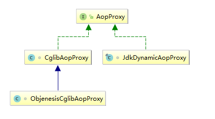

在上一篇文章中，我分析了 Spring 是如何为目标 bean 筛选合适的通知器的。现在通知器选好了，接下来就要通过代理的方式将通知器（Advisor）所持有的通知（Advice）织入到 bean 的某些方法前后。与筛选合适的通知器相比，创建代理对象的过程则要简单不少。

## 1、背景知识
### 1.1 proxy-target-class
在 Spring AOP 配置中，proxyTargetClass 属性可影响 Spring 生成的代理对象的类型。以注解配置为例，如下：
```java
@SpringBootApplication
@EnableAspectJAutoProxy(proxyTargetClass = true)
public class DemoApplication {
    // ...
}
```
如上，默认情况下 proxy-target-class 属性为 false。当目标 bean 实现了接口时，Spring 会基于 JDK 动态代理为目标 bean 创建代理对象。若未实现任何接口，Spring 则会通过 CGLIB 创建代理。而当 proxy-target-class 属性设为 true 时，则会强制 Spring 通过 CGLIB 的方式创建代理对象，即使目标 bean 实现了接口。
### 1.2 基于 JDK 的动态代理
基于 JDK 的动态代理主要是通过 JDK 提供的代理创建类 Proxy 为目标对象创建代理，下面我们来看一下 Proxy 中创建代理的方法声明。如下：
```java
public static Object newProxyInstance(ClassLoader loader,Class<?>[] interfaces,InvocationHandler h)
```
简单说一下上面的参数列表：
1. loader - 类加载器
2. interfaces - 目标类所实现的接口列表
3. h - 用于封装代理逻辑

JDK 动态代理对目标类是有一定要求的，即要求目标类必须实现了接口，JDK 动态代理只能为实现了接口的目标类生成代理对象。至于 InvocationHandler，是一个接口类型，定义了一个 invoke 方法。使用者需要实现该方法，并在其中封装代理逻辑。我们来试一下 JDK 动态代理的使用方式，如下：
目标类定义：
```java
public interface UserService {
    void save();

    void update();
}

public class UserServiceImpl implements UserService {
    @Override
    public void save() {
        System.out.println("save user info");
    }

    @Override
    public void update() {
        System.out.println("update user info");
    }
}
```
InvocationHandler 定义：
```java
public class JdkProxyCreator implements InvocationHandler {
    Object object;

    public JdkProxyCreator(Object object) {
        this.object = object;
    }

    @Override
    public Object invoke(Object proxy, Method method, Object[] args) throws Throwable {

        System.out.println(System.currentTimeMillis() + " - " + method.getName() + " method start");
        // 调用目标方法
        Object retVal = method.invoke(object, args);
        System.out.println(System.currentTimeMillis() + " - " + method.getName() + " method over");

        return retVal;
    }
}
```
如上，invoke 方法中的代理逻辑主要用于记录目标方法的调用时间，和结束时间。下面写点测试代码简单验证一下，如下：
```java
    public static void main(String[] args) {
        
        UserService userService = new UserServiceImpl();
        JdkProxyCreator jdkProxyCreator = new JdkProxyCreator(userService);
        UserService userServiceProxy = (UserService)Proxy.newProxyInstance(userService.getClass().getClassLoader(),
                userService.getClass().getInterfaces(), jdkProxyCreator);
        userServiceProxy.save();
        userServiceProxy.update();
    }
```
结果如下：
```
1553059153309 - save method start
save user info
1553059153309 - save method over
1553059153309 - update method start
update user info
1553059153309 - update method over
```
如上，可以看到我们的代码正常运行了。
### 1.3 基于 CGLIB 的动态代理
当我们要为未实现接口的类生成代理时，就无法使用 JDK 动态代理了。那么此类的目标对象生成代理时应该怎么办呢？当然是使用 CGLIB 了。在 CGLIB 中，代理逻辑是封装在 MethodInterceptor 实现类中的，代理对象则是通过 Enhancer 类的 create 方法进行创建。下面我来演示一下 CGLIB 创建代理对象的过程，如下：
目标类：
```java
public class UserService {
    public void save() {
        System.out.println("save user info");
    }

    public void update() {
        System.out.println("update user info");
    }
}
```
方法拦截器:
```java
public class UserMethodInterceptor implements MethodInterceptor {
    @Override
    public Object intercept(Object o, Method method, Object[] objects, MethodProxy methodProxy) throws Throwable {
        System.out.println(System.currentTimeMillis() + " - " + method.getName() + " method start");
        // 调用目标方法
        Object retVal = methodProxy.invokeSuper(o, objects);
        System.out.println(System.currentTimeMillis() + " - " + method.getName() + " method over");
        return retVal;
    }
}
```
测试类：
```java
    public static void main(String[] args) {
        UserService userService = new UserService();
        // 代理创建者
        Enhancer enhancer = new Enhancer();
        // 设置代理类的父类
        enhancer.setSuperclass(userService.getClass());
        // 设置代理逻辑
        enhancer.setCallback(new UserMethodInterceptor());
        // 创建代理对象
        UserService userServiceProxy = (UserService) enhancer.create();
        userServiceProxy.save();
        userServiceProxy.update();
    }
```
结果如下：
```java
1553060158279 - save method start
save user info
1553060158289 - save method over
1553060158289 - update method start
update user info
1553060158289 - update method over
```
如上，说明我的代理成功了。下面就开始源码的分析。
## 2、源码分析
为目标 bean 创建代理对象前，需要先创建 AopProxy 对象，然后再调用该对象的 getProxy 方法创建实际的代理类。我们先来看看 AopProxy 这个接口的定义，如下：
```java
public interface AopProxy {

    /** 创建代理对象 */
    Object getProxy();
    
    Object getProxy(ClassLoader classLoader);
}
```
在 Spring 中，有两个类实现了 AopProxy，如下：

Spring 在为目标 bean 创建代理的过程中，要根据 bean 是否实现接口，以及一些其他配置来决定使用 AopProxy 何种实现类为目标 bean 创建代理对象。下面我们就来看一下代理创建的过程，如下：
```java
protected Object createProxy(Class<?> beanClass, String beanName, Object[] specificInterceptors, TargetSource targetSource) {

    if (this.beanFactory instanceof ConfigurableListableBeanFactory) {
        AutoProxyUtils.exposeTargetClass((ConfigurableListableBeanFactory) this.beanFactory, beanName, beanClass);
    }

    ProxyFactory proxyFactory = new ProxyFactory();
    proxyFactory.copyFrom(this);

    // 默认配置下，或用户显式配置 proxyTargetClass = "false" 时，这里的 proxyFactory.isProxyTargetClass() 也为 false
    if (!proxyFactory.isProxyTargetClass()) {
        if (shouldProxyTargetClass(beanClass, beanName)) {
            proxyFactory.setProxyTargetClass(true);
        }
        else {
            // 检测 beanClass 是否实现了接口，若未实现，则将 proxyFactory 的成员变量 proxyTargetClass 设为 true 
            evaluateProxyInterfaces(beanClass, proxyFactory);
        }
    }

    // specificInterceptors 中若包含有 Advice，此处将 Advice 转为 Advisor
    Advisor[] advisors = buildAdvisors(beanName, specificInterceptors);
    proxyFactory.addAdvisors(advisors);
    proxyFactory.setTargetSource(targetSource);
    customizeProxyFactory(proxyFactory);

    proxyFactory.setFrozen(this.freezeProxy);
    if (advisorsPreFiltered()) {
        proxyFactory.setPreFiltered(true);
    }

    // 创建代理
    return proxyFactory.getProxy(getProxyClassLoader());
}

public Object getProxy(ClassLoader classLoader) {
    // 先创建 AopProxy 实现类对象，然后再调用 getProxy 为目标 bean 创建代理对象
    return createAopProxy().getProxy(classLoader);
}
```
getProxy 这里有两个方法调用，一个是调用 createAopProxy 创建 AopProxy 实现类对象，然后再调用 AopProxy 实现类对象中的 getProxy 创建代理对象。这里我们先来看一下创建 AopProxy 实现类对象的过程，如下：
```java
protected final synchronized AopProxy createAopProxy() {
    if (!this.active) {
        activate();
    }
    return getAopProxyFactory().createAopProxy(this);
}

public class DefaultAopProxyFactory implements AopProxyFactory, Serializable {

    @Override
    public AopProxy createAopProxy(AdvisedSupport config) throws AopConfigException {
        /*
         * 下面的三个条件简单分析一下：
         *
         *   条件1：config.isOptimize() - 是否需要优化，这个属性不常用
         *   条件2：config.isProxyTargetClass() - 检测 proxyTargetClass 的值，前面的代码会设置这个值
         *   条件3：hasNoUserSuppliedProxyInterfaces(config) - 目标 bean 是否实现了接口
         */
        if (config.isOptimize() || config.isProxyTargetClass() || hasNoUserSuppliedProxyInterfaces(config)) {
            Class<?> targetClass = config.getTargetClass();
            if (targetClass == null) {
                throw new AopConfigException("TargetSource cannot determine target class: " +
                        "Either an interface or a target is required for proxy creation.");
            }
            if (targetClass.isInterface() || Proxy.isProxyClass(targetClass)) {
                return new JdkDynamicAopProxy(config);
            }
            // 创建 CGLIB 代理，ObjenesisCglibAopProxy 继承自 CglibAopProxy
            return new ObjenesisCglibAopProxy(config);
        }
        else {
            // 创建 JDK 动态代理
            return new JdkDynamicAopProxy(config);
        }
    }
}
```
如上，DefaultAopProxyFactory 根据一些条件决定生成什么类型的 AopProxy 实现类对象。生成好 AopProxy 实现类对象后，下面就要为目标 bean 创建代理对象了。这里以 JdkDynamicAopProxy 为例，我们来看一下，该类的 getProxy 方法的逻辑是怎样的。如下：
```java
public Object getProxy() {
    return getProxy(ClassUtils.getDefaultClassLoader());
}

public Object getProxy(ClassLoader classLoader) {
    if (logger.isDebugEnabled()) {
        logger.debug("Creating JDK dynamic proxy: target source is " + this.advised.getTargetSource());
    }
    Class<?>[] proxiedInterfaces = AopProxyUtils.completeProxiedInterfaces(this.advised, true);
    findDefinedEqualsAndHashCodeMethods(proxiedInterfaces);
    
    // 调用 newProxyInstance 创建代理对象
    return Proxy.newProxyInstance(classLoader, proxiedInterfaces, this);
}
```
如上，请把目光移至最后一行有效代码上，会发现 JdkDynamicAopProxy 最终调用 Proxy.newProxyInstance 方法创建代理对象。到此，创建代理对象的整个过程也就分析完了，不知大家看懂了没。好了，关于创建代理的源码分析，就先说到这里吧。
## 3、总结
本篇文章对 Spring AOP 创建代理对象的过程进行了较为详细的分析，并在分析源码前介绍了相关的背景知识。总的来说，本篇文章涉及的技术点不是很复杂，相信大家都能看懂。限于个人能力，若文中有错误的地方，欢迎大家指出来。好了，本篇文章到此结束，谢谢阅读。