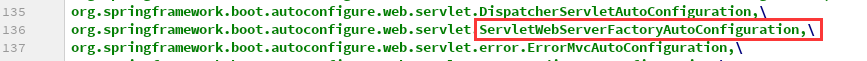
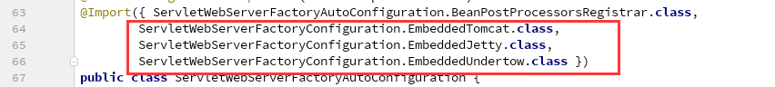
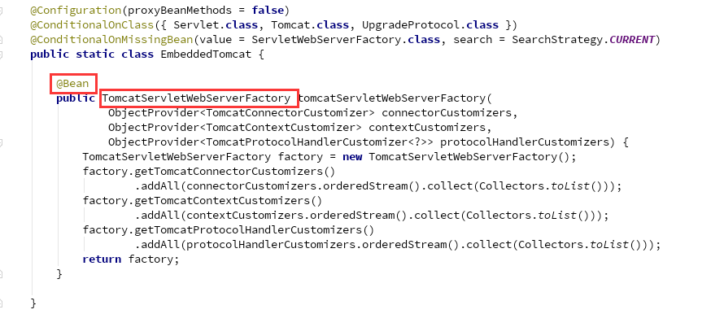
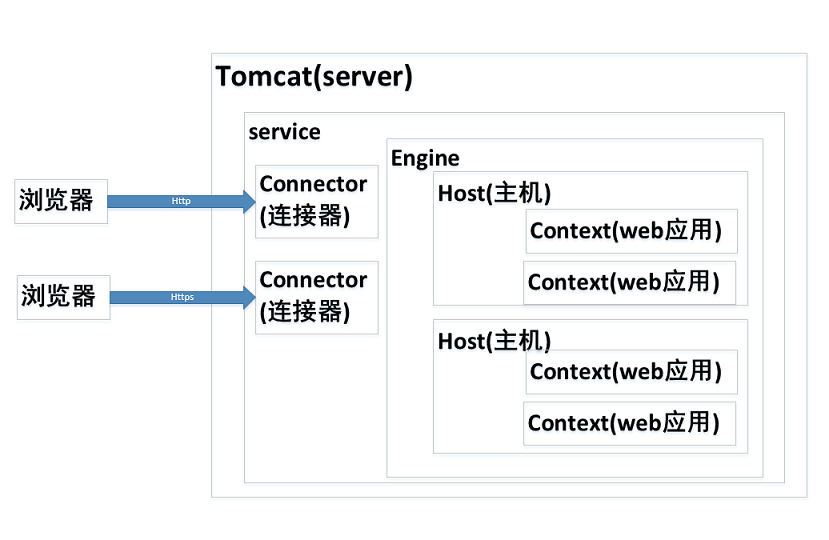
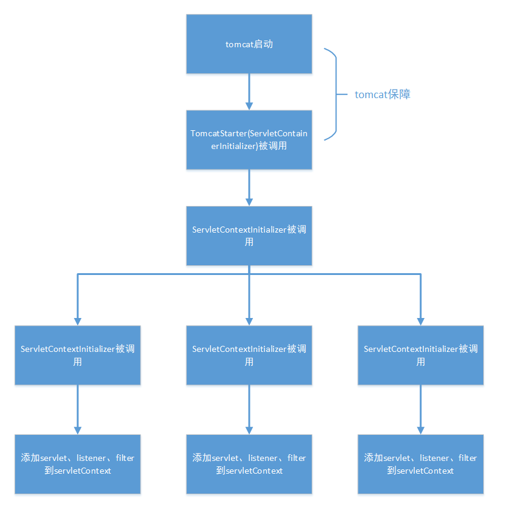

---
title: Spring Boot 源码浅析——内嵌容器
tags: 
	- Spring
toc: true
date: 2019-10-30 22:46:18
---
我们在[Spring Boot 源码浅析——起步依赖和自动配置](http://huzb.me/2019/07/04/Spring-Boot%E6%BA%90%E7%A0%81%E6%B5%85%E6%9E%90%E2%80%94%E2%80%94%E8%B5%B7%E6%AD%A5%E4%BE%9D%E8%B5%96%E5%92%8C%E8%87%AA%E5%8A%A8%E9%85%8D%E7%BD%AE/)中了解到 SpringBoot 的若干条特性，其中有一条就是内嵌的 Servlet 容器（默认是 tomcat）。这也是 SpringBoot 高效轻便的重要一环。这一章我们就来看看 SpringBoot 是如何启动内嵌的 Servlet 容器的。

## 1、推断应用类型

SpringBoot 在启动 Servlet 容器之前，首先会判断当前应用的类型，只有当前应用是一个网络应用时，SpringBoot 才会启动内嵌的 Servlet 容器。SpringBoot 推断应用类型的方式很巧妙，它并不需要用户在配置文件中去指定类型（毕竟 SpringBoot 的初衷就是无配置化），而是通过反射的方式去判断。

SpringBoot 把所有启动的流程封装在 SpringApplication 中，这是一个 SpringBoot 有而 Spring 没有的启动类。当我们启动 SpringBoot 时，首先会创建 SpringApplication 的实例：
```java
SpringTest
@SpringBootApplication
public class SpringTest {
    public static void main(String[] args){
        // 常见的启动方式
        ApplicationContext context =  SpringApplication.run(SpringTest.class,args);
    }
}
SpringApplication
public static ConfigurableApplicationContext run(Class<?>[] primarySources, String[] args) {
    // 创建 SpringApplication 实例，调用 run 方法
    return new SpringApplication(primarySources).run(args);
}
```
在 SpringApplication 的构造方法中，会对当前的引用类型进行推测：
```java
public SpringApplication(ResourceLoader resourceLoader, Class<?>... primarySources) {
    this.resourceLoader = resourceLoader;
    Assert.notNull(primarySources, "PrimarySources must not be null");
    this.primarySources = new LinkedHashSet<>(Arrays.asList(primarySources));
    // 推测当前应用类型
    this.webApplicationType = WebApplicationType.deduceFromClasspath();
    setInitializers((Collection) getSpringFactoriesInstances(ApplicationContextInitializer.class));
    setListeners((Collection) getSpringFactoriesInstances(ApplicationListener.class));
    this.mainApplicationClass = deduceMainApplicationClass();
}
```

SpringBoot 会调用 `deduceFromClasspath()` 方法来推测当前的应用类型。在 SpringBoot 中，应用有三种类型：REACTIVE、SERVLET 和 NONE。网络应用对应的类型是 SERVLET。推断类型的代码如下：

```java
WebApplicationType
static WebApplicationType deduceFromClasspath() {
    private static final String[] SERVLET_INDICATOR_CLASSES = { "javax.servlet.Servlet","org.springframework.web.context.ConfigurableWebApplicationContext" };
    // 判断是否为 REACTIVE
    if (ClassUtils.isPresent(WEBFLUX_INDICATOR_CLASS, null) && !ClassUtils.isPresent(WEBMVC_INDICATOR_CLASS, null)
            && !ClassUtils.isPresent(JERSEY_INDICATOR_CLASS, null)) {
        return WebApplicationType.REACTIVE;
    }
    // 判断是否为 NONE
    for (String className : SERVLET_INDICATOR_CLASSES) {
        if (!ClassUtils.isPresent(className, null)) {
            return WebApplicationType.NONE;
        }
    }
    // 默认为 SERVLET
    return WebApplicationType.SERVLET;
}
```
SpringBoot 通过 `ClassUtils.isPresent()` 来判断一个类在 classpath 中是否存在，只有当 `javax.servlet.Servlet`  和 `org.springframework.web.context.ConfigurableWebApplicationContext` 两个类在 classpath 中同时存在时 SpringBoot 才会推定当前应用类型为 SERVLET。

`ClassUtils.isPresent()` 内部通过反射的方式判断类是否存在：
```java
ClassUtils
public static boolean isPresent(String className, @Nullable ClassLoader classLoader) {
    try {
        // 尝试使用反射获取，如果获取不到会进入 catch 逻辑
        forName(className, classLoader);
        return true;
    }
    catch (IllegalAccessError err) {
        //...
        return false;
    }
}
```
那么 `javax.servlet.Servlet`  和 `org.springframework.web.context.ConfigurableWebApplicationContext` 什么时候存在呢？实际上我们只要导入 `spring-boot-starter-web` 这个包，这两个类就都存在了。因此，如果我们要以网络应用的方式启动 SpringBoot，只需要导入 `spring-boot-starter-web` 就好了。

## 2、按类型创建 Spring 容器

确定应用类型后，SpringBoot 开始创建 Spring 容器，也就是 ApplicationContext 的实例：

```java
SpringApplication
public ConfigurableApplicationContext run(String... args) {
    StopWatch stopWatch = new StopWatch();
    stopWatch.start();
    // context 的引用
    ConfigurableApplicationContext context = null;
    //...
    try {
        ApplicationArguments applicationArguments = new DefaultApplicationArguments(args);
        // 获取当前环境，根据应用类型决定
        ConfigurableEnvironment environment = prepareEnvironment(listeners, applicationArguments);
        configureIgnoreBeanInfo(environment);
        Banner printedBanner = printBanner(environment);
        // 创建 Spring 容器
        context = createApplicationContext();
        //...
    }
    //...
    return context;
}
```
SpringBoot 会按照当前应用类型创建容器：
```java
SpringApplication
protected ConfigurableApplicationContext createApplicationContext() {
    Class<?> contextClass = this.applicationContextClass;
    if (contextClass == null) {
        try {
            switch (this.webApplicationType) {
                // 如果是 SERVLET，创建 AnnotationConfigServletWebServerApplicationContext
                case SERVLET:
                    contextClass = Class.forName(DEFAULT_SERVLET_WEB_CONTEXT_CLASS);
                    break;
                // 如果是 REACTIVE，创建 AnnotationConfigReactiveWebServerApplicationContext
                case REACTIVE:
                    contextClass = Class.forName(DEFAULT_REACTIVE_WEB_CONTEXT_CLASS);
                    break;
                // 如果是 NONE，创建 AnnotationConfigApplicationContext
                default:
                    contextClass = Class.forName(DEFAULT_CONTEXT_CLASS);
            }
        }
        catch (ClassNotFoundException ex) {
            //...
        }
    }
    return (ConfigurableApplicationContext) BeanUtils.instantiateClass(contextClass);
}
```
当前为网络应用时，SpringBoot 会创建 AnnotationConfigServletWebServerApplicationContext 类型的容器。AnnotationConfigServletWebServerApplicationContext 会在 Spring 容器刷新时执行 `onRefresh()` 方法创建内嵌容器，会在 Spring 容器刷新结束后执行 `finishRefresh()` 方法启动内嵌容器：

```java
ServletWebServerApplicationContext
protected void onRefresh() {
    super.onRefresh();
    try {
        //创建内嵌容器
        createWebServer();
    }
    catch (Throwable ex) {
        throw new ApplicationContextException("Unable to start web server", ex);
    }
}

ServletWebServerApplicationContext
protected void finishRefresh() {
    super.finishRefresh();
    // 启动内嵌容器
    WebServer webServer = startWebServer();
    if (webServer != null) {
        publishEvent(new ServletWebServerInitializedEvent(webServer, this));
    }
}
```
## 3、注入 ServletWebServerFactory

和 SpringBoot 的大多数类一样，内嵌容器也是通过 SpringBoot 的自动配置机制注入到 Spring 容器中的。关于自动配置的部分之前的文章中已经有解析了（[Spring Boot 源码浅析——起步依赖和自动配置](http://huzb.me/2019/07/04/Spring-Boot%E6%BA%90%E7%A0%81%E6%B5%85%E6%9E%90%E2%80%94%E2%80%94%E8%B5%B7%E6%AD%A5%E4%BE%9D%E8%B5%96%E5%92%8C%E8%87%AA%E5%8A%A8%E9%85%8D%E7%BD%AE/)）。

在自动配置的过程中，SpringBoot 会向容器中注入一个 TomcatServletWebServerFactory 的特殊类，这个类的作用是在容器刷新时创建 tomcat 实例。我们来看一下这个类是怎么被 SpringBoot 发现然后扫描进来的。

在我们自动配置一章中有讲过，`spring-boot-autoconfigure` 包下的 spring.factories 文件中记录着自动配置所需要的配置类，其中和内嵌容器相关的叫 `ServletWebServerFactoryAutoConfiguration`：



在自动配置的过程中，SpringBoot 会引入这个配置类，而这个配置类中会引入三个内嵌容器类：



我们以 EmbeddedTomcat 为例，这个类也是一个配置类，内部以 @Bean 的方式定义了一个 TomcatServletWebServerFactory 的工厂类：



最终 TomcatServletWebServerFactory 这个内嵌容器的工厂类就会通过自动配置的方式注入到 Spring 容器中。

## 4、创建 tomcat 实例

在进入 tomcat 的创建逻辑前，我们先来了解一下 tomcat 内部的结构：



tomcat 是一个多级的目录结构，内部包含多个 host，一个 host 代表一台虚拟主机，每台虚拟主机对应一个域名；一个 host 内部包含多个 context，一个 context 代表一个 web 应用，每个 web 应用是由一个或者多个 servlet 组成的。所以在 tomcat 中，tomcat-host-context 是三级一对多的关系。tomcat 中还有很多 connector，每个 connector 监听一个端口。一个 tomcat 可以监听多个端口，由内部的转发机制将请求转发至不同应用。

SpringBoot 对应于一个 web 应用，所以在 SpringBoot 中会先创建一个 tomcat 实例，然后把自己作为 web 应用添加进去。SpringBoot 使用 WebServer 来表示一个容器实例，以 TomcatWebServer 为例：

```java
public class TomcatWebServer implements WebServer {

    private final Map<Service, Connector[]> serviceConnectors = new HashMap<>();
    // tomcat 实例
    private final Tomcat tomcat;

    private final boolean autoStart;
    // tomcat 状态
    private volatile boolean started;
    // 启动 tomcat
    void start() throws WebServerException{ //... }
    // 停止 tomcat
    void stop() throws WebServerException{ //... }

    int getPort(){ //... }
```
内部保存了一个 tomcat 实例并提供了启动和停止 tomcat 的方法。

当 Spring 容器在刷新时，会通过 refresh()->onRefresh()->createWebServer() 三层嵌套来调用 TomcatServletWebServerFactory 的 `getWebServer()` 方法获取 WebServer 实例：
```java
AbstractApplicationContext
public void refresh() throws BeansException, IllegalStateException {
    synchronized (this.startupShutdownMonitor) {
        prepareRefresh();
        ConfigurableListableBeanFactory beanFactory = obtainFreshBeanFactory();
        prepareBeanFactory(beanFactory);

        try {
            postProcessBeanFactory(beanFactory);

            invokeBeanFactoryPostProcessors(beanFactory);

            registerBeanPostProcessors(beanFactory);

            initMessageSource();

            initApplicationEventMulticaster();

            // 这里触发容器的 onRefresh() 方法
            onRefresh();

            registerListeners();

            finishBeanFactoryInitialization(beanFactory);

            finishRefresh();
        }
        //...
    }
}

ServletWebServerApplicationContext
protected void onRefresh() {
    super.onRefresh();
    try {
        // 这里创建 webServer 实例
        createWebServer();
    }
    catch (Throwable ex) {
        throw new ApplicationContextException("Unable to start web server", ex);
    }
}

ServletWebServerApplicationContext
private void createWebServer() {
    WebServer webServer = this.webServer;
    ServletContext servletContext = getServletContext();
    // 如果当前没有 webServer 实例，默认是没有的
    if (webServer == null && servletContext == null) {
        // 获取 ServletWebServerFactory，默认就是自动配置时注入的 TomcatServletWebServerFactory
        ServletWebServerFactory factory = getWebServerFactory();
        // 通过工厂类获取 webServer 实例
        this.webServer = factory.getWebServer(getSelfInitializer());
    }
    else if (servletContext != null) {
        try {
            getSelfInitializer().onStartup(servletContext);
        }
        catch (ServletException ex) {
            throw new ApplicationContextException("Cannot initialize servlet context", ex);
        }
    }
    initPropertySources();
}
```
可以看到，通过 refresh()->onRefresh()->createWebServer() 的调用链，SpringBoot 拿到了 WebServer 的工厂类，也就是我们在自动配置时注入的 TomcatServletWebServerFactory，然后通过这个 TomcatServletWebServerFactory 去获取 WebServer 实例。

下面我们着重来看一下 `getWebServer()` 的逻辑。在调用 `getWebServer()` 方法时，会首先通过 `getSelfInitializer()` 方法来拿到一个 ServletContextInitializer 对象：
```java
ServletWebServerApplicationContext
private org.springframework.boot.web.servlet.ServletContextInitializer getSelfInitializer() {
    return new ServletContextInitializer() {
        @Override
        public void onStartup(ServletContext servletContext) throws ServletException {
            prepareWebApplicationContext(servletContext);
            registerApplicationScope(servletContext);
            WebApplicationContextUtils.registerEnvironmentBeans(getBeanFactory(), servletContext);
            // 找到容器中所有其它的 ServletContextInitializer 的 bean，调用它们的 onStartup 方法
            for (ServletContextInitializer beans : getServletContextInitializerBeans()) {
                beans.onStartup(servletContext);
            }
        }
    };
}
```
内部返回了一个匿名对象，实际上就是一个 ServletContextInitializer 对象，这个 ServletContextInitializer 的作用很大，它会回调 Spring 容器中所有其它的 ServletContextInitializer 的 `onStartup()` 方法。

ServletContextInitializer 是连接 SpringBoot 和 tomcat 的桥梁：它们会被扫描进 Spring 容器中，同时每一个 ServletContextInitializer 中也保存了一个 JavaWeb 组件（servlet、listener、filter），当调用 `onStartup()` 方法时，它们会把自身持有的JavaWeb 组件添加到 tomcat 的 context 中。

以我们熟悉的 DispatcherServlet 为例，它由实现了 ServletContextInitializer 接口的 DispatcherServletRegistrationBean 注入到 context 中。在我们启动 SpringBoot 时，SpringBoot 会在容器中注入一个 DispatcherServletRegistrationBean，它的内部保存了一个 DispatcherServlet：
```java
@Configuration(proxyBeanMethods = false)
@Conditional(DispatcherServletRegistrationCondition.class)
@ConditionalOnClass(ServletRegistration.class)
@EnableConfigurationProperties(WebMvcProperties.class)
@Import(DispatcherServletConfiguration.class)
protected static class DispatcherServletRegistrationConfiguration {

    @Bean(name = DEFAULT_DISPATCHER_SERVLET_REGISTRATION_BEAN_NAME)
    @ConditionalOnBean(value = DispatcherServlet.class, name = DEFAULT_DISPATCHER_SERVLET_BEAN_NAME)
    public DispatcherServletRegistrationBean dispatcherServletRegistration(DispatcherServlet dispatcherServlet,
        WebMvcProperties webMvcProperties, ObjectProvider<MultipartConfigElement> multipartConfig) {
        // 创建 DispatcherServletRegistrationBean，传入了一个 DispatcherServlet
        DispatcherServletRegistrationBean registration = new DispatcherServletRegistrationBean(dispatcherServlet,webMvcProperties.
            getServlet().getPath());
        registration.setName(DEFAULT_DISPATCHER_SERVLET_BEAN_NAME);
        registration.setLoadOnStartup(webMvcProperties.getServlet().getLoadOnStartup());
        multipartConfig.ifAvailable(registration::setMultipartConfig);
        return registration;
    }

}
```
调用 `onStartup()` 方法时，会将 DispatcherServlet 添加到 servletContext 中：
```java
DispatcherServletRegistrationBean
// 为了展示直观，这里展开了父类的嵌套
public final void onStartup(ServletContext servletContext) throws ServletException {
    String description = getDescription();
    String name = getServletName();
    // 把当前持有的 servlet 加入到 servletContext 中
    DispatcherServlet registration = servletContext.addServlet(name, this.servlet);
    if (registration == null) {
        logger.info(StringUtils.capitalize(description) + " was not registered (possibly already registered?)");
        return;
    }
    configure(registration);
}
```
现在我们已经梳理出了一些环节：当 SpringBoot 获取 webServer 时，会往里面传入一个 ServletContextInitializer，这个 ServletContextInitializer 的 `onStartup()` 方法会回调其它 ServletContextInitializer 的 `onStartup()` 方法。而其它 ServletContextInitializer 的 `onStartup()` 方法会往 tomcat 的 context 里面添加组件。那么，第一个 ServletContextInitializer 是怎么被调用的呢？答案是由 TomcatStarter 调用。

SpringBoot 会通过 getWebServer()->prepareContext()->configureContext() 的调用链，将 ServletContextInitializer 层层传递，最终传递到 TomcatStarter 中，而 TomcatStarter 会被注册在 tomcat 的 context 中：
```java
TomcatServletWebServerFactory
public WebServer getWebServer(ServletContextInitializer... initializers) {
    //...
    // 这里调用 prepareContext()，传入的 initializers 就是通过 getSelfInitializer() 创建的 ServletContextInitializer
    prepareContext(tomcat.getHost(), initializers);
    return getTomcatWebServer(tomcat);
}
TomcatServletWebServerFactory
protected void prepareContext(Host host, ServletContextInitializer[] initializers) {
    //...
    // 这里调用 configureContext()，继续传递上层传入的 ServletContextInitializer
    configureContext(context, initializersToUse);
    postProcessContext(context);
}
protected void configureContext(Context context, ServletContextInitializer[] initializers) {
    // 创建一个 TomcatStarter，传入的 ServletContextInitializer 被保存在里面
    TomcatStarter starter = new TomcatStarter(initializers);
    if (context instanceof TomcatEmbeddedContext) {
        TomcatEmbeddedContext embeddedContext = (TomcatEmbeddedContext) context;
        embeddedContext.setStarter(starter);
        embeddedContext.setFailCtxIfServletStartFails(true);
    }
    // 将 TomcatStarter 保存在 tomcat 的 context 中
    context.addServletContainerInitializer(starter, NO_CLASSES);
    //...
}
```
TomcatStarter 是 ServletContainerInitializer 的实现类（注意 Servlet**Context**Initializer 和 Servlet**Container**Initializer 的区别，前者是由 Spring 定义的，后者是由 Tomcat 定义的）。ServletContainerInitializer 和 ServletContextInitializer 一样，都实现了 `onStartup()` 方法，tomcat 会在启动时回调这些 ServletContainerInitializer 的 `onStartup()` 方法，从而实现组件的动态添加。

Tomcat 会在启动时回调 TomcatStarter，而 TomcatStarter 在被回调时会调用传入的 ServletContextInitializer，这个 ServletContextInitializer 又会回调其它 ServletContextInitializer 的 `onStartup()` 方法，从而把用户自定义的组件添加到 tomcat 的 context 中。这些逻辑很拗口，因此我画了一张图来表示它们的关系：



最后，当 TomcatStarter 准备好后，SpringBoot 会通过 getWebServer()->getTomcatWebServer()->new TomcatWebServer()->initialize()->tomcat.start() 的调用链来调用 tomcat 的 `start()` 方法触发 TomcatStarter 的回调：
```java
TomcatServletWebServerFactory
public WebServer getWebServer(ServletContextInitializer... initializers) {
    //...
    prepareContext(tomcat.getHost(), initializers);
    // 这里调用 getTomcatWebServer()-
    return getTomcatWebServer(tomcat);
}
TomcatServletWebServerFactory
protected TomcatWebServer getTomcatWebServer(Tomcat tomcat) {
    // 这里调用 new TomcatWebServer()
    return new TomcatWebServer(tomcat, getPort() >= 0);
}
TomcatWebServer
public TomcatWebServer(Tomcat tomcat, boolean autoStart) {
    this.tomcat = tomcat;
    this.autoStart = autoStart;
    // 这里调用 initialize()
    initialize();
}
TomcatWebServer
private void initialize() throws WebServerException {
    synchronized (this.monitor) {
        try {
            //...

            // 调用 start() 触发 TomcatStarter 的回调
            this.tomcat.start();
            //...
        }
    }
}	
```
需要注意的是 tomcat.start() 只是触发 TomcatStarter，将用户自定义 JavaWeb 组件添加到 context 中，但此时并不能接收网络请求，因为还没有绑定端口。tomcat 真正能够接收请求是在 getConnector() 绑定端口之后。

## 5、启动内嵌容器

`createWebServer()` 方法创建了 tomcat 并且准备好了容器，接下来就是绑定端口正式接收请求。启动容器的触发点在 Spring 容器刷新完成后，Spring 容器会通过 finishRefresh()->start()->tomcat.getConnector() 的调用链启动容器，监听端口：
```java
AbstractApplicationContext
public void refresh() throws BeansException, IllegalStateException {
    synchronized (this.startupShutdownMonitor) {
        prepareRefresh();
        ConfigurableListableBeanFactory beanFactory = obtainFreshBeanFactory();
        prepareBeanFactory(beanFactory);

        try {
            postProcessBeanFactory(beanFactory);

            invokeBeanFactoryPostProcessors(beanFactory);

            registerBeanPostProcessors(beanFactory);

            initMessageSource();

            initApplicationEventMulticaster();

            onRefresh();

            registerListeners();

            finishBeanFactoryInitialization(beanFactory);

            // 这里触发容器的 finishRefresh() 方法
            finishRefresh();
        }
        //...
    }
}

ServletWebServerApplicationContext
protected void finishRefresh() {
    super.finishRefresh();
    WebServer webServer = this.webServer;
    // 这里调用 start()
    webServer.start();
    if (webServer != null) {
        publishEvent(new ServletWebServerInitializedEvent(webServer, this));
    }
}
TomcatWebServer
public void start() throws WebServerException {
    synchronized (this.monitor) {
        try{
            //...

            // 开始监听端口，接收网络请求
            Connector connector = this.tomcat.getConnector();
            //...
        }
    }
}
```
从这里开始，内嵌容器就被启动起来，开始监听端口，接收网络请求。

## 6、总结

这一章主要补全了之前缺失的 SpringBoot 启动过程中内嵌容器的启动过程。SpringBoot 的内嵌容器是一个很复杂的部分，这一章只是以 tomcat  为例，简单地走了一遍容器创建和启动的过程，当中的很多细节并没有深究。最后我们简单回顾一下内嵌容器的创建和启动过程：
- SpringBoot 用反射来确定当前应用的类型，并根据不同的应用类型创建不同的 Spring 容器。
- 对于网络应用 SpringBoot 会创建 AnnotationConfigServletWebServerApplicationContext，它会在 `onRefresh()` 时创建内嵌容器，在 `finishRefresh()` 时启动内嵌容器；
- SpringBoot 会在启动时自动注入一个 ServletWebServerFactory 的工厂类（比如 TomcatServletWebServerFactory、JettyServletWebServerFactory），这些工厂类封装了创建内嵌容器的逻辑；
- SpringBoot 会在 `onRefresh()` 时创建内嵌容器，创建的时候不仅会创建容器本身，还会通过 Servlet3.0 的动态注册机制往容器中注册用户自定义的 Servlet、listener、filter 等组件；
- 动态注册的机制借助了 ServletContextInitializer 这个连接 SpringBoot 和 tomcat 的桥梁，它的回调方法可以把用户自定义的组件注册到 tomcat 的 context 中。SpringBoot 会在 `onRefresh()` 时通过调用 `tomcat.start()` 方法触发这些回调，回调后内嵌容器中的所有组件已经准备好，但尚无法接收网络请求；
- SpringBoot 会在 `finishRefresh()` 时通过调用 `tomcat.getConnector()` 方法监听端口，接收网络请求，此时内嵌容器正式启动。

## 7、参考资料
[精尽 Spring MVC 源码分析 —— 容器的初始化（四）之 Spring Boot 集成](http://svip.iocoder.cn/Spring-MVC/context-init-integration-with-SpringBoot/)
[精尽 Spring Boot 源码分析 —— ServletWebServerApplicationContext](http://svip.iocoder.cn/Spring-Boot/ServletWebServerApplicationContext/)
[四张图带你了解Tomcat系统架构](https://blog.csdn.net/xlgen157387/article/details/79006434)
