---
title: Spring Boot 源码浅析——起步依赖和自动配置
date: 2019-07-04 15:28:45
tags: 
	- Spring
toc: true
---
从根本上来讲 Spring Boot 就是一些库的集合，是一个基于“约定优于配置”的原则，快速搭建应用的框架。本质上依然是 Spring，在这之上帮我们省去了很多样板化的配置，使得我们能够更专注于应用程序功能的开发。

Spring Boot 将很多魔法带入了 Spring 应用程序的开发之中，其中最重要的是以下四个核心：
- 自动配置：Spring Boot 会基于你的 classpath 中的 jar 包，试图猜测和配置你可能需要的 bean。
- 起步依赖：本质上是一个 Maven 项目对象模型，定义了对其他库的传递依赖，这些东西加在一起即支持某项功能（比如 mybatis-spring-boot-starter 中整合了 jdbc、mybatis、spring-mybatis 等多种依赖，这些依赖共同提供了 mybatis 这一功能）。
- 内置容器：嵌入了 Tomcat、Jetty 等 Servlet 容器，应用可以不用打包成 War 格式，而是可以直接以 Jar 格式运行。
- 应用监控：提供了一整套的对应用状态的监控与管理的功能模块（通过引入 spring-boot-starter-actuator），包括应用的线程信息、内存信息、应用是否处于健康状态等，为了满足更多的资源监控需求。

本文主要讲述自动配置和起步依赖这两个特性的实现原理，这两个特性也是 Spring Boot 开箱即用的重要保证。**所谓开箱即用是指，在 Spring Boot 中，对于大部分的功能（比如 web、mybatis、redis 等），只需要引入一个 starter 包和少量的配置就能使用**，不需要像以前一样引入很多 jar 包->注入很多 bean->在 bean 中配置很多属性。

我们通过对比在 Spring 中引入 Mybatis 的流程来说明这两个特性带来的开发体验提升。

## 一、原生 Spring 引入 Mybatis
回忆一下，在原生 Spring 中引入 Mybatis 的步骤：

**1、引入 jar 包**

```xml
<!-- MyBatis依赖 -->
<dependency>
    <groupId>org.mybatis</groupId>
    <artifactId>mybatis</artifactId>
    <version>3.4.0</version>
</dependency>
<!-- MyBatis自身实现的spring整合依赖 -->
<dependency>
    <groupId>org.mybatis</groupId>
    <artifactId>mybatis-spring</artifactId>
    <version>1.3.0</version>
</dependency>
<!-- 引入数据源 -->
<dependency>
      <groupId>org.springframework</groupId>
      <artifactId>spring-jdbc</artifactId>
      <version>${spring.version}</version>
</dependency>
```

**2、配置和注入 bean**

首先配置 DataSource：
```xml
<bean id="dataSource" class="org.springframework.jdbc.datasource.DriverManagerDataSource">
    <property name="driverClassName">
        <value>${driver}</value>
    </property>
    <property name="url">
        <value>${url}</value>
    </property>
    <property name="username">
        <value>${username}</value>
    </property>
    <property name="password">
        <value>${password}</value>
    </property>
</bean>
```
然后配置 SqlSessionFactory 并将 DataSource 注入：

```xml
<bean id="sqlSessionFactory" class="org.mybatis.spring.SqlSessionFactoryBean">
    <property name="dataSource" ref="dataSource"/>
    <property name="mapperLocations" value="classpath:config/mybatis/mapper/*.xml"/>
    <property name="configLocation" value="classpath:config/mybatis/mybatis-configuration.xml"/>
</bean>
```
最后配置自动扫描，将 Mapper 接口生成的代理注入到 Spring：

```xml
<bean class="org.mybatis.spring.mapper.MapperScannerConfigurer">
  <property name="basePackage" value="org.mybatis.spring.sample.mapper" />
</bean>
```

## 二、起步依赖

起步依赖通过把同一功能下的大量 jar 包封装成一个 starter 包的形式降低了依赖的复杂度。

在 Spring Boot 中，我们只需要引入一个 mybatis-spring-boot-starter 包就可以引入 Mybatis 所需的所有 jar 包（左边原生，右边 Spring Boot）：

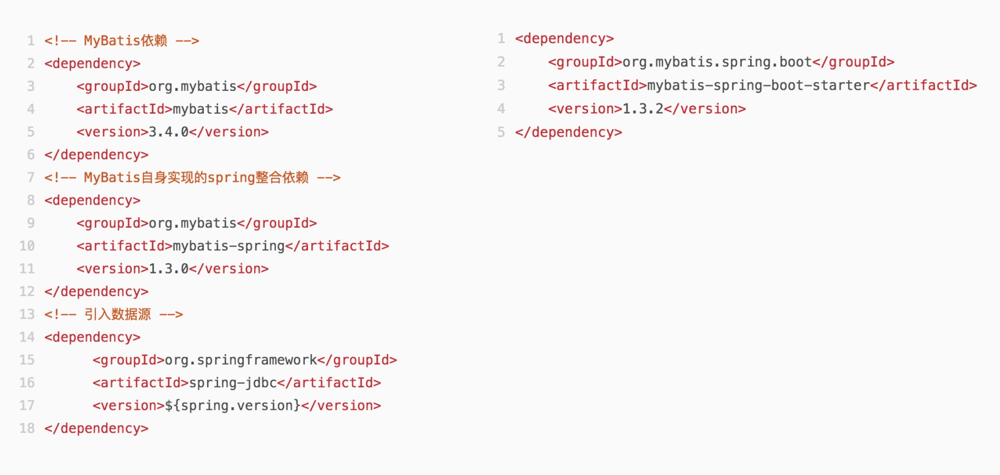

这样做的好处有两个，第一是将包按照功能整合后，减少了 pom 文件的复杂度，而且 starter 包表意明确，一般是一个功能对应一个包，不需要开发人员记忆大量的包依赖；第二是版本号管理，当我们需要为项目添加一个新的依赖时，不需要再去纠结选择的版本号是否合适，因为 Spring Boot 官方提供的起步依赖都和 Spring Boot 版本紧密相连，为我们传递的第三方依赖是经过足够测试后敲定下来最合适的版本。

那么这个功能是怎么实现的呢？我们点击 mybatis-spring-boot-starter 进去，发现里面是一些包的集合：

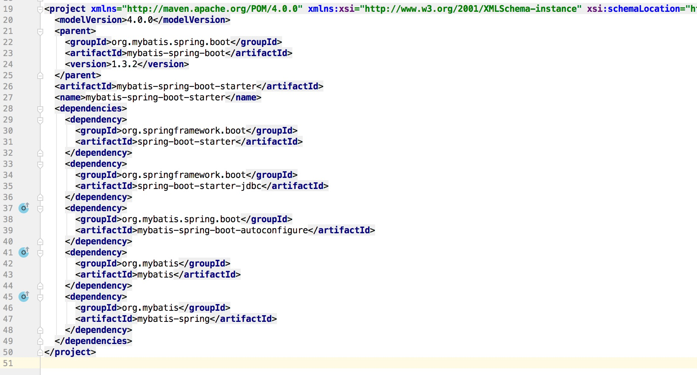

所以起步依赖就是将用于实现某个功能的 jar 包统一整合进 starter 包中，我们需要引入某个功能的时候，直接引入该 starter 包就行了。当然，整合进 starter 包的 jar 包都是经过足够测试敲定下来的，这也避免了某些版本的包不兼容的情况。

## 三、自动配置

在原生方式中，引入 jar 包后我们还要进行 bean 的配置和注入，而在 Spring Boot 中，我们只需要在全局的配置文件 application.properties 中加几行就行：

```text
spring.datasource.driverClassName = com.mysql.jdbc.Driver
spring.datasource.url = jdbc:mysql://127.0.0.1:3306/mybatis_test
spring.datasource.username = root
spring.datasource.password = root
```

相比于原生的方式，Spring Boot 中不再需要手动注入 dataSource 和 sqlSessionFactory 等相关的 bean，那么这些 bean 是在哪里被配置并且注入的呢？

### 1、基于注解的 bean 配置

以 Mybatis 为例，我们发现 mybatis-spring-boot-starter 这个包帮我们引入了 mybatis-spring-boot-autoconfigure 这个包，如下图：

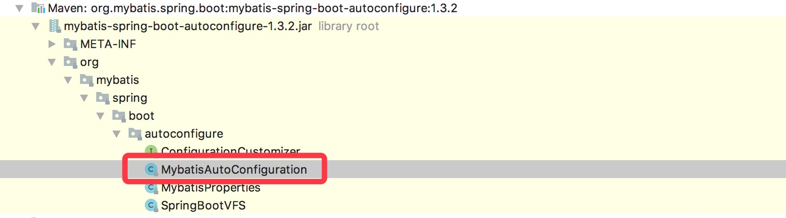

里面有 MybatisAutoConfiguration 这个类，打开这个类看看有什么东西：

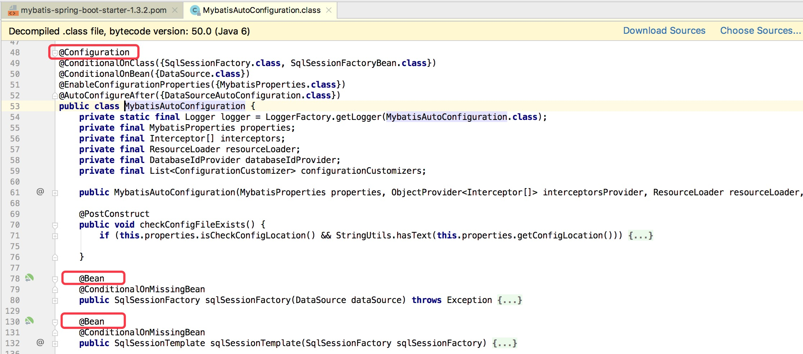

熟悉 @Configuration、@Bean 这两个注解的同学或许已经知道了，这两个注解一起使用就可以创建一个基于 java 代码的配置类，可以用来替代相应的 xml 配置文件。

### 2、bean 参数获取

我们看到了 bean 配置的地方，但是还没有看到 Spring Boot 是如何读取 application.properties 这个配置文件的。

在 DataSourceAutoConfiguration 类里面，我们注意到使用了 @EnableConfigurationProperties 这个注解：

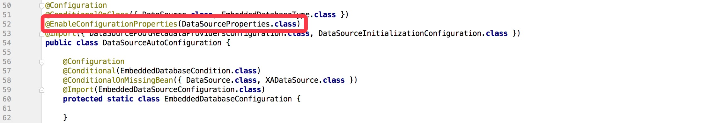

DataSourceProperties 中封装了数据源的各个属性，且使用了注解 @ConfigurationProperties 指定了配置文件的前缀，这个注解会自动去寻找 application.properties 这个文件中前缀为指定前缀的配置项，并把值注入到配置类的同名属性中：

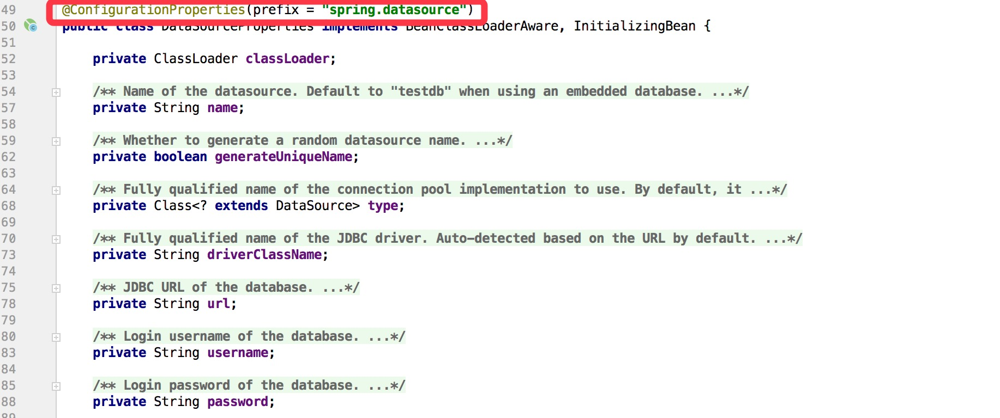

最后这个 DataSourceProperties 被 Spring Boot 默认的数据源 HikariDataSource 使用：

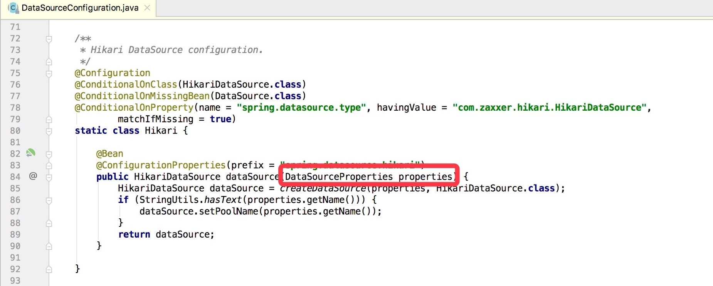

到这里我们可以总结出：application.properties 中的配置通过 @ConfigurationProperties 注解被读取到相应的配置类中，这些配置类又被各种 bean 读取，最终把配置传递到实际的 bean 中。

### 3、bean 发现

Spring Boot 默认扫描启动类所在的包下的主类与子类的所有组件，但并没有包括依赖包的中的类，那么依赖包中的 bean 是如何被发现的呢？

这就要从 @SpringBootApplication 这个注解说起了。我们通常在启动类中加 @SpringBootApplication 这个注解：


点进去看：

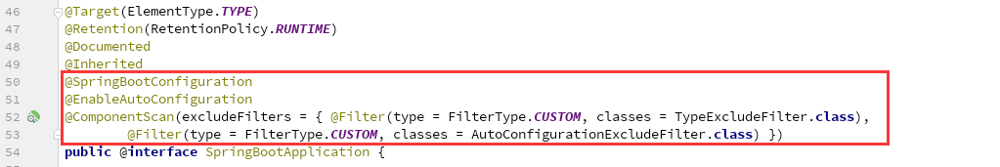

实际上重要的注解只有三个：
- @Configuration 的作用我们已经知道了，被注解的类将成为一个 bean 配置类。
- @ComponentScan 的作用我们也比较熟悉，自动扫描并加载符合条件的组件。
- **@EnableAutoConfiguration** 这个注解的功能很重要，它借助 @Import 的支持，收集和注册依赖包中相关的 bean 定义，这也是自动配置的关键所在。

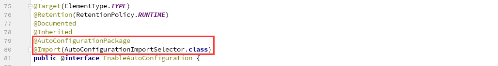

如上源码，@EnableAutoConfiguration 注解引入了 @AutoConfigurationPackage 和 @Import 这两个注解。

@AutoConfigurationPackage 这个注解不是本文的重点，但也跟自动配置相关。这个注解要放在配置类上，会把当前配置类所在的包名放进一个全局的数组里。这些包名会被 org.springframework.boot.autoconfigure 下的一些配置类扫描，从而进行自动配置。这个功能看上去跟 @ComponentScan 有点像，但两者是有很大区别的：@ComponentScan 是 Spring Core 下的注解，作用是扫描到标记 @Component 的类然后将其加入 Spring 容器；@AutoConfigurationPackage 是 Spring Boot 下的注解，作用是为 org.springframework.boot.autoconfigure 下的一些配置类提供扫描的路径，但具体的行为由配置类自己决定。

回到正题，我们实际要关心的是 @Import 这个注解。这个注解注入了一个类型为 AutoConfigurationImportSelector 的 bean，先看这个类的继承关系：

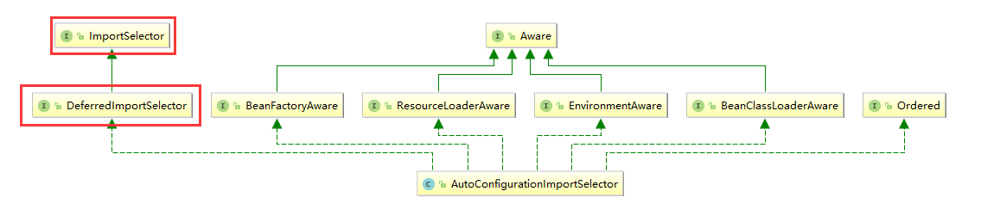

特别关注红框框起来的两个接口：ImportSelector 和 DeferredImportSelector。Spring 允许用户在配置类中使用 @Import 自行导入所需的类，而 @Import 有四种用法：
- 1、导入一个普通类。
- 2、导入一个标记了 @Configuration 的类，将该类以实例工厂的方式导入标记 @Bean 的方法的返回值。
- 3、导入一个 ImportBeanDefinitionRegistrar 的子类，该类可以获取到当前配置类（@Import 所在的类一定是配置类）的元数据信息，比如类全名和所在的包名，然后进行一些自定义的 bean 注册（上文的 @AutoConfigurationPackage 就是通过这种方式实现的）。
- 4、**导入一个 ImportSelector 的子类**，该类的 selectImports 方法返回一个类全名的数组，根据返回的类全名会注册相应的 bean。

**自动配置导入依赖包的中的类所用的方法就是 ImportSelector 这种方法。**

如继承关系图所示，AutoConfigurationImportSelector 实现了 DeferredImportSelector 接口，而 DeferredImportSelector 是 ImportSelector 的子接口。DeferredImportSelector 和 ImportSelector 的区别在于执行的时机。 ImportSelector 实例的 selectImports 方法的执行时机在 @Configuration 注解中的其他逻辑（@ImportResource、@Bean）被处理之前；而 DeferredImportSelector 实例的 selectImports 方法的执行时机则是在 @Configguration 注解中的其他逻辑被处理完毕之后：

```java
class ConfigurationClassParser {
    // ...
    public void parse(Set<BeanDefinitionHolder> configCandidates) {
        for (BeanDefinitionHolder holder : configCandidates) {
            BeanDefinition bd = holder.getBeanDefinition();
            try {
                if (bd instanceof AnnotatedBeanDefinition) {
                    parse(((AnnotatedBeanDefinition) bd).getMetadata(), holder.getBeanName());
                }
                else if (bd instanceof AbstractBeanDefinition && ((AbstractBeanDefinition) bd).hasBeanClass()) {
                    parse(((AbstractBeanDefinition) bd).getBeanClass(), holder.getBeanName());
                }
                else {
                    parse(bd.getBeanClassName(), holder.getBeanName());
                }
            }
            catch (BeanDefinitionStoreException ex) {
                throw ex;
            }
            catch (Throwable ex) {
                throw new BeanDefinitionStoreException(
                        "Failed to parse configuration class [" + bd.getBeanClassName() + "]", ex);
            }
        }
        // DeferredImportSelector 的执行时机在其它所有逻辑执行之后
        this.deferredImportSelectorHandler.process();
    }
   // ...
}
```
那么自动配置为什么要使用 DeferredImportSelector 而不是 ImportSelector 呢？这是因为在自动配置的时候需要通过判断容器中有没有特定的 bean 来判断一个配置类是否要被注册，如果自动配置的逻辑在其它逻辑之前，此时容器中注册的 bean 还不全，会导致该注册的配置类没有被注册，因此自动配置要在其它逻辑之后。

现在我们来看一下 AutoConfigurationImportSelector 的 selectImports 方法：
```java
public class AutoConfigurationImportSelector implements DeferredImportSelector, BeanClassLoaderAware, ResourceLoaderAware, BeanFactoryAware, EnvironmentAware, Ordered {
    private static final String[] NO_IMPORTS = new String[0];
    
    // ...
    // 实现 DeferredImportSelector 接口的 selectImports 方法
    @Override
    public String[] selectImports(AnnotationMetadata annotationMetadata) {
        if(!this.isEnabled(annotationMetadata)) {
            return NO_IMPORTS;
        } else {
            AutoConfigurationMetadata autoConfigurationMetadata = AutoConfigurationMetadataLoader
                .loadMetadata(this.beanClassLoader);
            AnnotationAttributes attributes = this.getAttributes(annotationMetadata);
            // 获取所有自动配置的配置类列表（核心）
            List<String> configurations = this.getCandidateConfigurations(annotationMetadata, attributes);
            // 去除重复的配置类
            configurations = this.removeDuplicates(configurations);
            // 获取应该被排除的配置类列表
            Set exclusions = this.getExclusions(annotationMetadata, attributes);
            this.checkExcludedClasses(configurations, exclusions);
            // 排除所有应该被排除的配置类
            configurations.removeAll(exclusions);
            // 筛选，选出满足条件的配置类（核心）
            configurations = this.filter(configurations, autoConfigurationMetadata);
            this.fireAutoConfigurationImportEvents(configurations, exclusions);
            // 返回列表
            return StringUtils.toStringArray(configurations);
        }
    }

    // ...

    protected List<String> getCandidateConfigurations(AnnotationMetadata metadata, AnnotationAttributes attributes) {
        // 从 classpath 目录下所有的 jar 包中读取 META-INF/spring.factories 文件信息，获取配置类列表
        List<String> configurations = SpringFactoriesLoader.loadFactoryNames(EnableAutoConfiguration.class,
            this.getBeanClassLoader());
        return configurations;
    }
}
```

AutoConfigurationImportSelector 下的 getCandidateConfigurations 会返回所有自动配置的配置类列表，这主要借助于一个 Spring 内部的工具类 SpringFactoriesLoader 来实现。SpringFactoriesLoader 的 loadFactoryNames 方法会从 classpath 目录下所有的 jar 包中读取 META-INF/spring.factories 文件信息，然后从中选出 key 为传入类的类全名的 value，将 value 合并成一个列表返回：

```java
public static List<String> loadFactoryNames(Class<?> factoryClass, @Nullable ClassLoader classLoader) {
    // 获取类全名
    String factoryClassName = factoryClass.getName();
    // loadSpringFactories 方法从 classpath 目录下所有的 jar 包中读取 META-INF/spring.factories 文件信息，
    // 解析为 Map，然后从中选出 key 为 factoryClassName 的 value，将 value 合并成一个 List。
    return loadSpringFactories(classLoader).getOrDefault(factoryClassName, Collections.emptyList());
}

private static Map<String, List<String>> loadSpringFactories(@Nullable ClassLoader classLoader) {
    MultiValueMap<String, String> result = cache.get(classLoader);
    if (result != null) {
        return result;
    }
    try {
        // 文件路径为 "META-INF/spring.factories"
        Enumeration<URL> urls = (classLoader != null ?
                classLoader.getResources("META-INF/spring.factories") :
                ClassLoader.getSystemResources("META-INF/spring.factories"));
        result = new LinkedMultiValueMap<>();
        while (urls.hasMoreElements()) {
            URL url = urls.nextElement();
            UrlResource resource = new UrlResource(url);
            Properties properties = PropertiesLoaderUtils.loadProperties(resource);
            for (Map.Entry<?, ?> entry : properties.entrySet()) {
                String factoryClassName = ((String) entry.getKey()).trim();
                for (String factoryName : StringUtils.commaDelimitedListToStringArray((String) entry.getValue())) {
                    result.add(factoryClassName, factoryName.trim());
                }
            }
        }
        cache.put(classLoader, result);
        return result;
    }
    catch (IOException ex) {
        throw new IllegalArgumentException("...", ex);
    }
}
```
最终 AutoConfigurationImportSelector 获取的是 classpath 目录下所有 META-INF/spring.factories 文件中 key 为 org.springframework.boot.autoconfigure.EnableAutoConfiguration 的 value 合并而成的一个列表。

我们来简单看一下位于 spring-boot-autoconfigure-2.1.6.RELEASE.jar 包下的 META-INF/spring.factories 文件：

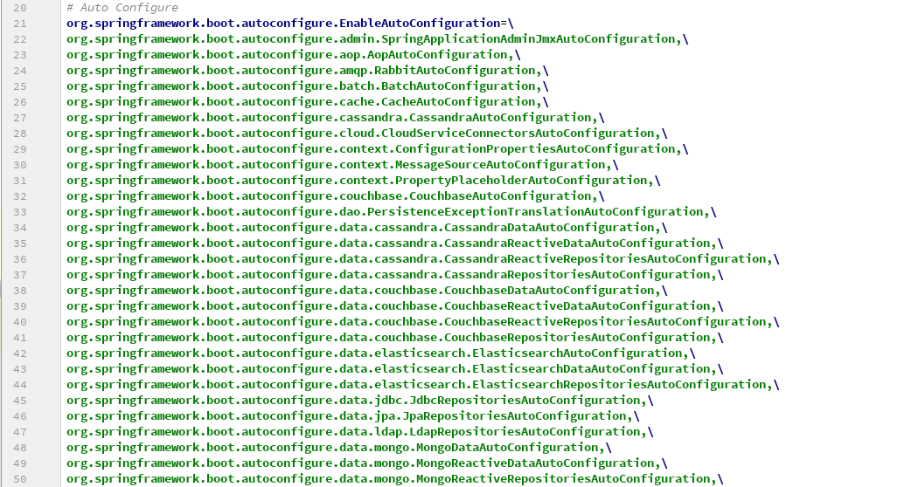

发现里面罗列了很多配置类，那么这些配置类在哪呢？其实同样也在 spring-boot-autoconfigure-2.1.6.RELEASE.jar 这个包里面：

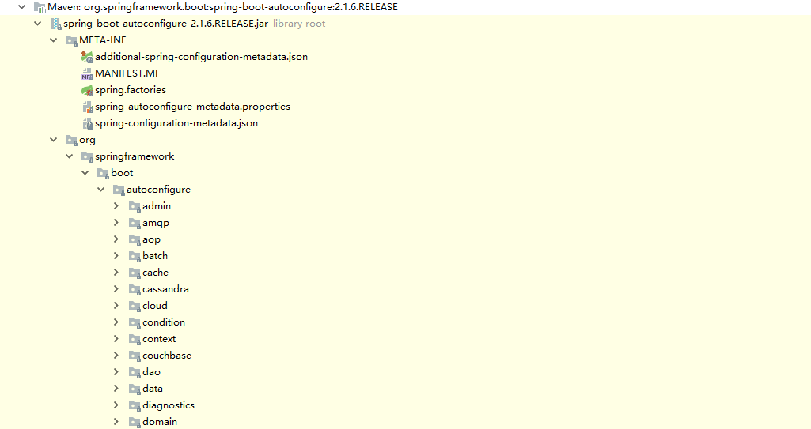

### 4、bean 筛选

上文我们看到 META-INF/spring.factories 下的配置类还是挺多的，里面有 aop、amp、jdbc、mongo 等等。这些配置类几乎涵盖了 Java 中常用的所有功能。我们当然不需要那么多的功能，那么 Spring Boot 又是如何对这些配置类做筛选的呢？

答案是 @ConditionalOnXXX 这类注解。这是 Spring Boot 特有的用于做条件筛选的注解，常见的有：

|注解|作用|
| --- | --- |
|@ConditionalOnBean|仅在容器存在某个 bean 时，才会实例化这个 Bean|
|@ConditionalOnClass|某个 class 位于类路径上，才会实例化这个 Bean|
|@ConditionalOnExpression|当表达式为 true 的时候，才会实例化这个 Bean|
|@ConditionalOnMissingBean|仅在容器不存在某个 Bean 时，才会实例化这个 Bean|
|@ConditionalOnMissingClass|某个 class 在类路径上不存在的时候，才会实例化这个 Bean|
|@ConditionalOnNotWebApplication|不是 web 应用时才会实例化这个 Bean|

我们以 MybatisAutoConfiguration 为例，看一下导入这个配置类的条件：


可以看到要完成 Mybatis 的自动配置，需要在类路径中存在 SqlSessionFactory.class、SqlSessionFactoryBean.class 这两个类，同时需要在容器中存在 DataSource 这个 Bean。

那么这个功能是如何实现的呢？我们找到了 AutoConfigurationImportSelector 下的 filter 方法，这里会对从 spring.factories 读出来的配置类列表进行过滤：

```java
private List<String> filter(List<String> configurations, AutoConfigurationMetadata autoConfigurationMetadata) {
    String[] candidates = StringUtils.toStringArray(configurations);
    boolean[] skip = new boolean[candidates.length];
    boolean skipped = false;
    // 调用各个过滤器，对配置列表进行筛选操作
    for (AutoConfigurationImportFilter filter : getAutoConfigurationImportFilters()) {
        invokeAwareMethods(filter);
        boolean[] match = filter.match(candidates, autoConfigurationMetadata);
        for (int i = 0; i < match.length; i++) {
            if (!match[i]) {
                skip[i] = true;
                candidates[i] = null;
                skipped = true;
            }
        }
    }
    if (!skipped) {
        return configurations;
    }
    List<String> result = new ArrayList<>(candidates.length);
    for (int i = 0; i < candidates.length; i++) {
        if (!skip[i]) {
            result.add(candidates[i]);
        }
    }

    return new ArrayList<>(result);
}
```

可以看到 filter 方法会调用各个 AutoConfigurationImportFilter 的 match 方法对配置列表进行筛选，具体的筛选逻辑由各个过滤器实现。我们找到一个名为 OnClassCondition 的过滤器，从名字可以看出这是负责 @ConditionalOnClass 注解的过滤器：

```java
@Order(Ordered.HIGHEST_PRECEDENCE)
class OnClassCondition extends FilteringSpringBootCondition {
    @Override
    public boolean[] match(String[] autoConfigurationClasses, AutoConfigurationMetadata autoConfigurationMetadata) {
        ConditionEvaluationReport report = ConditionEvaluationReport.find(this.beanFactory);
        // 获取每个配置类的筛选结果
        ConditionOutcome[] outcomes = getOutcomes(autoConfigurationClasses, autoConfigurationMetadata);
        boolean[] match = new boolean[outcomes.length];
        for (int i = 0; i < outcomes.length; i++) {
            // 结果为空或者为 true 表示通过，否则不通过
            match[i] = (outcomes[i] == null || outcomes[i].isMatch());
            if (!match[i] && outcomes[i] != null) {
                logOutcome(autoConfigurationClasses[i], outcomes[i]);
                if (report != null) {
                    report.recordConditionEvaluation(autoConfigurationClasses[i], this, outcomes[i]);
                }
            }
        }
        return match;
    }

    @Override
    protected final ConditionOutcome[] getOutcomes(String[] autoConfigurationClasses,
                                                   AutoConfigurationMetadata autoConfigurationMetadata) {
        // Split the work and perform half in a background thread. Using a single
        // additional thread seems to offer the best performance. More threads make
        // things worse
        // 这里是将配置类的筛选工作分成两部分进行，一半在当前线程，一半在新的线程，提高筛选效率
        int split = autoConfigurationClasses.length / 2;
        // 前一半配置类在新的线程筛选
        OutcomesResolver firstHalfResolver = createOutcomesResolver(autoConfigurationClasses, 0, split,
                                                                    autoConfigurationMetadata);
        // 后一半配置类在当前线程筛选
        OutcomesResolver secondHalfResolver = new StandardOutcomesResolver(autoConfigurationClasses, split,
                                                                           autoConfigurationClasses.length, autoConfigurationMetadata, getBeanClassLoader());
        // 进行实际的筛选
        ConditionOutcome[] secondHalf = secondHalfResolver.resolveOutcomes();
        ConditionOutcome[] firstHalf = firstHalfResolver.resolveOutcomes();
        // 合并筛选结果
        ConditionOutcome[] outcomes = new ConditionOutcome[autoConfigurationClasses.length];
        System.arraycopy(firstHalf, 0, outcomes, 0, firstHalf.length);
        System.arraycopy(secondHalf, 0, outcomes, split, secondHalf.length);
        return outcomes;
    }
}
```
这里过滤器会按照给定的配置类列表，返回一个结果列表，如果某一个配置类对应的结果为空或者为 true，则表示通过，否则表示不通过。为了提高筛选的效率，配置列表被分成两部分，在两个线程中筛选。我们进入实际筛选的代码：

```java
private ConditionOutcome[] getOutcomes(String[] autoConfigurationClasses, int start, int end,
                                       AutoConfigurationMetadata autoConfigurationMetadata) {
    ConditionOutcome[] outcomes = new ConditionOutcome[end - start];
    // 对每个配置类分别处理
    for (int i = start; i < end; i++) {
        String autoConfigurationClass = autoConfigurationClasses[i];
        if (autoConfigurationClass != null) {
            // 获取 @ConditionalOnClass 注解的属性
            // 属性的值是一串以","区隔的该配置类所依赖的类路径上的 class 集合的字符串
            String candidates = autoConfigurationMetadata.get(autoConfigurationClass, "ConditionalOnClass");
            if (candidates != null) {
                // 分两种情况，包含","的表示有多个class，依次处理；不包含","表示单个class，直接处理
                // 单个class的情况
                if (!candidates.contains(",")) {
                    // 检查类路径下是否存在该 class
                    outcomes[i - start] = getOutcome(candidates, this.beanClassLoader);
                }
                // 多个class的情况
                else{
                    // 检查类路径下是否存在所有这些 class
                    for (String candidate : StringUtils.commaDelimitedListToStringArray(candidates)) {
                        ConditionOutcome outcome = getOutcome(candidate, this.beanClassLoader);
                        if (outcome != null) {
                            outcomes[i - start] = outcome;
                            break;
                        }
                    }
                }
            }
        }
    }
    return outcomes;
}
```
我们看到实际筛选中，会对每个配置类分别处理，处理的方式是拿到该配置类上 @ConditionalOnClass 注解的属性，属性的值是一串以 `,` 区隔的该配置类所依赖的类路径上的 class 集合的字符串，过滤器会检查这些 class 是否都存在于类路径下：
```java
private ConditionOutcome getOutcome(String className, ClassLoader classLoader) {
    try{
        // 如果存在于类路径下，forName不会抛出异常；如果不存在，会抛异常
        forName(className, classLoader);
        // 检测通过，返回 null
        return null;
    }
    catch (Throwable ex) {
        // 检测不通过，返回结果为 false 的 ConditionOutcome
        return new ConditionOutcome(false, ConditionMessage.forCondition(ConditionalOnClass.class)
                                                .didNotFind("required class").items(Style.QUOTE, className));
    }
}
```
这里使用反射包下的 `forName` 方法检测 class 是否存在于类路径下，如果存在于类路径下，forName不会抛出异常；如果不存在，会抛出异常。如果检测通过，返回 null；如果检测不通过，返回结果为 false 的 ConditionOutcome。从上文我们知道，match 方法中，ConditionOutcome 为空或者为 true 都表示通过。

这里我们可以总结一下：bean 过滤的逻辑由 @ConditionalOnXXX 这类注解标识，然后由 Spring Boot 中的各类过滤器解析并处理。以 @ConditionalOnClass 这个注解为例，它的含义是某个 class 位于类路径上时，才会实例化这个 Bean，那么相应的过滤器在检测的时候，会调用 forName 来判断 class 是否存在于类路径上，如果不存在这个 class 就会抛出异常，然后在异常处理流程中给这个配置类打标记，不让它被注册到容器中，以此来实现筛选的功能。

## 四、总结

起步依赖和自动配置是 Spring Boot 开箱即用的重要保证。

起步依赖通过把同一功能下的大量 jar 包封装成一个 starter 包的形式降低了依赖的复杂度。

自动配置会基于你的 classpath 中的 jar 包，试图猜测和配置你可能需要的 bean。当我们导入一个 starter 包时，所有和这个功能相关的 bean 会以 @Bean 的形式定义在 jar 包的配置类中。启动类中默认会自动引入一个 AutoConfigurationImportSelector，这个选择器会帮我们扫描所有 jar 包下的 META-INF/spring.factories 文件，从文件中可以获取到该 jar 包内所有配置类的列表。但不是所有的配置类都会被引入， @ConditionalOnXXX 注解标志了引入某个配置类的条件。Spring Boot 内部实现了多种过滤器来解析和处理这类注解，AutoConfigurationImportSelector 调用这些过滤器，最终返回一份满足条件的配置类名单，注册到容器中，完成自动配置。

## 五、参考资料
[深入springboot原理——一步步分析springboot启动机制（starter机制）](https://www.cnblogs.com/hjwublog/p/10332042.html)
[Spring Boot自动配置的"魔法"是如何实现的？](https://sylvanassun.github.io/2018/01/08/2018-01-08-spring_boot_auto_configure/)