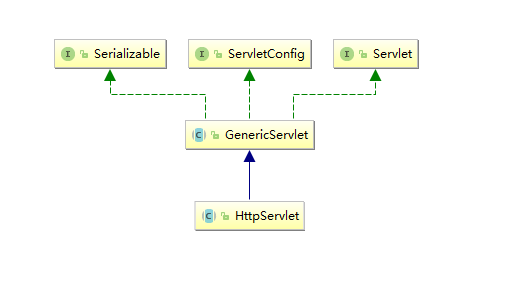
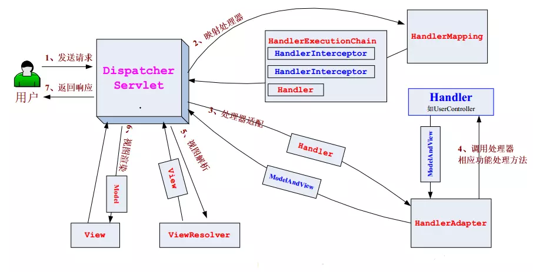

---
title: Spring MVC 源码浅析——请求处理流程
tags: 
	- Java
	- Spring
toc: true
date: 2019-03-22 12:42:36
---
Spring Boot 中把 Spring MVC 设置为默认的网络组建，配合内置的 tomcat 服务器，让服务器开发不再困难。但是封装代码带来了简便性的同时，也让下层逻辑不再清晰，这里我们就先来看一下，一个 http 报文到达后会经过怎样的流程。

## 1、背景知识
### 1.1 Servlet
说到网络就不得不说到 Java 中的 Servlet 接口。Servlet 是 J2EE 规范之一，在遵守该规范的前提下，我们可将 Web 应用部署在 Servlet 容器下，比如 tomcat。这样做的好处是什么呢？它可以使开发者聚焦业务逻辑，而不用去关心 HTTP 协议方面的事情。开发能支持 HTTP 协议的服务器本身就是一个庞大的工程：我们需要对 HTTP 的文本进行解析、对各种状态码作出响应、还要考虑底层操作系统和硬件情况等等。

如果我们写的 Web 应用不大，不夸张的说，项目中对 HTTP 提供支持的代码会比业务代码还要多，这岂不是得不偿失。当然，在现实中，我们不用自己动手写这部分的代码，我们只要基于 Servlet 规范实现 Web 应用，剩下的 Servlet 容器就会帮我们处理。

下面，我们先来看看 Servlet 接口及其实现类结构，然后再进行更进一步的说明。

<center>

</center>

我们从上到下顺序进行分析。先来看看最顶层的两个接口是怎么定义的。

#### 1.1.1 Servlet 与 ServletConfig
先来看看 Servlet 接口的定义，如下：
```java
public interface Servlet {

    public void init(ServletConfig config) throws ServletException;

    public ServletConfig getServletConfig();
    
    public void service(ServletRequest req, ServletResponse res) throws ServletException, IOException;
   
    public String getServletInfo();
    
    public void destroy();
}
```
init 方法会在容器启动时由容器调用，也可能会在 Servlet 第一次被使用时调用，调用时机取决 load-on-start 的配置。容器调用 init 方法时，会向其传入一个 ServletConfig 参数。ServletConfig 是什么呢？顾名思义，ServletConfig 是一个和 Servlet 配置相关的接口。举个例子说明一下，我们在配置 Spring MVC 的 DispatcherServlet 时，会通过 ServletConfig 将配置文件的位置告知 DispatcherServlet。比如：
```xml
<servlet>
    <servlet-name>dispatcher</servlet-name>
    <servlet-class>org.springframework.web.servlet.DispatcherServlet</servlet-class>
    <init-param>
        <param-name>contextConfigLocation</param-name>
        <param-value>classpath:application-web.xml</param-value>
    </init-param>
</servlet>
```
如上，标签内的配置信息最终会被放入 ServletConfig 实现类对象中。DispatcherServlet 通过 ServletConfig 接口中的方法，就能获取到 contextConfigLocation 对应的值。

Servlet 中的 service 方法用于处理请求。当然，一般情况下我们不会直接实现 Servlet 接口，通常是通过继承 HttpServlet 抽象类编写业务逻辑的。Servlet 中接口不多，也不难理解，这里就不多说了。下面我们来看看 ServletConfig 接口定义，如下：
```java
public interface ServletConfig {
    
    public String getServletName();

    public ServletContext getServletContext();

    public String getInitParameter(String name);

    public Enumeration<String> getInitParameterNames();
}
```
先来看看 getServletName 方法，该方法用于获取 servlet 名称，也就是标签中配置的内容。getServletContext 方法用于获取 Servlet 上下文。如果说一个 ServletConfig 对应一个 Servlet，那么一个 ServletContext 则是对应所有的 Servlet。ServletContext 代表当前的 Web 应用，可用于记录一些全局变量，当然它的功能不局限于记录变量。我们可通过标签向 ServletContext 中配置信息，比如在配置 Spring 监听器（ContextLoaderListener）时，就可以通过该标签配置 contextConfigLocation。如下：
```xml
<context-param>
    <param-name>contextConfigLocation</param-name>
    <param-value>classpath:application.xml</param-value>
</context-param>
```
关于 ServletContext 就先说这么多了，继续介绍 ServletConfig 中的其他方法。getInitParameter 方法用于获取标签中配置的参数值，getInitParameterNames 则是获取所有配置的名称集合，这两个方法用途都不难理解。

以上是 Servlet 与 ServletConfig 两个接口的说明，比较简单。说完这两个接口，我们继续往下看，接下来是 HttpServlet。

#### 1.1.2 HttpServlet
HttpServlet，从名字上就可看出，这个类是和 HTTP 协议相关。该类的关注点在于怎么处理 HTTP 请求，比如其定义了 doGet 方法处理 GET 类型的请求，定义了 doPost 方法处理 POST 类型的请求等。我们若需要基于 Servlet 写 Web 应用，应继承该类，并覆盖指定的方法。doGet 和 doPost 等方法并不是处理的入口方法，所以这些方法需要由其他方法调用才行。其他方法是哪个方法呢？当然是 service 方法了。下面我们看一下这个方法的实现。如下：
```java
@Override
public void service(ServletRequest req, ServletResponse res)
    throws ServletException, IOException {
    HttpServletRequest  request;
    HttpServletResponse response;
    
    if (!(req instanceof HttpServletRequest &&
            res instanceof HttpServletResponse)) {
        throw new ServletException("non-HTTP request or response");
    }

    request = (HttpServletRequest) req;
    response = (HttpServletResponse) res;

    // 调用重载方法，该重载方法接受 HttpServletRequest 和 HttpServletResponse 类型的参数
    service(request, response);
}

protected void service(HttpServletRequest req, HttpServletResponse resp)
    throws ServletException, IOException {
    String method = req.getMethod();

    // 处理 GET 请求
    if (method.equals(METHOD_GET)) {
        long lastModified = getLastModified(req);
        if (lastModified == -1) {
            // 调用 doGet 方法
            doGet(req, resp);
        } else {
            long ifModifiedSince = req.getDateHeader(HEADER_IFMODSINCE);
            if (ifModifiedSince < lastModified) {
                maybeSetLastModified(resp, lastModified);
                doGet(req, resp);
            } else {
                resp.setStatus(HttpServletResponse.SC_NOT_MODIFIED);
            }
        }

    // 处理 HEAD 请求
    } else if (method.equals(METHOD_HEAD)) {
        long lastModified = getLastModified(req);
        maybeSetLastModified(resp, lastModified);
        doHead(req, resp);

    // 处理 POST 请求
    } else if (method.equals(METHOD_POST)) {
        // 调用 doPost 方法
        doPost(req, resp);
    } else if (method.equals(METHOD_PUT)) {
        doPut(req, resp);
    } else if (method.equals(METHOD_DELETE)) {
        doDelete(req, resp);
    } else if (method.equals(METHOD_OPTIONS)) {
        doOptions(req,resp);
    } else if (method.equals(METHOD_TRACE)) {
        doTrace(req,resp);
    } else {
        String errMsg = lStrings.getString("http.method_not_implemented");
        Object[] errArgs = new Object[1];
        errArgs[0] = method;
        errMsg = MessageFormat.format(errMsg, errArgs);
        
        resp.sendError(HttpServletResponse.SC_NOT_IMPLEMENTED, errMsg);
    }
}
```
如上，第一个 service 方法覆盖父类中的抽象方法，并没什么太多逻辑。所有的逻辑集中在第二个 service 方法中，该方法根据请求类型分发请求。我们可以根据需要覆盖指定的处理方法。

以上所述只是 Servlet 规范中的一部分内容，这些内容是和本文相关的内容。对于 Servlet 规范中的其他内容，大家有兴趣可以自己去探索。好了，关于 Servlet 方面的内容，这里先说这么多。

### 1.2 Spring MVC 组件介绍

Spring MVC 利用 Spring 的 IOC 容器管理自己的组件，这些组件之间的协作关系如下图：



我们按照用户发送请求——>用户收到响应来走一遍：
1. 首先用户发送请求——>DispatcherServlet，前端控制器收到请求后自己不进行处理，而是委托给其他的解析器进行处理，作为统一访问点，进行全局的流程控制；
2. DispatcherServlet——>HandlerMapping，HandlerMapping 将会把请求映射为 HandlerExecutionChain 对象（包含一个 Handler 处理器（页面控制器）对象、多个 HandlerInterceptor 拦截器）对象，通过这种策略模式，很容易添加新的映射策略；
3. DispatcherServlet——>HandlerAdapter（默认有 SimpleControllerHandlerAdapter，HttpRequestHandlerAdapter 和 AnnotationMethodHandlerAdapter 几种适配器，分别对应实现 Controller 接口的类、实现 HttpRequestHandler 接口的类、注解@RequestMapping 的方法等封装而成的对象，为不同的 handler 提供统一的访问方式）；
4. 业务处理方法（Service）
5. HandlerAdapter 返回一个 ModelAndView 对象（包含模型数据、逻辑视图名）；
6. ModelAndView 的逻辑视图名——> ViewResolver， ViewResolver 将把逻辑视图名解析为具体的 View，通过这种策略模式，很容易更换其他视图技术；
7. View——>渲染，View 会根据传进来的 Model 模型数据进行渲染，此处的 Model 实际是一个 Map 数据结构，因此很容易支持其他视图技术；
8. 返回控制权给 DispatcherServlet，由 DispatcherServlet 返回响应给用户，到此一个流程结束。

以上就是 Spring MVC 处理请求的全过程，上面的流程进行了一定的简化，比如拦截器的执行时机就没说。不过这并不影响大家对主过程的理解。下来来简单介绍一下图中出现的一些组件：

| 组件 | 说明 |
| :--- | :--- |
| DispatcherServlet | 本质上是一个 HttpServlet，Servlet 容器会把请求委托给它。Spring MVC 的核心组件，是请求的入口，负责协调各个组件工作 |
|Handler|处理器，本质上是由实现 Controller 接口的类、实现 HttpRequestHandler 接口的类、注解@RequestMapping 的方法等封装而成的对象 |
|HandlerMapping|内部维护了一些 <访问路径, 处理器> 映射，负责为请求找到合适的处理器|
|HandlerAdapter|处理器的适配器。Spring 中的处理器的实现多变，比如用户处理器可以实现 Controller 接口，实现 HttpRequestHandler 接口，也可以用 @RequestMapping 注解将方法作为一个处理器等，这就导致 Spring 不知道怎么调用用户的处理器逻辑。所以这里需要一个处理器适配器，由处理器适配器去调用处理器的逻辑|
|ViewResolver| 用于将视图名称解析为视图对象 View。|
|View| 在视图对象用于将模板渲染成 html 或其他类型的文件。比如 InternalResourceView 可将 jsp 渲染成 html。|

## 2、源码分析

上面我们知道了一个 HTTP 请求是怎么样被处理的，我们看到了核心部分就是前端控制器 DispatcherServlet。下面我们就从源码的角度对上面的内容进行补充说明，DispatcherServlet 中负责转发的核心方法就是 doDispatch。
```java
protected void doDispatch(HttpServletRequest request, HttpServletResponse response) throws Exception {
    HttpServletRequest processedRequest = request;
    HandlerExecutionChain mappedHandler = null;
    boolean multipartRequestParsed = false;

    WebAsyncManager asyncManager = WebAsyncUtils.getAsyncManager(request);

    try {
        ModelAndView mv = null;
        Exception dispatchException = null;

        try {
            processedRequest = checkMultipart(request);
            multipartRequestParsed = (processedRequest != request);

            // 获取可处理当前请求的处理器 Handler，对应流程图中的步骤2
            mappedHandler = getHandler(processedRequest);
            if (mappedHandler == null || mappedHandler.getHandler() == null) {
                noHandlerFound(processedRequest, response);
                return;
            }

            // 把 Controller、@RequestMapping 等包装为适配器，对应步骤3
            HandlerAdapter ha = getHandlerAdapter(mappedHandler.getHandler());

            // 处理 last-modified 消息头
            String method = request.getMethod();
            boolean isGet = "GET".equals(method);
            if (isGet || "HEAD".equals(method)) {
                long lastModified = ha.getLastModified(request, mappedHandler.getHandler());
                if (logger.isDebugEnabled()) {
                    logger.debug("Last-Modified value for [" + getRequestUri(request) + "] is: " + lastModified);
                }
                if (new ServletWebRequest(request, response).checkNotModified(lastModified) && isGet) {
                    return;
                }
            }

            // 执行拦截器 preHandle 方法
            if (!mappedHandler.applyPreHandle(processedRequest, response)) {
                return;
            }

            // 调用处理器逻辑，对应步骤4，这一步得到的 ModelAndView 是数据对象（Map）和视图名称
            mv = ha.handle(processedRequest, response, mappedHandler.getHandler());

            if (asyncManager.isConcurrentHandlingStarted()) {
                return;
            }

            // 如果 controller 未返回视图名称，这里生成默认的视图名称
            applyDefaultViewName(processedRequest, mv);

            // 执行拦截器 postHandle 方法
            mappedHandler.applyPostHandle(processedRequest, response, mv);
        }
        catch (Exception ex) {
            dispatchException = ex;
        }
        catch (Throwable err) {
            dispatchException = new NestedServletException("Handler dispatch failed", err);
        }
        
        // 解析并渲染视图
        processDispatchResult(processedRequest, response, mappedHandler, mv, dispatchException);
    }
    catch (Exception ex) {
        triggerAfterCompletion(processedRequest, response, mappedHandler, ex);
    }
    catch (Throwable err) {
        triggerAfterCompletion(processedRequest, response, mappedHandler,
                new NestedServletException("Handler processing failed", err));
    }
    finally {
        if (asyncManager.isConcurrentHandlingStarted()) {
            // Instead of postHandle and afterCompletion
            if (mappedHandler != null) {
                mappedHandler.applyAfterConcurrentHandlingStarted(processedRequest, response);
            }
        }
        else {
            if (multipartRequestParsed) {
                cleanupMultipart(processedRequest);
            }
        }
    }
}
```
```java
private void processDispatchResult(HttpServletRequest request, HttpServletResponse response,
        HandlerExecutionChain mappedHandler, ModelAndView mv, Exception exception) throws Exception {

    boolean errorView = false;

    if (exception != null) {
        if (exception instanceof ModelAndViewDefiningException) {
            logger.debug("ModelAndViewDefiningException encountered", exception);
            mv = ((ModelAndViewDefiningException) exception).getModelAndView();
        }
        else {
            Object handler = (mappedHandler != null ? mappedHandler.getHandler() : null);
            mv = processHandlerException(request, response, handler, exception);
            errorView = (mv != null);
        }
    }

    if (mv != null && !mv.wasCleared()) {
        // 渲染视图
        render(mv, request, response);
        if (errorView) {
            WebUtils.clearErrorRequestAttributes(request);
        }
    }
    else {
        if (logger.isDebugEnabled()) {...
    }

    if (WebAsyncUtils.getAsyncManager(request).isConcurrentHandlingStarted()) {
        return;
    }

    if (mappedHandler != null) {
        mappedHandler.triggerAfterCompletion(request, response, null);
    }
}
```
```java
protected void render(ModelAndView mv, HttpServletRequest request, HttpServletResponse response) throws Exception {
    Locale locale = this.localeResolver.resolveLocale(request);
    response.setLocale(locale);

    View view;
    /*
     * 若 mv 中的 view 是 String 类型，即处理器返回的是模板名称，
     * 这里将其解析为具体的 View 对象
     */ 
    if (mv.isReference()) {
        // 解析视图，根据视图名找到视图，对应步骤5
        view = resolveViewName(mv.getViewName(), mv.getModelInternal(), locale, request);
        if (view == null) {
            throw new ServletException("Could not resolve view with name '" + mv.getViewName() +
                    "' in servlet with name '" + getServletName() + "'");
        }
    }
    else {
        view = mv.getView();
        if (view == null) {
            throw new ServletException("ModelAndView [" + mv + "] neither contains a view name nor a " +
                    "View object in servlet with name '" + getServletName() + "'");
        }
    }

    if (logger.isDebugEnabled()) {...}
    try {
        if (mv.getStatus() != null) {
            response.setStatus(mv.getStatus().value());
        }
        // 将模型中的数据填入视图中，并将结果返回给用户。对应步骤6和7
        view.render(mv.getModelInternal(), request, response);
    }
    catch (Exception ex) {
        if (logger.isDebugEnabled()) {...}
        throw ex;
    }
}
```
源码分析就到这里，我们再把流程总结一遍：
1. 请求达到 DispatcherServlet
2. 获取可处理当前请求的一个处理器 Handler 和多个拦截器 HandlerInterceptor 
3. 为当前获取的 Handler 找到合适的适配器，适配器的作用是提供统一调用接口
4. 执行拦截器 preHandle 方法
5. 执行适配器 handle 方法，即调用 handler 的对应处理方法，返回 ModelAndView，里面包含了模型数据和视图名称
6. 执行拦截器 postHandle 方法
7. 解析视图，根据视图名找到对应 view 对象
8. 渲染视图，view 对象根据传进来的模型和模型数据进行渲染，返回 html 或其他类型的文件
9. 返回响应

## 3、总结
本文分析了 Spring MVC 的请求转发流程，介绍了 HttpServlet 和 DispatcherServlet 的转发流程。Java 底层只提供了 TCP 套接字通信，Http 协议的实现是由上层应用完成的。自己动手写个协议解析器很麻烦，因此 J2EE 规定了 HttpServlet 接口简化了我们的工作。只要我们实现了 HttpServlet 接口，协议解析与封装的事底层的 Servlet 容器帮我们做好了。DispatcherServlet 就是一个的 HttpServlet，也是 Spring MVC 的核心组件。在 SpringBoot 默认的配置中，它会拦截底层  Servlet 所有的 Http 请求，然后调用 IOC 容器中的各种组件响应并返回。

## 4、参考资料
[Spring MVC 原理探秘 - 一个请求的旅行过程](http://www.tianxiaobo.com/2018/06/29/Spring-MVC-%E5%8E%9F%E7%90%86%E6%8E%A2%E7%A7%98-%E4%B8%80%E4%B8%AA%E8%AF%B7%E6%B1%82%E7%9A%84%E6%97%85%E8%A1%8C%E8%BF%87%E7%A8%8B/#2%E4%B8%80%E4%B8%AA%E8%AF%B7%E6%B1%82%E7%9A%84%E6%97%85%E8%A1%8C%E8%BF%87%E7%A8%8B)
[spring mvc 处理流程整理](https://www.cnblogs.com/javapath/p/6806189.html)