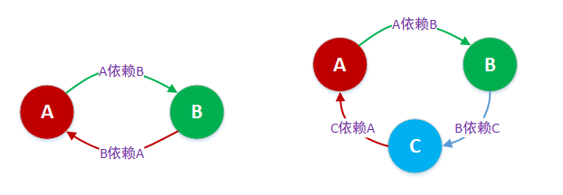
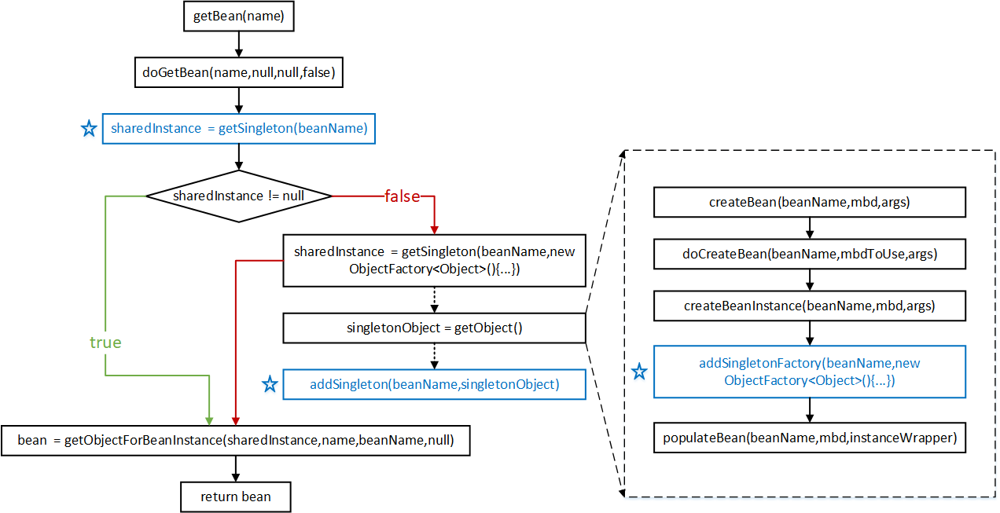

---
title: Spring 源码浅析——解决循环依赖
tags: 
	- Spring
	- Java
toc: true
date: 2019-03-11 12:40:01
---
本文来看一下 Spring 是如何解决循环依赖的。前几篇我们讲完了 IOC 容器创建的问题，但还有一些点没讲。比如在 doCreateBean 方法中的 earlySingletonExposure 是什么意思。这里我们要提到一个循环依赖的问题。

## 1、背景知识
### 1、什么是循环依赖
循环依赖其实就是循环引用，也就是两个或则两个以上的 bean 互相持有对方，最终形成闭环。比如 A 依赖于 B，B 又依赖于A。在 Spring 中这样的场景有很多，比如构造器参数中的循环依赖，属性注入时的循环依赖。而其中，只有`单例对象的属性注入循环依赖`是可以被解决的。



IOC 容器在实例化上左图两个 bean 时，会按照顺序，先去实例化 beanA，然后发现 beanA 依赖于 beanB，又去实例化 beanB；实例化 beanB 时，发现 beanB 又依赖于 beanA...如果容器不处理循环依赖的话，容器会无限执行上面的流程，直到内存溢出，程序崩溃。当然，Spring 是不会让这种情况发生的。在容器发现 beanB 依赖于 beanA 时，容器会获取 beanA 对象的一个早期的引用（early reference），并把这个早期引用注入到 beanB 中，让 beanB先完成实例化，beanA 就可以获取到 beanB 的引用，然后 beanA 完成实例化。

### 2、三级缓存

Spring 为了解决循环依赖问题使用了三级缓存的方式，三级缓存的定义如下：
```java
/** Cache of singleton objects: bean name --> bean instance */
private final Map<String, Object> singletonObjects = new ConcurrentHashMap<String, Object>(256);

/** Cache of early singleton objects: bean name --> bean instance */
private final Map<String, Object> earlySingletonObjects = new HashMap<String, Object>(16);

/** Cache of singleton factories: bean name --> ObjectFactory */
private final Map<String, ObjectFactory<?>> singletonFactories = new HashMap<String, ObjectFactory<?>>(16);
```
|缓存|用途|
|:---|:---|
|singletonObjects |用于存放完全初始化好的 bean，从该缓存中取出的 bean 可以直接使用 |
|earlySingletonObjects|存放早期 bean 对象（尚未填充属性），用于解决循环依赖|
|singletonFactories|存放 bean 工厂对象，用于解决循环依赖|

### 3、回顾获取 bean 的过程

这里我们来了解从 Spring IOC 容器中获取 bean 实例的流程（简化版），这对我们后续的源码分析会有比较大的帮助。先看图：
<br>

<br>
这张图是一个简化后的流程图。开始流程图中只有一条执行路径，在条件 sharedInstance != null 这里出现了岔路，形成了绿色和红色两条路径。在上图中，读取/添加缓存的方法我用蓝色的框和☆标注了出来。

我来按照上面的图，分析一下整个流程的执行顺序。这个流程从 getBean 方法开始，getBean 是个空壳方法，所有逻辑都在 doGetBean 方法中。doGetBean 首先会调用 getSingleton(beanName) 方法获取 sharedInstance，sharedInstance 可能是完全实例化好的 bean，也可能是一个早期 bean 对象，当然也有可能是 null。如果不为 null，则走绿色的那条路径。再经 getObjectForBeanInstance 这一步处理后，绿色的这条执行路径就结束了。

我们再来看一下红色的那条执行路径，也就是 sharedInstance = null 的情况。在第一次获取某个 bean 的时候，缓存中是没有记录的，所以这个时候要走创建逻辑。上图中的 getSingleton(beanName,new ObjectFactory() {…}) 方法会创建一个 bean 实例，上图虚线路径指的是 getSingleton 方法内部调用的两个方法，其逻辑如下：
```java
public Object getSingleton(String beanName, ObjectFactory<?> singletonFactory) {
    // 省略部分代码
    singletonObject = singletonFactory.getObject();
    // ...
    addSingleton(beanName, singletonObject);
}
```
如上所示，getSingleton 会在内部先调用 getObject 方法创建 singletonObject，然后再调用 addSingleton 将 singletonObject 放入缓存中。getObject 在内部代用了 createBean 方法，createBean 方法基本上也属于空壳方法，更多的逻辑是写在 doCreateBean 方法中的。doCreateBean 方法中的逻辑很多，其首先调用了 createBeanInstance 方法创建了一个原始的 bean 对象，随后调用 addSingletonFactory 方法向缓存中添加单例 bean 工厂，从该工厂可以获取早期 bean 对象。再之后，继续调用 populateBean 方法向原始 bean 对象中填充属性，并解析依赖。getObject 执行完成后，会返回完全实例化好的 bean。紧接着再调用 addSingleton 把完全实例化好的 bean 对象放入缓存中。到这里，红色执行路径差不多也就结束了。

这是对我们之前 bean 创建的回顾，下面来看一下源码。

## 2、源码分析
源码部分我们从 beanA、beanB 循环依赖的情况出发，来看 beanA 和 beanB 的创建流程。首先是 beanA：
### 1、beanA：doGetBean
```java
protected <T> T doGetBean(final String name, final Class<T> requiredType, final Object[] args, boolean typeCheckOnly)
        throws BeansException {

    // ...... 
    
    // 从缓存中获取 bean 实例
    Object sharedInstance = getSingleton(beanName);

    // ......
}
```
在 doGetBean 方法中 Spring 会先调用 getSingleton 查看是否能直接从缓存中获取 beanA 实例。
### 2、beanA：getSingleton
 ```java
public Object getSingleton(String beanName) {
    return getSingleton(beanName, true);
}

protected Object getSingleton(String beanName, boolean allowEarlyReference) {
    // 从 singletonObjects 获取实例，此时 beanA 还未创建，自然获取不到
    Object singletonObject = this.singletonObjects.get(beanName);
    // 判断 beanName 对应的 bean 是否正在创建中，此时创建还未开始，所以不会进入
    if (singletonObject == null && isSingletonCurrentlyInCreation(beanName)) {
        // ......
    }
    // 返回的是 null
    return (singletonObject != NULL_OBJECT ? singletonObject : null);
}
```
第一次访问 getSingleton 返回的是个 null，然后回到 doGetBean 继续执行。
### 3、beanA：doGetBean
```java
protected <T> T doGetBean(final String name, final Class<T> requiredType, final Object[] args, boolean typeCheckOnly)
        throws BeansException {

    // ...... 

    // 从缓存中获取的是 null
    Object sharedInstance = getSingleton(beanName);

    // 走 sharedInstance == null 的路线
    if (sharedInstance != null && args == null) {
        // ......
    } else {
        // ......

        // mbd.isSingleton() 用于判断 bean 是否是单例模式
        if (mbd.isSingleton()) {
            // 调用 getSingleton 获取 bean 实例
            sharedInstance = getSingleton(beanName, new ObjectFactory<Object>() {
                @Override
                public Object getObject() throws BeansException {
                    try {
                        // 内部调用的是 createBean 方法
                        return createBean(beanName, mbd, args);
                    } catch (BeansException ex) {
                        // ......
                    }
                }
            });
            // ......
        }
        // ......
    }
    // ......
}
```
我们走 sharedInstance == null 的路线，会调用 getSingleton 的重载方法，这次会传两个参数进去，一个 beanName 大家都知道，另一个 ObjectFactory<Object> 是一个匿名内部类，它持有外部方法的 beanName, mbd, args 变量（匿名内部类的性质），并把它们作为参数传递给 getObject 中调用的 createBean 方法。我们来看一下这个 getSingleton 的重载方法：
### 4、beanA：重载的 getSingleton
```java
public Object getSingleton(String beanName, ObjectFactory<?> singletonFactory) {
    synchronized (this.singletonObjects) {

        // ......

        // 标记为正在创建
        beforeSingletonCreation(beanName);
        
        // ......

        // 调用 getObject 方法创建 bean 实例
        singletonObject = singletonFactory.getObject();

        // ......
    }
}
```
getSingleton 的重载方法里面主要调用了传入的 ObjectFactory 的 getObject 方法。这个方法大家在之前看到过，这是匿名内部类实现的方法，里面返回的是 createBean 的结果，我们直接来看 createBean 方法：
### 5、beanA：createBean
```java
@Override
protected Object createBean(String beanName, RootBeanDefinition mbd, @Nullable Object[] args)
        throws BeanCreationException {

    // ......
    
    // 空壳方法，主要逻辑在这里
    Object beanInstance = doCreateBean(beanName, mbdToUse, args);

    // ......
}

protected Object doCreateBean(final String beanName, final RootBeanDefinition mbd, final @Nullable Object[] args)
        throws BeanCreationException { 
    
    // ......
   
    // 实例化 beanA
    instanceWrapper = createBeanInstance(beanName, mbd, args);
    
    // ......

    // 此处的 bean 可以认为是一个原始的 beanA 实例，暂未填充属性
    final Object bean = instanceWrapper.getWrappedInstance();

    // earlySingletonExposure 表示是否提前暴露，beanA 满足条件
    boolean earlySingletonExposure = (mbd.isSingleton() && this.allowCircularReferences && isSingletonCurrentlyInCreation(beanName));
    if (earlySingletonExposure) {
        if (logger.isTraceEnabled()) {
            logger.trace("Eagerly caching bean '" + beanName +
                    "' to allow for resolving potential circular references");
        }
        // 添加 beanA 的工厂对象到 singletonFactories 缓存中
        addSingletonFactory(beanName, new ObjectFactory<Object>() {
            @Override
            public Object getObject() throws BeansException {
                // 获取 beanA 的早期引用，如果 beanA 中的方法被 AOP 切点所匹配到，此时 AOP 相关逻辑会介入
                return getEarlyBeanReference(beanName, mbd, bean);
            }
        });
    }
    
    // ......

    // 属性装配，把属性填充进去，这一步 Spring 会发现 beanA 依赖 beanB，然后调用 getBean 获取 beanB
    populateBean(beanName, mbd, instanceWrapper);
    
    // ......

}
```
createBean 是个空壳方法，里面调用了 doCreateBean 来实现主要逻辑。doCreateBean 中会实例化 beanA 对象，此时还没有填充属性。然后把工厂对象添加到 singletonFactories 缓存中。这个工厂对象是也是一个匿名内部类，里面持有了外部方法的 beanName, mbd, bean 三个变量，其中 bean 就是 beanA 的早期引用，是还没填充属性的 beanA 实例。ObjectFactory 实现了 getObject 方法，实际上就是调用 getEarlyBeanReference，它会获取 beanName, mbd, bean 三个参数，对于没有被 AOP 匹配到的对象 beanA，它会直接返回传入的参数 bean，也就是 beanA 的早期引用。

接下来 beanA 会填充属性，这一步里 Spring 会发现 beanA 依赖于 beanB，于是会调用 getBean 获取 beanA。

### 6、beanB：getBean
beanB 的 getBean 流程跟目前为止的 beanA 流程一模一样，所以我们就快速前进了。
```java
public Object getBean(String name) throws BeansException {
    return doGetBean(name, null, null, false);
}

protected <T> T doGetBean(final String name, @Nullable final Class<T> requiredType,
                          @Nullable final Object[] args, boolean typeCheckOnly) throws BeansException {
    // ......

    sharedInstance = getSingleton(beanName, () -> {
        try {
            // getSingleton 内部会调用这个
            return createBean(beanName, mbd, args);
        }
        catch (BeansException ex) {
            // ......
        }
    });
    
    // ......

}

protected Object createBean(String beanName, RootBeanDefinition mbd, @Nullable Object[] args)
        throws BeanCreationException {

    // ......
    
    // 空壳方法，主要逻辑在这里
    Object beanInstance = doCreateBean(beanName, mbdToUse, args);

    // ......
}


protected Object doCreateBean(final String beanName, final RootBeanDefinition mbd, final @Nullable Object[] args)
        throws BeanCreationException { 
    
    // ......
   
    // 实例化 beanB
    instanceWrapper = createBeanInstance(beanName, mbd, args);
    
    // ......

    // 获取 beanB 的早期对象
    final Object bean = instanceWrapper.getWrappedInstance();

    // ......

    // 添加 beanB 的工厂对象到 singletonFactories 缓存中
    addSingletonFactory(beanName, new ObjectFactory<Object>() {
        @Override
        public Object getObject() throws BeansException {
            // 获取 beanB 的早期引用，如果 beanB 中的方法被 AOP 切点所匹配到，此时 AOP 相关逻辑会介入
            return getEarlyBeanReference(beanName, mbd, bean);
        }
     });
    
    // ......

    // 属性装配，把属性填充进去，这一步会发现 beanB 依赖 beanA，然后又调用 getBean 获取 beanA
    populateBean(beanName, mbd, instanceWrapper);
    
    // ......

}
```
beanB 的创建过程和 beanA 到目前为止的一模一样，最终都是来到了 populateBean 填充属性。然后 Spring 在这里又会发现 beanB 依赖 beanA，然后又调用 getBean 获取 beanA。
### 7、beanA：getBean
```java
public Object getBean(String name) throws BeansException {
    return doGetBean(name, null, null, false);
}

protected <T> T doGetBean(final String name, final Class<T> requiredType, final Object[] args, boolean typeCheckOnly)
        throws BeansException {

    // ...... 
    
    // 从缓存中获取 bean 实例
    Object sharedInstance = getSingleton(beanName);

    // ......
}
```
Spring 会再次调用 getSingleton 方法获取 beanA 实例。
### 8、beanA：getSingleton
```java
public Object getSingleton(String beanName) {
    return getSingleton(beanName, true);
}

protected Object getSingleton(String beanName, boolean allowEarlyReference) {

    // 从 singletonObjects 获取 beanA 的实例，因为还没完全创建成功，所以获取不到
    Object singletonObject = this.singletonObjects.get(beanName);

    // 判断 beanA 是否正在创建中，在第 4 步已经把 beanA 标记为正在创建
    if (singletonObject == null && isSingletonCurrentlyInCreation(beanName)) {
        synchronized (this.singletonObjects) {
            // 从 earlySingletonObjects 中获取提前曝光的 beanA，这里依旧没有
            singletonObject = this.earlySingletonObjects.get(beanName);
            if (singletonObject == null && allowEarlyReference) {
                // 从 singletonFactories 获取 beanA 的对象工厂，在第 5 步已经把 beanA 的对象工厂添加进去
                ObjectFactory<?> singletonFactory = this.singletonFactories.get(beanName);
                if (singletonFactory != null) {
                    // 通过对象工厂获取 beanA 的早期引用
                    singletonObject = singletonFactory.getObject();
                    // 将 beanA 的早期引用放入缓存 earlySingletonObjects 中
                    this.earlySingletonObjects.put(beanName, singletonObject);
                    // 将 beanA 的对象工厂从缓存 singletonFactories 中移除
                    this.singletonFactories.remove(beanName);
                }
            }
        }
    }
    // 返回 beanA 的早期引用
    return (singletonObject != NULL_OBJECT ? singletonObject : null);
}
```
这里就和第 2 步中第一次访问 getSingleton 不一样了，因为标记了 beanA 正在创建，所以这里 Spring 会依次查找三级缓存，最终在第三级缓存 singletonFactories 中找到了 beanA 对应的对象工厂，然后通过工厂对象获取到 beanA 的早期引用，并这个早期引用放在了第二级缓存 earlySingletonObjects 中。有了这个早期对象，beanB 的初始化过程就可以走完了。
### 9、beanB：doCreateBean
```java
protected Object doCreateBean(final String beanName, final RootBeanDefinition mbd, final @Nullable Object[] args)
        throws BeanCreationException { 
     
    // ......
    
    // 属性填充完成
    populateBean(beanName, mbd, instanceWrapper);
        
    // 进行余下的初始化工作
    exposedObject = initializeBean(beanName, exposedObject, mbd);

    // ......

    // 返回完成初始化的 beanB 
    return exposedObject;
}
```
beanB 初始化完成。
### 10、beanB：重载的getSingleton
```java
public Object getSingleton(String beanName, ObjectFactory<?> singletonFactory) {
    synchronized (this.singletonObjects) {

        // ......
        
        // 得到初始化后的 beanB
        singletonObject = singletonFactory.getObject();
        newSingleton = true;

        // 将 beanB 的正在创建状态移除
        afterSingletonCreation(beanName);

        if (newSingleton) {
            // 添加 beanB 到 singletonObjects 缓存中，并从其他集合中将 beanB 相关记录移除
            addSingleton(beanName, singletonObject);
        }

        // ......
        
        // 返回 beanB
        return (singletonObject != NULL_OBJECT ? singletonObject : null);
    }
}

protected void addSingleton(String beanName, Object singletonObject) {
    synchronized (this.singletonObjects) {
        // 将 beanB 存入 singletonObjects 中
        this.singletonObjects.put(beanName, (singletonObject != null ? singletonObject : NULL_OBJECT));

        // 从其他缓存中移除 beanB 相关映射
        this.singletonFactories.remove(beanName);
        this.earlySingletonObjects.remove(beanName);
        this.registeredSingletons.add(beanName);
    }
}
```
在完成初始化后，Spring 会把 beanB 存入 singletonObjects 中，然后把 singletonFactories 和 earlySingletonObjects 中的相应记录删除。
### 11、beanA：doCreateBean
同样地，BeanA 的初始化流程也可以走完了
```java
protected Object doCreateBean(final String beanName, final RootBeanDefinition mbd, final @Nullable Object[] args)
        throws BeanCreationException { 
     
    // ......
    
    // 属性填充完成
    populateBean(beanName, mbd, instanceWrapper);
        
    // 进行余下的初始化工作
    exposedObject = initializeBean(beanName, exposedObject, mbd);

    // ......

    // 返回完成初始化的 beanA
    return exposedObject;
}
```
beanA 初始化完成。
### 12、beanA：重载的getSingleton
```java
public Object getSingleton(String beanName, ObjectFactory<?> singletonFactory) {
    synchronized (this.singletonObjects) {

        // ......
        
        // 得到初始化后的 beanA
        singletonObject = singletonFactory.getObject();
        newSingleton = true;

        // 将 beanA 的正在创建状态移除
        afterSingletonCreation(beanName);

        if (newSingleton) {
            // 添加 beanA 到 singletonObjects 缓存中，并从其他集合中将 beanA 相关记录移除
            addSingleton(beanName, singletonObject);
        }

        // ......
        
        // 返回 beanA
        return (singletonObject != NULL_OBJECT ? singletonObject : null);
    }
}
```
到这里，beanA 和 beanB 就都初始化完成了。

## 3、为什么是三级缓存
看到这里，可能有同学心中有疑问，为什么要使用三级缓存呢？好像使用 earlySingletonObjects 和 singletonObjects 两级缓存，一个存放早期对象，一个存放初始化完成后的对象，也能实现同样的功能，singletonFactories 好像显得有些多此一举。其实不是的，对于普通对象，确实只要返回刚创建完的早期对象就好了，但对于内部有被 AOP 增强的方法的对象，需要返回的是代理对象。我们可以看一下 ObjectFactory 匿名内部类里面调用的 getEarlyBeanReference 方法：
```java
protected Object getEarlyBeanReference(String beanName, RootBeanDefinition mbd, Object bean) {
    Object exposedObject = bean;
    if (!mbd.isSynthetic() && hasInstantiationAwareBeanPostProcessors()) {
        for (BeanPostProcessor bp : getBeanPostProcessors()) {
            // SmartInstantiationAwareBeanPostProcessor 这个后置处理器会在返回早期对象时被调用，如果返回的对象需要加强，那这里就会生成代理对象
            if (bp instanceof SmartInstantiationAwareBeanPostProcessor) {
                SmartInstantiationAwareBeanPostProcessor ibp = (SmartInstantiationAwareBeanPostProcessor) bp;
                exposedObject = ibp.getEarlyBeanReference(exposedObject, beanName);
            }
        }
    }
    return exposedObject;
}
```
我们可以看到对于一般的对象，返回的就是传入的早期对象，但是对于内部有被 AOP 增强的方法的对象，会使用后置处理器返回一个代理对象。
## 4、总结
本篇文章主要分析了 Spring 如何解决循环依赖的问题。是通过三级缓存的方式，在对象实例化之后但还没有填充属性之前，提前暴露出早期的对象，之后有对象需要的话，可以从缓存中获取到这个早期对象，避免了无止境的循环依赖。同时我们也分析了为什么要使用三级缓存而不是二级缓存，是因为对于内部有被 AOP 增强的方法的对象，需要返回的不是实例化后的对象，而是在此基础上的代理对象。这就需要有一级缓存来存这些代理对象。
## 5、参考
[Spring IOC 源码分析](https://juejin.im/entry/5af832e76fb9a07aac248ca1)
[Spring-IOC-容器源码分析-循环依赖的解决办法](http://www.tianxiaobo.com/2018/06/08/Spring-IOC-%E5%AE%B9%E5%99%A8%E6%BA%90%E7%A0%81%E5%88%86%E6%9E%90-%E5%BE%AA%E7%8E%AF%E4%BE%9D%E8%B5%96%E7%9A%84%E8%A7%A3%E5%86%B3%E5%8A%9E%E6%B3%95/)
