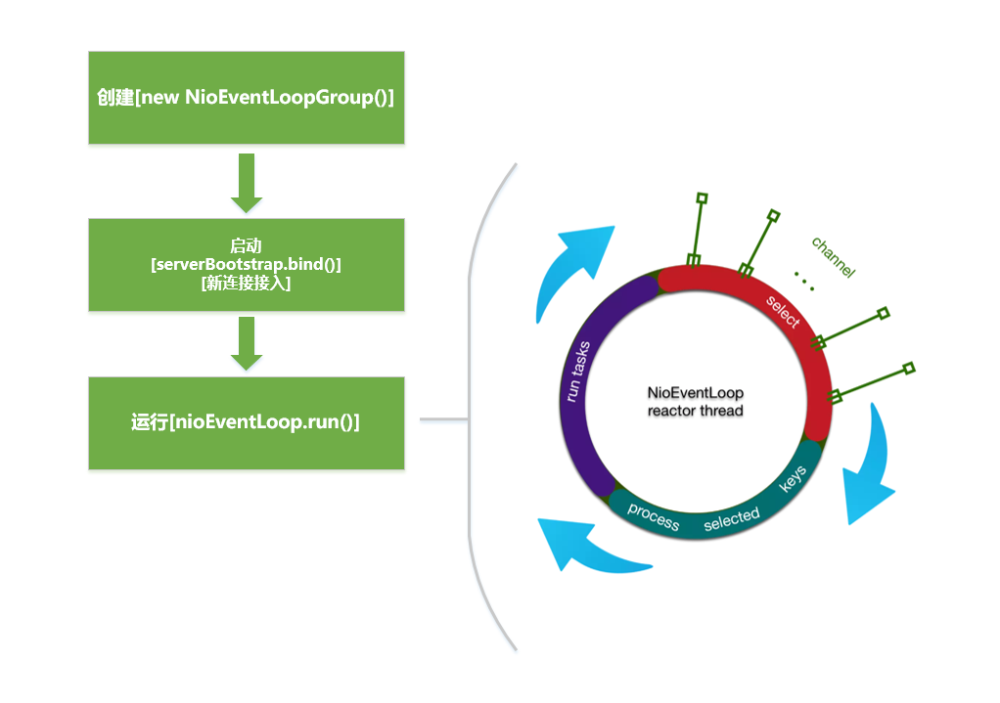
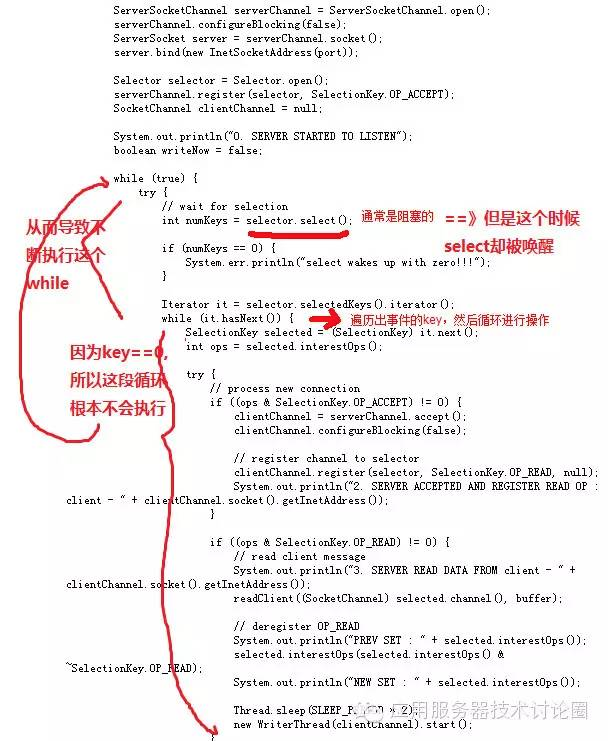

---
title: Netty 源码浅析——NioEventLoop
tags: 
	- Netty
toc: true
date: 2019-09-27 21:17:49
---
NioEventLoop 是 Netty 的核心组件。我们在服务端启动时，会用服务端 Channel 绑定一个 NioEventLoop，那么 NioEventLoop 里面到底在干些什么事？Netty 是如何保证事件循环的高效轮询和任务的及时执行？又是如何优雅地 fix 掉 jdk 的 nio bug 的呢？让我们深入源码一探究竟。

## NioEventLoop 概述

我们先对 NioEventLoop 作一个简单的介绍：
- NioEventLoop 是一个基于 JDK NIO 的异步事件循环类，它负责处理一个 Channel 在它的生命周期内的所有事件。
- NioEventLoop 的整个生命周期只会依赖于一个单一的线程来完成。
- NioEventLoop 和 Channel 是一对多的关系，一个 NioEventLoop 对应多个 Channel，通过 IO 多路复用来管理多个 Channel。
- 如果调用 Channel 操作的线程是 NioEventLoop 的内部线程，那么该操作会被立即执行；否则会把该操作封装成任务放入 NioEventLoop 的任务队列中。
- NioEventLoop 任务队列是一个多生产者单消费者的队列，所有提交到 NioEventLoop 任务队列中的任务会被以 FIFO 的方式消费。
- NioEventLoop 内部是一个 for 循环，不停地做三件事：检测 IO 事件->处理 IO 事件->处理异步任务队列

NioEventLoop 的生命周期分为三个过程：创建->启动->运行。三者的关系和触发时机如下图所示：



可以看到，NioEventLoop 的生命周期起始于我们在用户代码中调用 `new NioEventLoopGroup()`，这条语句会创建出 NioEventLoop；然后在两个地方触发 NioEventLoop 的启动，分别是服务端绑定端口和新连接接入；最终 NioEventLoop 会稳定在一个 for 循环中不断接收和处理 Channel 相关的事件。下面我们就按这个生命周期来阅读源码。

## NioEventLoop 创建

NioEventLoop 的创建发生在 `new NioEventLoopGroup()` 时，NioEventLoop 的创建是以组进行的，而每个 NioEventLoopGroup 创建时，会做以下三件事：
- 创建组内共享的线程创建器 ThreadPerTaskExecutor，它的作用是创建 NioEventLoop 底层的线程
- 创建 NioEventLoop 对象数组并给每一个 NioEventLoop 配置一些核心参数
- 创建一个线程选择器 EventExecutorChooser，它的作用是在组内给新连接分配 NioEventLoop

NioEventLoopGroup 创建的核心代码在它的父类 MultithreadEventExecutorGroup 的构造方法中：
```java
MultithreadEventExecutorGroup
protected MultithreadEventExecutorGroup(int nThreads, Executor executor, EventExecutorChooserFactory chooserFactory, Object... args) {
    //...
    // 1. 创建线程创建器
    if (executor == null) {
        executor = new ThreadPerTaskExecutor(newDefaultThreadFactory());
    }

    // 2. 创建 NioEventLoop 对象数组（10-26）
    children = new EventExecutor[nThreads];
    
    for (int i = 0; i < nThreads; i ++) {
        boolean success = false;
        try {
            children[i] = newChild(executor, args);
            success = true;
        } catch (Exception e) {
            //...
        } finally {
            if (!success) {
                //如果不成功，关闭线程
                //...
            }
        }
    }
    // 3. 创建线程选择器
    chooser = chooserFactory.newChooser(children);
    //...
}
```
代码中可以看到，创建 NioEventLoop 分为三步：创建线程创建器->创建 NioEventLoop 对象数组->创建线程选择器。我们按这个顺序依次进入源码。

### 创建线程创建器

第一步是创建线程创建器，创建线程创建器的相关代码如下：
```java
MultithreadEventExecutorGroup
protected MultithreadEventExecutorGroup(int nThreads, Executor executor, EventExecutorChooserFactory chooserFactory, Object... args) {
    //...
    // 创建线程创建器
    if (executor == null) {
        executor = new ThreadPerTaskExecutor(newDefaultThreadFactory());
    }
    //..
}
```
这里面是 new 了一个 ThreadPerTaskExecutor 对象，我们来看一下 ThreadPerTaskExecutor 这个类：
```java
ThreadPerTaskExecutor
public final class ThreadPerTaskExecutor implements Executor {
    private final ThreadFactory threadFactory;

    public ThreadPerTaskExecutor(ThreadFactory threadFactory) {
        //...
        // 保存 threadFactory
        this.threadFactory = threadFactory;
    }

    @Override
    public void execute(Runnable command) {
        // 当线程创建器执行任务时，会创建一个新线程然后交给新线程执行
        threadFactory.newThread(command).start();
    }
}
```
ThreadPerTaskExecutor 是 Executor 的子类，这表明它会调用线程执行任务。ThreadPerTaskExecutor 内部保存了一个 ThreadFactory，这是 Java 中的线程工厂，用于创建新线程。从 ThreadPerTaskExecutor 的内部方法可知，当它执行 `execute()` 时，会通过 threadFactory 创建一个新的线程然后执行。这个 threadFactory 我们可以看一下，默认是 DefaultThreadFactory 类型：
```java
DefaultThreadFactory
public DefaultThreadFactory(Class<?> poolType) {
    // 第二个参数是 daemon；第三个参数是 priority，默认是 5
    // poolType 是所在 EventLoopGroup 的类型，比如 NioEventLoopGroup，用于生成线程名
    this(poolType, false, Thread.NORM_PRIORITY);
}

public DefaultThreadFactory(String poolName, boolean daemon, int priority, ThreadGroup threadGroup) {
    //...
    // 线程名的前缀
    prefix = poolName + '-' + poolId.incrementAndGet() + '-';
    // 是否守护线程，默认是 false
    this.daemon = daemon;
    // 线程优先级，默认是 5
    this.priority = priority;
    // Java中的线程组，默认是父线程所在组
    this.threadGroup = threadGroup;
}

@Override
public Thread newThread(Runnable r) {
    // 创建线程实体，netty 对 Java 的线程做了优化，最终创建的是 FastThreadLocalThread
    Thread t = newThread(FastThreadLocalRunnable.wrap(r), prefix + nextId.incrementAndGet());
    try {
        if (t.isDaemon() != daemon) {
            t.setDaemon(daemon);
        }

        if (t.getPriority() != priority) {
            t.setPriority(priority);
        }
    } catch (Exception ignored) {
        // Doesn't matter even if failed to set.
    }
    return t;
}

protected Thread newThread(Runnable r, String name) {
    // 创建 FastThreadLocalThread
    return new FastThreadLocalThread(threadGroup, r, name);
}
```
我们可以看到 DefaultThreadFactory 给线程设置了一些默认参数，比如线程优先级 priority 默认是 5；守护线程 daemon 默认是 false；所在线程组（Java中的线程组）默认是父线程所在组；而线程名的命名规则是“poolName-poolId-nextId”的形式，其中 poolName 表示所在 EventLoopGroup 的类型，poolId 表示所在 EventLoopGroup 的序号，nextId 表示当前 EventLoop 在 EventLoopGroup 中的序号，比如“nioEventLoopGroup-2-1”表示这是类型为 nioEventLoopGroup 的第 2 个线程组中第 1 个线程。

最终创建出来的线程对象是 FastThreadLocalThread 类型，这是 Netty 中对 Java 原有线程的优化，它继承 Java 原生的 Thread，优化了原生的 ThreadLocal，这部分内容后面会讲到。

### 创建 NioEventLoop 对象数组

创建完线程创建器后就是创建 NioEventLoop 对象数组，也就是实际创建 NioEventLoop 的过程。在这一步里 EventExecutorGroup 会不断调用 `newChild()` 创建 NioEventLoop 对象：
```java
MultithreadEventExecutorGroup
protected MultithreadEventExecutorGroup(int nThreads, Executor executor, EventExecutorChooserFactory chooserFactory, Object... args) {
    //...
    // 创建 NioEventLoop 对象数组，大小为 nThreads
    children = new EventExecutor[nThreads];
    
    for (int i = 0; i < nThreads; i ++) {
        boolean success = false;
        try {
            // 调用 newChild() 创建 NioEventLoop
            children[i] = newChild(executor, args);
            success = true;
        } catch (Exception e) {
            //...
        } finally {
            if (!success) {
                //如果不成功，关闭线程
                //...
            }
        }
    }
    //...
}
```
这里我们会好奇在没有指定 NioEventLoopGroup 的时候默认会创建多少个 NioEventLoop，答案是 2 倍 cpu 个数，相关代码在 MultithreadEventExecutorGroup 的静态代码块中：
```java
MultithreadEventExecutorGroup
static {
    DEFAULT_EVENT_LOOP_THREADS = Math.max(1, SystemPropertyUtil.getInt(
            "io.netty.eventLoopThreads", NettyRuntime.availableProcessors() * 2));
    //...
}
```
这里的 DEFAULT_EVENT_LOOP_THREADS 就表示默认的 Eventloop 的数量，NettyRuntime.availableProcessors() * 2 就表示是 cpu 数量的 2 倍。

回到 NioEventLoop 对象数组的创建过程，我们看到 EventExecutorGroup 会不断调用 `newChild()` 创建 NioEventLoop 对象，那么我们来看一下 `newChild()` 的执行过程：
```java
NioEventLoopGroup
protected EventLoop newChild(Executor executor, Object... args) throws Exception {
    // 创建 NioEventLoop
    return new NioEventLoop(this, executor, (SelectorProvider) args[0],
        ((SelectStrategyFactory) args[1]).newSelectStrategy(), (RejectedExecutionHandler) args[2]);
}

NioEventLoop
NioEventLoop(NioEventLoopGroup parent, Executor executor, SelectorProvider selectorProvider,
             SelectStrategy strategy, RejectedExecutionHandler rejectedExecutionHandler) {
    // 调用父类构造方法
    super(parent, executor, false, DEFAULT_MAX_PENDING_TASKS, rejectedExecutionHandler);
    //...
    provider = selectorProvider;
    // 调用 jdk 底层的方法创建 Selector
    final SelectorTuple selectorTuple = openSelector();
    selector = selectorTuple.selector;
    unwrappedSelector = selectorTuple.unwrappedSelector;
    selectStrategy = strategy;
}

SingleThreadEventExecutor
protected SingleThreadEventExecutor(EventExecutorGroup parent, Executor executor,
                                    boolean addTaskWakesUp, int maxPendingTasks,
                                    RejectedExecutionHandler rejectedHandler) {
    super(parent);
    this.addTaskWakesUp = addTaskWakesUp;
    this.maxPendingTasks = Math.max(16, maxPendingTasks);
    // 保存线程创建器 ThreadPerTaskExecutor
    this.executor = ThreadExecutorMap.apply(executor, this);
    // 任务队列，用于执行外部线程的任务
    taskQueue = newTaskQueue(this.maxPendingTasks);
    rejectedExecutionHandler = ObjectUtil.checkNotNull(rejectedHandler, "rejectedHandler");
}
```
`newChild()` 方法实际上是调用了 NioEventLoop 的构造方法。这个构造方法里会先调用父类 SingleThreadEventExecutor 的构造方法，SingleThreadEventExecutor 的构造方法中会保存上一步创建的线程创建器 ThreadPerTaskExecutor 和创建一个异步任务队列 taskQueue，这是一个多生产者单消费者类型的异步任务队列，用于 NioEventLoop 处理外部线程提交的任务。然后回到 NioEventLoop 的构造方法，会调用 jdk 底层的方法创建 Selector。每个 NioEventLoop 都有自己的 Selector。

### 创建线程选择器

创建 NioEventLoop 的最后一个环节是创建一个线程选择器 EventExecutorChooser，线程选择器的作用是在新连接接入时分配一个 NioEventLoop，选择的逻辑很简单，就是按顺序分配，假如有 4 个 NioEventLoop，那么分配的顺序就是“1-2-3-4-1-2-3-……”。但是 Netty 的精妙之处就是对于这样一个小逻辑都进行了优化。对于普通长度的 NioEventLoop 数组，Netty 会创建普通选择器 GenericEventExecutorChooser，其内部计算下一个 NioEventLoop 的坐标的方式就是加一取余：
```java
private static final class GenericEventExecutorChooser implements EventExecutorChooser {
    private final AtomicInteger idx = new AtomicInteger();
    private final EventExecutor[] executors;

    GenericEventExecutorChooser(EventExecutor[] executors) {
        // 保存 NioEventLoop 数组
        this.executors = executors;
    }

    @Override
    public EventExecutor next() {
        // 计算下一个 NioEventLoop 的坐标（加一取余）
        return executors[Math.abs(idx.getAndIncrement() % executors.length)];
    }
}
```
但对于长度为 2 的幂（2,4,8,16...）的 NioEventLoop 数组，Netty 会创建专门的选择器 PowerOfTwoEventExecutorChooser，其内部计算下一个 NioEventLoop 的坐标的方式变成了加一求与：
```java
private static final class PowerOfTwoEventExecutorChooser implements EventExecutorChooser {
    private final AtomicInteger idx = new AtomicInteger();
    private final EventExecutor[] executors;

    PowerOfTwoEventExecutorChooser(EventExecutor[] executors) {
        // 保存 NioEventLoop 数组
        this.executors = executors;
    }

    @Override
    public EventExecutor next() {
        // 计算下一个 NioEventLoop 的坐标（加一求与）
        return executors[idx.getAndIncrement() & executors.length - 1];
    }
}
```
从 cpu 运行效率来看，与操作会优于取余操作。可见 Netty 是把性能优化做到了极致。

## NioEventLoop 启动

创建完成之后就需要把 NioEventLoop 启动起来。NioEventLoop 的启动有两种触发时机：
- bossGroup 中的 NioEventLoop 在服务端绑定端口时启动
- workGroup 中的 NioEventLoop 在新连接接入时启动

新连接接入的过程会在下文分析，这里先来看服务端绑定端口时的启动流程。我们在上一章分析了服务端绑定端口的具体操作，但这些操作实际上并不是在主线程完成的，而是通过把它们封装成 task，由服务端 Channel 绑定的 EventLoop 的 `execute(task)` 方法来完成的：
```java
AbstractBootstrap
private static void doBind0(final ChannelFuture regFuture, final Channel channel,
        final SocketAddress localAddress, final ChannelPromise promise) {
    // 把绑定端口操作封装成 task 提交给 EventLoop
    channel.eventLoop().execute(new Runnable() {
        @Override
        public void run() {
            if (regFuture.isSuccess()) {
                channel.bind(localAddress, promise).addListener(ChannelFutureListener.CLOSE_ON_FAILURE);
            } else {
                promise.setFailure(regFuture.cause());
            }
        }
    });
}
```
可以看到绑定端口的操作最终会提交给 EventLoop 执行。当然 task 里面的逻辑我们已经在上章分析过了。本章我们主要关心 EventLoop 的 `execute(task)` 方法：
```java
SingleThreadEventExecutor
public void execute(Runnable task) {
    //...
    // 判断当前执行的线程是否是 EventLoop 的线程，由于绑定端口时是在 main 线程中，所以这里是 false
    boolean inEventLoop = inEventLoop();
    // 将任务添加到任务队列
    addTask(task);
    if (!inEventLoop) {
        // 启动线程
        startThread();
        if (isShutdown()) {
            // 如果线程已中断
            //...
        }
    }

    if (!addTaskWakesUp && wakesUpForTask(task)) {
        wakeup(inEventLoop);
    }
}
```
每次在调用 EventLoop 的 `execute(task)` 方法时会判断调用线程是否是 EventLoop 的线程，如果不是，说明是在外部调用，则调用 `startThread()`。我们绑定端口时是在 main 线程中，且此时 EventLoop 的线程尚未启动，所以这里的 inEventLoop 是 false，于是会调用 `startThread()`：
```java
SingleThreadEventExecutor
private void startThread() {
    // 判断线程是否已启动
    if (state == ST_NOT_STARTED) {
        // 通过 cas 启动线程
        if (STATE_UPDATER.compareAndSet(this, ST_NOT_STARTED, ST_STARTED)) {
            try {
                // 实际启动线程
                doStartThread();
            } catch (Throwable cause) {
                STATE_UPDATER.set(this, ST_NOT_STARTED);
                PlatformDependent.throwException(cause);
            }
        }
    }
}
```
在 `startThread()` 中会判断当前 NioEventLoop 的状态，如果当前 NioEventLoop 处于未启动状态，会通过 cas 去启动线程。实际启动的过程在 `doStartThread()` 中：
```java
SingleThreadEventExecutor
private void doStartThread() {
    // executor 即上一节创建的线程创建器 ThreadPerTaskExecutor
    executor.execute(new Runnable() {
        @Override
        public void run() {
            // 将创建的线程保存在 NioEventLoop 中
            thread = Thread.currentThread();
            if (interrupted) {
                thread.interrupt();
            }
            boolean success = false;
            updateLastExecutionTime();
            try {
                // 启动线程
                SingleThreadEventExecutor.this.run();
                success = true;
            } catch (Throwable t) {
                //...
            } finally {
                //...
            }
        }
    });
}
```
`doStartThread()` 中会调用上一节创建的线程创建器 ThreadPerTaskExecutor 的 `execute()` 方法，这个方法我们在上一节分析过：会通过 ThreadFactory 创建一个新线程。然后 `doStartThread()` 会给创建的新线程提交一个任务。在提交的任务里会把新线程和 NioEventLoop 绑定起来，然后调用 NioEventLoop 的 `run()` 方法。此时 NioEventLoop 就真正启动起来了。

## NioEventLoop 运行

NioEventLoop 的 `run()` 方法中是一段 for 循环，在这段 for 循环中 NioEventLoop 主要不停地做以下三件事：
- 检测是否有 io 事件
- 处理 io 事件
- 处理异步任务队列，就是上文创建的 taskQueue，里面是外部线程提交的任务

我们先进入 `run()` 方法总览一下循环的全貌：

```java
NioEventLoop
protected void run() {
    for (;;) {
        try {
            try {
                switch (selectStrategy.calculateStrategy(selectNowSupplier, hasTasks())) {
                    case SelectStrategy.CONTINUE:
                        continue;
                    case SelectStrategy.BUSY_WAIT:
                    case SelectStrategy.SELECT:
                        // 检测 io 事件，传入时将 wakenUp 置为 false，表示不需要被唤醒
                        select(wakenUp.getAndSet(false));
                        // 如果 wakenUp 为 true 则唤醒 selector
                        if (wakenUp.get()) {
                            selector.wakeup();
                        }
                    default:
                }
            } catch (IOException e) {
                //...
            }

            cancelledKeys = 0;
            needsToSelectAgain = false;
            final int ioRatio = this.ioRatio;
            // ioRatio 是一个大于 0 小于等于 100 的数，表示处理 io 事件和处理异步任务队列的时间比例，默认是 50，表示时间比为 1：1
            // 当 ioRatio 等于 100 时比较特殊，表示不考虑比例
            if (ioRatio == 100) {
                try {
                    // 处理 io 事件
                    processSelectedKeys();
                } finally {
                    // 处理异步任务队列
                    runAllTasks();
                }
            } else {
                final long ioStartTime = System.nanoTime();
                try {
                    // 处理 io 事件
                    processSelectedKeys();
                } finally {
                    final long ioTime = System.nanoTime() - ioStartTime;
                    // 在给定时间内处理异步任务队列
                    runAllTasks(ioTime * (100 - ioRatio) / ioRatio);
                }
            }
        } catch (Throwable t) {
            handleLoopException(t);
        }
        try {
            if (isShuttingDown()) {
                closeAll();
                if (confirmShutdown()) {
                    return;
                }
            }
        } catch (Throwable t) {
            //...
        }
    }
}
```
可以看到 `run()` 方法中主要就是做了三件事：检测 io 事件->处理 io 事件->处理异步任务队列。具体到代码中，`select()` 方法会检测 io 事件；`processSelectedKeys()` 方法会处理 io 事件；`runAllTasks()` 方法会处理异步任务队列。

有两个变量值得注意，一个是 AtomicBoolean 变量 wakenUp，这个变量表示当前 selector 是否需要被唤醒，如果需要的话会调用 jdk 底层的 `Selector.wakeup()` 来会唤醒阻塞中的 Selector；另一个变量是 ioRatio，这是一个大于 0 小于等于 100 的整数，表示处理 io 事件和处理异步任务队列的时间比例，默认是 50，表示时间比为 1：1，当它等于 100 时比较特殊，表示不考虑比例。

### 检测 IO 事件

首先来看检测 IO 事件，检测 IO 事件发生在 `select()` 方法中，`select()` 内部也是一个无限 for 循环，但这个 for 循环并不会无限执行下去，它的内部有很多终止条件，比如轮询到了 IO 事件，外部有定时任务需要执行，或者外部任务队列中有任务等等。`select()` 内部主要做了四件事：
- 判断定时任务的执行时间是否快到了，是的话终止本次轮询
- 判断轮询过程中是否有任务加入，是的话终止本次轮询
- 不需要终止的话会进行一次阻塞式 select
- 解决 jdk 空轮询 bug

`select()` 代码如下：
```java
NioEventLoop
private void select(boolean oldWakenUp) throws IOException {
    Selector selector = this.selector;
    try {
        int selectCnt = 0;
        long currentTimeNanos = System.nanoTime();
        long selectDeadLineNanos = currentTimeNanos + delayNanos(currentTimeNanos);

        for (;;) {
            // 1. 判断定时任务的执行时间是否快到了，是的话终止本次轮询（11-18）
            long timeoutMillis = (selectDeadLineNanos - currentTimeNanos + 500000L) / 1000000L;
            if (timeoutMillis <= 0) {
                if (selectCnt == 0) {
                    selector.selectNow();
                    selectCnt = 1;
                }
                break;
            }
            // 2. 判断轮询过程中是否有任务加入，是的话终止本次轮询（20-24）
            if (hasTasks() && wakenUp.compareAndSet(false, true)) {
                selector.selectNow();
                selectCnt = 1;
                break;
            }
            // 3. 不需要终止的话会进行一次阻塞式 select（26-35）
            int selectedKeys = selector.select(timeoutMillis);
            selectCnt ++;

            if (selectedKeys != 0 || oldWakenUp || wakenUp.get() || hasTasks() || hasScheduledTasks()) {
                break;
            }
            if (Thread.interrupted()) {
                selectCnt = 1;
                break;
            }
            // 4. 解决 jdk 空轮询 bug（37-47）
            long time = System.nanoTime();
            if (time - TimeUnit.MILLISECONDS.toNanos(timeoutMillis) >= currentTimeNanos) {
                selectCnt = 1;
            } else if (SELECTOR_AUTO_REBUILD_THRESHOLD > 0 &&
                    selectCnt >= SELECTOR_AUTO_REBUILD_THRESHOLD) {
                selector = selectRebuildSelector(selectCnt);
                selectCnt = 1;
                break;
            }

            currentTimeNanos = time;
        }

        if (selectCnt > MIN_PREMATURE_SELECTOR_RETURNS) {
            if (logger.isDebugEnabled()) {
                logger.debug("Selector.select() returned prematurely {} times in a row for Selector {}.",
                        selectCnt - 1, selector);
            }
        }
    } catch (CancelledKeyException e) {
        //...
    }
}
```

我们逐一来分析。

首先是判断定时任务的执行时间是否快到了，NioEventLoop 使用优先级队列存放定时任务，按执行时间的先后排序，队头是最近一次的定时任务。每次 NioEventLoop 循环时，会计算当前的队头任务的执行时间是否快到了（<=0.5ms），如果是的话就终止循环：
```java
int selectCnt = 0;
long currentTimeNanos = System.nanoTime();
// 队头定时任务执行时间
long selectDeadLineNanos = currentTimeNanos + delayNanos(currentTimeNanos);

for (;;) {
    // 计算毫秒级超时时间
    long timeoutMillis = (selectDeadLineNanos - currentTimeNanos + 500000L) / 1000000L;
    // timeoutMillis 小于 0 表示当前时间距离 队头定时任务的执行时间小于 0.5ms
    if (timeoutMillis <= 0) {
        // 如果目前为止没有进行过 select 操作，就调用一次非阻塞的 selectNow
        if (selectCnt == 0) {
            selector.selectNow();
            selectCnt = 1;
        }
        break;
    }
    //...
}
```

其次是判断轮询过程中是否有任务加入：
```java
for (;;) {
    // 1. 判断定时任务的执行时间是否快到了，是的话终止本次轮询
    //...
    // 2. 判断轮询过程中是否有任务加入，是的话终止本次轮询
    // hashTasks() 会判断任务队列中是否有任务
    if (hasTasks() && wakenUp.compareAndSet(false, true)) {
        selector.selectNow();
        selectCnt = 1;
        break;
    }
    ....
}
```
Netty 为了保证任务队列能够及时执行，在每一次循环的时候会判断任务队列是否为空，如果不为空，就执行一次非阻塞 select 操作，终止循环。

如果当前没有触发终止循环的条件，NioEventLoop 会进行一次阻塞 select：
```java
for (;;) {
    // 1. 判断定时任务的执行时间是否快到了，是的话终止本次轮询
    //...
    // 2. 判断轮询过程中是否有任务加入，是的话终止本次轮询
    //...
    // 3. 阻塞式select操作
    // timeoutMillis 是从当前时间到下次定时任务截止的时间
    int selectedKeys = selector.select(timeoutMillis);
    selectCnt ++;
    // 如果检测到 IO 事件
    // 或当前 select 操作需要被唤醒
    // 或被外部线程唤醒
    // 或任务队列中有任务
    // 或有定时任务要执行，终止循环
    if (selectedKeys != 0 || oldWakenUp || wakenUp.get() || hasTasks() || hasScheduledTasks()) {
        break;
    }
    //....
}
```
执行到这一步，说明 Netty 任务队列里面队列为空，并且所有定时任务延迟时间还未到（大于0.5ms），于是，在这里进行一次阻塞 select 操作，最长阻塞的时间是到第一个定时任务的执行时间。阻塞 select 操作结束之后，Netty 会判断是否需要终止循环，终止循环的条件有：
- 检测到 IO 事件
- 当前 select 操作需要被唤醒
- 被外部线程唤醒
- 任务队列中有任务
- 有定时任务要执行

如果触发上述任一一个条件，都会终止循环。

这里我们可能会有一个问题，就是如果离第一个定时任务的执行时间很长，比如一小时，中间没有 IO 事件来唤醒，那么会不会一直阻塞一个小时？这个时候有新任务提交怎么办？答案是线程可能一直被阻塞，但在这段时间内，只要有新任务提交，就会被唤醒。相关的代码在外部线程提交任务的逻辑中：
```java
SingleThreadEventExecutor
public void execute(Runnable task) { 
    ...
    wakeup(inEventLoop); // inEventLoop为false
    ...
}
```
会调用 NioEventLoop 的 wakeup 方法：
```java
NioEventLoop
protected void wakeup(boolean inEventLoop) {
    if (!inEventLoop && wakenUp.compareAndSet(false, true)) {
        // 唤醒 Selector
        selector.wakeup();
    }
}
```
可以看到，在外部线程添加任务的时候，会调用 jdk 底层的 `selector.wakeup()` 方法，这个方法会唤醒阻塞中的 Selector。

上述三步操作已经能够实现检测 IO 事件的逻辑。但要保证顺利运行， Netty 还必须解决 jdk 空轮询的 bug。

#### jdk 空轮询

jdk 空轮询的 bug，是指 jdk 底层的 select 操作可能在没有任何 fd 有读写请求的情况下被唤醒，导致外层循环空转从而使 cpu 达到 100% 的 bug：



产生这个 bug 的原因是在部分 Linux 的 2.6 的 kernel 中，poll 和 epoll 对于突然中断的连接 socket 会对返回的 eventSet 事件集合置为 POLLHUP（也可能是 POLLERR），eventSet 事件集合发生了变化，这就可能导致 Selector 会被唤醒。这意味着 Selector 可能在没有任何 fd 可读写的情况下被唤醒，而此时返回的感兴趣事件数量是 0。

那么 Netty 是如何解决这个 bug 的呢？主要思路是在检测到这个 bug 发生之后重建一个新的 Selector：
```java
long currentTimeNanos = System.nanoTime();
for (;;) {
    // 1. 判断定时任务的执行时间是否快到了，是的话终止本次轮询
    //...
    // 2. 判断轮询过程中是否有任务加入，是的话终止本次轮询
    //...
    // 3. 阻塞式select操作
    //...
    // 4.解决 jdk 的空轮询 bug
    long time = System.nanoTime();
    // 计算当前时间距离 select 开始时间是否达到了 timeoutMillis 秒，如果达到了 timeoutMillis 秒，那说明这是一次有效的轮询，重置 selectCnt 标志
    if (time - TimeUnit.MILLISECONDS.toNanos(timeoutMillis) >= currentTimeNanos) {
        // 重置 selectCnt 标志
        selectCnt = 1;
    }
    // 如果没达到，说明 select 在没有 fd 可读写的情况下提前返回，那么就可能是触发了 jdk 的空轮询 bug，当空轮询的次数超过阀值的时候就重建 Selector
    else if (SELECTOR_AUTO_REBUILD_THRESHOLD > 0 && selectCnt >= SELECTOR_AUTO_REBUILD_THRESHOLD) {
        // 重建 Selector
        rebuildSelector();
        selector = this.selector;
        selector.selectNow();
        selectCnt = 1;
        break;
    }
    currentTimeNanos = time; 
    ...
 }
```
首先进入到这段代码的时候 select() 返回的 selectedKeys 一定等于 0。然后 Netty 会检查一下当前时间距离 select() 开始时间是否达到了 timeoutMillis 秒。如果达到了 timeoutMillis 秒，那说明这是一次有效的轮询，重置 selectCnt 标志；否则，表明该阻塞方法在没有 fd 可读写的情况下提前返回，那么就可能是触发了 jdk 的空轮询 bug，当空轮询的次数超过一个阀值的时候，默认是 512，就开始重建 Selector。

重建 Selector 的逻辑很简单，就是创建一个新的 Selector，然后把注册在旧的 Selector 上的 Channel 注册到新的 Selector 上来：

```java
NioEventLoop
private void rebuildSelector0() {
    final Selector oldSelector = selector;
    final SelectorTuple newSelectorTuple;

    try {
        // 创建新的 Selector
        newSelectorTuple = openSelector();
    } catch (Exception e) {
        //...
    }
    
    int nChannels = 0;
    // 依次取出旧的 Selector 上的 keys，注册到新的 Selector 上（15-29）
    for (SelectionKey key: oldSelector.keys()) {
        Object a = key.attachment();
        try {
            int interestOps = key.interestOps();
            key.cancel();
            // 注册到新的 Selector 上
            SelectionKey newKey = key.channel().register(newSelectorTuple.unwrappedSelector, interestOps, a);
            if (a instanceof AbstractNioChannel) {
                ((AbstractNioChannel) a).selectionKey = newKey;
            }
            nChannels ++;
        } catch (Exception e) {
            //...
        }
    }

    selector = newSelectorTuple.selector;
    unwrappedSelector = newSelectorTuple.unwrappedSelector;

    try {
        // 关闭旧的 Selector
        oldSelector.close();
    } catch (Throwable t) {
        //...
    }
}
```
可以看到，具体的重建步骤为：
- 拿到有效的 key
- 取消该 key 在旧的 Selector 上的事件注册
- 将该 key 对应的 Channel 注册到新的 Selector 上
- 重新绑定 Channel 和新的 key 的关系

转移完成之后，就可以将原有的 Selector 废弃，后面所有的轮询都是在新的 Selector 进行。

最后，我们总结一下 NioEventLoop 检测 IO 事件这一步做的事情：不断地轮询是否有 IO 事件发生，并且在轮询的过程中不断检查是否有定时任务和普通任务，保证了 Netty 的任务队列中的任务得到有效执行，轮询过程中会检查是否触发了 jdk 的空轮询 bug，如果触发了，会通过重建 Selector 的方式解决这个 bug。

### 处理 IO 事件

检测之后就是处理 IO 事件，处理 IO 事件的相关代码在 processSelectedKeys() 方法中：
```java
NioEventLoop
private void processSelectedKeys() {
    if (selectedKeys != null) {
        // 处理优化后的 SelectedKeys
        processSelectedKeysOptimized();
    } else {
        // 处理未优化的 SelectedKeys
        processSelectedKeysPlain(selector.selectedKeys());
    }
}
```
这里我们看到了两个方法，一个是处理优化后的 SelectedKeys，另一个是处理未优化的 SelectedKeys。这不禁让我们有些好奇，Netty 对 jdk 底层的 selectedKeys 也有优化吗？答案当然是是的。我们在这里稍微展开一下。优化的逻辑在创建 Selector 的 `openSelector()` 方法中：
```java
NioEventLoop
private Selector NioEventLoop.openSelector() {
    //...
    // SelectedSelectionKeySet 是 netty 优化后的 Set 类型
    final SelectedSelectionKeySet selectedKeySet = new SelectedSelectionKeySet();
    // 用反射的方式，把 Selector 内部的 selectedKeys 和 publicSelectedKeys 替换成 netty 优化后的 SelectedSelectionKeySet（7-12）
    Field selectedKeysField = selectorImplClass.getDeclaredField("selectedKeys");
    Field publicSelectedKeysField = selectorImplClass.getDeclaredField("publicSelectedKeys");
    selectedKeysField.setAccessible(true);
    publicSelectedKeysField.setAccessible(true);
    selectedKeysField.set(selector, selectedKeySet);
    publicSelectedKeysField.set(selector, selectedKeySet);
    //...
    selectedKeys = selectedKeySet;
}
```
Netty 在创建 Selector 时会用自定义的 Set 类型替换 Selector 原本内部的 selectedKeys 和 publicSelectedKeys，从 `sun.nio.ch.SelectorImpl` 中我们可以看到这两个 field 其实是两个 HashSet：
```java
SelectorImpl
private Set<SelectionKey> publicKeys;             
private Set<SelectionKey> publicSelectedKeys;    
protected SelectorImpl(SelectorProvider sp) {
    super(sp);
    // 把 keys 和 selectedKeys 初始化为 HashSet<SelectionKey>
    keys = new HashSet<SelectionKey>();
    selectedKeys = new HashSet<SelectionKey>();
    if (Util.atBugLevel("1.4")) {
        publicKeys = keys;
        publicSelectedKeys = selectedKeys;
    } else {
        publicKeys = Collections.unmodifiableSet(keys);
        publicSelectedKeys = Util.ungrowableSet(selectedKeys);
    }
}
```
那么 Netty 优化后的 Set 又是怎么样的呢：
```java
SelectedSelectionKeySet
final class SelectedSelectionKeySet extends AbstractSet<SelectionKey> {

    SelectionKey[] keys;
    int size;

    SelectedSelectionKeySet() {
        keys = new SelectionKey[1024];
    }

    @Override
    public boolean add(SelectionKey o) {
        if (o == null) {
            return false;
        }

        keys[size++] = o;
        if (size == keys.length) {
            increaseCapacity();
        }

        return true;
    }

    @Override
    public boolean remove(Object o) {
        return false;
    }

    @Override
    public boolean contains(Object o) {
        return false;
    }

    @Override
    public int size() {
        return size;
    }

    @Override
    public Iterator<SelectionKey> iterator() {
        return new Iterator<SelectionKey>() {
            private int idx;

            @Override
            public boolean hasNext() {
                return idx < size;
            }

            @Override
            public SelectionKey next() {
                if (!hasNext()) {
                    throw new NoSuchElementException();
                }
                return keys[idx++];
            }

            @Override
            public void remove() {
                throw new UnsupportedOperationException();
            }
        };
    }

    void reset() {
        reset(0);
    }

    void reset(int start) {
        Arrays.fill(keys, start, size, null);
        size = 0;
    }

    private void increaseCapacity() {
        SelectionKey[] newKeys = new SelectionKey[keys.length << 1];
        System.arraycopy(keys, 0, newKeys, 0, size);
        keys = newKeys;
    }
}
```
这段代码应该很容易看懂，底层是一个数组，有一个变量 size 指示数组的逻辑长度。每次 add 时，会把对象添加到数组的逻辑尾部，然后逻辑长度+1，当逻辑长度等于物理长度时，数组扩容。相比于 HashSet 的实现，这种方式不需要考虑哈希冲突，是真正的 O(1) 时间复杂度。而调用 iterator 时相当于遍历数组，也比遍历 HashSet 更加高效。

让我们回到 `processSelectedKeys()` 中，刚才我们见到了两个方法，一个是处理优化后的 SelectedKeys，另一个是处理未优化的 SelectedKeys，现在我们知道了优化后的 SelectedKeys 是怎么一回事。那么我们就进入  `processSelectedKeysOptimized()` 看看里面会做什么：

```java
NioEventLoop
private void processSelectedKeysOptimized() {
    for (int i = 0;i < selectedKeys.size; i ++) {
        // 1. 取出 IO 事件以及对应的 Channel（5-7）
        final SelectionKey k = selectedKeys.keys[i];
        selectedKeys[i] = null;
        final Object a = k.attachment();
        // 2. 处理该 Channel（9-14）
        if (a instanceof AbstractNioChannel) {
            processSelectedKey(k, (AbstractNioChannel) a);
        } else {
            NioTask<SelectableChannel> task = (NioTask<SelectableChannel>) a;
            processSelectedKey(k, task);
        }
        // 3. 判断是否该再来次轮询（16-20）
        if (needsToSelectAgain) {
            selectedKeys.reset(i + 1);
            selectAgain();
            i = -1;
        }
    }
}
```
和检测 IO 事件一样，处理 IO 事件也分成了几个步骤：取出 IO 事件以及对应的 Channel->处理该 Channel->判断是否该再来次轮询。我们也同样一步步来看。

首先是取出 IO 事件以及对应的 Channel：
```java
// 取出 SelectionKey 
final SelectionKey k = selectedKeys.keys[i];
// 快速释放，便于 gc
selectedKeys[i] = null;
// 从 attachment 获得 netty 的 Channel
final Object a = k.attachment();
```
每行的作用如注释所示。在服务端启动的时候讲过 Netty 会在注册 Selector 时把自己的 Channel 作为 attachment 绑定在 jdk 底层的 Channel 上，而现在从 Selector 中取出的 attachment 就是 Netty 的 Channel。

取出 IO 事件以及对应的 Channel 后就是处理该 Channel：
```java
if (a instanceof AbstractNioChannel) {
    // 处理各种类型的 IO 事件
    processSelectedKey(k, (AbstractNioChannel) a);
} else {
    NioTask<SelectableChannel> task = (NioTask<SelectableChannel>) a;
    // 处理各种类型的 IO 事件
    processSelectedKey(k, task);
}
```
这里 Netty 做了一次判断，判断拿到的 Netty-Channel 是否是 AbstractNioChannel 类型的，一般来说判断的结果都是是，但不论怎么样，最终都会调用到 `processSelectedKey()` 来真正处理各种类型的 IO 事件：
```java
NioEventLoop
private void processSelectedKey(SelectionKey k, AbstractNioChannel ch) {
    final AbstractNioChannel.NioUnsafe unsafe = ch.unsafe();
    if (!k.isValid()) {
        //...
        // 连接无效，关闭连接
        unsafe.close(unsafe.voidPromise());
        return;
    }

    try {
        int readyOps = k.readyOps();
        // 处理 OP_CONNECT 事件
        if ((readyOps & SelectionKey.OP_CONNECT) != 0) {
            int ops = k.interestOps();
            ops &= ~SelectionKey.OP_CONNECT;
            k.interestOps(ops);

            unsafe.finishConnect();
        }
        // 处理 OP_WRITE 事件
        if ((readyOps & SelectionKey.OP_WRITE) != 0) {
            ch.unsafe().forceFlush();
        }
        // 处理 OP_READ 和 OP_ACCEPT 事件
        if ((readyOps & (SelectionKey.OP_READ | SelectionKey.OP_ACCEPT)) != 0 || readyOps == 0) {
            unsafe.read();
        }
    } catch (CancelledKeyException ignored) {
        // 出错，关闭连接
        unsafe.close(unsafe.voidPromise());
    }
}
```
Netty 首先拿到了 Channel 对应的 unsafe，这是 Netty 中专门用于处理 Channel 底层操作的组件。然后根据收到的事件类型对 Channel 进行不同的处理。对于 boss NioEventLoop 来说，轮询到的是基本上就是 OP_ACCEPT 事件，后续的事情就通过它的 pipeline 将连接扔给一个 worker NioEventLoop 处理；对于 worker NioEventLoop 来说，轮询到的基本上都是 IO 读写事件，后续的事情就是通过它的 pipeline 将读取到的字节流传递给每个 channelHandler 来处理。

上述两步之后，处理 IO 事件的逻辑其实已经走完了，但 Netty 还在此基础上做了优化。做了什么优化呢？就是在 Netty 拿到一批 key 在进行处理的周期内，如果用户同时也在进行 Channel 的移除操作，这就意味着 Netty 拿到的这一批 key 里面，有些可能已经被用户丢掉了。Netty 去处理这些无效的 key 会浪费很多资源。所以 Netty 会在用户移除一定数量的 Channel 之后，丢掉原有的 key，重新 select() 一批出来，以保证 key 的有效性：
```java
// 判断是否需要重新轮询
if (needsToSelectAgain) {
    // 清除未处理的 key
    selectedKeys.reset(i + 1);
    // 重新轮询
    selectAgain();
    i = -1;
}
```
清除 key 的逻辑很简单，就是把数组清空，而重新轮询就是调用一次 selectNow。我们需要分析的是 needsToSelectAgain 这个参数，很明显这个参数控制了是否需要重新轮询，那么这个参数是在什么地方被赋值的呢？首先是在 NioEventLoop 的 `run()` 方法中，当 Netty 将要开始处理 IO 事件之前，会把 needsToSelectAgain 置为 false：
```java
NioEventLoop
protected void run() {
    for (; ; ) {
        // 检测 IO 事件
        //...
        // cancelledKeys 被初始化为0
        cancelledKeys = 0;
        // needsToSelectAgain 被置为 false
        needsToSelectAgain = false;
        final int ioRatio = this.ioRatio;
        if (ioRatio == 100) {
            try {
                // 处理 IO 事件
                processSelectedKeys();
            } finally {
                // 处理异步任务队列
                runAllTasks();
            }
        } else {
            final long ioStartTime = System.nanoTime();
            try {
                // 处理 IO 事件
                processSelectedKeys();
            } finally {
                final long ioTime = System.nanoTime() - ioStartTime;
                // 处理异步任务队列
                runAllTasks(ioTime * (100 - ioRatio) / ioRatio);
            }
        }
        //...
    }
}
```
这里还有一个重要参数 cancelledKeys，它的作用是记录 Netty 在处理 IO 事件的周期内取消的 key 的数量。

然后是在 AbstractChannel 的 `doDeregister()`  方法中，这个方法的作用是把 Channel 从当前注册的 Selector 中取消掉，而这个方法内部会把 needsToSelectAgain 置为 true：
```java
AbstractChannel
protected void doDeregister() throws Exception {
    // 调用 eventLoop 的 cancel()
    eventLoop().cancel(selectionKey());
}

NioEventLoop
void cancel(SelectionKey key) {
    // 将 key 取消
    key.cancel();
    // cancelledKeys 加一
    cancelledKeys ++;
    // 当取消的 key 超过一定数量（默认是 256），会把 needsToSelectAgain 置为 true
    if (cancelledKeys >= CLEANUP_INTERVAL) {
        cancelledKeys = 0;
        needsToSelectAgain = true;
    }
}
```
那么到这里我们就清楚了 Netty 在处理 IO 事件中重新选择的逻辑：当 Netty 在处理 IO 事件的过程中发现在这个周期内被取消的 Channel 超过一定数量时（默认是 256），会重新做一次轮询操作，以确保当前 keySet 的有效性。

到这里，NioEventLoop 的第二个步骤，处理 IO 事件也结束了，我们来总结一下：NioEventLoop 第二步做的事情为处理 IO 事件，Netty 使用数组替换掉 jdk 原生的 HashSet 来保证 IO 事件的高效处理；每个 SelectionKey 上绑定了 Netty 的 Channel 作为 attachment，这样在处理每个 SelectionKey 的时候，就可以找到对应的 Netty-Channel，然后通过 pipeline 的方式将处理串行到 ChannelHandler，回调到用户方法；最后 Netty 还做了一些优化处理，当用户在处理 IO 事件期间取消的 Channel 超过一定数量时，Netty 会进行一次重轮询以确保 keySet 的有效性。

### 处理异步任务队列

NioEventLoop 运行的第三个步骤就是处理异步任务队列。NioEventLoop 内部有两个异步任务队列，分别是普通任务队列和定时任务队列。NioEventLoop 对外暴露了两个方法用于给这两个任务队列添加任务，分别是 `execute()` 和 `schedule()`，前者用于给普通任务队列添加任务，后者用于给定时任务队列添加任务。

对于异步任务队列大家可能有些疑问，就是我们在日常使用的过程中，好像很少直接调用 Eventloop 的 `execute()` 和 `schedule()` 两个方法，那么在什么场景下需要用到异步任务队列呢？其实异步任务队列使用的频率很高，**只要是涉及到多个外部线程操作同一个 Channel 的，最终都会串行化至异步任务队列中**。这也就是为什么 Netty 中的 Channel 效率很高，因为它不用做线程同步操作，因为所有和 Channel 相关的操作最终都是由 Eventloop 一个线程来执行。

回到处理异步任务队列的逻辑，在处理异步任务队列中，一共有三个步骤：
- 合并定时任务到普通任务队列
- 处理任务
- 收尾工作

处理异步任务队列有两个实现，分别是 `runAllTasks()` 和 `runAllTasks(long timeoutNanos)`，后者是带超时时间的。为什么要带超时时间呢？这是为了防止异步任务队列中的任务太多，线程在此停留的时间太长，导致 IO 事件无法被及时处理（具体逻辑可以回顾本节的开头）。我们这里分析的是后面这个版本：
```java
SingleThreadEventExecutor
protected boolean runAllTasks(long timeoutNanos) {
    // 1. 合并定时任务到普通任务队列
    fetchFromScheduledTaskQueue();
    // 2. 处理任务（6-32）
    Runnable task = pollTask();
    if (task == null) {
        afterRunningAllTasks();
        return false;
    }

    final long deadline = ScheduledFutureTask.nanoTime() + timeoutNanos;
    long runTasks = 0;
    long lastExecutionTime;
    for (;;) {
        safeExecute(task);

        runTasks ++;

        if ((runTasks & 0x3F) == 0) {
            lastExecutionTime = ScheduledFutureTask.nanoTime();
            if (lastExecutionTime >= deadline) {
                break;
            }
        }

        task = pollTask();
        if (task == null) {
            lastExecutionTime = ScheduledFutureTask.nanoTime();
            break;
        }
    }
    // 3. 收尾工作
    afterRunningAllTasks();
    this.lastExecutionTime = lastExecutionTime;
    return true;
}
```
第一步是合并定时任务到普通任务队列，这一步是调用了 `fetchFromScheduledTaskQueue()` 方法，我们进去看一看：
```java
NioEventLoop
private boolean fetchFromScheduledTaskQueue() {
    long nanoTime = AbstractScheduledEventExecutor.nanoTime();
    // 从定时任务队列中取出执行时间小于等于当前时间的任务
    Runnable scheduledTask  = pollScheduledTask(nanoTime);
    while (scheduledTask != null) {
        if (!taskQueue.offer(scheduledTask)) {
            // 添加失败，说明普通任务队列满了，把定时任务放回，退出
            scheduledTaskQueue().add((ScheduledFutureTask<?>) scheduledTask);
            return false;
        }
        // 继续从定时任务队列中取出执行时间小于等于当前时间的任务
        scheduledTask  = pollScheduledTask(nanoTime);
    }
    return true;
}
```
在 `fetchFromScheduledTaskQueue()` 方法中，NioEventLoop 会不断从定时任务队列中取出执行时间小于等于当前时间的任务：
```java
AbstractScheduledEventExecutor
protected final Runnable pollScheduledTask(long nanoTime) {
    Queue<ScheduledFutureTask<?>> scheduledTaskQueue = this.scheduledTaskQueue;
    ScheduledFutureTask<?> scheduledTask = scheduledTaskQueue == null ? null : scheduledTaskQueue.peek();
    if (scheduledTask == null) {
        return null;
    }
    // 比较定时任务的 deadlineNanos 和当前时间，如果小于等于就取出，否则返回 null
    if (scheduledTask.deadlineNanos() <= nanoTime) {
        scheduledTaskQueue.remove();
        return scheduledTask;
    }
    return null;
}
```
可以看到每次取出时会比较定时任务的 deadlineNanos 和当前时间，如果小于等于就取出，否则返回 null。由于定时任务是按执行时间排列的优先级队列，所以每次取出都是当前队列中执行时间最小的任务，如果某次取出的任务的执行时间大于当前时间，则说明队列中剩下的任务的执行时间都大于当前时间，合并操作就可以结束了。

当合并操作结束之后，第二步就是执行任务队列中的任务：
```java
SingleThreadEventExecutor
protected boolean runAllTasks(long timeoutNanos) {
    // ...
    // 从队列中取出任务
    Runnable task = pollTask();
    // 如果任务已取完，则进行收尾工作
    if (task == null) {
        afterRunningAllTasks();
        return false;
    }
    // 计算 runAllTasks 的超时时间
    final long deadline = ScheduledFutureTask.nanoTime() + timeoutNanos;
    long runTasks = 0;
    long lastExecutionTime;
    for (;;) {
        // 执行任务
        safeExecute(task);

        runTasks ++;
        // 每执行 64 个任务检查一下是否超时
        if ((runTasks & 0x3F) == 0) {
            lastExecutionTime = ScheduledFutureTask.nanoTime();
            if (lastExecutionTime >= deadline) {
                break;
            }
        }
        // 取出下一个任务
        task = pollTask();
        if (task == null) {
            lastExecutionTime = ScheduledFutureTask.nanoTime();
            break;
        }
    }
    //...
}
```
这里每次从合并后的普通任务队列中取出一个任务来执行，这个 `safeExecute()` 内部的逻辑很简单，就是在 `Runnable.run()` 外层套了一个 try-catch：
```java
AbstractEventExecutor
protected static void safeExecute(Runnable task) {
    try {
        task.run();
    } catch (Throwable t) {
        logger.warn("A task raised an exception. Task: {}", task, t);
    }
}
```
回到执行任务的逻辑，我们知道 `runAllTasks(long timeoutNanos)` 是带超时时间的，超过规定时间后方法不能再执行下去。所以在执行任务的时候，每执行 64 个任务会检查一下是否超时。为什么不是每执行一次检查一次呢？这也是出于性能的考虑，频繁获取系统时间会损失很多性能。

执行任务队列中的任务之后就是收尾工作了，收尾工作很简单，就是调用一下 `afterRunningAllTasks` 方法：
```java
SingleThreadEventLoop
protected void afterRunningAllTasks() {
        runAllTasksFrom(tailTasks);
}
```
里面会调用 `runAllTasksFrom()` 方法，这个方法顾名思义就是把一个队列里面的所有任务跑一遍。而这里的 ailTasks 是一个收尾任务队列，NioEventLoop 可以通过父类 SingleTheadEventLoop 的 `executeAfterEventLoopIteration(Runnable task)` 方法向 tailTasks 中添加收尾任务，比如如果你想统计一下一次执行一次任务循环花了多长时间就可以在里面添加一个计时的任务。

到这里 NioEventLoop 的第三步骤，处理异步任务队列也就结束了，总结一下：处理异步任务队列的第一步是从定时任务队列中取出定时任务合并到普通任务队列中；然后会依次从普通任务队列中取出任务执行，执行过程中，如果是带超时时间的版本，会每隔 64 个任务检查一下是否超时；最后会做一个扫尾工作，把我们扫尾队列中的任务跑一遍。

## 总结

这一章的内容比较多，主要讲了 NioEventLoop 的创建、启动和运行过程。特别是运行过程，Netty 对 NioEventLoop 的运行设计是非常精妙的，值得我们好好阅读。

下面我用 tips 的方式对本章内容做一下总结：
- 用户代码在创建 bossGroup 和 workGroup 的时候 NioEventLoop 会被创建
- 不指定大小的情况下一个 Group 默认会创建 2*cpu 核数个 NioEventLoop
- 每个 NioEventLoopGroup 内部会有一个线程创建器和线程选择器，创建器用于创建 NioEventLoop，而选择器用于在新连接接入时分配 NioEventLoop
- Netty 对线程选择器也做了优化，在线程个数为 2 的幂次的时候，会用 & 替代 %
- 创建 NioEventLoop 的时候会创建一个 Selector 和一个定时任务队列
- 创建 Selector 的时候会用反射的方式把 Selector 内部的两个 HashSet 替换成数组，这是因为数组的添加和遍历操作性能要优于 HashSet
- 在服务端绑定端口时或新连接接入时会调用 NioEventLoop 的 `execute` 方法，首次调用 `execute` 时会通过线程创建器创建一个线程，然后把它保存在 NioEventLoop 中作为 NioEventLoop 的线程
- NioEventLoop 启动之后会不停循环，循环体内主要做三件事：检测 IO 事件->处理 IO 事件->处理异步任务队列
- NioEventLoop 在检测 IO 事件的过程中会维护一个计数器，如果 Selector 被提前唤醒且返回的 keySet 大小为 0，则表明 Selector 可能遇到了一次空轮询 bug，连续发生 512 次后，Netty 会创建一个新的 Selector ，然后把旧的 Selector 上的 key 移交到新的 Selector 上，以此来解决 jdk 空轮询的问题
- 处理 IO 事件中 NioEventLoop 会计算在每一个处理周期内取消的 key 的数量，当取消的 key 超过 256 个时，NioEventLoop 会重新轮询一次，以确保 keySet 的有效性
- Netty 通过异步任务的方式来实现 Channel 的无锁化。Netty 在外部线程调用 Channel 的读写方法的时候，会判断当前线程是否是 Channel 绑定的 NioEventLoop，如果不是的话，会把相关操作封装成 task 提交给相应 NioEventLoop 的任务队列。NioEventLoop 会在每次循环时执行这些任务。

## 参考资料
[JDK Epoll空轮询bug](https://www.jianshu.com/p/3ec120ca46b2)
[netty源码分析之揭开reactor线程的面纱（一）](https://www.jianshu.com/p/0d0eece6d467)
[netty源码分析之揭开reactor线程的面纱（二）](https://www.jianshu.com/p/467a9b41833e)
[netty源码分析之揭开reactor线程的面纱（三）](https://www.jianshu.com/p/58fad8e42379)
