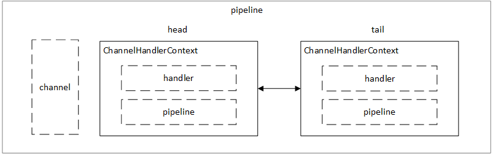
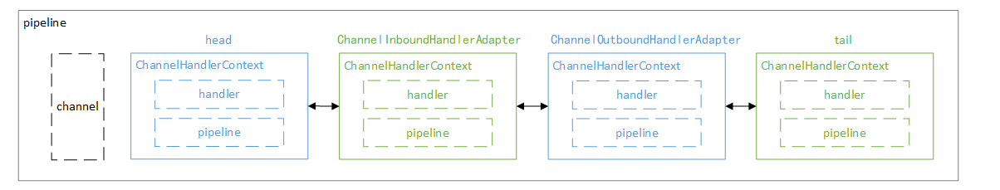
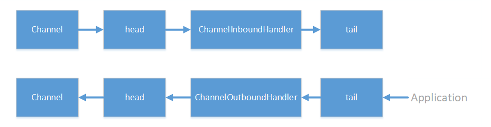

---
title: Netty 源码浅析——pipeline
tags: 
	- Netty
toc: true
date: 2019-10-07 13:38:47
---
在创建 Netty-Channel 的时候，我们会创建若干个组件，其中最重要的就是 pipeline 了。pipeline 可以看作是 Netty 的大动脉，所有对 Channel 的读写都要流过 pipeline，而 pipeline 也是 Netty 事件驱动的关键所在。

## pipeline 初始化

pipeline 在创建 Channel 的时候被创建：
```java
AbstractChannel
protected AbstractChannel(Channel parent) {
    this.parent = parent;
    id = newId();
    unsafe = newUnsafe();
    // 创建 pipeline
    pipeline = newChannelPipeline();
}
```
创建的时候会创建 head 和 tail 两个节点：
```java
DefaultChannelPipeline
protected DefaultChannelPipeline(Channel channel) {
    this.channel = ObjectUtil.checkNotNull(channel, "channel");
    succeededFuture = new SucceededChannelFuture(channel, null);
    voidPromise =  new VoidChannelPromise(channel, true);

    // 创建 head 和 tail 两个节点
    tail = new TailContext(this);
    head = new HeadContext(this);

    head.next = tail;
    tail.prev = head;
}
```
pipeline 中的每个节点是一个 ChannelHandlerContext 对象，一个 ChannelHandlerContext 对象包含一个事件处理器和事件所处上下文环境，其实就是所在 pipeline 的引用，因为通过 pipeline 可以拿到对应的 channel，从而拿到所有上下文信息：



## 添加 handler

创建了 pipeline 之后就是添加处理器，我们在用户代码中使用 `addLast()` 方法添加处理器：

```java
b.group(bossGroup, workerGroup)
        .channel(NioServerSocketChannel.class)
        .option(ChannelOption.SO_BACKLOG, 1024)
        .childOption(ChannelOption.TCP_NODELAY, true)
        .handler(new ServerHandler())
        .childHandler(new ChannelInitializer<SocketChannel>() {
            @Override
            public void initChannel(SocketChannel ch) {
                // 添加两个 handler
                ch.pipeline().addLast(new ChannelInboundHandlerAdapter());
                ch.pipeline().addLast(new ChannelOutboundHandlerAdapter());
                //..
            }
        });
```
添加之后的整体结构如下：



我用两种颜色区分了一下 pipeline 中两种不同类型的节点，一个是 ChannelInboundHandler，处理 inBound 事件，最典型的就是读取数据流，加工处理；还有一种类型的 handler 是 ChannelOutboundHandler，处理 outBound 事件，比如当调用 writeAndFlush() 类方法时，就会经过该种类型的 handler。不管是哪种类型的 handler，其外层对象 ChannelHandlerContext 都是通过 `addLast()` 方法添加到同一个双向链表中。我们来看一下核心代码：
```java
DefaultChannelPipeline
public final ChannelPipeline addFirst(EventExecutorGroup group, String name, ChannelHandler handler) {
    final AbstractChannelHandlerContext newCtx;
    synchronized (this) {
        // 1、检查可重复性
        checkMultiplicity(handler);
        // 2、创建 context 节点
        newCtx = newContext(group, filterName(name, handler), handler);
        // 3、添加至链表
        addFirst0(newCtx);

        //...
    }
    // 4、回调用户方法
    callHandlerAdded0(newCtx);
    return this;
}
```
我们看到 `addFirst()` 的核心代码是由 synchronized 包裹的，这是为了防止多线程并发插入。然后添加节点的操作被分成了四个部分：检查可重复性->创建 context 节点->添加至链表->回调用户方法。我们依次来看一下。

首先是检查可重复性：
```java
DefaultChannelPipeline
private static void checkMultiplicity(ChannelHandler handler) {
    if (handler instanceof ChannelHandlerAdapter) {
        ChannelHandlerAdapter h = (ChannelHandlerAdapter) handler;
        // 如果将要添加的 handler 不可被共享且已在其它 pipeline 上添加过，则抛出异常
        if (!h.isSharable() && h.added) {
            throw new ChannelPipelineException(
                    h.getClass().getName() +
                            " is not a @Sharable handler, so can't be added or removed multiple times.");
        }
        // 将 added 置为 true，表示已被添加过
        h.added = true;
    }
}
```
所谓可重复性是指一个 handler 是否可被添加到多个 Channel 的 pipeline 上。为什么需要有这一步操作呢？因为 Netty 是一个多线程的框架，多个 Channel 可以被同时并发地访问，而如果我们把一个非线程安全的 handler 同时添加在不同的 pipeline 上，就会带来安全性的问题。所以在使用中，如果我们需要在多条 pipeline 添加同一个 handler，那么我们就要在定义 handler 的时候用 @Sharable 这个注解来标明这个 handler 是线程安全的：
```java
@ChannelHandler.Sharable
public class ServerHandler extends ChannelInboundHandlerAdapter {
    //...
}
```
检查时，Netty 会根据 handler 上是否有 @Sharable 注解来判断这个 handler 是否可以被多次添加：
```java
ChannelHandlerAdapter
public boolean isSharable() {
   Class<?> clazz = getClass();
    // 通过 ThreadLocal 缓存是否可共享
    Map<Class<?>, Boolean> cache = InternalThreadLocalMap.get().handlerSharableCache();
    Boolean sharable = cache.get(clazz);
    if (sharable == null) {
        // 获取注解
        sharable = clazz.isAnnotationPresent(Sharable.class);
        cache.put(clazz, sharable);
    }
    return sharable;
}
```
可以看到 `isSharable()` 方法正是通过该 handler 对应的类是否标注 @Sharable 来判断 handler 是否可共享。为了性能，Netty 还使用了 ThreadLocal 来缓存状态信息，可谓是把优化做到了极致。

回到主流程，在检查可重复性之后就是创建 context 节点，这里我们先看到 `filterName(name, handler)` 方法，这个方法用于给 handler 生成一个唯一的名字：
```java
DefaultChannelPipeline
private String filterName(String name, ChannelHandler handler) {
    // 没有指定的名称就生成一个，默认是 null
    if (name == null) {
        return generateName(handler);
    }
    // 有指定的名称会检查是否重复，如果重复会抛出异常
    checkDuplicateName(name);
    return name;
}
```
如果我们指定了 handler 的名称，Netty 会对指定的名称做重复性检查，如果重复就会抛出异常。而默认情况下我们没有指定名称，所以传入的是 null，此时 Netty 会生成一个名字，Netty 创建默认名字的规则为 `简单类名#0`，下面我们来看些具体是怎么实现的：
```java
DefaultChannelPipeline
private static final FastThreadLocal<Map<Class<?>, String>> nameCaches;
private String generateName(ChannelHandler handler) {
    // 先查看缓存中是否有生成过默认 name
    Map<Class<?>, String> cache = nameCaches.get();
    Class<?> handlerType = handler.getClass();
    String name = cache.get(handlerType);
    // 没有生成过，就生成一个默认 name，加入缓存 
    if (name == null) {
        name = generateName0(handlerType);
        cache.put(handlerType, name);
    }
    // 生成完了，还要看默认 name 有没有冲突
    if (context0(name) != null) {
        String baseName = name.substring(0, name.length() - 1); // Strip the trailing '0'.
        for (int i = 1;; i ++) {
            String newName = baseName + i;
            if (context0(newName) == null) {
                name = newName;
                break;
            }
        }
    }
    return name;
}
```
Netty 使用一个 FastThreadLocal（后面的文章会细说）变量来缓存 handler 的类和默认名称的映射关系，在生成 name 的时候，首先查看缓存中有没有生成过默认 name，如果没有生成，就调用 `generateName0()` 方法生成默认 name，然后加入缓存。

接下来还需要检查 name 是否和 pipeline 上已有的 name 有冲突，调用 `context0()` 方法，查找 pipeline 里面有没有对应的 name：
```java
private AbstractChannelHandlerContext context0(String name) {
    AbstractChannelHandlerContext context = head.next;
    // 通过 next 线性搜索，比较名称是否相等
    while (context != tail) {
        if (context.name().equals(name)) {
            return context;
        }
        context = context.next;
    }
    return null;
}
```
`context0()` 方法遍历链表上每一个 ChannelHandlerContext，只要发现某个 context 的名字与待添加的 name 相同，就返回该 context。可以看到，这个其实是一个线性搜索的过程。

如果 `context0(name) != null` 成立，说明 pipeline 上已经有了一个和名称相同的 context，那么就从 `简单类名#0` 往上一直找，直到找到一个唯一的 name，比如 `简单类名#3`。

如果用户代码在添加 handler 的时候指定了一个 name，那么 Netty 就不再会为 handler 生成名称，如果用户指定的 name 和已有 handler 的名称重复，Netty 会直接抛出异常：

```java
DefaultChannelPipeline
private void checkDuplicateName(String name) {
    // 检查是否重复，如果重复则抛出异常
    if (context0(name) != null) {
        throw new IllegalArgumentException("Duplicate handler name: " + name);
    }
}
```

处理完 name 之后，就进入到创建 context 的过程：

```java
DefaultChannelHandlerContext
DefaultChannelHandlerContext(DefaultChannelPipeline pipeline, EventExecutor executor, String name, ChannelHandler handler) {
    super(pipeline, executor, name, handler.getClass());
    this.handler = handler;
}

AbstractChannelHandlerContext
AbstractChannelHandlerContext(DefaultChannelPipeline pipeline, EventExecutor executor, String name, Class<? extends ChannelHandler> handlerClass) {
    this.name = ObjectUtil.checkNotNull(name, "name");
    this.pipeline = pipeline;
    this.executor = executor;
    this.executionMask = mask(handlerClass);
    ordered = executor == null || executor instanceof OrderedEventExecutor;
}
```

我们看到在 DefaultChannelHandlerContext 和它的父类 AbstractChannelHandlerContext 中会把 handler、pipeline、name 等部件保存起来。这里有个属性叫 executionMask，可以翻译为执行掩码，这个执行掩码实际上按位存放了所有这个 handler 感兴趣事件。Netty 中有很多事件，比如 channelRegistered、channelActive、read、write、flush 等等，每个事件对应掩码中的某一位。当有事件需要传播时，可以通过和掩码做与操作来判断当前 handler 是否对这个事件感兴趣。那么掩码是如何生成的呢？我们进入 `mask()` 方法看一下：
```java
ChannelHandlerMask
private static int mask0(Class<? extends ChannelHandler> handlerType) {
    // 初始掩码为1，表示只关心 exceptionCaught 事件
    int mask = MASK_EXCEPTION_CAUGHT;
    try {
        // 判断当前类型是否是 ChannelInboundHandler 或者它的子类
        if (ChannelInboundHandler.class.isAssignableFrom(handlerType)) {
            // 如果是 ChannelInboundHandler 或者它的子类，就把所有 inbound 事件置为1
            mask |= MASK_ALL_INBOUND;
            // 下面的代码用排除的方式，把 handler 不感兴趣的 inbound 事件置为0（11-34）
            if (isSkippable(handlerType, "channelRegistered", ChannelHandlerContext.class)) {
                mask &= ~MASK_CHANNEL_REGISTERED;
            }
            if (isSkippable(handlerType, "channelUnregistered", ChannelHandlerContext.class)) {
                mask &= ~MASK_CHANNEL_UNREGISTERED;
            }
            if (isSkippable(handlerType, "channelActive", ChannelHandlerContext.class)) {
                mask &= ~MASK_CHANNEL_ACTIVE;
            }
            if (isSkippable(handlerType, "channelInactive", ChannelHandlerContext.class)) {
                mask &= ~MASK_CHANNEL_INACTIVE;
            }
            if (isSkippable(handlerType, "channelRead", ChannelHandlerContext.class, Object.class)) {
                mask &= ~MASK_CHANNEL_READ;
            }
            if (isSkippable(handlerType, "channelReadComplete", ChannelHandlerContext.class)) {
                mask &= ~MASK_CHANNEL_READ_COMPLETE;
            }
            if (isSkippable(handlerType, "channelWritabilityChanged", ChannelHandlerContext.class)) {
                mask &= ~MASK_CHANNEL_WRITABILITY_CHANGED;
            }
            if (isSkippable(handlerType, "userEventTriggered", ChannelHandlerContext.class, Object.class)) {
                mask &= ~MASK_USER_EVENT_TRIGGERED;
            }
        }
        // 判断当前类型是否是 ChannelOutboundHandler 或者它的子类
        if (ChannelOutboundHandler.class.isAssignableFrom(handlerType)) {
            // 如果是 ChannelOutboundHandler 或者它的子类，就把所有 outbound 事件置为1
            mask |= MASK_ALL_OUTBOUND;
            // 下面的代码用排除的方式，把 handler 不感兴趣的 outbound 事件置为0（41-67）
            if (isSkippable(handlerType, "bind", ChannelHandlerContext.class,
                    SocketAddress.class, ChannelPromise.class)) {
                mask &= ~MASK_BIND;
            }
            if (isSkippable(handlerType, "connect", ChannelHandlerContext.class, SocketAddress.class,
                    SocketAddress.class, ChannelPromise.class)) {
                mask &= ~MASK_CONNECT;
            }
            if (isSkippable(handlerType, "disconnect", ChannelHandlerContext.class, ChannelPromise.class)) {
                mask &= ~MASK_DISCONNECT;
            }
            if (isSkippable(handlerType, "close", ChannelHandlerContext.class, ChannelPromise.class)) {
                mask &= ~MASK_CLOSE;
            }
            if (isSkippable(handlerType, "deregister", ChannelHandlerContext.class, ChannelPromise.class)) {
                mask &= ~MASK_DEREGISTER;
            }
            if (isSkippable(handlerType, "read", ChannelHandlerContext.class)) {
                mask &= ~MASK_READ;
            }
            if (isSkippable(handlerType, "write", ChannelHandlerContext.class,
                    Object.class, ChannelPromise.class)) {
                mask &= ~MASK_WRITE;
            }
            if (isSkippable(handlerType, "flush", ChannelHandlerContext.class)) {
                mask &= ~MASK_FLUSH;
            }
        }
        // 最后判断是否关心 exceptionCaught 事件
        if (isSkippable(handlerType, "exceptionCaught", ChannelHandlerContext.class, Throwable.class)) {
            mask &= ~MASK_EXCEPTION_CAUGHT;
        }
    } catch (Exception e) {
        // Should never reach here.
        PlatformDependent.throwException(e);
    }

    return mask;
}
```
`mask()` 方法体非常长，但代码结构十分清晰。Netty 会首先判断当前的 handler 的类型是否是 ChannelInboundHandler 或者它的子类，如果是的话，就把所有 inbound 相关事件置为 1，然后用排除法把 handler 不感兴趣的 inbound 事件置为 0；同理，处理 outbound 事件时也会先判断它是否是 ChannelOutboundHandler 或者它的子类，如果是的话，就把所有 outbound 相关事件置为 1，然后用排除法把 handler 不感兴趣的 outbound 事件置为 0。那么 Netty 是如何判断当前 handler 对某一个事件不感兴趣的呢？我们看到它使用了 `isSkippable()` 方法：
```java
ChannelHandlerMask
private static boolean isSkippable(final Class<?> handlerType, final String methodName, final Class<?>... paramTypes) throws Exception {
    return AccessController.doPrivileged(new PrivilegedExceptionAction<Boolean>() {
        @Override
        public Boolean run() throws Exception {
            // 判断方法上是否有 @Skip 注解
            return handlerType.getMethod(methodName, paramTypes).isAnnotationPresent(Skip.class);
        }
    });
}
```
方法内部通过判断 handler 的对应方法上是否有 @Skip 注解来判断它是否对一个事件不感兴趣。这里我们可能会有一个疑问：通常我们的 handler 只会关注一到两个事件，也就是大部分事件我们都是不关心的，那么我们在定义 handler 的时候，难道要在所有方法上都加个 @Skip 注解？其实是不用的，因为 Netty 已经在 Adapter 里面帮我们写好了：
```java
public class ChannelInboundHandlerAdapter extends ChannelHandlerAdapter implements ChannelInboundHandler {
    // 所有的方法上都有 @Skip 注解
    @Skip
    @Override
    public void channelRegistered(ChannelHandlerContext ctx) throws Exception {
        ctx.fireChannelRegistered();
    }

    @Skip
    @Override
    public void channelUnregistered(ChannelHandlerContext ctx) throws Exception {
        ctx.fireChannelUnregistered();
    }
    //...
}
```
也就是说，对于用户来说，只要继承了 Adapter，那么所有用户没有重写的方法都是 @Skip 的，只有用户重写了的方法才是没有 @Skip 的。也就是说，只有这些由用户重写了的方法是 handler 关心的，其它由 Adapter 提供默认实现的方法是 handler 不关心的。

回到主流程，context 创建完之后，接下来就是添加节点至链表，这个过程非常简单，就是常见的链表添加操作，相信大家都能看懂：
```java
DefaultChannelHandlerContext
private void addLast0(AbstractChannelHandlerContext newCtx) {
    AbstractChannelHandlerContext prev = tail.prev;
    newCtx.prev = prev;
    newCtx.next = tail;
    prev.next = newCtx;
    tail.prev = newCtx;
}
```
这里要提一点就是 `addLast()` 和 `addFirst()` 中的 last 和 first 是相对除了 head 和 tail 节点的链表而言的，head 和 tail 永远都是链表的首部和尾部。

回到主流程，节点添加的最后一步就是回调用户代码，核心代码如下：
```java
AbstractChannelHandlerContext
final void callHandlerAdded() throws Exception {
    // 设置 handler 状态
    if (setAddComplete()) {
        // 回调用户代码
        handler().handlerAdded(this);
    }
}
```
`setAddComplete()` 会通过 cas 设置 handler 状态：
```java
AbstractChannelHandlerContext
final void setAddComplete() {
    for (;;) {
        int oldState = handlerState;
        if (oldState == REMOVE_COMPLETE || HANDLER_STATE_UPDATER.compareAndSet(this, oldState, ADD_COMPLETE)) {
            return;
        }
    }
}
```
然后调用用户的回调方法，常见的定义如下：
```java
public class DemoHandler extends SimpleChannelInboundHandler<...> {
    @Override
    public void handlerAdded(ChannelHandlerContext ctx) throws Exception {
        // 节点被添加完毕之后回调到此
        // do something
    }
}
```
到此，handler 的添加过程就结束了。

## 删除 handler

Netty 有个最大的特性之一就是 handler 可插拔，做到动态编织 pipeline，比如在首次建立连接的时候，需要通过进行权限认证，在认证通过之后，就可以将此 context 移除，下次 pipeline 在传播事件的时候就不会调用到权限认证处理器。

下面是权限认证 handler 最简单的实现，第一个数据包传来的是认证信息，如果校验通过，就删除此 handler，否则，直接关闭连接：
```java
public class AuthHandler extends SimpleChannelInboundHandler<ByteBuf> {
    @Override
    protected void channelRead0(ChannelHandlerContext ctx, ByteBuf data) throws Exception {
        if (verify(authDataPacket)) {
            ctx.pipeline().remove(this);
        } else {
            ctx.close();
        }
    }

    private boolean verify(ByteBuf byteBuf) {
        //...
    }
}
```
重点就在 ctx.pipeline().remove(this) 这段代码，这段代码把 AuthHandler 从当前 pipeline 移除，我们看看是怎么实现的：
```java
DefaultChannelPipeline
public final ChannelPipeline remove(ChannelHandler handler) {
    // 1、找到待删除节点
    remove(getContextOrDie(handler));
    return this;
}
DefaultChannelPipeline
private AbstractChannelHandlerContext remove(final AbstractChannelHandlerContext ctx) {
    synchronized (this) {
        // 2、从链表上删除
        remove0(ctx);
        //..
    }
    // 3、回调用户方法
    callHandlerRemoved0(ctx);
    return ctx;
}

```
首先是找到待删除的节点，过程很简单：
```java
DefaultChannelPipeline
private AbstractChannelHandlerContext getContextOrDie(ChannelHandler handler) {
    // 顺序搜索对应节点
    AbstractChannelHandlerContext ctx = (AbstractChannelHandlerContext) context(handler);
    // 没找到就抛出异常
    if (ctx == null) {
        throw new NoSuchElementException(handler.getClass().getName());
    } else {
        return ctx;
    }
}

DefaultChannelPipeline
public final ChannelHandlerContext context(ChannelHandler handler) {
    AbstractChannelHandlerContext ctx = head.next;
    // 从头节点开始不断 next 搜索，对比 handler 是否相同
    for (;;) {

        if (ctx == null) {
            return null;
        }
        // 如果 handler 相同，返回当前的 context 节点
        if (ctx.handler() == handler) {
            return ctx;
        }

        ctx = ctx.next;
    }
}
```
这里为了找到 handler 对应的 context，照样是通过依次遍历双向链表的方式，直到某一个 context 的 handler 和当前 handler 相同，便找到了该节点。

找到节点之后就是把节点从链表中删除，和添加一样，都是常规的链表操作：
```java
DefaultChannelPipeline
private static void remove0(AbstractChannelHandlerContext ctx) {
    AbstractChannelHandlerContext prev = ctx.prev;
    AbstractChannelHandlerContext next = ctx.next;
    prev.next = next;
    next.prev = prev;
}
```
最后是回调用户代码，在回调后会修改 handler 当前状态：
```java
AbstractChannelHandlerContext
final void callHandlerRemoved() throws Exception {
    try {
        // 判断当前 handler 状态
        if (handlerState == ADD_COMPLETE) {
            // 回调用户方法
            handler().handlerRemoved(this);
        }
    } finally {
        // 修改 handler 状态
        handlerState = REMOVE_COMPLETE;
    }
}
```
到此，删除节点的操作就做完了。相比添加而言删除节点比较简单。

## inbound 和 outbound

Netty 中的处理器分两类：一类是入站处理器（ChannelInboundHandler），专门用于处理入站（inbound）事件；另一类是出站处理器（ChannelOutboundHandler），专门用于处理出站（outbound）事件。inbound 事件和 outbound 事件都会沿着 pipeline 传播，但两者传播的方向不一样：inbound 事件是从头节点到尾节点，而 outbound 事件是从尾节点传到头节点。两者传播的示意图如下：



从大方向上而言，inbound 事件主要是发生在数据被接收或者 Channel 状态发生改变时；而 outbound 事件发生在数据发送或者用户对 Channel 进行操作时。从用户的角度而言，inbound 事件是被动接收的，而 outbound 事件是主动发起的。具体事件列表如下：

** inbound 事件：**

| 事件  | 描述 |
| ---- | --- |
| channelRegistered | 当 Channel 已经注册到它的 EventLoop 时被调用 |
| channelUnregistered | 当 Channel 已经从它的 EventLoop 注销时被调用 |
| channelActive | 当 Channel 已经连接到远程节点/已经绑定到端口（可以接受和发送数据）时被调用　 |
| channelInactive | 当 Channel 已经和远程节点断开/已经和端口解绑时被调用 |
| channelRead | 从 Channel 读取数据时被调用 |
| channelReadComplete | 当所有可读字节都已经从 Channel 中读取后被调用 |
| channelWritabilityChanged | 当 Channel 的可写状态发生改变时被调用 |
| userEventTriggered | 用户可以通过 fireUserEventTriggered() 方法主动触发 |

** outbound 事件：**

| 事件  | 描述 |
| ---- | ---- |
| bind | 当请求将 Channel 绑定到端口时被调用 |
| connect | 当请求将 Channel 连接到远程节点时被调用 |
| disconnect　　　 | 当请求将 Channel 从远程节点断开时被调用 |
| close | 当请求关闭 Channel 时被调用 |
| deregister | 当请求将 Channel 从它的 EventLoop 注销时被调用 |
| read | 当请求从 Channel 读取更多数据时被调用 |
| flush | 当请求通过 Channel 将入队数据冲刷到远程节点时被调用 |
| write | 当请求通过 Channel 将数据写到远程节点时被调用 |

其中，读写数据是我们最常见的场景，也是最具代表性的 inbound 和 outbound 事件。接下来我们将分别从读写两种场景观察 pipeline 事件传播的机制。

## inbound 事件传播

首先是读事件的传播，我们先从客户端发送数据，然后观察服务端是如何读取这些数据的。客户端代码如下：
```java
public class Client {
    public static void main(String[] args) throws Exception {
        EventLoopGroup workerGroup = new NioEventLoopGroup();
        try {
            Bootstrap b = new Bootstrap();
            b.group(workerGroup)
                    .channel(NioSocketChannel.class)
                    .handler(new ChannelInitializer<SocketChannel>() {
                        @Override
                        protected void initChannel(SocketChannel ch) throws Exception {
                            
                        }
                    });

            // 连接到服务器
            ChannelFuture f = b.connect("127.0.0.1",8888).sync();
            // 获取 buffer
            ByteBuf buf = PooledByteBufAllocator.DEFAULT.buffer();
            // 把消息写入 buffer
            buf.writeBytes("hello".getBytes());
            // 把 buffer 中的数据写到 channel 并刷新
            f.channel().writeAndFlush(buf).sync();
        } finally {
            workerGroup.shutdownGracefully();
        }
    }
}
```
上面代码是一个简单的客户端代码，会在连接到服务器后发送字符串“hello”到服务端。然后是服务端代码：
```java
public final class Server {

    public static void main(String[] args) throws Exception {
        EventLoopGroup bossGroup = new NioEventLoopGroup(1);
        EventLoopGroup workerGroup = new NioEventLoopGroup();

        try {
            ServerBootstrap b = new ServerBootstrap();
            b.group(bossGroup, workerGroup)
                    .channel(NioServerSocketChannel.class)
                    .option(ChannelOption.SO_BACKLOG, 1024)
                    .childOption(ChannelOption.TCP_NODELAY, true)
                    .childHandler(new ChannelInitializer<SocketChannel>() {
                        @Override
                        public void initChannel(SocketChannel ch) {
                            ch.pipeline().addLast(new ChannelInboundHandlerAdapter() {
                                @Override
                                public void channelRead(ChannelHandlerContext ctx, Object msg) throws Exception {
                                    // 接收到 buffer
                                    ByteBuf buf = (ByteBuf)msg;
                                    // 打印标签 A
                                    System.out.print("InboundHandlerA:");
                                    // 以字符串形式打印 buffer 中内容
                                    System.out.println(buf.toString(Charset.defaultCharset()));
                                    // 继续传播读事件
                                    ctx.fireChannelRead(msg);
                                }
                            });
                            ch.pipeline().addLast(new ChannelInboundHandlerAdapter() {
                                @Override
                                public void channelRead(ChannelHandlerContext ctx, Object msg) throws Exception {
                                    // 接收到 buffer
                                    ByteBuf buf = (ByteBuf)msg;
                                    // 打印标签 B
                                    System.out.print("InboundHandlerB:");
                                    // 以字符串形式打印 buffer 中内容
                                    System.out.println(buf.toString(Charset.defaultCharset()));
                                    // 继续传播读事件
                                    ctx.fireChannelRead(msg);
                                }
                            });
                            ch.pipeline().addLast(new ChannelInboundHandlerAdapter() {
                                @Override
                                public void channelRead(ChannelHandlerContext ctx, Object msg) throws Exception {
                                    // 接收到 buffer
                                    ByteBuf buf = (ByteBuf)msg;
                                    // 打印标签 C
                                    System.out.print("InboundHandlerC:");
                                    // 以字符串形式打印 buffer 中内容
                                    System.out.println(buf.toString(Charset.defaultCharset()));
                                    // 继续传播读事件
                                    ctx.fireChannelRead(msg);
                                }
                            });
                        }
                    });
            // 启动服务器，监听 8888 端口
            ChannelFuture f = b.bind(8888).sync();
            f.channel().closeFuture().sync();
        } finally {
            bossGroup.shutdownGracefully();
            workerGroup.shutdownGracefully();
        }
    }
}
```
上面是一段服务器代码，可以看到在服务端的 pipeline 上依次添加了 A、B、C 三个 inbound 处理器，每个处理器在接收到读事件后会打印自己的标签和缓冲区的内容。服务端的 pipeline 顺序如下图所示：


最终程序运行结果为：

```
InboundHandlerA:hello
InboundHandlerB:hello
InboundHandlerC:hello
```
可以看到，读事件在 pipeline 中是从 head 传播到 tail 的，并且每个 handler 都接收到了 Channel 中的数据。那么这一切是怎么发生的呢？我们来看一下源码。

根据前几章的知识，我们知道了 Channel 是注册在 NioEventLoop 上的，而 NioEventLoop 在不停地轮询读写事件，所以当客户端的数据达到时，第一时间是由 NioEventLoop 处理的，这也是我们阅读源码的起点：

```java
// NioEventLoop
private void processSelectedKey(SelectionKey k, AbstractNioChannel ch) {
    final AbstractNioChannel.NioUnsafe unsafe = ch.unsafe();
    try {
        //...
        // 检测到读事件，调用 unsafe.read()
        if ((readyOps & (SelectionKey.OP_READ | SelectionKey.OP_ACCEPT)) != 0 || readyOps == 0) {
            unsafe.read();
        }
    } catch (CancelledKeyException ignored) {
        unsafe.close(unsafe.voidPromise());
    }
}
```
上面这段代码在新连接接入一章提到过，当检测到读事件之后，Netty 会调用 Channel 上绑定的 unsafe 的 `read()` 方法：
```java
NioByteUnsafe
public final void read() {
    final ChannelPipeline pipeline = pipeline();
    final ByteBufAllocator allocator = config.getAllocator();
    final RecvByteBufAllocator.Handle allocHandle = recvBufAllocHandle();
    allocHandle.reset(config);
    ByteBuf byteBuf = null;
    try {
        do {
            // 为 byteBuf 分配内存
            byteBuf = allocHandle.allocate(allocator);
            // 将 Channel 中的数据读到 byteBuf
            allocHandle.lastBytesRead(doReadBytes(byteBuf));
            allocHandle.incMessagesRead(1);
            readPending = false;
            // 传播 ChannelRead 事件
            pipeline.fireChannelRead(byteBuf);
            byteBuf = null;
        } while (allocHandle.continueReading());
        allocHandle.readComplete();
        // 传播 readComplete 事件
        pipeline.fireChannelReadComplete();
    } catch (Throwable t) {
        //...
    } finally {
        //...
    }
}
```
Netty 会首先为有数据的 Channel 创建 byteBuf，然后把 Channel 中的数据读到 byteBuf 中。我们的重点是 `pipeline.fireChannelRead(byteBuf);` 这一行，这行代码中 Netty 会传播一个读事件，我们看一下实际的流程：
```java
DefaultChannelPipeline
public final ChannelPipeline fireChannelRead(Object msg) {
    // 调用静态方法 invokeChannelRead，传入 head 节点和 msg
    AbstractChannelHandlerContext.invokeChannelRead(head, msg);
    return this;
}
```
首先是调用一个静态方法 `invokeChannelRead()`，传入的是 head 节点和 msg：
```java
AbstractChannelHandlerContext
static void invokeChannelRead(final AbstractChannelHandlerContext next, Object msg) {
    final Object m = next.pipeline.touch(ObjectUtil.checkNotNull(msg, "msg"), next);
    EventExecutor executor = next.executor();
    // 如果当前线程是 Channel 所在线程，直接执行
    if (executor.inEventLoop()) {
        // 调用当前节点的 invokeChannelRead 方法
        next.invokeChannelRead(m);
    } else {
        // 如果当前线程不是 Channel 所在线程，把执行逻辑提交给异步任务队列
        executor.execute(new Runnable() {
            @Override
            public void run() {
                next.invokeChannelRead(m);
            }
        });
    }
}
```
这里 Netty 为了确保线程的安全性，会确保操作在 Channel 所在 NioEventLoop 的线程中执行。然后调用当前节点的 `invokeChannelRead()` 方法，当前的节点是 head，所以调用 head 节点的 `invokeChannelRead()` 方法：
```java
AbstractChannelHandlerContext
private void invokeChannelRead(Object msg) {
    // 判断节点状态
    if (invokeHandler()) {
        try {
            // 获取节点的 handler，调用 handler 的 channelRead 方法
            ((ChannelInboundHandler) handler()).channelRead(this, msg);
        } catch (Throwable t) {
            //...
        }
    } else {
        fireChannelRead(msg);
    }
}
```
首先会判断当前节点的状态，然后拿到当前节点内部的 handler，调用该 handler 的 `channelRead()` 方法，这里拿到的是 HeadContext 本身：
```java
HeadContext
public void channelRead(ChannelHandlerContext ctx, Object msg) {
    // 传播读事件
    ctx.fireChannelRead(msg);
}
```
可以看到 HeadContext 在收到读事件后没有进行任何操作，而是通过 `fireChannelRead()` 方法直接把事件往下传播：
```java
AbstractChannelHandlerContext
public ChannelHandlerContext fireChannelRead(final Object msg) {
    // 找到下一个节点，继续传播
    invokeChannelRead(findContextInbound(MASK_CHANNEL_READ), msg);
    return this;
}
```
和刚开始一样，这里依然是调用静态方法 `invokeChannelRead()`，但是传入的参数变化了，传入的不是 head，而是通过 `findContextInbound(MASK_CHANNEL_READ)` 方法找到的下一个节点。

我们把视角放到 `findContextInbound(MASK_CHANNEL_READ)` 这个方法上来。这里传入的 MASK_CHANNEL_READ 其实就是 channelRead 事件的掩码，所以从语义上，这是要找到下一个关注 channelRead 事件的节点，我们来看一下内部是怎么实现的：
```java
AbstractChannelHandlerContext
private AbstractChannelHandlerContext findContextInbound(int mask) {
    AbstractChannelHandlerContext ctx = this;
    do {
        ctx = ctx.next;
    } while ((ctx.executionMask & mask) == 0);
    return ctx;
}
```
可以看到 Netty 会从当前节点开始不断往下找，直到找到第一个执行掩码和 channelRead 事件的掩码相与不为 0 的节点，返回。

当我们重写 `channelRead()` 方法之后，节点在 channelRead 所在位上的掩码就被置为了 1，因此我们自定义的三个处理器 A、B、C 的执行掩码和 channelRead 事件的掩码相与的结果都不为0，三个处理器会被依次调用，执行它们的 `channelRead()` 方法。

那么 inbound 事件的传播在什么地方结束呢？如果我们自定义的 handler 没有进行 `fireChannelRead()` 操作的话，那么传播就会在那个 handler 结束。而如果我们的 handler 都有 `fireChannelRead()` 这步操作的话，传播会在 tail 节点结束：
```java
TailContext
public void channelRead(ChannelHandlerContext ctx, Object msg) {
    onUnhandledInboundMessage(msg);
}
```
上面是 tail 节点的 `channelRead()` 方法，可以看到 tail 节点没有继续进行 `fireChannelRead()` 操作，而是通过一个 `onUnhandledInboundMessage()` 方法拦住了事件的传播。这个方法的内部如下：
```java
DefaultChannelPipeline
protected void onUnhandledInboundMessage(Object msg) {
    try {
        // 打印提示
        logger.debug("Discarded inbound message {} that reached at the tail of the pipeline. " +
                        "Please check your pipeline configuration.", msg);
    } finally {
        // 释放 bytebuf
        ReferenceCountUtil.release(msg);
    }
}
```
方法会打印一个提示，提示用户没有对 channelRead 事件进行拦截，然后会释放 bytebuf，相当于做了一个兜底操作。

那么到这里，一次读事件的传播就结束了。

## outbound 事件传播

outbound 事件中典型的就是写事件。我们来看一下写事件是如何在 pipeline 上传播的。

首先是搭建一个实验场景：
```java
public class Client {
    public static void main(String[] args) throws Exception {
        EventLoopGroup workerGroup = new NioEventLoopGroup();
        try {
            Bootstrap b = new Bootstrap();
            b.group(workerGroup)
                    .channel(NioSocketChannel.class)
                    .handler(new ChannelInitializer<SocketChannel>() {
                        @Override
                        protected void initChannel(SocketChannel ch) throws Exception {
                            ch.pipeline().addLast(new ChannelOutboundHandlerAdapter(){
                                @Override
                                public void write(ChannelHandlerContext ctx, Object msg, ChannelPromise promise) throws Exception {
                                    // 打印标签 A
                                    System.out.print("ChannelOutboundHandlerA:");
                                    // 打印写入的数据
                                    System.out.println(((ByteBuf)msg).toString(Charset.defaultCharset()));
                                    // 继续传播写事件
                                    ctx.write(msg);
                                }
                            });
                            ch.pipeline().addLast(new ChannelOutboundHandlerAdapter(){
                                @Override
                                public void write(ChannelHandlerContext ctx, Object msg, ChannelPromise promise) throws Exception {
                                    // 打印标签 B
                                    System.out.print("ChannelOutboundHandlerB:");
                                    // 打印写入的数据
                                    System.out.println(((ByteBuf)msg).toString(Charset.defaultCharset()));
                                    // 继续传播写事件
                                    ctx.write(msg);
                                }
                            });
                            ch.pipeline().addLast(new ChannelOutboundHandlerAdapter(){
                                @Override
                                public void write(ChannelHandlerContext ctx, Object msg, ChannelPromise promise) throws Exception {
                                    // 打印标签 C
                                    System.out.print("ChannelOutboundHandlerC:");
                                    // 打印写入的数据
                                    System.out.println(((ByteBuf)msg).toString(Charset.defaultCharset()));
                                    // 继续传播写事件
                                    ctx.write(msg);
                                }
                            });
                            ch.pipeline().addLast(new ChannelInboundHandlerAdapter(){
                                @Override
                                public void channelActive(ChannelHandlerContext ctx) throws Exception {
                                    // 在连接建立时写入一个 "hello" 到 Channel
                                    ByteBuf buf = PooledByteBufAllocator.DEFAULT.buffer();
                                    buf.writeBytes("hello".getBytes());
                                    ctx.pipeline().write(buf);
                                }
                            });
                        }
                    });

            // 连接到服务器
            ChannelFuture f = b.connect("127.0.0.1",8888).sync();
        } finally {
            workerGroup.shutdownGracefully();
        }
    }
}
```
这次实验的服务端代码和上一小节中的一样，重点是客户端代码。我们在客户端代码中加入了 A、B、C 三个 outbound 事件处理器，每个处理器都会监听 pipeline 上的 write 事件并打印写入的数据。另有一个处理器用于在连接建立时向 Channel 写入数据。三个 outbound 事件处理器在 pipeline 上的顺序如下：


最终程序运行结果如下：

```
ChannelOutboundHandlerC:hello
ChannelOutboundHandlerB:hello
ChannelOutboundHandlerA:hello
```

可以看到写事件传播的方向和读事件相反，是从尾结点向头节点传播的。下面我们从源码的角度来看一下事件传播的过程。

首先是写事件的起点，`ctx.pipeline().write(buf)` 这行代码：
```java
DefaultChannelPipeline
public final ChannelFuture write(Object msg) {
    // 调用 tail 节点的 write 方法
    return tail.write(msg);
}
```
进入之后会发现，pipeline 会调用 tail 节点的 `write()` 方法：
```java
AbstractChannelHandlerContext
public ChannelFuture write(Object msg) {
    // 调用重载方法，传入一个 promise
    return write(msg, newPromise());
}

AbstractChannelHandlerContext
public ChannelFuture write(final Object msg, final ChannelPromise promise) {
    // 调用重载方法，第二个参数是 flush，传入为 false
    write(msg, false, promise);
    return promise;
}

AbstractChannelHandlerContext
private void write(Object msg, boolean flush, ChannelPromise promise) {
    // write 方法的核心代码，这里的 flush 为 false
    // 查找下一个节点
    final AbstractChannelHandlerContext next = findContextOutbound(flush ? (MASK_WRITE | MASK_FLUSH) : MASK_WRITE);
    final Object m = pipeline.touch(msg, next);
    EventExecutor executor = next.executor();
    // 确保 write 操作在 NioEventLoop 的内部线程中
    if (executor.inEventLoop()) {
        // 根据是否 flush 传播不同的事件
        if (flush) {
            next.invokeWriteAndFlush(m, promise);
        } else {
            next.invokeWrite(m, promise);
        }
    } else {
        final AbstractWriteTask task;
        if (flush) {
            task = WriteAndFlushTask.newInstance(next, m, promise);
        }  else {
            task = WriteTask.newInstance(next, m, promise);
        }
    }
}
```
这里 write 方法有三个重载的版本，核心代码在第三个版本中。我们把眼光放到第 18 行的 `findContextOutbound()` 方法上。传播 inbound 事件时有个类似的方法，会根据传入的事件掩码查找下一个匹配的节点。这里当我们的 flush 为 false 时，查找的是下一个关注 write 事件的节点：
```java
AbstractChannelHandlerContext
private AbstractChannelHandlerContext findContextOutbound(int mask) {
    AbstractChannelHandlerContext ctx = this;
    do {
        ctx = ctx.prev;
    } while ((ctx.executionMask & mask) == 0);
    return ctx;
}
```
可以看到内部的逻辑和之前的方法很像，只是这里是通过 while 循环不断找到前一个节点。这也是为什么 outbound 事件和 inbound 事件传播方向不一样的原因了。

回到 write 方法，在找到 next 节点后，会判断当前线程是否是 Channel 绑定的 NioEventLoop 的内部线程，这是出于线程安全的考虑。然后会调用 next 节点的 `invokeWrite()` 方法。当前这里的 next 节点就是我们的 C 处理器。会调用该处理器的 `invokeWrite()` 方法：
```java
AbstractChannelHandlerContext
private void invokeWrite(Object msg, ChannelPromise promise) {
    // 判断节点状态
    if (invokeHandler()) {
        // 实际执行方法
        invokeWrite0(msg, promise);
    } else {
        write(msg, promise);
    }
}

AbstractChannelHandlerContext
private void invokeWrite0(Object msg, ChannelPromise promise) {
    try {
        // 调用 handler 的 write 方法，这里是我们自定义的第三个  handler
        ((ChannelOutboundHandler) handler()).write(this, msg, promise);
    } catch (Throwable t) {
        notifyOutboundHandlerException(t, promise);
    }
}
```
首先会判断节点状态，然后调用节点内部的 handler 的 `write()` 方法，这个方法就是我们在用户代码中自定义的：
```java
Client
public void write(ChannelHandlerContext ctx, Object msg, ChannelPromise promise) throws Exception {
    System.out.print("ChannelOutboundHandlerC:");
    System.out.println(((ByteBuf)msg).toString(Charset.defaultCharset()));
    ctx.write(msg);
}
```
最终用户代码会通过 `ctx.write(msg)` 把写事件传播到下一个节点。

那么如果我们始终不对写事件进行拦截，写事件最终会传播到哪呢？答案是最终会传播到 head 节点：
```java
HeadContext
public void write(ChannelHandlerContext ctx, Object msg, ChannelPromise promise) {
    unsafe.write(msg, promise);
}
```
可以看到在 head 节点中，不会再传播写事件，而是会调用 unsafe 的 write() 方法对事件进行拦截：
```java
public final void write(Object msg, ChannelPromise promise) {
    // 拿到 unsafe 的 outboundBuffer
    ChannelOutboundBuffer outboundBuffer = this.outboundBuffer;
    //...
    // 把消息写到 outboundBuffer 中
    outboundBuffer.addMessage(msg, size, promise);
}
```
最终消息会被写到 unsafe 内部的一个 outboundBuffer 中。这是每个  unsafe 内部保存的一个缓冲区，用于缓冲将要写到 Channel 中的数据。当我们调用 `flush()` 方法时，这里的数据会被刷到 Channel 中。

到此，outbound 事件传播的过程也结束了。

## 异常的传播

前两节我们看到了 inbound 和 outbound 事件的传播，而这一章来看一下另一个非常重要的部分，异常传播。

Netty 之所以可靠的一个很重要的原因，就是我们可以在每个处理器上去捕获上游节点抛出的异常。捕获的方法为 `exceptionCaught`，这是每种类型的处理器都需要实现的方法。而如果我们用户代码没有捕获异常，Netty 也会做些兜底的措施，防止异常影响到线程正常运行。我们来看一下 Netty 具体是怎么做的。

和前两节一样，我们先介绍一下实验环境：
```java
public class Client {
    public static void main(String[] args) throws Exception {
        EventLoopGroup workerGroup = new NioEventLoopGroup();
        try {
            Bootstrap b = new Bootstrap();
            b.group(workerGroup)
                    .channel(NioSocketChannel.class)
                    .handler(new ChannelInitializer<SocketChannel>() {
                        @Override
                        protected void initChannel(SocketChannel ch) throws Exception {
                            ch.pipeline().addLast(new ChannelHandlerAdapter() {
                                @Override
                                public void exceptionCaught(ChannelHandlerContext ctx, Throwable cause) throws Exception {
                                    // 打印标签
                                    System.out.print("ChannelHandlerA catches:");
                                    // 打印错误信息
                                    System.out.println(cause.getMessage());
                                    // 继续传播异常
                                    ctx.fireExceptionCaught(cause);
                                }
                            });
                            ch.pipeline().addLast(new ChannelInboundHandlerAdapter() {
                                @Override
                                public void channelActive(ChannelHandlerContext ctx) throws Exception {
                                    System.out.println("ChannelHandlerB throws exception");
                                    // 抛出异常
                                    throw new Exception("Exception from B");
                                }
                            });
                            ch.pipeline().addLast(new ChannelHandlerAdapter() {
                                @Override
                                public void exceptionCaught(ChannelHandlerContext ctx, Throwable cause) throws Exception {
                                    // 打印标签
                                    System.out.print("ChannelHandlerC catches:");
                                    // 打印错误信息
                                    System.out.println(cause.getMessage());
                                    // 继续传播异常
                                    ctx.fireExceptionCaught(cause);
                                }
                            });
                        }
                    });

            // 连接到服务器
            ChannelFuture f = b.connect("127.0.0.1", 8888).sync();
        } finally {
            workerGroup.shutdownGracefully();
        }
    }
}
```
还是在我们的客户端，我们添加了 A、B、C 三个处理器，当客户端连上服务器后，处理器 B 会抛出一个异常，A、C 处理器监听异常事件并在收到异常事件后打印异常的信息。三个处理器在 pipeline 上的关系如下：


程序最终的结果如下：
```
ChannelHandlerB throws exception
ChannelHandlerC catches:Exception from B
十月 07, 2019 6:59:37 下午 io.netty.channel.DefaultChannelPipeline onUnhandledInboundException
警告: An exceptionCaught() event was fired, and it reached at the tail of the pipeline. It usually means the last handler in the pipeline did not handle the exception.
java.lang.Exception: Exception from B
	at test.Client$1$2.channelActive(Client.java:40)
	at io.netty.channel.AbstractChannelHandlerContext.invokeChannelActive(AbstractChannelHandlerContext.java:225)
	at io.netty.channel.AbstractChannelHandlerContext.invokeChannelActive(AbstractChannelHandlerContext.java:211)
	at io.netty.channel.AbstractChannelHandlerContext.fireChannelActive(AbstractChannelHandlerContext.java:204)
	at io.netty.channel.DefaultChannelPipeline$HeadContext.channelActive(DefaultChannelPipeline.java:1396)
	at io.netty.channel.AbstractChannelHandlerContext.invokeChannelActive(AbstractChannelHandlerContext.java:225)
	at io.netty.channel.AbstractChannelHandlerContext.invokeChannelActive(AbstractChannelHandlerContext.java:211)
	at io.netty.channel.DefaultChannelPipeline.fireChannelActive(DefaultChannelPipeline.java:906)
	at io.netty.channel.nio.AbstractNioChannel$AbstractNioUnsafe.fulfillConnectPromise(AbstractNioChannel.java:311)
	at io.netty.channel.nio.AbstractNioChannel$AbstractNioUnsafe.finishConnect(AbstractNioChannel.java:341)
	at io.netty.channel.nio.NioEventLoop.processSelectedKey(NioEventLoop.java:670)
	at io.netty.channel.nio.NioEventLoop.processSelectedKeysOptimized(NioEventLoop.java:617)
	at io.netty.channel.nio.NioEventLoop.processSelectedKeys(NioEventLoop.java:534)
	at io.netty.channel.nio.NioEventLoop.run(NioEventLoop.java:496)
	at io.netty.util.concurrent.SingleThreadEventExecutor$5.run(SingleThreadEventExecutor.java:906)
	at io.netty.util.internal.ThreadExecutorMap$2.run(ThreadExecutorMap.java:74)
	at io.netty.util.concurrent.FastThreadLocalRunnable.run(FastThreadLocalRunnable.java:30)
	at java.lang.Thread.run(Thread.java:748)
```
可以看到，只有处理器 C 接收到了异常事件（第二行），而处理器 A 没有收到。另外 Netty 打印了一个警告和异常的堆栈信息。

我们从源码中看一下发生了什么：
```java
AbstractChannelHandlerContext
private void invokeChannelActive() {
    if (invokeHandler()) {
        try {
            ((ChannelInboundHandler) handler()).channelActive(this);
        } catch (Throwable t) {
            // catch 住异常
            notifyHandlerException(t);
        }
    } else {
        fireChannelActive();
    }
}
```
在传播事件的过程中，如果发生了异常，就会在对应的 `invokeXXX()` 方法中 catch 住这个异常。catch 的方法体内会调用 `notifyHandlerException()` 方法：
```java
AbstractChannelHandlerContext
private void notifyHandlerException(Throwable cause) {
    //...
    invokeExceptionCaught(cause);
}
```
我们看到了一个 `invokeExceptionCaught()` 方法，从名字可以知道这个方法会执行节点的 `exceptionCaught()` 方法：
```java
AbstractChannelHandlerContext
private void invokeExceptionCaught(final Throwable cause) {
    // 判断节点状态
    if (invokeHandler()) {
        try {
            // 调用 handler 的 exceptionCaught 方法
            handler().exceptionCaught(this, cause);
        } catch (Throwable error) {
            //...
        }
    } else {
        fireExceptionCaught(cause);
    }
}

ChannelHandlerAdapter
public void exceptionCaught(ChannelHandlerContext ctx, Throwable cause)
        throws Exception {
    // 传播异常事件
    ctx.fireExceptionCaught(cause);
}
```
节点会首先判断自己的状态，然后调用 handler 的 exceptionCaught 方法。这里调用到了 ChannelHandlerAdapter 的默认实现，默认实现中节点会直接把异常事件传播出去：
```java
AbstractChannelHandlerContext
public ChannelHandlerContext fireExceptionCaught(final Throwable cause) {
    invokeExceptionCaught(findContextInbound(MASK_EXCEPTION_CAUGHT), cause);
    return this;
}
```
这段传播异常事件的方法大家想必都不会陌生。没错，这里会找到下一个对异常事件感兴趣的节点然后把异常传播下去。让我们感到惊讶的是，异常传播中寻找下一个节点的方法是 `findContextInbound()`，这和 inbound 事件中查找下一个节点的方法是同一个！也就是说，异常传播的方向和 inbound 事件是一样的（不过也好理解，因为异常事件和 inbound 事件都是被动接受的，而 outbound 事件一般是主动触发的）。我们看一下实际的逻辑：

```java
AbstractChannelHandlerContext
private AbstractChannelHandlerContext findContextInbound(int mask) {
    AbstractChannelHandlerContext ctx = this;
    do {
        ctx = ctx.next;
    } while ((ctx.executionMask & mask) == 0);
    return ctx;
}
```
确实和 inbound 是一样的，都是往后寻找下一个能接收事件的节点。

那么如果我们一直传播下去，最终异常会怎么处理呢？和 inbound 事件一样，tail 节点对异常事件做了兜底操作：

```java
public void exceptionCaught(ChannelHandlerContext ctx, Throwable cause) {
    // 兜底处理
    onUnhandledInboundException(cause);
}
```
onUnhandledInboundException 方法对异常做了兜底处理：
```java
protected void onUnhandledInboundException(Throwable cause) {
    try {
        // 打印异常信息，提醒用户没有 caught 异常
        logger.warn(
                "An exceptionCaught() event was fired, and it reached at the tail of the pipeline. " +
                        "It usually means the last handler in the pipeline did not handle the exception.",
                cause);
    } finally {
        // 释放掉异常，让异常不会中断线程
        ReferenceCountUtil.release(cause);
    }
}
```
可以看到，tail 节点在最后会提醒用户没有 caught 住异常，然后释放掉异常，让它不会影响线程的继续运行。所以在 Netty 中，如果某条 pipeline 发生了异常，最远只会传播到 pipeline 的尾节点，不会影响线程的正常运行。

## 总结

pipeline 的相关内容分析完了，我们以 tips 的形式总结一下相关的知识点:
- pipeline 在服务端 Channel 和客户端 Channel 创建的时候创建
- pipeline 中的数据结构是双向链表，链表的每一个节点都是 ChannelHandlerContext，里面包装了事件处理器 ChannelHandler 和相关的上下文（pipeline 引用）
- 添加和删除的对象都是 ChannelHandlerContext，添加时 Netty 会把事件处理器封装成 ChannelHandlerContext，同时生成节点的执行掩码，掩码的每一位代表了节点关心的事件，事件传播的时候就是根据掩码来选择下一个节点
- Netty 中的事件可以分为 inbound 和 outbound，其中 inbound 事件包括数据的读取和 Channel 状态的改变，outbound 事件包括数据的写入和用户对 Channel 的操作。从用户角度来看，inbound 事件一般是被动接收的，而 outbound 事件是主动发起的
- inbound 事件的传播方向是从 head 节点到 tail 节点；outbound 事件的传播方向是从 tail 节点到 head 节点；异常的传播和 inbound 一样是从 head 节点到 tail 节点，如果前面的节点没有拦截掉异常，那么 tail 节点会提醒用户去处理这个异常，同时 tail 节点也会释放掉这个异常，防止异常影响线程正常工作
- head 节点中的 unsafe 会对 Channel 做具体操作，比如读、写、连接等；而 tail 节点起到了终止事件和异常传播的作用


## 参考资料
[netty源码分析之pipeline(一)](https://juejin.im/post/5bd26334e51d457a496de685)
[netty源码分析之pipeline(二)](https://juejin.im/post/5bd79c39f265da0aa81c47cf)