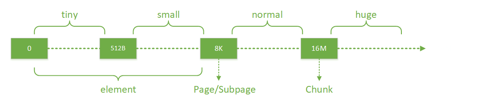
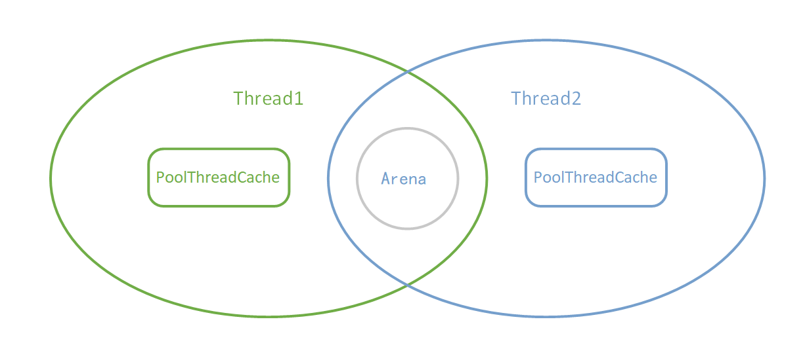
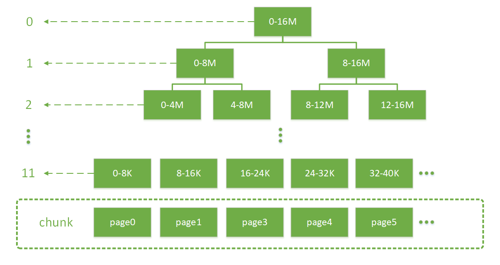
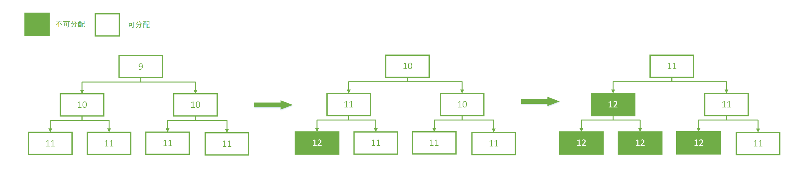
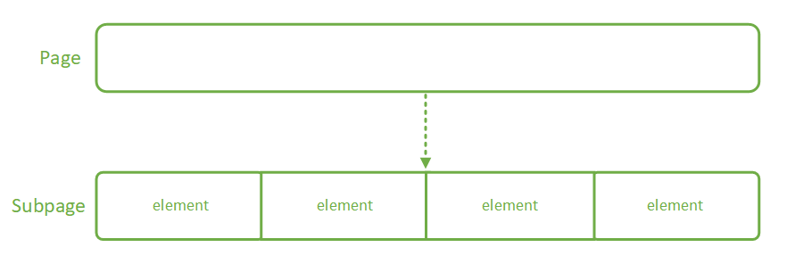
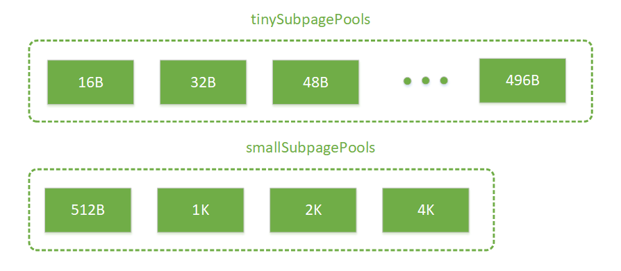
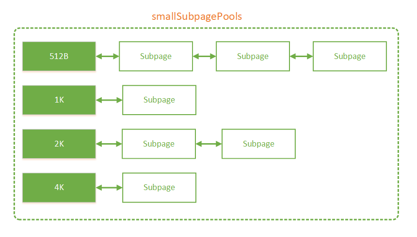
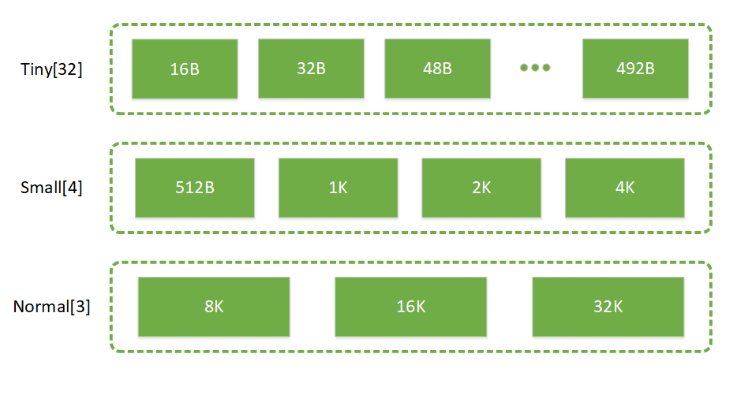

---
title: Netty 源码浅析——内存分配
tags: 
	- Netty
toc: true
date: 2019-10-13 12:40:00
---
我们都知道堆外内存的使用是 Netty 高效的重要原因。堆外内存可以减少一次堆内到堆外的数据拷贝，因此高效。但堆外内存无法由 GC 直接管控。另一方面，堆内内存虽然可以由 GC 直接管控，但分配和回收内存都会占用系统的资源。所以在这种情况下，Netty 选择了手动管理内存，这一章我们就来看看 Netty 是如何管理内存的。

## 内存规格介绍

Netty 中以块分配内存，而不同规格大小的内存块的分配逻辑是不一样的。Netty 按规格对内存块的分类如下图所示：



最上面一行就代表了 Netty 中所有的规格。其中 tiny 代表了大小在 0-512B 的内存块，small 代表了大小在 512B-8K 的内存块，normal 代表了大小在 8K-16M 的内存块，huge 代表了大于 16M 的内存块。围绕不同规格内存的分界线，Netty 又定义了几个内存分配的单位：
- Chunk：一个 Chunk 的大小是 16M，Chunk 是 Netty 对操作系统进行内存申请的单位，后续所有的内存分配都是在 Chunk 里面进行操作。
- Page：Chunk 内部以 Page 为单位分配内存，一个 Page 大小为 8K。当我们需要 16K 的空间时，Netty 就会从一个 Chunk 中找到两个 Page 进行分配。
- Subpage 和 element：element 是比 Page 更小的单位，当我们申请小于 8K 的内存时，Netty 会以 element 为单位进行内存分配。element 没有固定大小，具体由用户的需求决定。Netty 通过 Subpage 管理 element，Subpage 是由 Page 转变过来的。当我们需要 1K 的空间时，Netty 会把一个 Page 变成 Subpage，然后把 Subpage 分成 8 个 1K 的 element 进行分配。

## Chunk 中的内存分配

线程分配内存主要从两个地方分配: PoolThreadCache 和 Arena。其中 PoolThreadCache 线程独享, Arena 为几个线程共享：



当我们初次申请内存的时候，Netty 会从一整块内存（Chunk）中分出一部分来给用户使用，这部分工作是由 Arena 来完成。而当用户使用完毕释放内存的时候，这些被分出来的内存会按不同规格大小放在 PoolThreadCache 中缓存起来。当下次要申请内存的时候，就会先从 PoolThreadCache 中找。

PoolThreadCache 的部分我们后面会看到，这边先讨论 Arena 的部分。Chunk、Page、Subpage 和 element 都是 Arena 中的概念，Arena 的工作就是从一整块内存中分出合适大小的内存块。Arena 中最大的内存单位是 Chunk，这是 Netty 向操作系统申请内存的单位。而一块 Chunk（16M） 申请下来之后，内部会被分成 2048 个 Page（8K），当用户向 Netty 申请超过 8K 内存的时候，Netty 会以 Page 的形式分配内存。

Chunk 内部通过伙伴算法管理 Page，具体实现为一棵平衡二叉树 memoryMap：



二叉树中所有子节点管理的内存也属于其父节点。当我们要申请大小为 16K 的内存时，我们会从根节点开始不断寻找可用的节点，一直到第 10 层。那么如何判断一个节点是否可用呢？Netty 会在每个节点内部保存一个值，这个值代表这个节点之下的第几层还存在未分配的节点。比如第 9 层的节点的值如果为 9，就代表这个节点本身到下面所有的子节点都未分配；如果第 9 层的节点的值为 10，代表它本身不可被分配，但第 10 层有子节点可以被分配；如果第 9 层的节点的值为 12，此时可分配节点的深度大于了总深度，代表这个节点及其下面的所有子节点都不可被分配。下图描述了分配的过程：



下面我们从源码的角度看一下这里的逻辑。

首先是 memoryMap 的初始化：
```java
memoryMap = new byte[maxSubpageAllocs << 1];
depthMap = new byte[memoryMap.length];
int memoryMapIndex = 1;
// 下面这个 for 循环会把两个数组都初始化为当前节点的层数
for (int d = 0; d <= maxOrder; ++ d) { // move down the tree one level at a time
    int depth = 1 << d;
    for (int p = 0; p < depth; ++ p) {
        // in each level traverse left to right and set value to the depth of subtree
        memoryMap[memoryMapIndex] = (byte) d;
        depthMap[memoryMapIndex] = (byte) d;
        memoryMapIndex ++;
    }
}
```
这里创建了两个数组 memoryMap 和 depthMap，两个数组初始化时都保存了当前节点的层数。而使用过程中，memoryMap 中的值会变化，变化逻辑上面已经讲过；depthMap 中的值不变，仍表示当前节点的层数。

下面看看如何向 PoolChunk 申请一段内存：
```java
long allocate(int normCapacity) {
    if ((normCapacity & subpageOverflowMask) != 0) { // >= pageSize
        // 分配 Page
        return allocateRun(normCapacity);
    } else {
        // 分配 Subpage
        return allocateSubpage(normCapacity);
    }
}
```
当需要分配的内存大于 pageSize（8K） 时，使用 `allocateRun()` 实现内存分配。否则使用方法 `allocateSubpage()` 分配内存。分配 Subpage 的逻辑我们下面再讲。先看分配 Page 的逻辑：
```java
private long allocateRun(int normCapacity) {
    // 找到层数
    int d = maxOrder - (log2(normCapacity) - pageShifts);
    // 分配节点
    int id = allocateNode(d);
    if (id < 0) {
        return id;
    }
    // 可用内存减少
    freeBytes -= runLength(id);
    return id;
}
```
normCapacity 是处理过的值，如申请大小为 1000K 的内存，实际申请的内存大小为 1024K。方法中会先找到对应的层数，比如 1024K 对应第 4 层。然后在 memoryMap 中找到第 4 层第一个可用的节点，查询逻辑如下：
```java
private int allocateNode(int d) {
    int id = 1;
    int initial = - (1 << d); 
    // value(id)=memoryMap[id] 
    byte val = value(id); 
    if (val > d) { // unusable
        return -1;
    }
    // 从根节点开始遍历，如果当前节点的 val<d，则通过 id <<=1 匹配下一层
    while (val < d || (id & initial) == 0) { // id & initial == 1 << d for all ids at depth d, for < d it is 0
        id <<= 1;
        // 获取左子节点的 val
        val = value(id);
        // 如果左子节点 val > d，说明左子节点的内存不够分配，此时需要在右子节点上继续查找
        if (val > d) {
            id ^= 1; // 找到兄弟节点
            val = value(id);
        }
    }
    byte value = value(id);
    // 分配成功的节点需要标记为不可用，防止被再次分配，在 memoryMap 对应位置更新为 12
    setValue(id, unusable); // mark as unusable
    // 分配节点完成后，递归更新其父节点的状态
    updateParentsAlloc(id);
    return id;
}
```
查询分为以下几个步骤：
- 从根节点开始遍历，如果当前节点的 val < d，则通过 id <<=1 匹配下一层；
- 先找左子节点，如果左子节点 val > d，则表示左子节点内存不够分配，此时需要在右子节点上继续查找；
- 分配成功的节点需要标记为不可用，防止被再次分配，在 memoryMap 对应位置更新为 12；
- 分配节点完成后，递归更新其父节点的状态。

我们再来看一下递归更新其父节点状态的逻辑：
```java
private void updateParentsAlloc(int id) {
    while (id > 1) {
        int parentId = id >>> 1; // 找到父节点
        byte val1 = value(id); // 当前节点的 value
        byte val2 = value(id ^ 1); // 兄弟节点的 value
        byte val = val1 < val2 ? val1 : val2; // 选择其中的较小值
        setValue(parentId, val);// 更新父节点 value
        id = parentId;
    }
}
```
递归更新父节点状态时，会选择当前节点和兄弟节点中较小值更新。至于原因大家看之前分配过程的图就明白啦。

到此，Chunk 中的内存分配已经完成。

## Subpage 中的内存分配

上一节中分析了如何在 Chunk 中分配一块 Page 级别的内存，但在实际应用中，存在很多分配小内存的情况，如果也占用一个 Page，明显很浪费。针对这种情况，Netty 提供了 Subpage 把一个 Page 划分成更小的内存段，通过对每个内存段的标记与清理标记进行内存的分配与释放。如下图：



Subpage 由 Page 转变而来，一个 Subpage 的内部可以被**等分**成多个 element。Subpage 通过 bitmap 的方式来标记一段内存是否已被使用。Subpage 的定义如下：

```java
final class PoolSubpage<T> {
    // 对应的 page 在 chunk 中的 id
    private final int memoryMapIdx; 
    // 对应的 page 在 chunk.memory 的偏移量
    private final int runOffset;    
    // page 大小
    private final int pageSize;
    // 通过对位图中每一个二进制位的标记来记录一段内存的占用状态
    private final long[] bitmap; 
    // 位图长度
    private int bitmapLength;
    
    PoolSubpage<T> prev;
    PoolSubpage<T> next;

    boolean doNotDestroy;    
    // element 的大小
    int elemSize;   
    // element 的数量
    private int maxNumElems;        
    // 下一个可用 element 的位置
    private int nextAvail;
    // 可用的 element 数量
    private int numAvail;       
    ...
}
```

假设目前需要申请大小为 2K 的内存：

```java
long allocate(int normCapacity) {
    if ((normCapacity & subpageOverflowMask) != 0) { // >= pageSize
        // 分配 Page
        return allocateRun(normCapacity);
    } else {
        // 分配 Subpage
        return allocateSubpage(normCapacity);
    }
}
```

因为 2K 小于一个 Page 的大小，所以采用 `allocateSubpage()` 进行内存分配，具体实现如下：

```java
PoolChunk
private long allocateSubpage(int normCapacity) {
    // Obtain the head of the PoolSubPage pool that is owned by the PoolArena and synchronize on it.
    // This is need as we may add it back and so alter the linked-list structure.
    // 对应 Subpage 池的头节点
    PoolSubpage<T> head = arena.findSubpagePoolHead(normCapacity);
    synchronized (head) {
        int d = maxOrder; // subpages are only be allocated from pages i.e., leaves
        // 找到一个可分配的 Page
        int id = allocateNode(d);
        if (id < 0) {
            return id;
        }
        // subpages 数组记录了哪些 Page 已经被转化成了 Subpage
        final PoolSubpage<T>[] subpages = this.subpages;
        final int pageSize = this.pageSize;

        freeBytes -= pageSize;
        // 从 pageId 到 subpageId 的转化，这是因为 pageId 是从 2048 开始的（叶子节点），而 subpageId 是从 0 开始的
        int subpageIdx = subpageIdx(id);
        // 找到 Subpage
        PoolSubpage<T> subpage = subpages[subpageIdx];
        // 如果 subpage == null，表示还没进行从 page 到 subpage 的转化
        if (subpage == null) {
            // 创建 subpage
            subpage = new PoolSubpage<T>(head, this, id, runOffset(id), pageSize, normCapacity);
            // 保存 subpage
            subpages[subpageIdx] = subpage;
        } else {
            subpage.init(head, normCapacity);
        }
        // 从 subpage 分配内存
        return subpage.allocate();
    }
}
```
首先会从 arena 中取出一个 Subpage 池的头节点，关于 Subpage 池我们之后再讲。然后从 Chunk 中找到一个可分配的 Page，Netty 会先检查 Page 是否已被转化成 Subpage，如果没有的话，会先创建 Subpage，然后再从 Subpage 分配内存。

创建 Subpage 的逻辑如下：

```java
PoolSubpage(PoolSubpage<T> head, PoolChunk<T> chunk, int memoryMapIdx, int runOffset, int pageSize, elemSize) {
    // 保存 chunk
    this.chunk = chunk;
    // 保存 page 的 id
    this.memoryMapIdx = memoryMapIdx;
    // 保存 page 的偏移量
    this.runOffset = runOffset;
    // 保存 page 的 size
    this.pageSize = pageSize;
    // 创建 bitmap 数组
    bitmap = new long[pageSize >>> 10]; // pageSize / 16 / 64
    // 初始化 Subpage
    init(head, elemSize);
}
```

首先会保存 chunk 和 page 的相关信息，然后创建一个 bitmap 数组。bitmap 数组的大小为 8。这是因为 Subpage 内部最小以 16 字节为单位管理内存，如果以 16 个字节对应 long 中的一位，一个 long 有 64 位，那么需要 8192/16/64 共 8 个 long 描述所有内存段。但这 8 个 long 也不一定全用上，实际用到的 long 的数量会在 `init()` 方法中计算：

```java
void init(PoolSubpage<T> head, int elemSize) {
    doNotDestroy = true;
    this.elemSize = elemSize;
    if (elemSize != 0) {
        // element 的数量
        maxNumElems = numAvail = pageSize / elemSize;
        nextAvail = 0;
        // maxNumElems/64 表示用到的 long 个数，如果有余数还要加一
        bitmapLength = maxNumElems >>> 6;
        if ((maxNumElems & 63) != 0) {
            bitmapLength ++;
        }

        for (int i = 0; i < bitmapLength; i ++) {
            bitmap[i] = 0;
        }
    }
    // 把 Subpage 放入 Subpage 池中
    addToPool(head);
}
```
首先根据 element 的大小计算 Subpage 要被分成多少段，然后将段数除以 64 向上取整就是所要用到的 long 个数。比如 element 的大小是 1k，那么就要用到 1 个 long。

然后是把 Subpage 放入到 Subpage 池中。创建好的 Subpage 被分成多个 element，我们只会用到其中的一段，剩下都是未分配的。而这些还有 element 未分配的 Subpage 会被放入到 Arena 的 Subpage 池中。Arena 中按不同内存规格大小分成了两组 Subpage 池，分别是 tinySubpagePools 和 smallSubpagePools：

```java
private final PoolSubpage<T>[] tinySubpagePools;
private final PoolSubpage<T>[] smallSubpagePools;
```

从名字可以看出，tinySubpagePools 内部是 tiny 规格大小的 Subpage 池，而 smallSubpagePools 内部是 small 规格大小的 Subpage 池。具体的规格如下：



每个方框都代表一个 Subpage 池，内部以链表的形式存放 Subpage。方框中的数字代表 Subpage 的规格。内部结构如下图：



还未被完全分配的 Subpage 会被放入 Subpage 池中，这样下次用户申请相同规格的内存时就可以直接从 Subpage 池中找到 Subpage 进行分配。被分配完的 Subpage 会被移除。

下面看看 Subpage 是如何进行内存分配的：

```java
long allocate() {
    if (elemSize == 0) {
        return toHandle(0);
    }

    if (numAvail == 0 || !doNotDestroy) {
        return -1;
    }
    // 在 bitmap 上找到第一个可用段，然后将该 bit 置为 1
    final int bitmapIdx = getNextAvail();
    int q = bitmapIdx >>> 6;
    int r = bitmapIdx & 63;
    assert (bitmap[q] >>> r & 1) == 0;
    bitmap[q] |= 1L << r;

    if (-- numAvail == 0) {
        // Subpage 被完全分配，从 pool 中移除
        removeFromPool();
    }

    return toHandle(bitmapIdx);
}
```

上述代码会先在 bitmap 上找到第一个可用段，然后将该 bit 置为 1。如果分配完成后，可用的 element 为 0，则从 pool 中将当前 Subpage 移除。

分配完内存段后则是要返回指向内存段的指针，这个指针由 Page 在 Chunk 中的位置和 element 在 Subpage 中的位置共同组成。具体如下：

```java
private long toHandle(int bitmapIdx) {
    return 0x4000000000000000L | (long) bitmapIdx << 32 | memoryMapIdx;
}
```

最高的 4 位是一个握手字段，随后 28 位代表了 element 在 Subpage 中的位置，最后的 32 位代表了 Page 在 Chunk 中的位置。这样我们就可以通过指针在 Chunk 中找到内存段的位置。

到此，Subpage 中的内存分配就完成了。

## Chunk 管理

随着 Chunk 中内存的不断分配和释放（内存释放后会先进入 Cache，如果 Cache 满了会归还给 Chunk），会导致很多碎片内存段，大大增加了之后分配一段连续内存的失败率，针对这种情况，Netty 按内存使用率把 Chunk 分成了几个等级，分配时按一定的次序进行分配，减少内存的碎片化。

Netty 中的 Chunk 按内存使用率被分成了以下几种级别：

```java
abstract class PoolArena<T> implements PoolArenaMetric {
    //...
    private final PoolChunkList<T> q050;
    private final PoolChunkList<T> q025;
    private final PoolChunkList<T> q000;
    private final PoolChunkList<T> qInit;
    private final PoolChunkList<T> q075;
    private final PoolChunkList<T> q100;
    //...
}
```

每个级别的 Chunk 都以链表的形式保存在对应的 PoolChunkList 中，每个级别所对应的内存使用率如下表所示：

| 类型 | 内存使用率（%） |
| :---- | :---- |
| qInit | [0, 25)　　　　　　　　　　　　　　　　　　 |
| q000 | [1,50) |
| q025 | [25,75) |
| q050 | [50,100) |
| q075 | [75,100) |
| q100 | 100 |

每种级别都对应了一个内存使用率的区间，当 Chunk 的内存使用率超出当前级别的区间时，会进入更高或更低的级别。我们注意到相邻的 ChunkList 之间在使用率上存在一定的重叠区域，这是为了防止，由于使用率不断变化，导致某个 Chunk 在两个 List 中不停来回跳动的情况，加了这么一段重叠的缓存区域，可以减少跳动的次数。

而当我们申请内存时，会以 q050->q025->q000->qInit->q075 的次序申请：
```java
    private void allocateNormal(PooledByteBuf<T> buf, int reqCapacity, int normCapacity) {
        if (q050.allocate(buf, reqCapacity, normCapacity) || q025.allocate(buf, reqCapacity, normCapacity) ||
            q000.allocate(buf, reqCapacity, normCapacity) || qInit.allocate(buf, reqCapacity, normCapacity) ||
            q075.allocate(buf, reqCapacity, normCapacity)) {
            return;
        }
        //...
    }
```
这主要是为了在尽可能减少内存碎片的产生的同时，减少申请的次数。所以以使用率处于中间位置的 q050 作为第一优先级，而如果 q050 中申请失败，说明这次申请的内存可能比较大，会依次向使用率较低的 ChunkList 发起申请。而如果前几个 ChunkList 都申请失败（这种情况大概率是前几个 ChunkList 为空），那么最后会尝试向 q075 申请。

## Cache 机制

Arena 中分配的内存使用完毕以后，不会立刻归还，而是会在 PoolThreadCache 中缓存起来。当用户下一次申请的时候，会先在 PoolThreadCache 中寻找有没有匹配的内存。

PoolThreadCache 是线程私有的，内部通过 MemoryRegionCache 的方式缓存内存。MemoryRegionCache 的内部实际上是一个队列。和 Arena 中的 Subpage 池一样，PoolThreadCache 也把内存按不同的规格保存：



代码中的定义如下：
```java
final class PoolThreadCache {
    // ...
    private final MemoryRegionCache<byte[]>[] tinySubPageHeapCaches;
    private final MemoryRegionCache<byte[]>[] smallSubPageHeapCaches;
    private final MemoryRegionCache<ByteBuffer>[] tinySubPageDirectCaches;
    private final MemoryRegionCache<ByteBuffer>[] smallSubPageDirectCaches;
    private final MemoryRegionCache<byte[]>[] normalHeapCaches;
    private final MemoryRegionCache<ByteBuffer>[] normalDirectCaches;
    //...
}
```
可以看到除了内存规格外，PoolThreadCache 还对 Heap 和 Direct 进行了分类。

每个 Caches  都是一个 MemoryRegionCache 类型的数组，MemoryRegionCache 的定义如下：

```java
private abstract static class MemoryRegionCache<T> {
    private final int size;
    // 通过队列存放内存
    private final Queue<Entry<T>> queue;
    private final SizeClass sizeClass;
    private int allocations;
    //...
}
```
内部通过队列存放内存，一个队列中保存着相同大小和相同类型（Heap 或 Direct）的内存。实际上队列用 Entry 表示内存，这是 Netty 中表示内存的方式，Netty 可以通过一个 Entry 唯一定位一段内存：
```java
        static final class Entry<T> {
            //...
            // 内存所在 Chunk
            PoolChunk<T> chunk;
            // java 底层 ByteBuffer，表示物理内存地址
            ByteBuffer nioBuffer;
            // 指针
            long handle = -1;
            //...
        }
```
nioBuffer 代表物理内存的地址，handle 是 Chunk 内部的指针，通过 handle 可以在 Chunk 内部找到当前内存段的信息（偏移量，长度），然后通过这些信息在物理内存中找到最终分配的内存地址。

最后我们来看一下完整的分配内存的逻辑：
```java
    private void allocate(PoolThreadCache cache, PooledByteBuf<T> buf, final int reqCapacity) {
        // 规整请求的内存大小
        final int normCapacity = normalizeCapacity(reqCapacity);
        // 如果请求的内存小于一个 Page，走 Subpage 的逻辑
        if (isTinyOrSmall(normCapacity)) { // capacity < pageSize
            int tableIdx;
            PoolSubpage<T>[] table;
            boolean tiny = isTiny(normCapacity);
            // 判断请求的大小是否为 Tiny
            if (tiny) { // < 512
                // 先在 PoolThreadCache 中寻找，如果找到直接返回
                if (cache.allocateTiny(this, buf, reqCapacity, normCapacity)) {
                    // was able to allocate out of the cache so move on
                    return;
                }
                tableIdx = tinyIdx(normCapacity);
                table = tinySubpagePools;
            } else {
                // small 和 tiny 一样，先在 PoolThreadCache 中寻找，如果找到直接返回
                if (cache.allocateSmall(this, buf, reqCapacity, normCapacity)) {
                    // was able to allocate out of the cache so move on
                    return;
                }
                tableIdx = smallIdx(normCapacity);
                table = smallSubpagePools;
            }
            // 找到 Subpage 池的头节点
            final PoolSubpage<T> head = table[tableIdx];
            // 尝试在 Subpage 池中找，如果找到直接返回
            synchronized (head) {
                final PoolSubpage<T> s = head.next;
                if (s != head) {
                    assert s.doNotDestroy && s.elemSize == normCapacity;
                    long handle = s.allocate();
                    assert handle >= 0;
                    s.chunk.initBufWithSubpage(buf, null, handle, reqCapacity);
                    incTinySmallAllocation(tiny);
                    return;
                }
            }
            // 向 Arena 申请分配内存
            synchronized (this) {
                allocateNormal(buf, reqCapacity, normCapacity);
            }

            incTinySmallAllocation(tiny);
            return;
        }
        // 如果请求的内存大于一个 Page，走 Chunk 的逻辑
        if (normCapacity <= chunkSize) {
            // 先在 PoolThreadCache 中寻找，如果找到直接返回
            if (cache.allocateNormal(this, buf, reqCapacity, normCapacity)) {
                // was able to allocate out of the cache so move on
                return;
            }
            // 向 Arena 申请分配内存
            synchronized (this) {
                allocateNormal(buf, reqCapacity, normCapacity);
                ++allocationsNormal;
            }
        } else {
            // 大于一个 Chunk 的直接分配
            allocateHuge(buf, reqCapacity);
        }
    }
```
整体的代码逻辑比较清晰，概括如下：
- 1、对请求的内存大小做规整化处理：大于 512B 时调整为大于等于请求值的 2 的最小幂；小于 512B 时调整为大于等于请求值的 16 的倍数。
- 2、当请求内存小于 8K 时，走 Subpage 的逻辑。先从 PoolThreadCache 中找；再从 Subpage 池中找；最后向 Arena 申请分配。
- 3、当请求内存大于 8K 小于 16M 时，走 Chunk 的逻辑。先从 PoolThreadCache 中找；再向 Arena 申请分配。
- 4、当请求内存大于 16M 时，不走内存池，直接分配。

## 内存释放

前面已经提到了，内存池不会预置内存块到线程缓存中，在线程申请到内存使用完成之后归还内存时优先把内存块缓存到线程中，除非该内存块不适合缓存在线程中（内存太大），当当前线程内存分配动作非常活跃时，这样会明显的提高分配效率，但是当它不活跃时对内存又是极大的浪费，所以内存池会监控该线程，随时做好把内存从线程缓存中删除的准备。删除缓存的逻辑在 `trim()` 方法中，这个方法在 `allocate()` 中被调用，默认每进行 8192 次 `allocate()` 会调用一次 `trim()`：
```java
PoolThreadCache
private boolean allocate(MemoryRegionCache<?> cache, PooledByteBuf buf, int reqCapacity) {
    if (cache == null) {
        // no cache found so just return false here
        return false;
    }
    boolean allocated = cache.allocate(buf, reqCapacity);
    // 默认每进行 8192 次 allocate() 会调用一次 trim()
    if (++ allocations >= freeSweepAllocationThreshold) {
        allocations = 0;
        // 整理缓存
        trim();
    }
    return allocated;
}
```
依次对线程内的所有缓存池进行整理：
```java
    PoolThreadCache
    void trim() {
        trim(tinySubPageDirectCaches);
        trim(smallSubPageDirectCaches);
        trim(normalDirectCaches);
        trim(tinySubPageHeapCaches);
        trim(smallSubPageHeapCaches);
        trim(normalHeapCaches);
    }
```
我们挑选其中的 smallSubPageDirectCaches 来看（逻辑都是一样的）：
```java
    PoolThreadCache
    private static void trim(MemoryRegionCache<?>[] caches) {
        if (caches == null) {
            return;
        }
        // 整理 smallSubPageDirectCaches 下所有的 Cache
        for (MemoryRegionCache<?> c: caches) {
            trim(c);
        }
    }
```
smallSubPageDirectCaches 下包含很多不同规格的 Cache，所有规格的 Cache 都会被整理，方法最终调用到：
```java
PoolThreadCache.MemoryRegionCache
public final void trim() {
    // size 表示缓存池的大小，allocations 表示距离上一次整理进行了多少次调用
    int free = size - allocations;
    allocations = 0;
    // 如果调用次数小于缓存池大小，释放掉小于的部分
    if (free > 0) {
        free(free, false);
    }
}
```
这里会统计距离上一次整理后，Netty 在这个缓存池进行的多少次调用。当调用不够频繁时，Netty 会释放一部分缓存。调用的频繁程度由 size 来衡量，这是一个固定值表示缓存池的大小，默认情况下 tiny/small/normal 分别是 512/256/64。当调用次数不够 size 大小时，会释放不够的部分：
```java
private int free(int max, boolean finalizer) {
    int numFreed = 0;
    // max=size - allocations
    for (; numFreed < max; numFreed++) {
        // 从队列中获取缓存快
        Entry<T> entry = queue.poll();
        if (entry != null) {
            // 释放缓存块
            freeEntry(entry, finalizer);
        } else {
            // all cleared
            // 队列中没有缓存块，全部释放完毕
            return numFreed;
        }
    }
    return numFreed;
}
```
Netty 会不断从缓存池中获取缓存块然后释放掉，直到缓存池为空或者达到 size - allocations 的数量。这里的 `freeEntry()` 是把内存块还给 Arena，做的是分配内存的逆操作。

除了定期检查缓存使用频率回收缓存外，Netty 在线程结束后会回收该线程的所有缓存。相关的逻辑在 PoolThreadCache 中。

我们知道在 Netty 中如果一个线程如果需要缓存内存块，就要创建一个 PoolThreadCache 的变量。这个变量被保存在 FastLocalThreadMap 中，当线程结束后，FastLocalThreadMap 和它内部保存的 value 都会被 GC 回收。而对象在销毁时会调用 `finalize()` 方法。Netty 重载了 PoolThreadCache 的 `finalize()` 方法，让它会在销毁前释放所有的缓存：
```java
    PoolThreadCache
    protected void finalize() throws Throwable {
        try {
            super.finalize();
        } finally {
            // 释放所有缓存
            free(true);
        }
    }
```
和 `trim()` 一样，`free()` 内部也是依次释放各种规格的缓存：
```java
    PoolThreadCache 
    void free(boolean finalizer) {
        // As free() may be called either by the finalizer or by FastThreadLocal.onRemoval(...) we need to ensure
        // we only call this one time.
        // 依次释放各种规格的缓存池
        if (freed.compareAndSet(false, true)) {
            int numFreed = free(tinySubPageDirectCaches, finalizer) +
                    free(smallSubPageDirectCaches, finalizer) +
                    free(normalDirectCaches, finalizer) +
                    free(tinySubPageHeapCaches, finalizer) +
                    free(smallSubPageHeapCaches, finalizer) +
                    free(normalHeapCaches, finalizer);
            //...
        }
    }
```
最终会调用到缓存池内部的 `free()` 方法：
```java
MemoryRegionCache
public final int free(boolean finalizer) {
    // 传进去的是 Integer.MAX_VALUE，表示回收所有缓存
    return free(Integer.MAX_VALUE, finalizer);
}
MemoryRegionCache
private int free(int max, boolean finalizer) {
    int numFreed = 0;
    // 传进来的是 Integer.MAX_VALUE，所有的缓存都会被回收
    for (; numFreed < max; numFreed++) {
        // 从队列获取缓存块
        Entry<T> entry = queue.poll();
        if (entry != null) {
            // 释放缓存块
            freeEntry(entry, finalizer);
        } else {
            // all cleared
            // 全部回收完毕
            return numFreed;
        }
    }
    return numFreed;
}
```
内部和 `free()` 的逻辑类似，都是从队列中获取缓存然后通过 `freeEntry` 释放，只不过这里的 max 是 Integer.MAX_VALUE，表示会回收所有缓存。这样，就防止了内存泄露的发生。

## 总结

内存分配是 Netty 中非常重要的部分，我以 tips 的形式概括一下知识点：
- 线程分配内存主要从两个地方分配: PoolThreadCache 和 Arena。其中 PoolThreadCache 线程独享, Arena 为几个线程共享。
- Arena 中以 Chunk（16M）为单位向操作系统申请内存。
- 当申请超过一个 Page（8K）大小的内存时，内存分配在 Chunk 中进行，分配的单位是 Page，Chunk 以伙伴算法管理内存。
- 当申请小于一个 Page 大小的内存时，内存分配在 SubPage 中进行，Subpage 由 Page 转化过来，内部被等分成多个 element。Subpage 以 bitmap 管理内存。
- 未被完全分配的 Subpage 会被放入 Subpage 池中，之后用户请求内存时会先从 Subpage 池中找。
- Subpage 池内部按不同的内存规格大小分类。
- 为了减少内存碎片，Arena 中的 Chunk 会按内存使用率分类，按一定的次序从不同内存使用率的 Chunk 中分配内存。
- 分配的内存用完后不会立即归还给 Chunk，而是会被放进 PoolThreadCache 中缓存（如果缓存满了会归还给 Chunk）。
- 用户申请内存时最先从 PoolThreadCache 中找，PoolThreadCache 内部也会按不同的规格大小分类。
- 当请求内存大于 16M 时，不走内存池，直接分配。
- Netty 会检查 PoolThreadCache 中缓存使用的频率，使用频率低的会被释放掉。检查的入口是 `allocate()` 方法，默认每调用 8192 次 `allocate()` 方法触发一次检查。
- 线程结束时 Netty 会回收它所有的缓存，具体的时机是在 PoolThreadCache 对象被 GC 时，这样可以防止内存的泄露。

## 参考资料
[深入浅出Netty内存管理 PoolChunk](https://www.jianshu.com/p/c4bd37a3555b)
[深入浅出Netty内存管理 PoolSubpage](https://www.jianshu.com/p/d91060311437)
[Netty PoolArea原理探究](https://kkewwei.github.io/elasticsearch_learning/2018/05/23/Netty%E5%86%85%E5%AD%98%E5%AD%A6%E4%B9%A0/)
[Java读源码之Netty深入剖析](https://coding.imooc.com/class/230.html)
[自顶向下深入分析Netty（十）--JEMalloc分配算法](https://www.jianshu.com/p/15304cd63175)