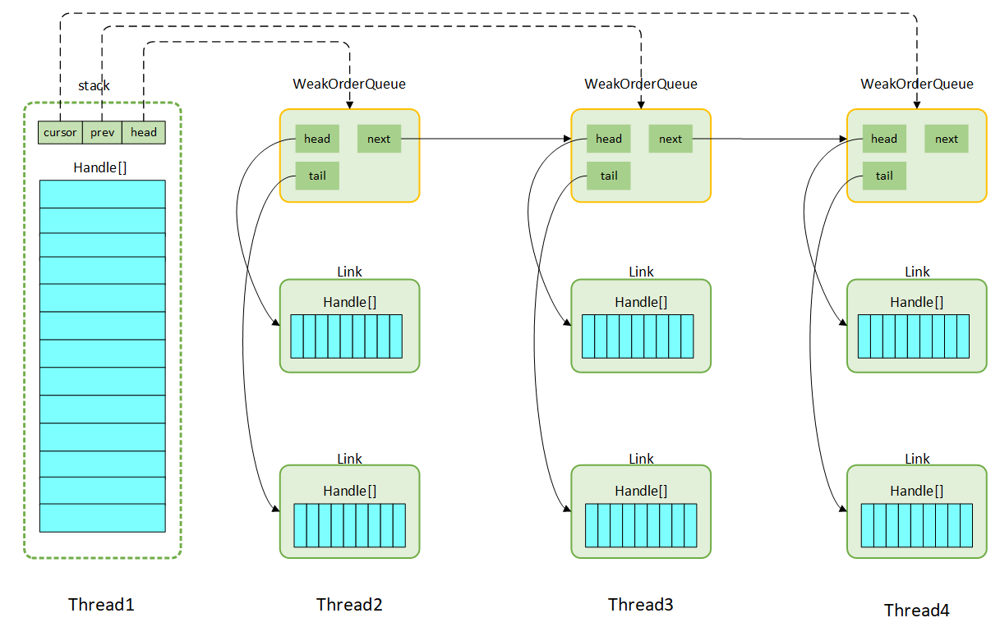

---
title: Netty 源码浅析——对象池
tags: 
	- Netty
toc: true
date: 2019-10-17 20:31:56
---
为了提高程序的性能，Netty 中实现了一个轻量级的对象池 Recycler。Recycler 在 Netty 里面使用是非常频繁的，我们在创建 PooledDirectByteBuf 的时候，不是每次都会创建一个新对象，而是先在预先创建好的对象池中去取；而当我们不用 PooledDirectByteBuf 对象的时候，可以通过 `recycle()` 方法把它释放掉，实际上就是放回了对象池中。这样做的好处是可以减少创建对象的开销，同时减少 young gc 的频率。

这时大家可能会好奇，Recycler 内部是怎么实现的呢？让我们进入源码一探究竟。

## Recycler 的使用

首先来看一下 Recycler 的使用：
```java
public class RecyclerTest {
    // 创建了一个 Recycler<User> 对象
    private static Recycler<User> userRecycler = new Recycler<User>() {
        @Override
        // 实现了 newObject 方法
        protected User newObject(Handle<User> handle) {
            return new User(handle);
        }
    };
    // 自定义的 User 对象
    static class User{
        // 保存了 userRecycler 的 handle
        Recycler.Handle<User> handle;
        User(Recycler.Handle<User> handle){
            this.handle = handle;
        }
        // 通过 handle 回收对象
        void recycle(){
            handle.recycle(this);
        }
    }

    public static void main(String[] args){
        // 第一个 User 对象
        User user1 = userRecycler.get();
        // 对象回收
        user1.recycle();
        // 第二个 User 对象
        User user2 = userRecycler.get();
        // 判断两个 User 对象是否是同一个
        System.out.println(user1==user2);
    }
}
```
运行结果如下：
```java
true
```
首先在使用 Recycler 的时候，要创建一个带泛型的 Recycler 对象，表示专门存放某一类对象的对象池。然后要实现该对象池的 `newObject()` 方法，方法内部会传入一个 handle，通过 handle 可以控制对象的释放。最后是要在自定义的对象中保存对象池的 handle，然后通过调用 `handle.recycle(this)` 方法把对象放回对象池。

我们在测试代码中先从对象池获取了一个 User 对象，接着回收了这个对象，然后又从对象池获取了一个对象，比较发现这两次获取的是同一个对象。说明从对象池中获取的对象是循环利用的。

## Stack、WeakOrderQueue 介绍

对象池通过 Recycler 里面 Stack、WeakOrderQueue 2 个类来实现。 首先放一张图来展示一下两者的关系：



- 每个线程都拥有自己的对象池, 该对象池结构如上图所示, Stack 作为本线程对象池的核心, 通过 FastThreadLocal 来实现每个线程的本地化。
- 本线程 thread1 回收本线程产生的对象时, 会将对象以 DefaultHandle 的形式存放在 Stack 中；其它线程 thread2 也可以回收 thread1 产生的对象，thread2 回收的对象不会立即放回 thread1 的 Stack 中，而是保存在 thread2 内部的一个 WeakOrderQueue 中。这些外部线程的 WeakOrderQueue 以链表的方式和 Stack 关联起来。
- 默认情况下一个线程最多持有 2CPU 个 WeakOrderQueue，也就是说一个线程最多可以帮 2CPU 个外部线程的对象池回收对象。可以通过修改 `io.netty.recycler.maxDelayedQueuesPerThread` 参数的值来修改一个线程最多持有的 WeakOrderQueue 的数量。
- WeakOrderQueue 内部有以 Link 来管理对象。每个 Link 存放的对象是有限的，一个 Link 最多存放 16 个对象。 如果满了则会再产生一个 Link 继续存放。
- 当前线程从对象池中拿对象时, 首先从 Stack 中获取，若没有的话，将尝试从 cursor 指向的 WeakOrderQueue 中回收一个 Link 的对象,。如果回收到了就继续从 Stack 中获取对象；如果没有回收到就创建对象。
- 一个对象池中最多存放 4K 个对象 , 可以通过 `io.netty.recycler.maxCapacity` 控制；而 Link 节点中每个 DefaultHandle 数组默认长度 16, 可以通过`io.netty.recycler.linkCapacity` 控制;

## 从线程池获取对象

通过调用 `Recycler.get()` 来完成：
```java
Recycler
public final T get() {
     // 若置为 0, 将 handle 置为 Noop_HANDLE，代表着不被回收
    if (maxCapacityPerThread == 0) {
        return newObject((Handle<T>) NOOP_HANDLE);
    }
    // 获取当前线程对应的 Stack
    Stack<T> stack = threadLocal.get();
    // 从对象池获取对象
    DefaultHandle<T> handle = stack.pop();
    // 若对象池中没有对象,则调用子类的 newObject 方法创建新的对象
    if (handle == null) {
        handle = stack.newHandle();
        handle.value = newObject(handle);
    }
    return (T) handle.value;
}
```
首先获取本线程对应的唯一 Stack, 从该 Stack 中获取对象。若 Stack 中没有对象, 则主动调用 newObject 产生一个对象。同时完成了 handle 与对象、Stack 的绑定。

我们接下来看如何通过 `stack.pop()` 来从对象池中获取对象：
```java
Recycler.Stack
DefaultHandle<T> pop() {
    // 统计着 elements 中存放的对象个数，同时是指向栈顶+1的指针
    int size = this.size;
   //若 elements 没有可用对象
    if (size == 0) {
        // 就尝试从别的线程帮着回收的对象中转移一些到 elements 中, 也就是从 WeakOrderQueue 中转移一些数据出来
        if (!scavenge()) {
            return null;
        }
        size = this.size;
    }
    size --;
    // 将栈顶元素出栈
    DefaultHandle ret = elements[size];
    elements[size] = null;
    //...
    return ret;
}
```
如果 Stack 中有对象，就直接从 Stack 中获取；如果 Stack 中没有对象，就尝试从别的线程帮着回收的对象中转移一些到 Stack。从 Stack 中获取对象的方式很简单，就是将栈顶元素出栈，然后将指针减一。关键是 `scavenge()` 的逻辑，这个方法会从 WeakOrderQueue 中回收一些对象：
```java
Recycler.Stack
boolean scavenge() {
    //尝试从 WeakOrderQueue 中转移数据到 Stack 中
    if (scavengeSome()) {
        return true;
    }
    // 如果转移失败，会把 cursor 指针重置到 head 节点
    prev = null;
    cursor = head;
    return false;
}
Recycler.Stack
boolean scavengeSome() {
     // cursor 指针指向上一次对 WeakorderQueueu 列表的浏览位置，每一次都从上一次的位置继续，这是一种 FIFO 的处理策略
    WeakOrderQueue prev;
    WeakOrderQueue cursor = this.cursor;
    // 若游标为 null, 则是第一次从 WeakorderQueueu 链中获取元素
    if (cursor == null) {
        prev = null;
        cursor = head;
        // 若不存在任何 WeakorderQueueu，退出
        if (cursor == null) {
            return false;
        }
    } else {
        prev = this.prev;
    }
    boolean success = false;
    // 循环的不停地从 WeakOrderQueue 中找到一个可用的 Link
    do {
        // 从 WeakOrderQueue 中转移数据到 Stack 中，转移成功则跳出
        if (cursor.transfer(this)) {
            success = true;
            break;
        }
        WeakOrderQueue next = cursor.next;
        // 如果当前处理的 WeakOrderQueue 所在的线程已经消亡，则尽可能的提取里面的数据，之后从列表中删除这个 WeakOrderQueue。
        // 注意 owner 使用 WeakReference<Thread> 定义, 当线程消亡后, 通过 cursor.owner.get() 自然变为 null
        if (cursor.owner.get() == null) {
            // 如果消亡的线程还有数据，
            if (cursor.hasFinalData()) {
                for (;;) {
                    // 尽量将该线程对应的 WeakOrderQueue 里面 Link 对应的对象迁移到 Stack 中
                    if (cursor.transfer(this)) {
                        success = true;
                    } else {
                        break;
                    }
                }
            }
           // 将消亡的那个 WeakOrderQueue 从链中去掉
            if (prev != null) {
                prev.setNext(next);
            }
        } else {
            prev = cursor;
        }
        // 将游标指向下一个 WeakOrderQueue
        cursor = next;
    } while (cursor != null && !success);
    this.prev = prev;
    this.cursor = cursor;
    return success;
}
```
这里 Netty 会尝试从 cursor 指向的 WeakOrderQueue 中获取对象转移到 Stack，如果获取到了就退出；如果获取不到就将 cursor 移到下一个 WeakOrderQueue，直到找到可回收的对象为止。

而在移动 cursor 之前，Netty 会检查之前 WeakOrderQueue 所在的线程已经消亡。因为获取不到对象可能是因为当前 WeakOrderQueue 没有对象，也有可能是 WeakOrderQueue 所在的线程已经消亡。而如果 WeakOrderQueue 所在的线程已经消亡，Netty 会尽量将其中的对象转移到 Stack 中。

我们先来看一下 WeakOrderQueue 中有对象且线程没有消亡的情况下，Netty 是怎么回收对象的：
```java
WeakOrderQueue
boolean transfer(Stack<?> dst) {
    Link head = this.head.link;
    // WeakOrderQueue中整个Link链为空, 则直接退出
    if (head == null) {
        return false;
    }
    // 说明 head 已经被读取完了，需要将 head 指向下一个 Link
    if (head.readIndex == LINK_CAPACITY) {
        if (head.next == null) {
            return false;
        }
        this.head.link = head = head.next;
    }
    // 获取当前 Link 可读的下标
    final int srcStart = head.readIndex;
    // 获取当前 Link 可写的下标
    int srcEnd = head.get();
    // 总共可读长度
    final int srcSize = srcEnd - srcStart;
    if (srcSize == 0) {
        return false;
    }
    // 获取 Stack 的栈顶位置
    final int dstSize = dst.size;
    // 计算回收后 Stack 的栈顶位置
    final int expectedCapacity = dstSize + srcSize;
    // 如果回收后会超过 Stack 当前容量
    if (expectedCapacity > dst.elements.length) {
        // 将 Stack 扩容
        final int actualCapacity = dst.increaseCapacity(expectedCapacity);
        srcEnd = min(srcStart + actualCapacity - dstSize, srcEnd);
    }

    if (srcStart != srcEnd) {
        final DefaultHandle[] srcElems = head.elements;
        final DefaultHandle[] dstElems = dst.elements;
        int newDstSize = dstSize;
        // 每个元素都开始从源迁移到目的地
        for (int i = srcStart; i < srcEnd; i++) {
            DefaultHandle element = srcElems[i];
            if (element.recycleId == 0) {
                element.recycleId = element.lastRecycledId;
            } else if (element.recycleId != element.lastRecycledId) {
                throw new IllegalStateException("recycled already");
            }
            srcElems[i] = null;
            // 为了防止 Stack 扩张太快, 实际每 8 个初次回收的对象中只回收 1 个，7 个都被丢弃了
            if (dst.dropHandle(element)) {
                // Drop the object.
                continue;
            }
            element.stack = dst;
            dstElems[newDstSize ++] = element;
        }

        if (srcEnd == LINK_CAPACITY && head.next != null) {
            // Add capacity back as the Link is GCed.
            this.head.reclaimSpace(LINK_CAPACITY);
            this.head.link = head.next;
        }

        head.readIndex = srcEnd;
        if (dst.size == newDstSize) {
            return false;
        }
        dst.size = newDstSize;
        return true;
    } else {
        // The destination stack is full already.
        return false;
    }
}
```
每次回收时 Netty 会回收一个 Link 的对象。一个 Link 内部有两个指针，读指针和写指针，读指针指向上次回收的位置，而写指针指向 Link 的尾端，这两个指针中间的对象就是可回收对象。Netty 会先统计出 Link 内部可回收对象的数量，如果超出 Stack 剩余容量，会先把 Stack 扩容。然后依次将对象从 Link 转移到 Stack。转移的时候为了防止 Stack 扩张太快，Netty 会谨慎地回收从未被回收过的对象，具体来说，每 8 个从未被回收过的对象中只会选择一个进行回收。这主要是为了防止应用程序因为某些原因创建了大量一次性对象而使对象池过度扩张。

回到上层逻辑，如果 WeakOrderQueue 对应的线程消亡了，Netty 会尽量将该 WeakOrderQueue 里面的对象迁移到 Stack 中，我们看看这是怎么实现的：
```java
            // 如果消亡的线程还有数据
            if (cursor.hasFinalData()) {
                for (;;) {
                    // 尽量将该线程对应的 WeakOrderQueue 里面 Link 对应的对象迁移到 Stack 中
                    if (cursor.transfer(this)) {
                        success = true;
                    } else {
                        break;
                    }
                }
            }
```
当判断消亡的线程内还有数据时，Netty 会通过一个 for 循环不断调用 `transfer()` 方法，这个方法我们刚才分析过，内部会回收一个 Link 的对象。所以在 for 循环中 Netty 会不断回收 WeakOrderQueue 中 Link 链上的所有 Link，直到某次回收失败。

那么是如何判断消亡的线程内还有数据呢？答案很简单，只要看 WeakOrderQueue 中 tail 节点的 Link 的读指针是不是指向 Link 的末端就行：
```java
boolean hasFinalData() {
    return tail.readIndex != tail.get();
}
```
当尾 Link 的读指针指向末尾的时候，说明尾 Link 内的数据已经被回收完了；而如果尾 Link 内的数据被回收完了，那整个 WeakOrderQueue 内部的数据也被回收完了。

到此，从线程池获取对象的逻辑就结束了。

## 向对象池中存放对象

调用 `handle.recycle()` 可以向对象池中存放对象：
```java
DefaultHandle
public void recycle(Object object) {
    // 有效性检验
    if (object != value) {
        throw new IllegalArgumentException("object does not belong to handle");
    }
    Stack<?> stack = this.stack;
    if (lastRecycledId != recycleId || stack == null) {
        throw new IllegalStateException("recycled already");
    }

    // 向 Stack 存放对象
    stack.push(this);
}
```
在一些有效性检验之后，最终会调用 `stack.push()` 往 Stack 中存放对象：
```java
Recycler.Stack
void push(DefaultHandle<?> item) {
    Thread currentThread = Thread.currentThread();
    // 如果是本线程回收
    if (threadRef.get() == currentThread) {
        // 存放到 Stack 中
        pushNow(item);
    } else {
        // 如果是外部线程回收，存放到 WeakOrderQueue 中
        pushLater(item, currentThread);
    }
}
```
如果是本线程回收的对象，直接放进 Stack 中；如果是外部线程回收的对象，就存放到外部线程的 WeakOrderQueue 中。

我们先来看本线程回收的逻辑：
```java
Recycler.Stack
private void pushNow(DefaultHandle<?> item) {
    // 检验有效性
    if ((item.recycleId | item.lastRecycledId) != 0) {
        throw new IllegalStateException("recycled already");
    }
    item.recycleId = item.lastRecycledId = OWN_THREAD_ID;
    // 指向栈顶
    int size = this.size;
    // 如果超过 Stack 最大容量直接丢弃；
    // 如果是初次回收的对象会丢弃 7/8
    if (size >= maxCapacity || dropHandle(item)) {
        // Hit the maximum capacity or should drop - drop the possibly youngest object.
        return;
    }
    // 如果对象池已满则扩容，扩展为当前 2 倍大小
    if (size == elements.length) {
        elements = Arrays.copyOf(elements, min(size << 1, maxCapacity));
    }

    elements[size] = item;
    this.size = size + 1;
}
```
本线程回收的对象最后会进入 Stack 中，Stack 内部是一个数组，通过栈顶指针控制，对象最后会放入栈顶指针指向的位置。如果超过了对象池最大大小，对象会被直接丢弃；如果超过了当前对象池大小，对象池会扩容。另外本线程回收时和从 WeakOrderQueue 转移对象一样，会对初次回收的对象做检查，丢弃其中的 7/8，这同样是为了防止 Stack 扩张过快。

回到上层逻辑，除了本线程回收外，Netty 的对象池还允许外部线程回收，回收的对象不会直接放入 Stack 中，而是放在外部线程的 WeakOrderQueue 中：
```java
Recycler.Stack
private void pushLater(DefaultHandle<?> item, Thread thread) {
    // DELAYED_RECYCLED 里存放了当前线程帮所有外部 Stack 回收的 WeakOrderQueue 的映射关系
    Map<Stack<?>, WeakOrderQueue> delayedRecycled = DELAYED_RECYCLED.get();
    // 获取当前 Stack 对应的 WeakOrderQueue
    WeakOrderQueue queue = delayedRecycled.get(this);
    // 如果没有获取到 WeakOrderQueue，说明当前线程第一次帮该 Stack 回收对象
    if (queue == null) {
        // 每个线程最多能帮 maxDelayedQueues（2CPU）个外部 Stack 回收对象，超过数量回收失败
        if (delayedRecycled.size() >= maxDelayedQueues) {
            // Add a dummy queue so we know we should drop the object
            // 插入一个特殊的 WeakOrderQueue，下次回收时看到 WeakOrderQueue.DUMMY 就说明该线程无法帮该 Stack 回收
            delayedRecycled.put(this, WeakOrderQueue.DUMMY);
            return;
        }
        // Check if we already reached the maximum number of delayed queues and if we can allocate at all.
        // 别的线程最多帮这个 Stack 回收 2K 个对象，检查是否超过数量，如果没有超过，就向这个 Stack 头插法新建 WeakOrderQueue 对象
        if ((queue = WeakOrderQueue.allocate(this, thread)) == null) {
            // drop object
            return;
        }
        delayedRecycled.put(this, queue);
    // 看到 WeakOrderQueue.DUMMY 就说明该线程无法帮该 Stack 回收，直接返回
    } else if (queue == WeakOrderQueue.DUMMY) {
        // drop object
        return;
    }
    // 向 WeakOrderQueue 对应的 Link 存放对象
    queue.add(item);
}
```

每个线程内部都维护着一个 DELAYED_RECYCLED 的线程私有变量，这是一个 Map 记录着当前线程帮所有外部 Stack 回收的 WeakOrderQueue 的映射关系。回收时线程会先从 Map 中获取当前 Stack 对应的 WeakOrderQueue，如果获取到了就直接存放对象；如果没有获取到，会尝试创建一个 WeakOrderQueue。但 WeakOrderQueue 不能无限创建，它受到以下条件约束：1）本线程最多能创建的 WeakOrderQueue 数量，默认是 2CPU 个，也就是说一个线程最多帮 2CPU 个外部 Stack 回收对象；2）该 Stack 可以存放在外部线程的最大对象数，默认是 2K，也就是说，一个 Stack 最多能在外部线程存放 2K 个对象。超过这两条限制，当前线程将无法创建 WeakOrderQueue。

如果可以回收，线程会调用 `weakOrderQueue.add()` 方法存放对象：

```java
Recycler.WeakOrderQueue
void add(DefaultHandle<?> handle) {
    handle.lastRecycledId = id;
    // 获取尾 Link
    Link tail = this.tail;
    int writeIndex;
    // 若尾 Link 已经写满了，那么我们再新建一个 Link 存放对象
    if ((writeIndex = tail.get()) == LINK_CAPACITY) {
        // 新建 Link 之前要判断是否超过了对应 Stack 可以存放在外部线程的最大对象数
        if (!reserveSpace(availableSharedCapacity, LINK_CAPACITY)) {
            // Drop it.
            return;
        }
        // We allocate a Link so reserve the space
        this.tail = tail = tail.next = new Link();
        writeIndex = tail.get();
    }
    // 存放对象
    tail.elements[writeIndex] = handle;
    // 将对象指向的 Stack 置为 null，标记这是一个存放在外部的对象
    handle.stack = null;
    // we lazy set to ensure that setting stack to null appears before we unnull it in the owning thread;
    // this also means we guarantee visibility of an element in the queue if we see the index updated
    // 将 tail 内部的对象数量+1。
    // 为了和 handle.stack 保持一致，这里 tail 这个 AtomicInteger 变量会调用 lazySet 修改数值。因为 handle.stack 并不是一个 volatile 变量。
    // （基础知识：AtomicInteger.set 会刷新缓存行，而 AtomicInteger.lazySet 不会）
    tail.lazySet(writeIndex + 1);  //https://github.com/netty/netty/issues/8215
}
```
向 WeakOrderQueue 对应的 Link 存放对象时，会先获取该 WeakOrderQueue 的尾 Link，如果尾 Link 没有放满，就放到尾 Link 中；如果尾 Link 放满了，就创建一个 Link 再放。新建 Link 时会判断是否超过了对应 Stack 可以存放在外部线程的最大对象数，如果超过了就直接返回。

到此，向对象池中存放对象的逻辑就结束了。

## 总结

对象池是 Netty 中重要的组成部分，但也可以独立于 Netty 使用。和前几章一样，我们以 tips 的形式总结一下对象池的要点：
- 对象池有两部分组成：由当前线程保存的 Stack 和在其它线程中的 weakOrderQueue
- Stack 底层是一个数组，通过一个栈顶指针实现栈的功能；weakOrderQueue 内部是一个 Link 数组，每个 Link 可以存放 16 个对象
- 每次获取对象时，先从 Stack 中找，Stack 中没有对象，则从 weakOrderQueue 中转移一个 Link 的对象到 Stack 中，再返回给用户
- 回收对象时，如果是由 Stack 所在线程回收，则对象直接存入 Stack；如果是由外部线程回收，则把对象放在外部线程中和 Stack 关联的 weakOrderQueue 中，等需要时再转移到 Stack 中
- 从 weakOrderQueue 中转移对象时，如果 weakOrderQueue 关联的线程已经消亡，会把 weakOrderQueue 中的所有对象转移到 Stack 中
- 在不超出最大容量的情况下，Stack 的容量不够时会扩容，扩容是一个单向的过程，扩容后不会缩容，因此 Stack 会谨慎回收那些还没被回收过的新对象，具体是每 8 个回收一个，防止大量的一次性对象让 Stack 扩张过快

## 参考资料
[Netty对象回收池Recycler原理详解](https://kkewwei.github.io/elasticsearch_learning/2019/01/16/Netty%E5%AF%B9%E8%B1%A1%E5%9B%9E%E6%94%B6%E6%B1%A0Recycler%E5%8E%9F%E7%90%86%E8%AF%A6%E8%A7%A3/)