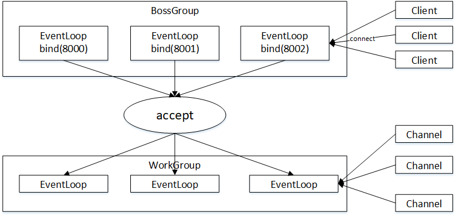
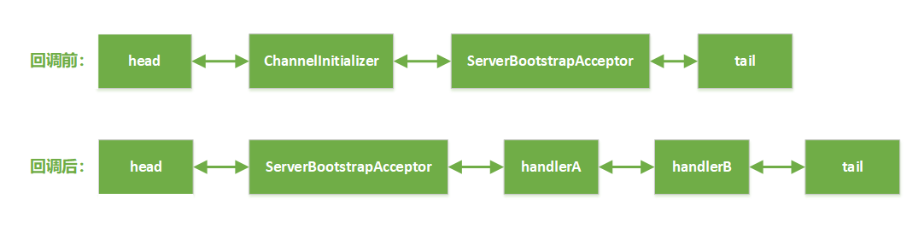
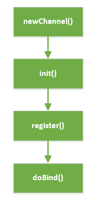

---
title: Netty 源码学习笔记——服务器启动流程
tags: 
	- Netty
toc: true
date: 2019-09-16 10:12:17
---
Netty 是一个使用非常广泛的异步事件驱动的网络通信层框架，在常用的中间件比如 Dubbo、RocketMQ 中都能看到它的身影。从使用者的角度来讲，Netty 屏蔽了 Java 原生 NIO 底层繁杂的细节，使用者只需要专注业务逻辑即可实现高质量的 NIO 网络通信。但 Netty 的封装也让它的底层变成了一个黑箱，阅读源码就是打开这个黑箱。

## why netty

在进入正题之前，我们先来看一下 jdk 原生的方式和 Netty 方式启动一个 NIO 服务器的区别。首先是用原生方式启动一个 NIO 服务端：

```java
import java.io.IOException;
import java.net.InetSocketAddress;
import java.nio.ByteBuffer;
import java.nio.channels.SelectionKey;
import java.nio.channels.Selector;
import java.nio.channels.ServerSocketChannel;
import java.nio.channels.SocketChannel;
import java.nio.charset.Charset;
import java.util.Iterator;
import java.util.Set;

public class NIOServer {
    public static void main(String[] args) throws IOException {
        // 处理连接请求
        Selector acceptSelector = Selector.open();
        // 处理读写请求
        Selector workSelector = Selector.open();

        // 线程1：用于处理连接请求
        new Thread(() -> {
            try {
                // 对应IO编程中服务端启动
                ServerSocketChannel listenerChannel = ServerSocketChannel.open();
                // 绑定端口
                listenerChannel.socket().bind(new InetSocketAddress(8000));
                // 设置非阻塞
                listenerChannel.configureBlocking(false);
                // 注册连接事件
                listenerChannel.register(acceptSelector, SelectionKey.OP_ACCEPT);

                while (true) {
                    // 监测是否有新的连接，这里的1指的是最大阻塞的时间为1ms
                    if (acceptSelector.select(1) > 0) {
                        Set<SelectionKey> set = acceptSelector.selectedKeys();
                        Iterator<SelectionKey> keyIterator = set.iterator();
                        while (keyIterator.hasNext()) {
                            SelectionKey key = keyIterator.next();
                            if (key.isAcceptable()) {
                                try {
                                    // 每来一个新连接，不需要创建一个线程，而是直接注册到 workSelector
                                    SocketChannel clientChannel = ((ServerSocketChannel) key.channel()).accept();
                                    clientChannel.configureBlocking(false);
                                    clientChannel.register(workSelector, SelectionKey.OP_READ);
                                } finally {
                                    keyIterator.remove();
                                }
                            }

                        }
                    }
                }
            } catch (IOException ignored) {
            }

        }).start();


        // 线程2：用于处理读写请求
        new Thread(() -> {
            try {
                while (true) {
                    // 批量轮询是否有哪些连接有数据可读，这里的1指的是最大阻塞的时间为1ms
                    if (workSelector.select(1) > 0) {
                        Set<SelectionKey> set = workSelector.selectedKeys();
                        Iterator<SelectionKey> keyIterator = set.iterator();

                        while (keyIterator.hasNext()) {
                            SelectionKey key = keyIterator.next();

                            if (key.isReadable()) {
                                try {
                                    SocketChannel clientChannel = (SocketChannel) key.channel();
                                    ByteBuffer byteBuffer = ByteBuffer.allocate(1024);
                                    // 读取数据以块为单位批量读取
                                    clientChannel.read(byteBuffer);
                                    byteBuffer.flip();
                                    System.out.println(Charset.defaultCharset().newDecoder().decode(byteBuffer)
                                            .toString());
                                } finally {
                                    keyIterator.remove();
                                    // 重新注册
                                    key.interestOps(SelectionKey.OP_READ);
                                }
                            }

                        }
                    }
                }
            } catch (IOException ignored) {
            }
        }).start();
    }
}
```
原生代码非常冗长，这里简单描述一下。NIO 模型中通常会有多个线程，每个线程绑定一个轮询器 Selector，在我们这个例子中 acceptSelector 负责轮询是否有新的连接，workSelector 负责轮询连接是否有数据可读。服务端监测到新的连接之后，将新连接绑定到 workSelector 上，后续的读写都由 workSelector 对应的线程完成。如果在某一时刻有多条连接有数据可读，那么通过 workSelector.select() 方法可以轮询出来，进而批量处理。

原生的代码非常复杂，实际编程中我们肯定没有耐心每次写这样一大段代码。那么同样的功能交给 netty 会怎么实现呢？以下是使用 netty 方式启动一个 NIO 服务端：
```java
public final class Server {

    public static void main(String[] args) throws Exception {
        // EventLoopGroup 表示线程池，bossGroup 对应原生中接收新连接的线程，workerGroup 对应原生中处理读写的线程
        EventLoopGroup bossGroup = new NioEventLoopGroup(1);
        EventLoopGroup workerGroup = new NioEventLoopGroup();

        try {
            // ServerBootstrap 是服务端的一个启动辅助类，通过给它设置一系列参数来绑定端口启动服务
            ServerBootstrap b = new ServerBootstrap();
            // group() 分别设置处理连接事件和读写事件的线程组
            b.group(bossGroup, workerGroup)
                    // 设置通道类型为 NioServerSocketChannel，这是 netty 自己的 Channel，指的是服务器通道，相应的还有客户端通道 NioSocketChannel
                    .channel(NioServerSocketChannel.class)
                    // option() 设置 bossGroup 中的连接属性，这里具体是 tcp 属性
                    .option(ChannelOption.SO_BACKLOG, 1024)
                    // childOption() 设置 workGroup 中的连接属性，这里具体也是 tcp 属性
                    .childOption(ChannelOption.TCP_NODELAY, true)
                    // handler() 为 bossGroup 中的 Channel 绑定处理器，处理器会监听 Channel 上的事件，具体过程后续会讲到
                    .handler(new ServerHandler())
                    // childHandler() 为 workGroup 中的 Channel 绑定处理器，同上
                    .childHandler(new ChannelInitializer<SocketChannel>() {
                        @Override
                        public void initChannel(SocketChannel ch) {
                            //..

                        }
                    });
            // 真正的启动过程，绑定 8888 端口，sync() 表示阻塞等待服务器启动完成
            ChannelFuture f = b.bind(8888).sync();
            // 等待服务器关闭，closeFuture() 表示获取服务器关闭事件，sync() 表示阻塞等待，这行代码会使 main 线程一直阻塞直到服务器关闭
            f.channel().closeFuture().sync();
        } finally {
            // 优雅关闭线程组
            bossGroup.shutdownGracefully();
            workerGroup.shutdownGracefully();
        }
    }
}
```
代码说明如上。这么一小段代码就实现了我们前面 NIO 编程中的所有的功能，包括服务端启动、接受新连接，而且你不用担心这段代码的健壮性和性能问题，Netty 底层都帮你设计好了。相比 jdk 原生方式，Netty 可以概括出以下五点优势：
- Netty 屏蔽了原生 NIO 繁琐的细节，降低了编程难度
- Netty 的 reactor 线程设计能够实现安全高效的并发处理，并且解决了空轮询 bug
- Netty 的对象池和内存池机制进一步提升了性能
- Netty 的事件机制具有很大灵活性，伴随着庞大的 netty 社区，让你处理任何一种通用协议几乎不用亲自动手
- Netty 已经得到各大 rpc框架、消息队列、分布式中间件的线上验证，健壮性无比强大

## 相关概念介绍

在学习 Netty 的源码之前，需要对 Netty 的主要概念进行了解，主要是初步明白每个类负责的任务是什么，能够完成哪些工作。当然，每个概念的具体实现会在后续章节中进行介绍。

### Channel

Netty 的 Channel 是对网络连接处理的抽象，负责与网络进行通讯，可以和网络编程中的一条 Socket 对应。

### ChannelHandler 与 ChannelPipeline

ChannelHandler 是通道处理器，用来处理 I/O事件或拦截 I/O 操作，ChannelPipeline 字如其名，是一个双向流水线，内部维护了多个 ChannelHandler，绑定在 Channel 上，当有数据流过 Channel 时会顺着 ChannelPipeline 依次调用 ChannelHandler 的相关方法。

Netty 的 ChannelPipeline 和 ChannelHandler 机制类似于 Servlet 和 Filter 过滤器/拦截器，每次收到请求会依次调用配置好的拦截器链。Netty 服务器收到消息后，将消息在 ChannelPipeline 中流动和传递，途经的 ChannelHandler 会对消息进行处理，ChannelHandler 分为两种 inbound 和 outbound，服务器 read 过程中只会调用 inboundHandler，write 时只会调用 outboundHandler。

ChannelPipeline 内部维护了一个双向链表，Head 和 Tail 分别代表表头和表尾，Head 作为总入口和总出口，负责底层的网络读写操作；用户自己定义的ChannelHandler 会被添加到链表中，这样就可以对 I/O 事件进行拦截和处理；这样的好处在于用户可以方便的通过新增和删除链表中的 ChannelHandler 来实现不同的业务逻辑，不需要对已有的 ChannelHandler 进行修改。

### EventLoop 与 EventLoopGroup

EventLoop 是内部不停循环的一个线程，EventLoopGroup 是多个 EventLoop 组成的线程组，Netty 使用了 Reactor 模型，服务器的连接和读写放在线程池的事件循环中执行，这是 Netty 获得高性能的原因之一。每个 EventLoop 内部会绑定一个 Selector，可以将 Channel 注册到上面，EventLoop 会不断的进行 select() 获取准备就绪的描述符；此外，EventLoop 内部也会维护一个任务队列用于处理非 IO 任务。

### Future 与 Promise

Netty 的 Future 继承了 jdk 的 Future 接口，相比原生多了 Listener 的添加和移除。Listener 使用了观察者模式，在任务完成后自动回调，不需要阻塞等待。除此之外，Future 提供了对结果的更细粒度查询，可以知道结果是成功还是失败。Promise 拓展了 Future，在 Promise 中可以手动设置任务结果。Future 只读不能修改，适合用在外部；Promise 可以修改，适合用在内部。

## 线程模型

Netty 使用 reactor 方式处理连接，一个线程会处理多条连接，它们的关系如下：



从图中可以看出，每个 bossGroup 的 EventLoop 监听一个端口（也可以监听多个），当客户端向某个端口发起 connect 请求后，对应端口的 EventLoop 会处理这次请求。如果 accept 成功，会把得到的新连接绑定到 workGroup 的一个 EventLoop 上，之后客户端和服务器的通信会在这条新连接上进行。一个 EventLoop 上会绑定多条 Channel，每个 Channel 会注册在 EventLoop 内部的一个 Selector 上，EventLoop 通过循环的方式不断从 Selector 中获取准备就绪的描述符进行处理。

## 启动流程

了解了上面的概念后，我们再来根据程序说明一下服务器的启动过程，主要分为五个阶段：

- 配置 ServerBootstrap：初始化启动类，设置相关参数；
- 创建服务端 Channel：调用 jdk 底层的 open() 方法创建 jdk 底层的 Channel，然后 Netty 将其封装成自己的 Channel；
- 初始化服务端 Channel：创建完 Channel 之后会基于此 Channel 做一些初始化操作，比如设置一些属性、添加一些逻辑处理器等；
- 注册 Selector：将 jdk 底层的 Channel 注册到 EventLoop 的 Selector 上面，并将 Netty 自己的 Channel 作为 attachment 绑定在 jdk 底层的 Channel 上，这样从  Selector 上拿到 jdk 底层的 Channel 后可以通过 attachment 拿到 Netty 自己的 Channel；
- 端口绑定：将 jdk 底层的 Channel 绑定到本地的端口上面，结束后使用 fireChannelActive 通知 Pipeline 里的 ChannelHandle，执行其 channelActive 方法；

由于注册阶段是异步的，绑定阶段会与之同时进行，因此注册阶段完毕后会判断绑定阶段是否结束从而触发 channelActive。

### 配置 ServerBootstrap
配置阶段的工作在用户代码中已经完成：
```java
b.group(bossGroup, workerGroup)
        .channel(NioServerSocketChannel.class)
        .option(ChannelOption.SO_BACKLOG, 1024)
        .childOption(ChannelOption.TCP_NODELAY, true)
        .handler(new ServerHandler())
        .childHandler(new ChannelInitializer<SocketChannel>() {
            @Override
            public void initChannel(SocketChannel ch) {
            //..
            }
        });
```

实现的方式是通过 method chaining 将启动服务器需要的参数保存到 ServerBootstrap 的属性上。我们再来看一下 ServerBootstrap 拥有的可设置的属性：

```java
EventLoopGroup group; // 连接线程组，用于处理连接请求
ChannelFactory<? extends C> channelFactory; // Channel 的工厂类
SocketAddress localAddress; // 绑定的地址
Map<ChannelOption<?>, Object> options; // Channel 可设置的选项，比如 TCP 连接参数
Map<AttributeKey<?>, Object> attrs; // Channel 属性，用于保存用户自定义数据
ChannelHandler handler; // Channel 处理器
Map<ChannelOption<?>, Object> childOptions; // accept 后创建的新 Channel 的可设置的选项，比如 TCP 连接参数
Map<AttributeKey<?>, Object> childAttrs; // accept 后创建的新 Channel 的属性，用于保存用户自定义数据
EventLoopGroup childGroup; // 工作线程组，用于处理读写请求
ChannelHandler childHandler; // accept 后创建的新 Channel 的处理器
```

对应的有以下方法：
```java
group() // 设置连接线程组和工作线程组
channelFactory() 及 channel() // 设置channel工厂和channel类型
localAddress() // 设置地址
option() // 添加 channel 参数
attr() // 添加 channel 属性
handler() // 设置 handle
childOption() // 添加子 channel 参数
childAttr() // 添加子 channel 属性
childHandler() // 设置 childHandle
```

### 创建服务端 Channel

配置完成后，Netty 会创建服务端 Channel，创建的过程中主要做了以下 5 件事：
- 通过反射创建服务端 Channel
- 创建 jdk 底层的 Channel，将其设置为非阻塞，保存在服务端 Channel 中
- 为服务端 Channel 分配全局唯一的 id
- 创建 NioMessageUnsafe，用于 Netty 底层的读写操作
- 创建 ChannelPipeline，默认的是 DefaultChannelPipeline

下面我们来跟着源码分析一下。Netty 创建服务端 Channel 的地方在 bootstrap 的 initAndRegister() 方法中：
```java
AbstractBootstrap
final ChannelFuture initAndRegister() {
    Channel channel = null;
    try {
        channel = channelFactory.newChannel(); // 创建 Channel
        init(channel); // 初始化 Channel
    } catch (Throwable t) {
        if (channel != null) {
            channel.unsafe().closeForcibly();
            return new DefaultChannelPromise(channel, GlobalEventExecutor.INSTANCE).setFailure(t);
        }
        return new DefaultChannelPromise(new FailedChannel(), GlobalEventExecutor.INSTANCE).setFailure(t);
    }
    ChannelFuture regFuture = config().group().register(channel); // 注册 Channel
    if (regFuture.cause() != null) {
        if (channel.isRegistered()) {
            channel.close();
        } else {
            channel.unsafe().closeForcibly();
        }
    }
    
    return regFuture;
}
```
这里有三个逻辑：创建->初始化->注册，本小节主要关注第一个创建逻辑。创建的方式是通过一个工厂类 channelFactory 创建， channelFactory 是我们在用户代码调用 `b.channel(NioServerSocketChannel.class)` 时创建的，工厂内部会保存我们传入的 class 对象，然后通过反射的方式创建对应的 Channel：
```java
ReflectiveChannelFactory
public ReflectiveChannelFactory(Class<? extends T> clazz) {
    ObjectUtil.checkNotNull(clazz, "clazz");
    try {
        // 通过反射创建实例
        this.constructor = clazz.getConstructor();
    } catch (NoSuchMethodException e) {
        //...
    }
}
```

Netty NIO 服务端使用 NioServerSocketChannel 作为服务端 Channel 类型，那么接下来就要进入 NioServerSocketChannel 的构造方法。首先是创建 jdk 底层的 ServerSocketChannel：

```java
NioServerSocketChannel
public NioServerSocketChannel() {
        this(newSocket(DEFAULT_SELECTOR_PROVIDER)); // 创建 socket
}

private static ServerSocketChannel newSocket(SelectorProvider provider) {
        return provider.openServerSocketChannel(); // 创建 jdk 底层的 ServerSocketChannel
}
```

在原生的 jdk nio 编程中，我们会用 `selectorProvider.open()` 的方式获取服务端的 ServerSocketChannel，那么在 Netty 中也一样。SelectorProvider 是 Java 提供的 NIO 的抽象类，会根据操作系统类型和版本确定具体的实现类：如果 Linux 内核版本>=2.6 则具体的实现类为 EPollSelectorProvider，否则为默认的 PollSelectorProvider。

创建完 jdk 底层的 Channel 后，NioServerSocketChannel 会调用父类的构造方法创建三个重要的成员变量，id、unsafe 和 pipeline：

```java
AbstractChannel
protected AbstractChannel(Channel parent) {
    this.parent = parent;
    id = newId(); // 全局唯一的id
    unsafe = newUnsafe(); // 用于底层读写操作的组件
    pipeline = newChannelPipeline(); // 用于处理逻辑链的组件
}
```

从父类的名字 AbstractChannel 可以看出，这不仅是服务端 Channel 的父类，也是所有 Netty Channel 的父类，因此在所有 Netty Channel 中都有这三个成员变量。其中，id 用于标识唯一 Channel；unsafe 用于处理底层读写操作；pipeline 用于处理数据流入流出时的逻辑链。当然此时的 pipeline 还是空的，内部只有头尾两个节点：

```java
 protected DefaultChannelPipeline(Channel channel) {
        //...

        // 初始化双向链表
        tail = new TailContext(this); // 创建head 
        head = new HeadContext(this); // 创建tail

        head.next = tail;
        tail.prev = head;
}
```
最后回到之前创建的 jdk 底层的 ServerSocketChannel 上来，Netty 会把它保存在自己的 Channel 的成员变量中，然后把它设置成非阻塞模式。对服务端 Channel 而言，还会创建一个配置类用于设置服务端的 TCP 参数：
```java
AbstractNioChannel
protected AbstractNioChannel(Channel parent, SelectableChannel ch, int readInterestOp) {
    super(parent);
    this.ch = ch; // 保存 jdk 底层的 ServerSocketChannel
    this.readInterestOp = readInterestOp;
    try {
        ch.configureBlocking(false); // 设置成非阻塞模式
    } catch (IOException e) {
        ch.close();
        //...
    }
}

NioServerSocketChannel
public NioServerSocketChannel(ServerSocketChannel channel) {
    super(null, channel, SelectionKey.OP_ACCEPT);
    // 服务端配置类，用于设置服务端的 TCP 参数
    config = new NioServerSocketChannelConfig(this, javaChannel().socket());
}
```
这里 `ch.configureBlocking(false);` 这一步非常重要，使用 NIO 通信时，一定要把 Channel 设置成非阻塞的模式。

至此，服务端 Channel 就创建好了，接下来是初始化的过程。

### 初始化服务端 Channel

在服务端 Channel 创建完成之后，接下来会做一些初始化的工作。初始化的工作比较简单，主要做了以下 4 件事：
- 将用户传入的参数设置到 jdk 底层的 socket 上
- 在服务端 Channel 中保存用户传入的自定义属性
- 添加用户通过 handle() 传入的自定义 handler
- 添加一个类型为 ServerBootstrapAcceptor 的特殊 handler

我们回到 bootstrap 的 initAndRegister() 方法：
```java
AbstractBootstrap
final ChannelFuture initAndRegister() {
    Channel channel = null;
    try {
        channel = channelFactory.newChannel(); // 创建 Channel
        init(channel); // 初始化 Channel
    } catch (Throwable t) {
        if (channel != null) {
            channel.unsafe().closeForcibly();
            return new DefaultChannelPromise(channel, GlobalEventExecutor.INSTANCE).setFailure(t);
        }
        return new DefaultChannelPromise(new FailedChannel(), GlobalEventExecutor.INSTANCE).setFailure(t);
    }
    ChannelFuture regFuture = config().group().register(channel); // 注册 Channel
    if (regFuture.cause() != null) {
        if (channel.isRegistered()) {
            channel.close();
        } else {
            channel.unsafe().closeForcibly();
        }
    }
    
    return regFuture;
}
```
之前分析了第一步创建 Channel 的过程，现在来看第二步初始化 Channel：
```java
ServerBootstrap
void init(Channel channel) throws Exception {
    final Map<ChannelOption<?>, Object> options = options0();
    synchronized (options) {
        setChannelOptions(channel, options, logger); // 设置 jdk 底层 socket 的参数
    }
    // 在服务端 Channel  中保存用户传入的自定义属性（8-15）
    final Map<AttributeKey<?>, Object> attrs = attrs0();
    synchronized (attrs) {
        for (Entry<AttributeKey<?>, Object> e: attrs.entrySet()) {
            @SuppressWarnings("unchecked")
            AttributeKey<Object> key = (AttributeKey<Object>) e.getKey();
            channel.attr(key).set(e.getValue());
        }
    }

    ChannelPipeline p = channel.pipeline();

    // 准备 ServerBootstrapAcceptor 初始化的参数（20-30）
    final EventLoopGroup currentChildGroup = childGroup;
    final ChannelHandler currentChildHandler = childHandler;
    final Entry<ChannelOption<?>, Object>[] currentChildOptions;
    final Entry<AttributeKey<?>, Object>[] currentChildAttrs;

    synchronized (childOptions) {
        currentChildOptions = childOptions.entrySet().toArray(newOptionArray(0));
    }
    synchronized (childAttrs) {
        currentChildAttrs = childAttrs.entrySet().toArray(newAttrArray(0));
    }

    // 向服务端 Channel 的 pipeline 添加 handler（33-50）
    p.addLast(new ChannelInitializer<Channel>() {
        @Override
        public void initChannel(final Channel ch) throws Exception {
            final ChannelPipeline pipeline = ch.pipeline();
            ChannelHandler handler = config.handler();
            if (handler != null) {
                pipeline.addLast(handler); // 添加用户在 handler() 中自定义的 handler
            }
            // 添加 ServerBootstrapAcceptor，这是服务端 Channel 默认添加的特殊 handler（42-48）
            ch.eventLoop().execute(new Runnable() {
                @Override
                public void run() {
                    pipeline.addLast(new ServerBootstrapAcceptor(
                            ch, currentChildGroup, currentChildHandler, currentChildOptions, currentChildAttrs));
                }
            });
        }
    });
}
```
首先是设置 jdk 底层 socket 的参数，这里用到了我们在上一节创建服务端 Channel 时保存的配置类 NioServerSocketChannelConfig，底层会调用它的 setOption() 方法给 socket 设置参数。设置完成后，bootstrap 会把用户自定义的属性以 Map 的形式保存在服务端 Channel 中（对应代码 8-15 行）。然后向服务端 Channel 的 pipeline 添加了用户自定义的 handler（对应代码第 39 行），最后又添加了一个类型为 ServerBootstrapAcceptor 的特殊 handler，这个 handler 接收了很多和子连接相关的参数，可以猜到它的作用和创建子连接相关，具体作用我们之后会看到。

到此，初始化服务端 Channel 的过程结束了。

### 注册 Selector

初始化服务端 Channel 之后，就要把 Channel 注册到 Selector 上了。注册的过程主要做了以下几件事：
- 绑定 EventLoop
- 调用 jdk 底层注册
- 触发 Pipeline 上面的注册事件

让我们继续回到 bootstrap 的 initAndRegister() 方法：

```java
AbstractBootstrap
final ChannelFuture initAndRegister() {
    Channel channel = null;
    try {
        channel = channelFactory.newChannel(); // 创建 Channel
        init(channel); // 初始化 Channel
    } catch (Throwable t) {
        if (channel != null) {
            channel.unsafe().closeForcibly();
            return new DefaultChannelPromise(channel, GlobalEventExecutor.INSTANCE).setFailure(t);
        }
        return new DefaultChannelPromise(new FailedChannel(), GlobalEventExecutor.INSTANCE).setFailure(t);
    }
    ChannelFuture regFuture = config().group().register(channel); // 注册 Channel
    if (regFuture.cause() != null) {
        if (channel.isRegistered()) {
            channel.close();
        } else {
            channel.unsafe().closeForcibly();
        }
    }
    
    return regFuture;
}
```

前面两节分析了创建和初始化的过程，那么这一节就来看看注册的过程：

```java
MultithreadEventLoopGroup    
public ChannelFuture register(Channel channel) {
    return next().register(channel); // 选择一个 eventLoop
}

AbstractChannel
public final void register(EventLoop eventLoop, final ChannelPromise promise) {
    //...

    AbstractChannel.this.eventLoop = eventLoop; // 绑定 eventLoop 到当前 Channel

    if (eventLoop.inEventLoop()) {
        register0(promise); // 实际注册过程
    } else {
        // 当前线程非 eventLoop 时，会把注册任务提交给 eventLoop 的任务队列（16-27）
        try {
            eventLoop.execute(new Runnable() {
                @Override
                public void run() {
                    register0(promise); // 实际注册过程
                }
            });
        } catch (Throwable t) {
            closeForcibly();
            closeFuture.setClosed();
            safeSetFailure(promise, t);
        }
    }
}
```
由于我们是在 eventLoopGroup 中注册，所以先顺序选择了一个 eventLoop 进行绑定。这个绑定操作意义重大，一旦一个 Channel 和 eventLoop 绑定，就意味着后续所有和这个 Channel 相关的操作，都会由这个 eventLoop 来处理。然后是实际注册过程，不论当前线程是否是 eventLoop，最终都会调用 `register0(promise)` 进行实际注册：
```java
private void register0(ChannelPromise promise) {
    try {
        //...
        boolean firstRegistration = neverRegistered;
        doRegister(); // 调用 jdk 底层的 register()
        neverRegistered = false;
        registered = true;

        pipeline.invokeHandlerAddedIfNeeded(); // 触发 handlerAdded 事件

        safeSetSuccess(promise);
        pipeline.fireChannelRegistered();// 触发 channelRegistered 事件

        // 当前状态为活跃则触发 ChannelActive 事件（注册时不活跃，绑定端口后活跃）
        if (isActive()) {
            if (firstRegistration) {
                pipeline.fireChannelActive();
            } else if (config().isAutoRead()) {
                beginRead();
            }
        }
    } catch (Throwable t) {
        //...
    }
}
```
register0 内部会先调用 jdk 底层的 register() 进行注册，然后在 pipeline 上触发一系列的事件。我们一个个来看，先看 jdk 底层的注册逻辑：
```java
AbstractNioChannel
protected void doRegister() throws Exception {
    boolean selected = false;
    for (;;) {
        try {
            selectionKey = javaChannel().register(eventLoop().unwrappedSelector(), 0, this); // 调用 jdk 底层的 register() 注册
            return;
        } catch (CancelledKeyException e) {
            //...
        }
    }
}
```
jdk 底层的 register() 的第三个参数是 attachment，传进去的 this 是 Netty 自己的 Channel。这步操作非常巧妙。之前我们可能会疑惑，Selector 每次返回的是 jdk 底层的 Channel，那么 Netty 是怎么知道它对应哪个 Netty Channel 的呢？这里我们找到了答案：Netty 通过把自己的 Channel 作为 attachment 绑定在 jdk 底层的 Channel 上，在每次返回的时候带出来。

回到 register0，在完成 jdk 底层的注册后，会触发服务端 ChannelPipeline 上的 handlerAdded 和 channelRegistered 两个事件。事件回调的原理大家应该都知道。这里要关注一下 handlerAdded 这个事件和 ChannelInitializer 这个处理器。我们先回顾一下我们的用户代码：我们通过 `b.handle(new ServerHandler())` 方法给服务端连接添加处理器，传入的只有一个处理器，那么如果我们想给服务端 Channel 添加多个处理器该怎么做呢？实际上很简单，我们只需要传入一个 ChannelInitializer，然后在 initChannel() 方法中添加处理器就行：
```java
b.group(bossGroup,workerGroup)
        .handler(new ChannelInitializer<SocketChannel>(){
            @Override
            public void initChannel(SocketChannel ch){
                //..
                ch.pipeline().addLast(handlerA);
                ch.pipeline().addLast(handlerB);
                //...
            }
        })
```
这也是日常开发中使用比较多的范式，那么这个 ChannelInitializer 有何特殊之处，为什么在它的 initChannel() 方法中可以为 pipeline 添加处理器？答案正是在 ChannelInitializer 的 handlerAdded 事件回调中：
```java
ChannelInitializer
public void handlerAdded(ChannelHandlerContext ctx) throws Exception {
    if (ctx.channel().isRegistered()) {
        if (initChannel(ctx)) { // 调用抽象类的 initChannel() 方法
            removeState(ctx);
        }
    }
}

private boolean initChannel(ChannelHandlerContext ctx) throws Exception {
    if (initMap.add(ctx)) { 
        try {
            initChannel((C) ctx.channel()); // 调用用户实现的 initChannel() 方法
        } catch (Throwable cause) {
            //...
        } finally {
            ChannelPipeline pipeline = ctx.pipeline();
            if (pipeline.context(this) != null) {
                pipeline.remove(this); // 把自己从 pipeline 中移出
            }
        }
        return true;
    }
    return false;
}
```
ChannelInitializer 会先调用用户实现的 initChannel() 方法添加用户的处理器，然后把自己从 pipeline 移出。用图表示就是：



到此，注册 Selector 的过程就走完了。

### 端口绑定

注册 Selector 之后，服务端 Channel 还会进行端口绑定。端口绑定主要做两件事：
- 调用 jdk 底层的绑定
- 触发 channelActive 事件

核心代码在 AbstractChannel 的 bind() 中：

```java
AbstractChannel
public final void bind(final SocketAddress localAddress, final ChannelPromise promise) {
    //...
    boolean wasActive = isActive(); // 绑定前 isActive() 为 false
    try {
        doBind(localAddress); // 调用  jdk 底层的绑定
    } catch (Throwable t) {
        safeSetFailure(promise, t);
        closeIfClosed();
        return;
    }
    if (!wasActive && isActive()) { // 绑定后 isActive() 为 true
            @Override
            public void run() {
                pipeline.fireChannelActive(); // 触发 ChannelActive 事件
            }
        });
    }
    safeSetSuccess(promise);
}
```
首先是调用 jdk 底层的绑定：
```java
NioServerSocketChannel
protected void doBind(SocketAddress localAddress) throws Exception {
    if (PlatformDependent.javaVersion() >= 7) {
        javaChannel().bind(localAddress, config.getBacklog()); // 版本号不小于 7 调用 channel 的 bind()
    } else {
        javaChannel().socket().bind(localAddress, config.getBacklog()); // 版本号小于 7 调用 socket 的 bind()
    }
}
```

这里会根据 jdk 的版本号判断。然后触发 pipeline 上的 ChannelActive 事件。ChannelActive 会首先传播到 pipeline 中的 head 节点，head 节点在这里会把 OP_ACCEPT 事件添加到服务端 Channel 的感兴趣事件集合：

```java
AbstractNioChannel
protected void doBeginRead() throws Exception {
    final SelectionKey selectionKey = this.selectionKey;
    if (!selectionKey.isValid()) {
        return;
    }

    readPending = true;

    final int interestOps = selectionKey.interestOps();
    if ((interestOps & readInterestOp) == 0) {
        selectionKey.interestOps(interestOps | readInterestOp); // 把 OP_ACCEPT 事件添加到服务端 Channel 的感兴趣事件集合
    }
}
```
这样服务端 Channel 就开始监听端口上的 OP_ACCEPT 事件，服务端才算启动完毕。

## 总结

最后我们来总结一下服务端启动的过程。服务端启动核心路径如下图所示：



- 首先调用 newChannel() 创建服务端的 Channel，在这个过程中会先调用 jdk 底层的 api 来创建一个 jdk 底层的 Channel，然后 Netty 将其包装成一个自己的 Channel，同时会创建一些基本的组件（unsafe,pipeline）绑定在此 Channel 上；
- 然后调用 init() 方法初始化服务端 Channel，这个过程最重要的也就是为服务端 Channel 添加一个连接处理器 ServerBootstrapAcceptor；
- 随后调用  register() 方法注册 Selector，这个过程中 Netty 将 jdk 底层的 Channel 注册到事件轮询器 Selector 上，并将 Netty 自己的 Channel 作为 attachment 绑定到对应的 jdk 底层的 Channel 上；
- 最后调用 doBind() 方法调用 jdk 底层的 api 实现对本地端口的监听，绑定后 Netty 会重新向 Selector 注册一个 OP_ACCEPT 事件，这样 Netty 就可以接受新的连接了。

## 参考资料
[Netty服务器启动过程](https://www.kancloud.cn/ssj234/netty-source/433213)
[《跟闪电侠学Netty》01: 服务端启动流程介绍](https://www.jianshu.com/p/ec3ebb396943)
[精尽 Netty 源码分析](http://svip.iocoder.cn/categories/Netty/)