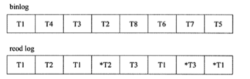

MySQL 中有很多日志，其中 redo log,undo log 和 binlog 是使用比较多的日志。redo log 和 undo log 是 innodb 层面的日志，用于实现数据库引擎中的事务。其中，redo log 保证了事务的持久性，undo log 保证了事务的一致性，redo log 和 undo log 共同保证了事务的原子性。binlog 是 mysql server 层面的日志，它主要用于主库和从库之间的数据同步。下面我们来依次介绍一下这三种日志：

## 1、binlog
binlog 中记录了对 MySQL 数据库执行更改的所有操作，但不包括 SELECT 和 SHOW 这类操作，因为这类操作对数据本身没有修改。在 innodb 中存储引擎会为每个事务分配一个默认大小为 32K 的缓冲区，事务在提交之前会把二进制日志写入缓冲区中，等事务提交时再将缓冲区中的日志写入文件中。但写入文件不代表刷新到硬盘，因为操作系统对写操作会有一个缓冲。通过修改 sync_binlog = [N] 可以设置每提交多少次事务就强制刷盘。默认 sync_binlog = 0，表示刷盘时机由操作系统决定。

binlog 中有三种格式：
- STATEMENT：记录的是每一条会修改数据的 SQL 语句。优点是体积小，缺点是无法记录特定函数，比如 UUID()、USER() 等。
- ROW：记录的是每一条被修改的记录行的修改情况。优点是不会再有无法记录特定函数的问题，缺点是体积大。
- MIXED：此格式下默认采用 STATEMENT 格式进行记录，在特殊情况（比如涉及到无法记录的特定函数时）下，会采用 ROW 的格式记录。

目前版本（5.7）下默认使用 ROW 格式来记录二进制日志。

### 1.1 主从复制

binlog 可以实现 MySQL 主从服务器之间的复制功能，具体有以下几步：
1. 在主服务器上创建一个具有复制权限的用户。
2. 依次在主从服务器配置唯一的 serverid。
3. 从服务器设置连接主服务器的信息，然后执行`start slave`，开启主从复制开关。
4. 从服务器会创建两个线程：IO 线程和 SQL 线程。IO 线程会通过主服务器上授权的有复制权限的用户请求连接主服务器，并请求从指定 binlog 日志文件的指定位置之后发送 binlog 日志内容。（日志文件名和位置在上一步设置连接信息时已指定）
5. 主服务器接收到来自从服务器的请求后，会创建一个专门的 IO 线程，此 IO 线程会根据从服务器的 IO 线程请求的信息，读取指定 binlog 日志文件指定位置之后的 binlog 日志信息，然后返回给从端的 IO 线程。返回的信息中除了 binlog 日志内容外，还有本次返回日志内容后在主服务器端的新的 binlog 文件名以及在 binlog 中的下一个指定更新位置。
6. 当从服务器的 IO 线程获取来自主服务器上 IO 线程发送的日志内容及日志文件和位置点后，将 binlog 日志内容依次写入到从端自身的 relay log（即中继日志）文件的最末端，并将新的 binlog 文件名和位置记录到 master-info 文件中，以便下一次读取主端新 binlog 日志时，能告诉主服务器需要从新 binlog 日志的哪个文件哪个位置开始请求新的 binlog 日志内容。
7. 从服务器端的 SQL 线程会实时检测本地 relay log 中新增加的日志内容，然后根据日志内容更新从库的数据。到此一轮复制操作就完成了。

## 2、redo log
redo log 由两部分组成：一是内存中的重做缓存日志（redo log buffer），其是易失的；二是重做日志文件（redo log file），其是持久的。redo log 通过 Write Ahead Log 和 Force Log at Commit 机制来实现事务的持久性，即当修改内存中的数据页时，先修改内存中的日志；当事务提交时，必须先将该事务的所有 redo log 持久化。在这两个机制之下，当系统发生宕机时，redo log 保证了：如果一个事务的 redo log 已经全部刷入磁盘，那么该事务一定可以恢复；如果一个事务的 redo log 没有全部刷入磁盘，那么就通过 undo log 将这个事务恢复到执行之前。

redo log 中记录的是每一次修改的物理日志，即数据库中每个页的修改，这个页既包括聚簇索引，也包括二级索引。举个例子，当我们执行 SQL 语句 `INSERT INTO t VALUES(1,2)` 时，其记录的重做日志大致为：

> page(2,3), offset 32, value 1,2 # 聚簇索引
page(2,4), offset 64, value 2    # 二级索引

可以看到 redo log 中的记录是**物理**的，记录的是在哪个数据页偏移量多少的地方写入什么值，同时这种记录也是**幂等**的，也就是说无论执行多少次恢复操作，最终的结果都是一样的。而 binlog 就不一样，尽管 binlog 也可以按行记录，但这种记录是逻辑的。比如对于插入操作而言，它的记录可能是：在xx行插入一条xxx的数据。对这条记录而言，重复执行就会插入多条重复数据。

除此之外，两种日志记录写入磁盘的时间点也不一样。每个事务会为二进制日志分配一个缓冲区，缓冲区中的日志只在当前事务提交时一次性刷入磁盘；而 redo log 的缓冲区由所有事务共享，缓冲区中的数据刷入磁盘的时机受很多条件的影响。这表现为 redo log 并不按事务提交的顺序记录日志。如图所示：

T1、T2、T3 表示事务的记录。*T1、*T2、*T3表示事务提交时的日志。T1 的提交发生在 T2之后，但 T2 提交时会把已经记录的 T1 相关的部分刷到磁盘。那么 redo log 何时刷入磁盘呢？具体有三个时机：
- 有事务提交时
- 当 log buffer 中有一半的内存空间已经被使用时
- checkpoint 时（checkpoint 会将内存中的部分脏页刷入磁盘，要确保脏页在刷入磁盘之前对应的 redo log 已经刷盘完成）

为了确保每次日志都能写入到事务日志文件中，在每次将 redo log buffer 中的日志写入日志文件的过程中都会调用一次操作系统的 fsync 操作。

### 2.1 LSN

数据库宕机后可以根据 redo log 恢复，但并不是所有数据都需要恢复。在宕机之前就已经刷入到磁盘的数据可以不用恢复。这个判断是由 LSN 来完成的。LSN 表示的是日志序列号，它是一个单调递增的 8 字节数字，代表的是事务写入 redo log 的字节的总量。例如当前 redo log 的 LSN 为 1000，事务 T1 写入了 100 字节到 redo log，那么 LSN 就变成了 1100，若又有事务 T2 写入了 200 字节到 redo log，那么 LSN 就变成了 1300。可以看出，LSN 相当于游标，指示了 redo log 中的某个位置。

在 innodb 中有以下几种 LSN：
- Log sequence number：当前写入 redo log 的总量
- Log flushed up to：当前刷入磁盘的 redo log 的总量
- FIL_PAGE_LSN：存在于每个数据页的头部，表示该页最后刷新时 LSN 的大小，通过比较这个参数可以判断该页刷新的时间
- Last checkpoint at：上次脏页刷盘后，内存中仍存在的脏页中最小的 LSN。这个参数的意思是，页 LSN 小于该 LSN 的数据页都已经刷入了磁盘（但不代表大于该 LSN 的页都没有刷入，redo log 的幂等性确保了重复恢复的一致性），该参数会保存两份交替写入，避免了因介质失败而导致无法找到可用的 checkpoint。

当数据恢复时，只需要应用 checkpoint 之后的日志，且对于某一页，只需要应用页 LSN 之后的日志。这样加快了恢复的速度。而且 redo log 中小于 checkpoint 的部分可以写入新的数据，循环利用，节省空间。

## 3、undo log
undo log 的设计目的在于回滚，在 innodb 中还顺带实现了 MVCC 的功能。undo log 位于共享表空间中，事务需要在 undo log segment 中申请相应的页，页的头部会记录事务相关的信息（事务类型，事务状态等）。将 undo log 写入共享表空间的过程同样需要写入 redo log。undo log 的逻辑结构如下：

T0、T1、T2 表示创建 undo log 的事务。undo log 中保存的是每一行数据在每一个事务版本下的**逻辑**数据。而恢复也很简单，就是将某个版本的数据设置为当前数据就好。这里可能会有一个问题，就是数据库中可能同时有数千个并发的事务，当我们回滚某一个事务时，如何保障其它事务的修改仍然有效？答案很简单，当我们回滚某一个事务时，该事物还未提交，而如果该事务还未提交，则当前数据行会加锁，因此对某一行数据而言，不存在回滚会同时擦除其它事务修改的可能。而对整个数据页而言，如果使用物理日志，就会发生这种擦除的情况。因此 undo log 使用**逻辑日志**。

事务为 undo log 分配的页不会一直存在，当事务提交时，undo log 就没有了回滚的价值。但仍不能立马删除 undo log 的所在页，因为可能还有其它事务通过 MVCC 访问之前的版本。故事务提交时将 undo log 放入一个链表中，是否可以最终删除 undo log 及 undo log 所在页由 purge 线程判断。

## 4、事务写入过程

1、事务开启
2、undo log's redo log 写入
3、undo log 写入
4、redo log 写入
5、数据页写入
6、redo log 刷盘
7、2-6 重复若干
8、事务提交
9、某个时间脏页刷盘

## 5、崩溃恢复过程

1、启动开始时检测是否发生崩溃
2、定位到最近的一个 checkpoint
3、定位在这个 checkpoint 时 flush 到磁盘的数据页，检查 checksum。如果不正确，说明这个页在上次写入是不完整的，从 doublewrite buffer 里把正确的页读出来，更新到 buffer 中的页
4、分析 redo log，标识出未提交事务（事务提交之后会清除 undo log，undo log 中记录了事务的ID。通过检查是否存在对应的 undo log 可以知道事务的提交状态）
5、顺序执行 redo，跳过页 LSN 大于当前 LSN 的页（通过 redo log 也可以恢复 undo log）
6、通过 undo log 回滚未提交的事务

## 6、binlog 和 redo log 的一致性
MySQL 主从复制之间依赖 binlog，而 binlog 文件的写入在 commit 之前，如果写完 binlog 文件后主库宕机，再次启动时会回滚事务。但此时从库已经执行，则会造成主备数据不一致。所以在开启binlog 后，如何保证 binlog 和 redo log 的一致性呢？为此，MySQL 引入二阶段提交（two phase commit or 2pc），MySQL 内部会自动将普通事务当做一个 XA 事务（内部分布式事物）来处理：

– 自动为每个事务分配一个唯一的ID（XID）。

– COMMIT 会被自动的分成 Prepare 和 Commit 两个阶段。

– Binlog 会被当做事务协调者(Transaction Coordinator)，Binlog 的每条日志会被当做协调者日志。

Binlog 在 2PC 中充当了事务的协调者（Transaction Coordinator）。由 Binlog 来通知 InnoDB 引擎来执行 prepare，commit 或者 rollback 的步骤。事务提交的整个过程如下：

以上的图片中可以看到，事务的提交主要分为两个主要步骤：

1、准备阶段（Storage Engine（InnoDB） Transaction Prepare Phase）

此时SQL已经成功执行，并生成xid信息及redo和undo的内存日志。然后调用prepare方法完成第一阶段，papare方法实际上什么也没做，将事务状态设为TRX_PREPARED，并将redo log刷磁盘。

2、提交阶段(Storage Engine（InnoDB）Commit Phase)

2.1 记录协调者日志，即Binlog日志。

如果事务涉及的所有存储引擎的prepare都执行成功，则调用TC_LOG_BINLOG::log_xid方法将SQL语句写到binlog（write()将binary log内存日志数据写入文件系统缓存，fsync()将binary log文件系统缓存日志数据永久写入磁盘）。此时，事务已经铁定要提交了。否则，调用ha_rollback_trans方法回滚事务，而SQL语句实际上也不会写到binlog。

2.2 告诉引擎做commit。

3、最后，调用引擎的commit完成事务的提交。会清除undo信息，刷redo日志，将事务设为TRX_NOT_STARTED状态。

由上面的二阶段提交流程可以看出，一旦步骤 2 中的操作完成，就确保了事务的提交，即使在执行步骤 3 时数据库发送了宕机。此外需要注意的是，每个步骤都需要进行一次 fsync 操作才能保证上下两层数据的一致性。步骤 2 的 fsync 参数由 sync_binlog=1 控制，步骤 3 的 fsync 由参数 innodb_flush_log_at_trx_commit=1 控制，俗称“双1”，是保证日志一致性的根本。

事务的两阶段提交协议保证了无论在任何情况下，事务要么同时存在于存储引擎和 binlog 中，要么两个里面都不存在，这就保证了主库与从库之间数据的一致性。如果数据库系统发生崩溃，当数据库系统重新启动时会进行崩溃恢复操作，存储引擎中处于 prepare 状态的事务会去查询该事务是否也同时存在于 binlog 中，如果存在就在存储引擎内部提交该事务（因为此时从库可能已经获取了对应的 binlog 内容），如果 binlog 中没有该事务，就回滚该事务。例如：当崩溃发生在第一步和第二步之间时，明显处于 prepare 状态的事务还没来得及写入到 binlog 中，所以该事务会在存储引擎内部进行回滚，这样该事务在存储引擎和 binlog 中都不会存在；当崩溃发生在第二步和第三步之间时，处于 prepare 状态的事务存在于 binlog 中，那么该事务会在存储引擎内部进行提交，这样该事务就同时存在于存储引擎和 binlog 中。

## 7、参考资料
[MySQL 中Redo与Binlog顺序一致性问题](https://www.cnblogs.com/mao3714/p/8734838.html)