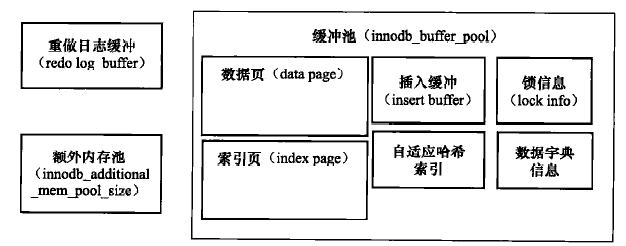

---

title: 插入缓冲、两次写和自适应哈希索引
tags: MySQL
toc: true

date: 2019-01-14 11:56:25

---
<!--more-->
InnoDB 是 MySQL 数据库从 5.5.8 版本开始的默认存储引擎，它将数据放在一个逻辑的表空间中，这个表空间就像黑盒一样由 InnoDB 存储引擎自身进行管理。从 MySQL 4.1 开始，它可以将每个 InnoDB 的表单独存在一个独立的 idb 文件中。此外，InnoDB 支持用裸设备（raw disk，不被操作系统管理的设备）建立其表空间。

InnoDB 通过使用多版本并发控制（MVCC）来获得高并发性，并且实现了 SQL 标准的四种隔离级别，默认为 REPEATABLE 级别。同时，使用一种称为 next-key locking 的策略来避免幻读。除此之外，InnoDB 还提供了**插入缓冲、二次写、自适应哈希索引**等高性能和高可用的功能。

## 缓冲池

功能的实现离不开底层的配合。为了协调 CPU 速度与磁盘速度之间的鸿沟，InnoDB 在内存中开辟了一块空间叫内存池，将对数据库的修改首先保存在内存中。比如对于页的操作，首先会在内存中进行，然后后台线程会把脏页（还没有刷入磁盘的页）刷入磁盘。InnoDB 中的内存池如下图：

缓冲池中缓存的数据页类型有：索引页、数据页、undo 页、插入缓冲、自适应哈希索引、InnoDB 存储的锁信息、数据字典信息等。不能简单地认为，缓冲池只是缓存索引页和数据页，它们只是占缓冲池很大的一部分而已。

### 中点插入策略

缓冲池对于数据页的管理，是使用 LRU 的方式管理的。和传统的 LRU 稍有不同的是，InnoDB 使用一种称为“中点插入策略”的方式插入数据：
- 新页的第一次插入只会插入到 LRU 链表尾端 3/8（中点）的位置
- 页的再次命中（LRU 上的页被命中）才会把页插入到链表头部
- 可以设置一个 InnoDB_old_blocks_time 的参数，表示新页插入后过多久才有资格被插入到链表头部

这样做的好处是避免了一些冷数据对真正热点数据的干扰。比如进行扫描操作时，需要访问表中的许多页，甚至是全部页，而这些页通常来说只在这次查询中需要，并不是活跃的热点数据。如果页被放入 LRU 链表头部，那么非常可能将所需的真正热点数据刷出。InnoDB_old_blocks_time 也是出于同样的目的。可以避免临近的几次查询把页刷入热数据的情况。

## 插入缓冲

InnoDB 底层使用聚簇索引管理数据。在进行插入操作的时候，数据页的存放是按主键顺序存放的，此时磁盘顺序访问，速度会很快。但对于非聚集索引叶子节点的插入则不再是顺序的了，这时需要离散地访问非聚集索引页，磁盘的随机读取效率很低，导致了插入操作的性能下降。

InnoDB 存储引擎创造性地设计了 Insert Buffer，对于非聚簇索引的插入或更新操作，不是每一次直接插入到索引页中，而是先判断插入的非聚簇索引页是否在缓冲池中，若在，则直接插入；若不在，则先放入到一个 Insert Buffer 对象中。然后再以一定的频率和情况进行 Insert Buffer 和辅助索引叶子节点的 merge 操作，这时通常能将多个插入合并到一个操作中（因为在一个索引页中），这就大大提高了对于非聚簇索引插入的性能。

然而 Insert Buffer 的使用需要同时满足以下两个条件：
- 索引是辅助索引。
- 索引不是唯一的。（因为在插入缓冲时，数据库并不去查找索引页来判断插入的记录的唯一性。如果去查找肯定又会有离散读取的发生，就背离了 Insert Buffer 的初衷）

Insert Buffer 的数据结构是一颗 B+树，4.1 版本之前每张表都有一颗 Insert Buffer B+树，4.1 版本之后所有表共用一颗 B+树。Insert Buffer B+树的非叶子节点存放的是查询的 search key，其构造如图：

其中 space 表示待插入记录所在表的表空间 id，在 InnoDB 存储引擎中，每个表有一个唯一的 space id，可以通过 space id 查询得知是哪张表；maker 是用来兼容老版本的 Insert Buffer。offerset 表示页所在的偏移量。

当一个辅助索引要插入到页（space,offset）时，如果这个页不在缓冲池中，那么 InnoDB 存储引擎首先根据上述规则构造一个 search key，接下来查询 Insert Buffer 这棵 B+树，然后再将记录插入到 Insert Buffer B+树的叶子节点中。

## 两次写

如果说 Insert Buffer 带给 InnoDB 存储引擎的是性能上的提升，那么 doublewrite（两次写）带给 InnoDB 存储引擎的是数据页的可靠性。

InnoDB 中有记录（Row）被更新时，先将其在 Buffer Pool 中的 page 更新，并将这次更新记录到 Redo Log file 中，这时候 Buffer Pool 中的该 page 就是被标记为 Dirty。在适当的时候（Buffer Pool 不够、Redo 不够，系统闲置等），这些 Dirty Page 会被 Checkpoint 刷新到磁盘进行持久化操作。

但尴尬的地方在于 InnoDB 的 Page Size 是 16KB，其数据校验也是针对这 16KB 来计算的，将数据写入到磁盘是以 Page 为单位进行操作的，而文件系统是以 4k 为单位写入，磁盘 IO 的最小单位是 512K，因此并不能保证数据页的写入就是原子性的。

那么可不可以通过 redo log 来进行恢复呢？答案是只能恢复校验完整（还没写）的页，不能恢复已损坏的页。比如某次 checkpoint 要刷入 4 个数据页，其中第一页写了 2KB，后三页还未写。那么根据 redo log 可以恢复后三页，但已经写了 2KB 的页没法恢复，因为没法知道在宕机前第一页到底写了多少。

**为什么 redo log 不需要 doublewrite 的支持？**
> 因为 redo log 写入的单位就是 512 字节，也就是磁盘 IO 的最小单位，所以无所谓数据损坏。

double write 由两部分组成，一部分是内存中的 doublewrite buffer，大小为 2MB，另一部分是物理磁盘上共享表空间中连续的 128 个页，即 2 个区，大小同样为 2MB。在对缓冲池的脏页进行刷新时，并不直接写磁盘，而是会通过 memcpy 函数将脏页先复制到内存中的 doublewrite buffer，之后通过 doublewrite buffer 再分两次，每次 1MB 顺序地写入共享表空间的物理磁盘上，然后马上调用 fsync 函数，同步磁盘。在这个过程中，因为 doublewrite 页是连续的，因此这个过程是顺序写的，开销不是很大。其工作流程如下图所示：

现在我们来分析一下为什么 double write 可以生效。当宕机发生时，有那么几种情况：1、磁盘还未写，此时可以通过 redo log 恢复；2、磁盘正在进行从内存到共享表空间的写，此时数据文件中的页还没开始被写入，因此也同样可以通过 redo log 恢复；3、磁盘正在写数据文件，此时共享表空间已经写完，可以从共享表空间拷贝页的副本到数据文件实现恢复。

## 自适应哈希索引

哈希是一种非常快的查询方法，一般只需要一次查找就能定位数据。InnoDB 存储引擎会监控对表上各索引页的查询，如果观察到建立哈希索引可以带来速度提升，则建立哈希索引，称之为自适应哈希索引（AHI）。自适应哈希索引的原理过程如下：

最终 AHI 会把查询的条件和缓冲池的 B+ 树页对应起来。

自适应哈希索引有一个要求，即对这个页的连续访问模式必须是一样的。例如对于（a,b）这样的联合索引页，其访问模式可以是以下情况：
- WHERE a=xxx
- WHERE a=xxx and b=xxx

若交替以上两种查询，那么 InnoDB 存储引擎不会对该页构造哈希索引（这是因为哈希索引是以索引的哈希值为键值存放的，hash(a) 和 hash(a,b) 是两个完全不同的值）

在连续的查询模式一样的条件下，如果能满足以下条件，InnoDB 存储引擎就会创建相应的哈希索引：
- 以该连续模式连续访问了 100 次
- 以该模式连续访问了 页中记录总数/16 次

哈希索引只能用来搜索等值的查询，如 SELECT * FROM table WHERE index_col='xxx'。对于其它类型的查找，如范围查找，是不能使用哈希索引的。

InnoDB 存储引擎官方文档显示，启用 AHI 后,读取和写入速度可以提高 2 倍，辅助索引的连接操作性能可以提高 5 倍。 

## 总结

InnoDB 存储引擎在 MySQL 原有的基础上做了很多优化，主要涉及到的就是缓冲池和磁盘的交互。尽可能多地读缓存，尽量少地读磁盘，于是有了自适应哈希索引；尽量多地顺序写，尽量少地离散写，于是有了插入缓冲；由于缓存的易失性，带来的数据恢复问题，又有了两次写。这些设计思想不只可以用于数据库，也可以用于程序设计的方方面面。

