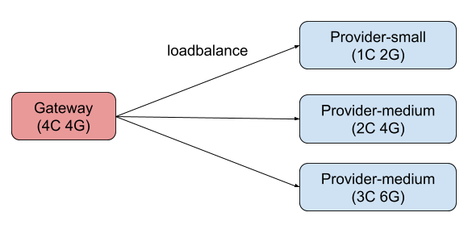
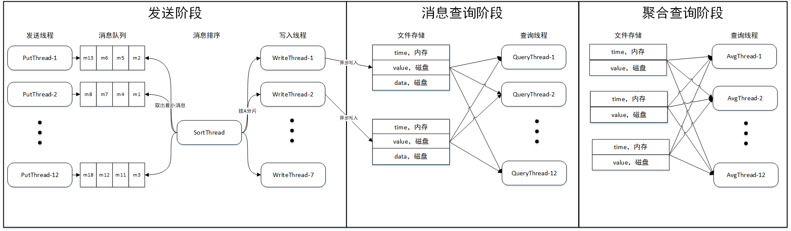
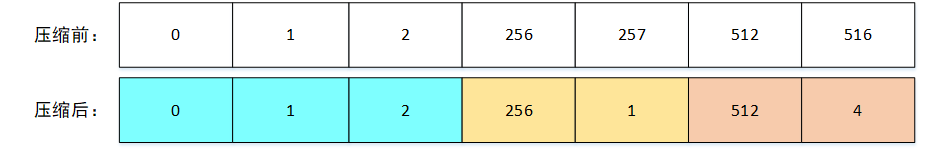
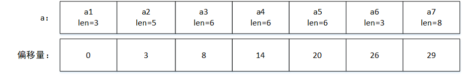
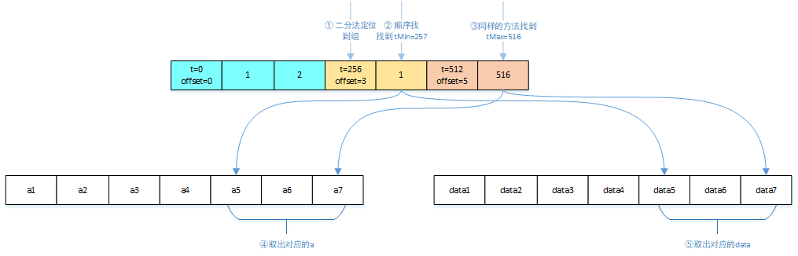

---
title: 第五届阿里中间件性能挑战赛总结
tags: Java
toc: true
date: 2019-09-05 22:10:15
---
历时一个月的阿里中间件性能挑战赛终于告一段落，起初只是想在实习的碎片时间找点事做，不知不觉竟走完了整个比赛。比赛的过程不可谓不波折，中途几次想要退赛都被队友劝了回来，排行榜上的名次也是起起落落最终定格在第六名。当然名次是次要的，比赛过程中和大佬们切磋交流，拓宽眼界，才是无价的收获。

这篇文章记录了这次比赛中我的方案和有效的优化点，欢迎大家拍砖交流。代码地址：[第五届阿里中间件性能挑战赛复赛第6名代码留存](https://github.com/zhebinhu/mqrace2019)


## 一、初赛部分

### 赛题介绍

首先来看初赛的赛题：[阿里巴巴2019中间件性能挑战赛-自适应负载均衡（初赛）赛题](https://code.aliyun.com/middlewarerace2019/adaptive-loadbalance?spm=5176.12281978.0.0.562d1556TCjPhT)

> 实现一套自适应负载均衡机制，要求能够自动根据服务处理能力变化动态最优化分配请求保证较低响应时间，较高吞吐量。

评测环境的架构如下图所示：



- 所有程序均在不同的 docker 容器中运行,每个容器都独占运行在不同的物理机上；
- Gateway 负责将请求转发至 Provider；
- Provider 处理请求返回响应；
- Provider 按照 CPU 核数和内存大小分为 Small、Medium、Large 三个规格；
- 选手需要设计实现 Gateway 选择 Provider 的 load balance 算法。

其中，每个 Provider 的服务能力（处理请求的速率）都会动态变化：1）三个 Provider 的总处理能力会分别在小于/约等于/大于请求量三个状态变动；2）三个 Provider 任意一个的处理能力都小于总请求量。

### 初赛思路

初赛官方给了一个示例程序，里面是一个 1:1:1 的随机路由：

``` java
public class UserLoadBalance implements LoadBalance {

    @Override
    public <T> Invoker<T> select(List<Invoker<T>> invokers, URL url, Invocation invocation) throws RpcException {
        return invokers.get(ThreadLocalRandom.current().nextInt(invokers.size()));
    }
}
```

实际上这个方案的 QPS 蛮高的了，在线上能够跑到 113w。但很明显 1:1:1 不是一个合理的比例，因为每台 Provider 的配置和参数都不一样。我们按照题目中给的三个 provider 的最大线程数分别为 200、450、650 的比例调整了初始权重，然后又根据每台 Provider 的实时连接数动态调整权重，最终形成了初赛的方案。

### 初赛方案

时间仓促，初赛的方案只做了一版，是令牌桶+权重法的形式：在 Gateway 中为每个 Provider 维护一个令牌桶，桶中的初始令牌数分别是 200、450、650，代表了三个 Provider 的最大线程数，当一个请求打到某个 Provider 上时会带走对应桶中的一块令牌，返回时归还令牌。Gateway 会按照每个桶内的剩余令牌数的比例分配下一个请求，如果所有桶中都没有令牌，就拒绝当前请求。

这个方案可以跑到 127w，基本上跑完就到了初赛截止的日期，所以我们没有对这个方案做更多的优化。现在想来，200:450:650 的比例也不一定是最合理的，因为实际评测环境中，服务器的可用线程数是定期变化的，如果能有反馈机制实时反映服务器当前的最大处理能力，效果可能会更好一些。

## 二、复赛部分

### 赛题介绍

复赛的赛题：[实现一个进程内基于队列的消息持久化存储引擎](https://code.aliyun.com/middlewarerace2019/mqrace2019?spm=5176.12281978.0.0.562d1556S6zzxp)

### 赛题背景

Apache RocketMQ 作为的一款分布式的消息中间件，历年双十一承载了万亿级的消息流转，为业务方提供高性能低延迟的稳定可靠的消息服务。随着业务的逐步发展和云上的输出，各种依赖消息作为输入输出的流计算场景层出不穷，这些都给 RocketMQ 带来了新的挑战。请实现一个进程内消息持久化存储引擎，可支持简单的聚合计算，如指定时间窗口的内对于消息属性某些字段的求和、求平均等。

### 要求

实现一个进程内消息持久化存储引擎，要求包含以下功能：

- 发送消息功能
- 根据一定的条件做查询或聚合计算，包括：
A. 查询一定时间窗口内的消息
B. 对一定时间窗口内的消息属性某个字段求平均

对接口层而言，消息包括两个字段，一个是业务字段 a（long），一个是时间戳（long，线程内升序），以及一个 byte 数组消息体（34字节）。实际存储格式用户自己定义，只要能实现对应的读写接口就好。

### 测试环境

测试环境为 4c8g 的 ECS，Jvm 相关参数 -Xmx4g -XX:MaxDirectMemorySize=2g -XX:+UseConcMarkSweepGC。带一块 300G 左右大小的 SSD 磁盘。SSD 性能大致如下：iops 1w 左右；块读写能力（一次读写 4K 以上）在 200MB/s 左右。

### 评测指标和规模

评测程序分为 3 个阶段： 发送阶段、查询聚合消息阶段、查询聚合结果阶段：
- 发送阶段：假设发送消息条数为 N1，所有消息发送完毕的时间为 T1；发送线程多个，消息条数在 20 亿条左右，总数据在 100G 左右。
- 查询聚合消息阶段：有多次查询，消息总数为 N2，所有查询时间为 T2；返回以 t 和 a 为条件的消息，返回消息按照 t 升序排列。
- 查询聚合结果阶段：有多次查询，消息总数为 N3，所有查询时间为 T3；返回以 t 和 a 为条件对 a 求平均的值。

若查询结果都正确，则最终成绩为 N1/T1 + N2/T2 + N3/T3。

### 赛题分析

从题面上看，复赛的考察点非常广。100G 的数据要做查询，6G 的内存是肯定放不下，那么首先就要考察我们的文件读写和索引设计。其次每个阶段都有多个线程读或者写，那么并发能力也是考察的一个点。然后第二、三阶段都以时间窗口为查询条件，线程内递增的时间戳是一个非常特殊的属性，很容易让我们联想到时序数据库中的时间戳压缩、预聚合等技术，如何利用好时间戳这个属性也是考察的一个重要部分。最后则是对程序的优化能力，性能大赛肯定离不开对程序的性能优化，从 Java 语言到 Linux IO 机制再到 SSD，都有可以优化的点，这也是考验基本功的地方。

这次比赛的难点之一我认为在于对多条件查询的优化上。时序数据按时间顺序存储，那么如果查询时只按时间维度来查的话，整个系统的设计就会简单很多，最简单的方式就是把消息按照时间顺序堆积，查询时定位两个数据点 tMin 和 tMax 就可以拿到所有的有效数据，有效数据率达 100%。但当查询条件中加入一个随机分布的 a 后，有效数据率就会骤降到 50%，因为平均下来有一半数据是不满足条件的。但我们又不能像 t 一样地对 a 进行排序，因为 a 是无序的。所以怎样保证我们每次取的数据中包含尽可能多的有效数据便成了本次比赛的一个关键点。

### 复赛思路

先在这里介绍一下我们方案的总体流程：



首先在发送阶段，评测程序会启动 12 个线程并发 put，每个线程将消息写入一个队列中，这时每个队列是局部有序的。然后存储引擎会启动一个排序线程，不断取出 12 个队列中最小的队头元素，这样就实现了消息的全局有序。然后排序线程会按 a 的大小将消息写入对应的分区中。将消息按 a 分区的好处是可以在查询阶段只读入 aMin 和 aMax 之间的分区，提高有效数据率。写入时将 t、a 和 body 分开存放，原因是为了便于建立索引和进行数据压缩。进行数据压缩后，t 可以被压缩到 1 个字节，所有 t 可以全量存在内存中，a 和 body 存入各自对应的文件中。

消息查询阶段，先根据 aMin 和 aMax 确定分区，然后根据内存中的 t 定位到 tMin 和 tMax 的位置，再从文件中读出 a 和 body，根据 aMin 和 aMax 筛选掉不满足条件的数据，最后将各分区的数据合并返回。

聚合查询阶段，大致流程和第二阶段相同，只是少了读 body 和最后的数据合并。

### 文件读写

由于这次比赛禁止使用 C++ 和 JNI，因此在读写方式上能选择的就非常有限。排除掉性能堪忧的字节流 IO，摆在我们面前的就剩下了 ByteBuffer，DirectByteBuffer 和 Mmap。这三种 IO 的原理和优劣已有大佬珠玉在前：[文件IO操作的一些最佳实践](https://www.cnkirito.moe/file-io-best-practise/)，这里就不赘述了。总之最后我们选择了 DirectByteBuffer 作为读写方式。

确定了读写方式后就要确定块大小。当我们把消息分区，并将 a 和 body 分开存储之后，这里的写实际上就变成了随机写。理论上讲随机写是不如顺序写的，但好在 SSD 有个特性：大块数据的随机读写不输于顺序读写。要理解这个事情可以参考大佬的博客：[What every programmer should know about solid-state drives](http://codecapsule.com/2014/02/12/coding-for-ssds-part-6-a-summary-what-every-programmer-should-know-about-solid-state-drives/)，一言以蔽之就是当我们对齐簇（SSD 的一种访问单位）进行随机读写时，SSD 会充分利用内部的并发机制，将读写性能提升到顺序读写的水平。一个簇的大小在 16M/32M，为了保险起见，我们将块大小定在了 32M。

### 数据压缩

关于 TSDB 中的数据压缩大家可以参考这篇文章：[阿里巴巴双十一千万级实时监控系统技术揭秘](https://www.infoq.cn/article/YRyUcv8zGw6*2BKOmTf7)

这里提一下时间戳压缩算法 delta-of-delta。对于时序数据来说，时间戳是一个非常适合压缩的点。特别是在高并发场景下，时间戳数据会非常密集，可能很多条数据的时间戳都是连续的，当面对这些连续递增的数据时，存储数据之间的差值会有很好的的效果。比如我们把相差在 100ms 的数据放在一个组中，那么对于 {100000,100030,100062,100099} 这组数据，我们可以把它存成 {100000,30,32,37}，因为相差在 100ms 内，所以每个差值用 7 个 bit 就可以存储，4个数据一共占用空间 64+7+7+7 = 85 bits。delta-of-delta 则是在差值的基础上更进了一步，存储的是差值的差值：

|时间戳|Delta|Delta of Delta|
| :--- | :--- | :--- |
|100000|0|0|
|100030|30|30|
|100062|32|2|
|100099|37|5|

通过引入二阶差值，数据范围会变得更小了，但因为数据变得不定长，所以还要在每个数值前引入一个标志位记录数据长度。具体的算法大家可以参考这篇文章：[Beringei高性能时间序列内存数据库原理](https://blog.csdn.net/SAN_YUN/article/details/84877909)

本次比赛对时间戳数据压缩的需求没有那么高，所以我们只使用了一阶差值。具体的方案是把差值在 256ms 的 t 放在一个组，组内存放和该组第一个 t 的差值，这样每个 t  只需要 1 个字节存放，16g 的数据可以被压缩到 2g 存放在内存中。方案示意图如下：



本来数据压缩到这里也就结束了，因为 a 和 body 都是随机的，随机数据一般是不可压缩的。但某天群里有个老哥发现了 a 也有个隐藏规律，就是线上环境的大部分 a 的长度都小于 6 个字节。也就是说，对于大部分 long 型变量 a，其实没有把 8 个字节用满。这个发现实际上在群里引发过一些争议，因为题目中给到的信息是 a 是一个随机数，而一个 64 位随机数小于 6 个字节的概率是 1/65536，线上的情况显然不符合随机性。问题抛给官方，最后官方依然允许了对 a 的压缩，但要求压缩算法具有通用性。

其实给定长度没有用满这种情况在网络中非常常见，很多时候我们用 rpc 传送一个 long 值，但实际上只有 int 大小。对于这种情况，thrift 使用了 zigzag 来对数据进行压缩。zigzag 的核心思想是去掉高位无用的 0。比如对于 00000000_00000000_00000000_10100101这个 32 位整数，我们只要存放 10100101 就行了，高位的 0 全部可以去掉。但是高位去 0 后，a 的长度就会从定长 64 位变成不定长，我们如何识别每一个 a 的实际位置呢？zigzag 对此的解决方式是在每个字节中设置一个标志位记录当前是否是最后一个字节。这种方式用在数据量较小的 rpc 中可以，但如果用在存储引擎中，会带来很大的额外计算成本。所以我们用空间换时间，用一个额外数组来记录当前 a 距离文件头的偏移量。当然，Java 中文件操作的最小单位是字节，所以我们记录的偏移量也是字节。方案示意图如下：



这时大家会发现，这个偏移量数据跟时间戳数据很像，都符合递增且小幅增长两个特性，所以我们可以用压缩时间戳数据的方法压缩偏移量数据。线上环境下，最终得到的压缩后的偏移量数据也能放在内存中。

### 索引设计

题目的背景是时序数据存储引擎，而且二三阶段都以时间作为查询条件，那么就启发我们使用时间戳数据作为索引。索引的结构其实上面已经展示了，就是压缩后的 t 数组，只不过要在每一组的头部存放当前组的偏移量信息，用来计算消息的偏移。查询步骤如下：



### 数据分区

数据分区是优化第三阶段的核心手段。原理很简单，就是把数据按照 a 的值分片，存在不同的分区中。当第三阶段取数时，只读在 aMin 和 aMax 之间的分区，提高取数的有效率。这里有个问题是如何确定每个分区的范围。最简单的方法就是用 hard code 把 long.max_value 均等分成若干个区，但这样的效果不好，因为前面提到过，线上的数据在 long.max_value 中并不是均匀分布的，会出现某个分区中数据量特别大的情况。所以我们需要根据线上数据的分布来确定每个分区的范围。实际方案中，我们会在第一阶段开始后先预读一部分流量（10000000条消息），然后将这些流量按 a 排序，按比例获取每个分区的临界值。当线上数据的 a 都是独立同分布的情况下，用这种方式划分的分区中的数据量是比较平均的。最终使用数据分区能将第三阶段的分数提升50%。

### 比赛感悟

比赛中最大的一个感受就是累，一方面是赛程的不断延长，另一方面是排行榜不断更新带来的心理压力。但是收获也是巨大的，不论是在学校还是实习的时候，其实能实际接触到中间件开发的机会不多，对于极限环境下的性能优化机会更是少之又少。通过参加这次比赛，无论是技术视野还是技术能力都有不小的提升。当然最大的收获还是见识了更大的世界，认识了更多厉害的人。最后感谢主办方提供这样一个平台，感谢群里交流过想法的大佬，感谢我的队友。
