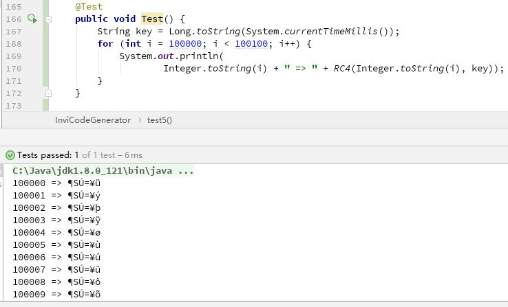
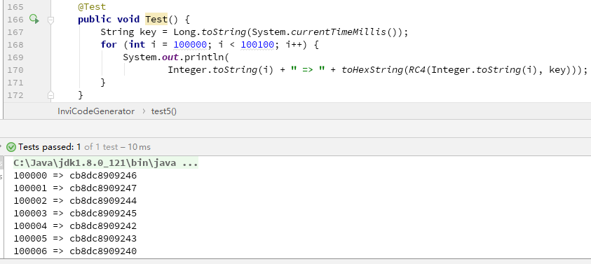
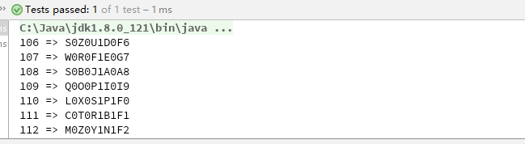
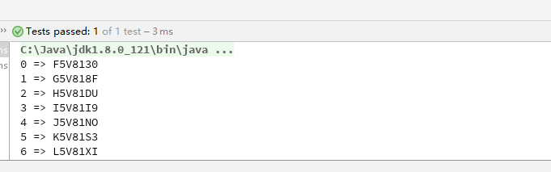
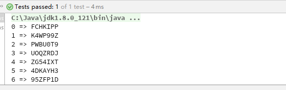

---

title: 简单的密码学生成唯一邀请码
tags: 密码学
toc: true
date: 2018-03-23 17:10:23
---
<!--more-->
最近项目需要生成用户邀请码，网上找了几个算法都不太满意，就自己写了一个。里面借鉴了一些密码学里的思路，最后的算法效果还不错。想把思路记录下来，可以用在类似对加密强度要求不高的场合下。

## 需求分析

从业务需求和市面上其它产品邀请码的使用体验上来看，邀请码有以下几个强制性的要求：

- 不可重复
- 唯一确定

这两点要求首先就排除了 hash code 的可能，因为 hash code 是可以发生碰撞的。然后在强制性要求的基础之上，我们还有一些进一步的需求：

- 长度不能太长，6-10 位是合适的区间
- 不容易被推测出
- 资源消耗尽可能小

在这些需求的约束下，我们先来看看常见的通用的序列码生成算法。

## 通用方案

通用方案的解决思路可以分为两种：一种是生成一串不重复随机数，然后将其保存到数据库里。使用邀请码时从数据库里查询就可以得到邀请人；另一种是对身份信息作加密，通常是用户 id，将加密后的密文作为邀请码，使用时可以不查询数据库，直接解密得到。理论上说，第二种方式稍好一点，可以少进行一次数据库查询。但是考虑到安全性，我们还是会把解密后的 id 拿到数据库中查询，防止有人输错或者伪造邀请码产生 NPE。因此在选择算法的时候，这两种思路我都有考虑到。

### 1、UUID
谈到不重复的随机数，最先想到的自然是 UUID。UUID 是一种软件构建的标准，也是开放软件基金会组织（OSF）在分布式计算环境领域的一部分。按照 OSF 制定的标准计算，它用到了以太网卡地址、纳秒级时间、芯片 ID 码和许多可能的数字，保证对在同一时空中的所有机器都是唯一的。Java 的工具类 java.util.UUID 是 Java 提供的一整套 UUID 生成方案，对于开发者来说可以很方便的调用。然而 UUID 并不适合用在这里，因为 UUID 的位数是固定的 32 位，这个对于我们的邀请码来说显然是太长了（想象一下用户面对面分享邀请码的时候居然需要报一串 32 位的数字+字母）。

网上也有用 UUID 的一部分当随机数的，但 UUID 只能保证完整的 32 位是不会重复的，不能保证其中的某一段不重复，因此这个方案也行不通。

### 2、系统当前时间
系统当前时间也是一种常见的随机数生成方案。它的做法是先获取到系统当前时间，再用它和某个时间点对比，将这两段时间的间隔以毫秒或者纳秒为单位存到内存中去。最后我们程序获取到的是一串数字。Java 提供了两个系统函数用于实现这个功能：System.currentTimeMillis() 和 System.nanoTime()。然而这两个系统函数在这个业务里都有各自的问题。

System.currentTimeMillis() 返回的是从 1970.1.1 UTC 零点开始到现在的时间，精确到毫秒。它的问题在于不能支持高并发的邀请码生成。在这套方案中，只要我们的系统在某 1 秒内生成的邀请码超过 32 个，那么出现相同邀请码的概率就超过 50%（详见[生日攻击 ](https://zh.wikipedia.org/wiki/%E7%94%9F%E6%97%A5%E5%95%8F%E9%A1%8C)）。显然，这个规模的并发量是不能接受的。

System.nanoTime() 返回的是从某个固定但随意的时间点开始的时间，精确到纳秒。这个固定但随意的时间，在不同 JVM 中是不一样的。这也就是说不同计算机计算出来的 nanoTime() 是有可能重合的。甚至同一台计算机重启 JVM 后生成的 nanoTime() 也是可能重合的。这违背了我们的第一个要求。

### 3、RC4 算法
RC4 对于学过密码的同学来说肯定不会陌生。它是大名鼎鼎的 RSA 三人组中的头号人物 Ronald Rivest 在 1987 年设计的一种轻量级对称加密算法。它的特点是按字节流加密，也就是说明文多长，密文就多长。这一特点很好避免了 UUID 只能生成 32 位字符串的尴尬。而且 RC4 是一个轻量级加密算法，运行速度快，占用资源少，很好地满足了我们的第 5 点要求。乍一看 RC4 似乎是种理想的方案，然而实际一跑就出现了问题：



出现了乱码！这是因为字符的取值在 0~255，而我们熟悉的英文和数字只占了其中的 62 位，其它符号是我们不熟悉的，当然也不能作为邀请码。解决方法也很简单，把字符串转成 16 进制即可：



由于把 8 位的字符串转成了 4 位的 16 进制，字符串的长度增加了一倍，但长度尚在可接受范围之内。不太满意的一点是加密后的密文都是连续性的，高位的数字基本不变。这也意味着如果被邀请的同学输错了后几位数字，后台大概率检测不到他的这次操作失误，因为他输入的错误邀请码能在数据库里被找到。而且连续的密文容易被找出规律，安全性较低。因此这种方式也不建议。

### 4、用户身份标志+随机数

这种方法是我在网上找到的已经被用于实际业务中的方法，它的大致思路是这样：

- 获取用户身份的唯一标志，比如用户 ID。
- 将用户 ID 补全，补全的位数取决于你希望得到的邀请码长度，如：106 可以补全为 00106.
- 随机生成一串大写字母串，长度和补全后的用户 ID 相同，如：SZUDF。
- 将随机数隔位插入用户 ID，得到邀请码：S0Z0U1D0F6。

这种方式得到的邀请码基本能满足我们的要求：由用户 ID 的唯一性保证了邀请码的唯一性；随机生成的字母串又能保证不容易被找到规律，同时又提高了用户操作的容错率；长度也在可接受范围内。因此第一版的邀请码生成算法我们采用了这种方式。



但是它仍然有改进的空间。①、字母和数字的位置是固定的，有一定的容易被察觉的规律，且对于数字来说，仍然具有连续性；②、用户 ID 直接暴露在密文中，存在风险；③、没有校验位，邀请码的校验依赖于数据库，无法对恶意伪造大量错误邀请码的攻击进行有效防御。

因此我在这种算法上作了改进，克服了以上的缺点。

## 我的方案

为了让字母和数字的位置不再固定，我将用户 ID 作了 36 进制转换，即把用户 ID 映射为一串字母+数字的组合，高位用 0 补全。

```java
        int[] b = new int[CODE_LENGTH];
        b[0] = id;
        for (int i = 0; i < 5; ++i) {
            b[i + 1] = b[i] / 36;
            b[i] = (b[i]) % 36;
        }
```
同时把随机数生成的范围扩大到字母和数字，这样密文中的每一位都可能是数字和字母，规律性就不易察觉得多。

然后是用户 ID 暴露在密文中的问题。这个问题的解决办法是我们可以加一点[盐 ](https://zh.wikipedia.org/wiki/%E7%9B%90_(%E5%AF%86%E7%A0%81%E5%AD%A6)。盐的取值最好不要太小，太小缺乏隐蔽性；也不能太大，太大会占用过多用户 ID 的取值空间。具体的取值取决于业务需求。

当然，最后是校验位的问题。这个问题我思考之后决定在随机数上作文章。目前的算法，会生成和补全后用户 ID 长度相等的随机数。这有两点问题：一是邀请码长度稍显过长，6 位用户 ID 就会产生 12 位的邀请码；二是随机数没有提供额外的信息，这对密文来说是一种资源浪费。鉴于此，我改变了随机数的生成方式，让它不再随机生成，而是承担起对密文其它部分的校验功能。同时改变了它的长度，把它固定在 2 位。当然，缩短后的校验码就没有办法隔位插入，我就把它放在了密文尾部。用这一套校验方式，理论上能保证 99.9%的误操作可以被后台检测出来而不需要查询数据库。



生成的邀请码如上，相比第一版，可以看到一些很明显的改进。而且理论上可以容纳 1000 万的用户量，比第一版的 10 万位有了很大提升。

但是这一版的算法仍有问题，细心的同学会发现 6 个验证码的 2~5 位是一样的。这是因为低位的变化不足以影响到高位，导致高位的字符没有发生变化。这样的算法在安全性上是比较薄弱的，攻击人可以利用这一规律大大降低猜测的区间。而且密文和密钥（超参数，本文中就是 salt 和 prime1）之间的关系比较直接，没有进行进一步的处理。现代密码学认为，密码的安全性应该由密钥来保障而不是加密算法，如果密钥和密文之间的联系过于直接，密码的安全性便会削弱。当然，密码学上对这些问题有解决方法，那就是**扩散和混淆**。

### 扩散和混淆

扩散 (diffusion) 和混淆 (confusion) 是 C.E.Shannon 提出的设计密码体制的两种基本方法，其目的是为了抵抗对手对密码体制的统计分析。在分组密码的设计中，充分利用扩散和混淆，可以有效地抵抗对手从密文的统计特性推测明文或密钥。扩散和混淆是现代分组密码的设计基础。

所谓扩散就是让明文中的每一位影响密文中的许多位，或者说让密文中的每一位受明文中的许多位的影响。这样可以隐蔽明文的统计特性。当然，理想的情况是让明文中的每一位影响密文中的所有位，或者说让密文中的每一位受明文中所有位的影响。

所谓混淆就是将密文与密钥之间的统计关系变得尽可能复杂，使得对手即使获取了关于密文的一些统计特性，也无法推测密钥。使用复杂的非线性代替变换可以达到比较好的混淆效果，而简单的线性代替变换得到的混淆效果则不理想。可以用"揉面团"来形象地比喻扩散和混淆。当然，这个"揉面团"的过程应该是可逆的。乘积和迭代有助于实现扩散和混淆。选择某些较简单的受密钥控制的密码变换，通过乘积和迭代可以取得比较好的扩散和混淆的效果。

### 改进后的算法

我用扩散和混淆的方式对算法进行了改进。

扩散的方式很简单，只需要将个位和其它每一位作和后取余，即可把变化传导到每一位。为了隐蔽，我还把变化进行了放大：
```java
id = id * PRIME1;
```
 PRIME1 可以为任意随机数，最好和 36 以及 10^n（n 为用户 id 位数）互质。这是因为根据[循环群 ](https://zh.wikipedia.org/wiki/%E5%BE%AA%E7%92%B0%E7%BE%A4) 的性质：若 m 和 p 互质，则 ( id * m ) % p 的结果遍历[0, p) 的所有整数。保证了放大后结果的分布和原数据的分布同样均匀。为了使结果看起来更随机，我还给每一位分配了不同系数：

```java
        id = id * PRIME1;
        id = id + SALT;
        int[] b = new int[CODE_LENGTH];
        b[0] = id;
        for (int i = 0; i < 5; ++i) {
            b[i + 1] = b[i] / ARY;
            b[i] = (b[i] + b[0] * i) % ARY;
        }
        b[5] = (b[0] + b[1] + b[2]) * PRIME1 % ARY;
        b[6] = (b[3] + b[4] + b[5]) * PRIME1 % ARY;
```
ARY 表示进制，这里是 36，也可以设置成其它的数，比如 62（字母区分大小写）。
代码的第 7、9、10 行中我分别对每一位设置了不同的系数，使得每一次的增量显得更不固定。

然后是混淆。混淆我用了[P-box](https://zh.wikipedia.org/wiki/P%E7%9B%92) 的方式，其实就是将数字洗牌。比如把 1234567 洗成 5237641。这样处理之后可以隐藏密钥和密文之间的关系。洗牌的方式也很简单，选择一个和 CODE_LENGTH（本文中为 7）互质的数 PRIME2，和数组角标相乘取余即可（原理同 PRIME1）。最终的代码如下：

```java
    public static String inviCodeGenerator(int id) {
        id = id * PRIME1;
        id = id + SALT;
        int[] b = new int[CODE_LENGTH];
        b[0] = id;
        for (int i = 0; i < 5; ++i) {
            b[i + 1] = b[i] / ARY;
            b[i] = (b[i] + b[0] * i) % ARY;
        }
        b[5] = (b[0] + b[1] + b[2]) * PRIME1 % ARY;
        b[6] = (b[3] + b[4] + b[5]) * PRIME1 % ARY;
        StringBuilder sb = new StringBuilder();
        for (int i = 0; i < CODE_LENGTH; ++i) {
            sb.append(HEX_36_Array.charAt(b[(i * PRIME2) % CODE_LENGTH]));
        }
        return sb.toString();
    }
```

测试结果如下：



完美符合我们的需求^_^

邀请码和用户 ID 的转换也很简单，因为加密的过程都是可逆的，所以只需将加密过程作逆变换即可。这里要提一点就是我们是设置了校验位的，所以可以在解密的过程中对邀请码进行校验，如果是用户的误输入或者有人企图构造邀请码恶意攻击，我们在业务层就可以检测出来，不需要拿到数据层去做校验。具体的解密代码如下：

```java
    public static int inviDecoding(String inviCode) {
        if (inviCode.length() != CODE_LENGTH) {
            return -1;
        }
        int res = 0;
        int a[] = new int[CODE_LENGTH];
        int b[] = new int[CODE_LENGTH];
        char[] c = new char[CODE_LENGTH];
        for (int i = 0; i < CODE_LENGTH; ++i) {
            a[(i * PRIME2) % CODE_LENGTH] = i;
        }
        for (int i = 0; i < CODE_LENGTH; ++i) {
            c[i] = inviCode.charAt(a[i]);
        }
        for (int i = 0; i < CODE_LENGTH; ++i) {
            a[i] = HEX_36_Array.indexOf(c[i]);
        }
        b[5] = (a[0] + a[1] + a[2]) * PRIME1 % ARY;
        b[6] = (a[3] + a[4] + a[5]) * PRIME1 % ARY;
        if (a[5] != b[5] || a[6] != b[6]) {
            return -1;
        }
        for (int i = 4; i >= 0; --i) {
            b[i] = (a[i] - a[0] * i + ARY * i) % ARY;
        }
        for (int i = 4; i > 0; --i) {
            res += b[i];
            res *= ARY;
        }
        res = ((res + b[0]) - SALT) / PRIME1;
        return res;
    }
```
代码 18~22 行就是在作校验。

## 总结

不同的业务有不同的需求，市面上通用的方案可能只能满足大部分共性的需求，但对于某些特定的需求，市面上找不到完善的解决方案，这时候就需要我们独立解决问题的能力。本科的时候觉得密码学没用，没想到在这用上了。越来越觉得世上没有无用的知识，多积累一些总是好的^_^