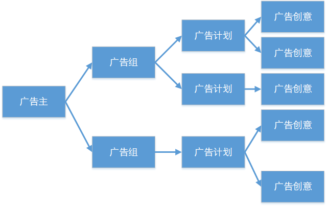

---
title: 计算广告基础
tags: 
	- 广告
toc: true
date: 2020-02-08 14:41:32
---
## 一、基本概念和名词解释
### 广告平台
- 诉求：追求最大的广告收入
- 需要关注的：
	- 广告主生态平衡
	- 竞价的公平性，广告主的留存等
	- 广告资源的全局分配

### 用户
- 诉求：只看到自己感兴趣的广告
- 反馈：广告点击、app 停留时长、不感兴趣等

### 广告主
- 诉求：追求广告的推广效果
- 分类：
	- 品牌广告主：追求品牌的曝光和触达，间接影响用户，如可口可乐、三星、苹果等
	- 效果广告主：追求用户的直接反馈（下载、购买、咨询等）如：游戏团队花钱推广等。主要关注 ROI

### 预算和出价
- 预算：总共能花多少钱
- 出价：决定自己愿意为一个流量付出多少钱，出价不一定是针对流量，而是针对特定目标（投放、展示、点击、转化等）
- 典型出价：
	- 10 元钱 1000 个展示
	- 2 角钱一个点击
	- 5 元钱一次应用下载（转化）
	- 100 元一次用户提交个人信息（转化）

### 受众与定向
- 广告主对有效受众（Audience）的预先筛选：如剃须刀定向男性，裙子定向女性
- 平台挖掘用户特征并打上各类标签
	- 年龄、性别
	- 兴趣标签
	- 关键词
	- 地理位置
	- 手机型号、版本等

### 广告计划和广告组、广告创意

### 投放（send）和展示（show）
- 用户在头条上进行一次刷新，会触发一次对内容和广告的请求（request）。
- Ad Engine 根据各种信息，选出一条或多条最合适的广告，返回给客户端。称为广告的投放（Send）
- 用户看到一次广告，叫做广告的展示（Show）
- Send 和 Show 的区别和联系
	- 都可以作为广告的一次触达
	- Ad Engine 能够控制广告的 Send，无法控制 Show
	- 一次广告的 Send 可能对应多次 Show，也可能对应 0 次 Show
	- 有 Show 一定有 Send
	- 信息流整体 Show/Send 比例（SSR）大约 1.7 左右，详情页 0.5 左右

### 点击与转化
- 对大部分广告来说，对广告产生兴趣后的第一个动作是点击广告（Click），进入落地页（landing page）
- 进入落地页后，根据广告类型引导用户进行进一步动作。如：下载应用、提交包含姓名电话的表单、拨打电话等。这些后续的动作统称为转化（Convert）。
- 点击率（Click Through Rate，CTR）= 用户看到广告后点击的概率 = click / send（或 click / show）
- 转化率（ConVersion Rate，CVR）= 用户进入落地页后进行转化动作的概率 = convert / click

### ROI 与转化成本
- 收益率（Return On Investment，ROI）是广告主的产出投入比，ROI 越高，广告主越愿意在广告平台投放广告。也是广告平台优化广告主效果的核心目标之一。
- 转化成本：广告主平均获得每个转化花费的广告费。随着转化的深度变深，转化成本由几元（下载应用）到几百上千元（电话拨打）不等。
- 一般用转化成本间接衡量与优化广告主 ROI。转化成本越低，ROI 越高。

### 广告收入与 CPM
- 广告平台最终的追求是最大的广告收入
- 广告收入 = 广告投放量 * 单位广告投放量收入
- 千次广告投放收入（Cost Per Mille，CPM）代表平均投放 1000 次广告平台能获取的收入。
- 广告平台收入提升主要两种手段：
	- 增加广告投放量，引入新流量位置
	- 提升分配的合理性，提升 CPM

## 二、广告的售卖方式
### 品牌广告
- 追求品牌的曝光和触达
- 根据定向和溢价分为两种
	- CPT（cost per time）：包断时段内整个位置，高溢价
	- GD（guaranteed delivery）：购买特定数量，较高溢价
- 通过溢价，做到对高质量流量的触达
- 越来越看重效果（主要是点击率和互动率）

### 效果广告
- 也称竞价（RTB）广告
- 每个流量对每个广告主的价值不一样
- 需要进行广告竞价（Ads auction）
- 每个广告主为此次流量出价，出价高的人获胜，根据特定规则进行计价
- 当到达计费点时扣费
- 竞价排序按照这次投放对平台的**预期收益**（千次投放收益）（eCPM = estimated cost per mille）进行排序

### 竞价方式 —— 展示出价（CPM）
- 按千次展示竞价，按展示计费
- eCPM = cpm_bid（千次展示的出价）

### 竞价方式 —— 点击出价（CPC）
- 按点击竞价，按点击计费
- eCPM = cpc_bid（单次点击的出价） \* pctr（预估点击率） \* 1000

### 竞价方式 —— 转化出价（CPA）
- 按转化竞价，按转化计费
- eCPM = cpa_bid（单次转化的出价） \* pctr（预估点击率） \* pcvr（预估转化率） \* 1000

> **Q1：pctr 和 pcvr 都是预估的值，如果预估偏低会怎么样？偏高会怎么样？**
预估偏低可能会使得原先排在第一位的广告没有排到第一，原先第二位的广告排到了第一，此时我们投放的是原先排第二位的广告。但在广告物料充足的情况下，第一第二位不会相差太多，这种情况下的损失是可以接受的。
预估偏高可能会使原先排在靠后的广告排到了第一，但这条广告实际没有这么多的收益，此时相当于我们投放了一条原先排位靠后的广告，这种情况下的损失就会很大。

> **Q2：既然 pctr 和 pcvr 都可能预估不准，那我们为什么还要做 cpc 和 cpa？**
因为 cpc 和 cpa 的单价更高。假设广告主给出的一次展示/点击/转化的价格分别是 5/6/8 元，那么 1000 次请求下，按照 cpm 收费最多只能赚 5000 元，而按 cpc 和 cpa 收费最多可以赚 6000/8000 元。在物料足够丰富的情况下，如果我们能对每个流量进行精准的投递，就能获得比 cpm 更高的收益。

### 竞价方式 —— oCPC/oCPM
- CPM 的缺点：
	- 转化事件依赖广告主回传，广告主可能作弊
	- 平台需要承担预估不准的风险
- oCPC：
	- 广告主按照转化竞价，按点击计费
	- 竞价：eCPM = cpa_bid \* pctr \* pcvr \* 1000；
	- 计费：cost（单次点击计费） = eCPM / 1000 / pctr
- oCPM：
	- 广告主按照转化竞价，按投放计费
	- 竞价：eCPM = cpa_bid \* pctr \* pcvr \* 1000
	- 计费：cost（单次投放计费） = eCPM / 1000
- 在广告主不作弊，以及平台点击率，转化率预估准确的前提下，CPA/oCPC/oCPM 的效果没有区别
- 从 CPA 到 oCPC 到 oCPM，平台承担风险变小，广告主风险变大
- 现状：CPA（中小广告主）+ oCPM（其他）

### 计费方式 —— 广义一价（GFP）
- cost（计费） = eCPM（出价）
- 可类比常见的拍卖，价高者得，出多少钱就是多少钱

### 计费方式 —— 广义二价（GSP）
- GFP 的缺点：广告主会有向下探价的动力。比如广告主用 10 元拍下了一条广告，虽然拍下了，但心里会想，是不是 9.5 元一样也能拍下这条广告，那么下一次广告主就会出 9.5 元，直到拍不到这条为止。如果所有的广告主都那么做，那么大家都会不停下探价格，最后压低了广告的价格。
- GSP：第一名获胜之后，按第二名的出价计费
- 杜绝了广告主向下探价的动机，只要能获胜，就不用担心是不是多出了钱

### 计费方式 —— VCG
- GSP 只适用于一个广告位的情况，实际情况下可能有多个广告位同时拍卖，此时我们要用一种更通用的方式来计算
- 描述：根据广告参与竞价后，对其它广告造成的损失，来计费

|广告主|Bid1|Bid2|
| :---: | :---: | :---: |
|A|10|6|
|B|8|4|
|C|3|1|

A 不参加竞价，B 和 C 的总效用为 8 + 1 = 9 元。
A 如果参加竞价，B 和 C 的总效用为 4 + 0 = 4 元。
A 参加竞价，导致 B 和 C 的社会总效用损失了 9 - 4 = 5 元，因此 A 需要支付 5 元。

- 只有一个广告位的情况下，VCG 和 GSP 是一样的。
- 目前整体是 GSP，但在信息流上是 VCG

## 三、广告投放的核心问题
### 广告定向 & 过滤
- 给定每个广告的受众选择，在每个流量过来时，快速在数十万的广告库中检索出定向了这个流量的广告。
- 根据各类需求，对广告进行过滤。
- 目前 20W 广告，检索 + 过滤时间约为 20ms
- 使用倒排 + Bitmap 优化检索效率

### 广告 Ranking
- 目标：计算各类广告（cpc/ocpc/cpa/cpm等）的预期收益（eCPM），选出对平台最大的一个
- 核心是广告的 ctr/cvr 预估
- ranking 时可能会有其他的目标，如用户体验、广告主生态等
- sort_eCPM = eCPM + hidden_cost（隐藏收益，包括用户体验、广告主生态收益等）

### 广告模型 —— ctr&cvr 预估
- 问题抽象：给定一定的样本（用户是否点击了这个广告），预估一个用户对一个广告的点击率
- 作用：在线广告的核心模块，最终决定整体投放效果
- 特点：特征维度极多，数据量极大，在线学习，样本不均衡
- 常见模型：LR、FM、FFM、NN
- 常用学习方法：SGD，FTRL
- 推荐一篇paper：[Ad Click Prediction:a View from the Trenches](https://static.googleusercontent.com/media/research.google.com/zh-CN//pubs/archive/41159.pdf)
- 粗排与精排

### 用户体验
- 用户的核心诉求：
	- 少看广告
	- 少看低质量广告
- AdLoad：全平台控制一个能出广告的总数 广告 send <= 文章send \* 8%
- 频控：少看重复广告
- Dislike（不感兴趣）：用户反馈不喜欢广告后给反馈
- Staytime（落地页停留时长）：减少标题党
- 混排：文章质量高，广告就排后面点

### 广告主预算控制与 Budget Pacing
- 拆分广告主需求：
	- 优先跑量：保证转化成本稳定，量越大越好。需要动态根据转化成本调价。
	- 优先低成本：保证每天预算花完，成本越低越好。Budget Pacing 可以使得同样花完预算的情况下取得最低的转化成本。

### 思考：怎样提升广告收入？
- 引入更多的流量：增加广告位
- 让用户看到更想点击、转化的广告：改进模型、增加特征
- 让广告主提升付费意愿：提供更精准的定向，做更深的转化、反作弊等
- 增加广告主满意度：提升投放稳定性，满足广告主的真实需求
- 性能优化：（省下来的钱当赚的）